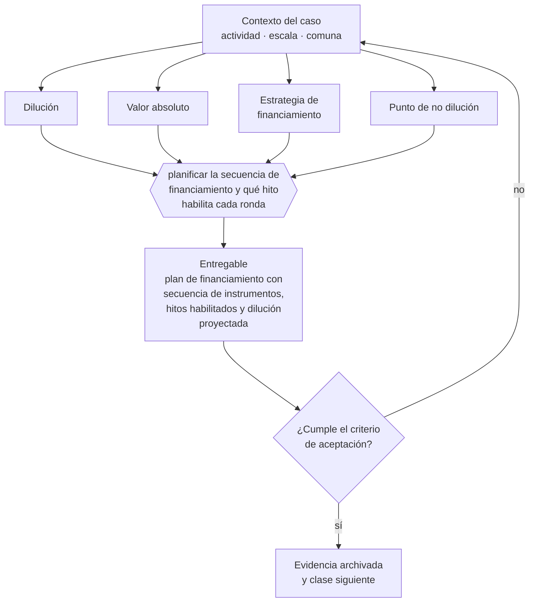

# Clase 224 — Costo de dilución y estrategia de financiamiento

> **Parte 16 · Financiamiento, banca, fondos e inversión** — clase 14 de 14

**Estado de evidencia:** `DINAMICO` · **Jurisdicción:** Chile-first · **Fecha base normativa:** 07-08-2026 
**Decisión que habilita:** planificar la secuencia de financiamiento y qué hito habilita cada ronda 
**Entregable:** plan de financiamiento con secuencia de instrumentos, hitos habilitados y dilución proyectada

## 🎯 Propósito

Planificar la secuencia de financiamiento vinculando cada ronda a un hito que aumente el valor, y evaluar la dilución en valor absoluto.

## 📚 Resultados de aprendizaje

Al finalizar esta clase podrás:

1. **Definir** con precisión los cuatro conceptos de la tabla siguiente y usarlos para describir un caso real.
2. **Explicar** por qué esta materia condiciona decisiones de otras partes del programa.
3. **Decidir** —planificar la secuencia de financiamiento y qué hito habilita cada ronda— y justificar la decisión por escrito.
4. **Producir** el entregable de la clase y contrastarlo contra su criterio de aceptación.
5. **Distinguir** el dato estable del dato dinámico que exige revalidación en la fuente oficial.

## 🧩 Conceptos centrales

| Concepto | Comprensión verificable |
|---|---|
| **Dilución** | Pérdida de porcentaje por emisión de nuevas acciones. |
| **Valor absoluto** | Valor de la participación en dinero, no en porcentaje. |
| **Estrategia de financiamiento** | Secuencia planificada de instrumentos y montos. |
| **Punto de no dilución** | Monto a partir del cual conviene otra fuente. |

## 🗺️ Flujo de razonamiento

## 📖 Desarrollo

### 1. El fondo del asunto

La dilución se evalúa en valor absoluto y no en porcentaje: un 10% de una empresa que vale diez veces más es mejor que un 40% de la anterior. Lo que sí destruye valor es levantar capital sin plan, ronda tras ronda, sin que cada una habilite un hito que aumente el valor.

### 2. Cómo se traduce en la práctica

Un 10 % de una empresa que vale diez veces más es mejor que un 40 % de la anterior; el porcentaje solo no informa. Lo que sí destruye valor es levantar capital sin plan, ronda tras ronda, sin que cada una habilite un hito que justifique una valorización mayor en la siguiente.

### 3. Marco aplicable y quién interviene

- FOGAPE y sistema de garantías estatales
- Ley 21.521 Fintec para plataformas de financiamiento colectivo
- instrumentos SAFE, notas convertibles y aumentos de capital en SpA

**Autoridades o contrapartes involucradas:** CMF, CORFO, SERCOTEC, BancoEstado y banca comercial.
**Profesionales de apoyo:** CFO, abogado corporativo, asesor financiero, contador. La participación concreta depende del riesgo, del
tamaño de la empresa y de la actividad económica.

## 🧪 Taller guiado

Aplica esta clase a **una** de las siguientes líneas de negocio y repite después el ejercicio con
una segunda línea de carga regulatoria distinta:

| Línea | Carga regulatoria |
|---|---|
| SaaS B2B con IA | media |
| Servicios profesionales | baja |
| E-commerce D2C | media |
| Alimentos o foodtech | alta |
| Exportación de servicios | media |
| Fintech regulada | alta |
| Construcción o servicios técnicos | alta |

**Secuencia de trabajo:**

1. Delimita el contexto: actividad económica, escala, comuna y etapa de la empresa.
2. Reúne los antecedentes que la decisión exige y anota la fecha de cada fuente.
3. Identifica las alternativas reales, incluida la de no hacer nada.
4. Evalúa el impacto en mercado, caja, personas, regulación y operación.
5. Toma la decisión y regístrala con sus supuestos.
6. Produce el entregable.
7. Contrástalo contra el criterio de aceptación.
8. Anota lo que requiere validación profesional y programa su revisión.

### 📦 Entregable

Plan de financiamiento con secuencia de instrumentos, hitos habilitados y dilución proyectada.

Debe incluir decisión, supuestos, fuentes con fecha de consulta, responsable, riesgos
identificados y próximos pasos.

## 🏆 Reto verificable

Resuelve la misma materia para una segunda línea de negocio con distinta carga regulatoria y
explica por escrito **qué cambió, por qué y qué fuente lo determina**.

## ✅ Criterio de aceptación

- [ ] cada levantamiento tiene hito asociado
- [ ] la dilución está proyectada en valor absoluto
- [ ] cada afirmación regulatoria está referida a una fuente oficial con fecha de consulta;
- [ ] los datos dinámicos quedan marcados para revalidación;
- [ ] hay un responsable asignado y evidencia reproducible del trabajo.

## ⚠️ Errores frecuentes

**Propios de esta clase:**

- Evaluar la dilución solo en porcentaje y no en valor absoluto.
- Levantar capital sin definir qué hito debe alcanzarse con él.

**Característicos de la parte 16:**

- Financiar activos de largo plazo con líneas de corto plazo.
- Usar factoring de forma estructural y erosionar el margen.

## 🇨🇱 Checklist Chile

- [ ] ¿existe norma o autoridad específica para esta materia?
- [ ] ¿la fuente consultada está vigente a la fecha de ejecución?
- [ ] ¿se activa algún trámite ante el SII?
- [ ] ¿se activa algún requisito municipal o sectorial?
- [ ] ¿afecta a consumidores o al tratamiento de datos personales?
- [ ] ¿afecta a trabajadores o a la seguridad y salud en el trabajo?
- [ ] ¿afecta a impuestos, contabilidad o caja?
- [ ] ¿afecta a contratos o a propiedad intelectual?
- [ ] ¿requiere renovación, reporte periódico o revalidación?

## ❓ Preguntas de comprobación

1. ¿Qué hito concreto habilita cada levantamiento que planificas?
2. ¿Cuánto valdría tu participación en cada escenario, en dinero y no en porcentaje?
3. ¿Cuál es el monto mínimo que necesitas para llegar al siguiente hito?

## 🔗 Fuentes oficiales

**Corporación de Fomento de la Producción — Innovación, inversión y garantías**  
<https://www.corfo.cl/> · verificado 2026-08-19

- *Qué contiene:* Reúne los instrumentos de fomento a la innovación y la inversión, incluidos programas de capital semilla, escalamiento, garantías y cobertura de riesgo para el sistema financiero.
- *Cómo leerla:* Filtra por etapa de la empresa antes que por monto. Y verifica el componente de innovación que exige cada instrumento: presentar una expansión comercial como innovación es la causa más común de rechazo.
- *Uso en esta clase:* aporta el marco de «Innovación, inversión y garantías» para planificar la secuencia de financiamiento y qué hito habilita cada ronda.

**Servicio de Cooperación Técnica — Fomento para micro y pequeñas empresas**  
<https://www.sercotec.cl/> · verificado 2026-08-19

- *Qué contiene:* Publica las convocatorias vigentes con sus bases: perfil de empresa elegible, monto del subsidio, cofinanciamiento exigido, gastos financiables y obligaciones de rendición.
- *Cómo leerla:* Lee las bases desde el final: la sección de rendición decide si podrás quedarte con el subsidio. Muchos proyectos se adjudican y después devuelven fondos por no poder acreditar el gasto en la forma exigida.
- *Uso en esta clase:* aporta el marco de «Fomento para micro y pequeñas empresas» para planificar la secuencia de financiamiento y qué hito habilita cada ronda.

**Start-Up Chile · CORFO — Aceleración de startups**  
<https://startupchile.org/> · verificado 2026-08-19

- *Qué contiene:* Describe los programas de aceleración, sus cohortes, el aporte que entregan y las contrapartidas exigidas en permanencia, reporte y actividades.
- *Cómo leerla:* Evalúa el programa por la red y la validación que aporta, no por el monto. La contrapartida de permanencia tiene costo operativo real y debe compararse contra lo que la empresa necesita en su etapa.
- *Uso en esta clase:* aporta el marco de «Aceleración de startups» para planificar la secuencia de financiamiento y qué hito habilita cada ronda.

Complementos del repositorio: [glosario](../../../docs/19_GLOSSARY.md) ·
[ruta de lecturas](../../../docs/15_BOOKS_AND_LEARNING_PATH.md) ·
[catálogo de fuentes](../../../docs/16_OFFICIAL_SOURCE_CATALOG.md).

> [!IMPORTANT]
> Material educativo. Para una decisión real de alto impacto hay que verificar la fuente oficial
> vigente y validar con el profesional competente.

---

| Anterior | Índice | Siguiente |
|---|---|---|
| [← 223 · Data room y due diligence de inversión](../class-13-data-room-y-due-diligence-de-inversion/README.md) | [Parte 16](../README.md) · [Programa](../../../README.md) | [225 · Patente municipal: flujo y evidencia →](../../part-17-permisos-patentes-y-regulacion-sectorial/class-01-patente-municipal-flujo-y-evidencia/README.md) |
