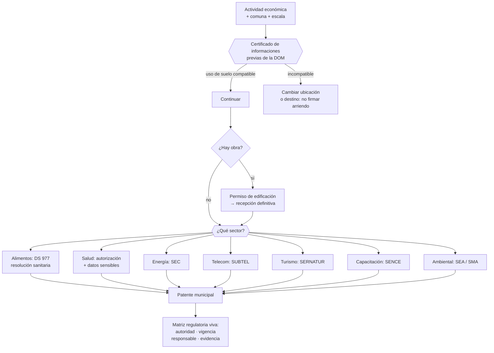

# Parte 17 — Permisos, patentes y regulación sectorial

> *Estar constituido y con inicio de actividades no habilita a operar*

🔴 **Etapa 5 — Operar, vender y crecer** · salida de la etapa: Empresa habilitada, operando y creciendo con control

**Estado de evidencia:** `SECTORIAL` · **Clases:** 14 (225–238) · **Fecha base normativa:** 07-08-2026 
**Contenido central:** Patente municipal, uso de suelo, sanitaria, DS 977, salud, obra, SEC, SUBTEL, SERNATUR y SEIA 
**Conceptos definidos en esta parte:** 55

## 🎯 De qué trata esta parte

Esta parte existe porque la brecha entre existir jurídicamente y poder operar es donde más proyectos se detienen. Una empresa con RUT e inicio de actividades todavía puede necesitar patente municipal, uso de suelo compatible, autorización sanitaria, resolución sectorial y, en ciertos casos, calificación ambiental. Cada uno tiene su autoridad, su plazo y su renovación.

El error de secuencia es el más caro y el más común: firmar el arriendo antes de pedir el certificado de informaciones previas de la Dirección de Obras, o diseñar el local antes de leer las exigencias de planta física de la autoridad sanitaria. Los permisos se condicionan entre sí, y esa dependencia define el cronograma real del proyecto mucho más que la obra o el equipamiento.

El entregable que ordena todo es la matriz regulatoria: cada permiso con su autoridad, su vigencia, su responsable interno y la ubicación de la evidencia. Sin ella, la renovación depende de que alguien recuerde, que funciona hasta que falla, normalmente durante una fiscalización.

## 📚 Resultados de la parte

Al terminar esta parte podrás:

1. **Determinar qué permisos exige una actividad concreta en una comuna concreta**.
2. **Secuenciar los permisos en el orden en que se condicionan entre sí**.
3. **Estimar plazos y costos de habilitación antes de comprometer arriendo o inversión**.
4. **Mantener una matriz regulatoria viva con vencimientos y renovaciones**.

## 🗺️ Mapa de la parte

## ⚖️ Marco aplicable

- DL 3.063 sobre rentas municipales (patente municipal)
- Ley General de Urbanismo y Construcciones y su Ordenanza General
- Código Sanitario y DS 977 Reglamento Sanitario de los Alimentos
- Ley 19.300 sobre bases generales del medio ambiente
- Ley 20.667 y normativa sectorial de SEC, SUBTEL, SERNATUR, SENCE y MTT

**Autoridades o contrapartes:** Municipalidad y Dirección de Obras Municipales, SEREMI de Salud, SEC, SUBTEL, SERNATUR, SENCE, SEA, SMA.
**Profesionales de apoyo:** abogado regulatorio, arquitecto o DOM, prevencionista, consultor sectorial.

## ⚠️ Riesgos característicos

- Arrendar un local cuyo uso de suelo no admite la actividad.
- Iniciar operación con permiso en trámite y exponerse a clausura.
- Olvidar renovaciones periódicas de permisos y resoluciones.
- Asumir que un permiso obtenido en una comuna sirve en otra.

## 📘 Las 14 clases

| # | Global | Clase | Decisión que habilita |
|---:|---:|---|---|
| 01 | 225 | [Patente municipal: flujo y evidencia](class-01-patente-municipal-flujo-y-evidencia/README.md) | determinar el municipio competente, los requisitos y el monto estimado de la patente |
| 02 | 226 | [Uso de suelo, DOM y compatibilidad territorial](class-02-uso-de-suelo-dom-y-compatibilidad-territorial/README.md) | verificar la compatibilidad territorial antes de comprometer un inmueble |
| 03 | 227 | [Autorización sanitaria general](class-03-autorizacion-sanitaria-general/README.md) | determinar si la actividad requiere autorización sanitaria y qué exige |
| 04 | 228 | [Alimentos y Reglamento Sanitario DS 977](class-04-alimentos-y-reglamento-sanitario-ds-977/README.md) | determinar qué exigencias del reglamento aplican al producto y al proceso |
| 05 | 229 | [Resolución sanitaria para locales de alimentos](class-05-resolucion-sanitaria-para-locales-de-alimentos/README.md) | diseñar el local considerando desde el inicio los requisitos sanitarios |
| 06 | 230 | [Salud, prestaciones y datos sensibles](class-06-salud-prestaciones-y-datos-sensibles/README.md) | determinar las autorizaciones y las obligaciones de datos que aplican al servicio de salud |
| 07 | 231 | [Construcción, LGUC y OGUC](class-07-construccion-lguc-y-oguc/README.md) | determinar qué permisos exige la obra y quién es el profesional responsable |
| 08 | 232 | [Energía e instalaciones fiscalizadas por SEC](class-08-energia-e-instalaciones-fiscalizadas-por-sec/README.md) | asegurar que las instalaciones estén ejecutadas y declaradas conforme a la normativa |
| 09 | 233 | [Telecomunicaciones y SUBTEL](class-09-telecomunicaciones-y-subtel/README.md) | determinar si la actividad requiere habilitación de SUBTEL y de qué tipo |
| 10 | 234 | [Turismo y registros sectoriales](class-10-turismo-y-registros-sectoriales/README.md) | determinar si la actividad exige inscripción y qué normas técnicas aplican |
| 11 | 235 | [Transporte, logística y permisos](class-11-transporte-logistica-y-permisos/README.md) | determinar los requisitos del transporte propio o contratado y quién responde por la carga |
| 12 | 236 | [OTEC, capacitación y SENCE](class-12-otec-capacitacion-y-sence/README.md) | determinar si conviene operar como OTEC y qué exige el reconocimiento |
| 13 | 237 | [Medio ambiente, SEA, SMA y permisos sectoriales](class-13-medio-ambiente-sea-sma-y-permisos-sectoriales/README.md) | determinar si el proyecto debe ingresar al SEIA y bajo qué modalidad |
| 14 | 238 | [Matriz regulatoria por actividad económica](class-14-matriz-regulatoria-por-actividad-economica/README.md) | construir la matriz regulatoria completa de la actividad y mantenerla vigente |

## 🔤 Glosario de la parte

| Concepto | Definición operacional |
|---|---|
| **Actividad calificada** | Clasificación por riesgo que determina exigencias. |
| **Autoridad competente** | Organismo que fiscaliza cada obligación. |
| **Autorización sanitaria** | Permiso de la seremi de salud para actividades con riesgo sanitario. |
| **Buenas prácticas de manufactura** | Condiciones de higiene y proceso exigidas. |
| **Cambio de destino** | Trámite para modificar el uso autorizado del inmueble. |
| **Capital propio tributario** | Base sobre la que se calcula el monto de la patente. |
| **Certificación** | Documento que acredita la conformidad de la instalación. |
| **Certificado de informaciones previas** | Documento de la dom con las condiciones aplicables al predio. |
| **Concesión o permiso** | Autorización según el tipo de servicio de telecomunicaciones. |
| **Consentimiento informado** | Autorización específica para prestaciones y tratamiento de datos. |
| **Curso registrado** | Programa aprobado con código y horas. |
| **Dato sensible de salud** | Categoría con protección reforzada. |
| **DIA y EIA** | Declaración o estudio, según la magnitud del impacto. |
| **DS 977** | Reglamento sanitario de los alimentos. |
| **Evidencia de cumplimiento** | Documento que acredita el cumplimiento vigente. |
| **Ficha clínica** | Documento con reglas propias de acceso y conservación. |
| **Fiscalización** | Inspección de la autoridad sanitaria. |
| **Franquicia tributaria** | Beneficio que permite descontar capacitación del impuesto. |
| **Informe sanitario** | Evaluación de las condiciones del establecimiento. |
| **Instalación declarada** | Registro obligatorio de instalaciones eléctricas o de gas. |
| **Instalador autorizado** | Profesional con licencia habilitante. |
| **LGUC y OGUC** | Marco legal y reglamentario de urbanismo y construcciones. |
| **Manipulador de alimentos** | Persona con capacitación exigida. |
| **Matriz regulatoria** | Inventario de obligaciones aplicables por actividad. |
| **OTEC** | Organismo técnico de capacitación reconocido por sence. |
| **OTIC** | Organismo intermedio que administra la franquicia. |
| **Patente municipal** | Tributo que habilita el ejercicio de una actividad en una comuna. |
| **Patente provisoria** | Autorización transitoria mientras se completan requisitos. |
| **Permiso de edificación** | Autorización previa a construir. |
| **Planta física** | Condiciones de infraestructura exigidas. |
| **Prestador de salud** | Entidad que otorga prestaciones, con registro y autorización. |
| **Profesional competente** | Arquitecto o ingeniero responsable ante la dom. |
| **RCA** | Resolución de calificación ambiental y sus condiciones. |
| **Recepción definitiva** | Aprobación municipal de la obra construida. |
| **Registro de prestadores** | Inscripción de servicios turísticos. |
| **Registro de proveedor** | Inscripción exigida para operar ciertos servicios. |
| **Registro de transportistas** | Inscripción exigida según el tipo de servicio. |
| **Renovación** | Pago semestral que mantiene vigente la habilitación. |
| **Resolución sanitaria** | Autorización específica para un establecimiento de alimentos. |
| **Responsabilidad por la carga** | Obligación frente a pérdida o daño. |
| **Revisión técnica y documentación** | Requisitos del vehículo y del conductor. |
| **Rotulado** | Información obligatoria en el envase. |
| **SEC** | Superintendencia de electricidad y combustibles. |
| **SEIA** | Sistema de evaluación de impacto ambiental. |
| **Sello de calidad** | Distintivo voluntario asociado a estándares. |
| **SERNATUR** | Servicio nacional de turismo. |
| **Servicio limitado** | Categoría de servicio con requisitos propios. |
| **Servicio turístico** | Categoría regulada según el tipo de prestación. |
| **SUBTEL** | Subsecretaría de telecomunicaciones. |
| **Tipología de proyecto** | Categoría que determina si debe ingresar al sistema. |
| **Transporte remunerado** | Traslado de carga o personas por precio. |
| **Trazabilidad de lote** | Capacidad de seguir el producto desde el insumo hasta el consumidor. |
| **Uso de suelo** | Destino permitido para un inmueble según el instrumento de planificación. |
| **Vencimiento** | Fecha en que la habilitación debe renovarse. |
| **Vigencia** | Plazo de la autorización y condiciones de renovación. |

## 🔗 Cómo se conecta

Depende del domicilio comercial fijado en la parte 06 y de la actividad declarada en la parte 07. Sus plazos condicionan el presupuesto de arranque de la parte 09, y sus vencimientos entran en el plan de cumplimiento de la parte 19.

## 📖 Pauta bibliográfica

- DL 3.063 (rentas municipales); LGUC y su Ordenanza General.
- Código Sanitario y DS 977 Reglamento Sanitario de los Alimentos.
- Ley 19.300 y reglamento del SEIA — tipologías que obligan a ingresar.

## 🏛️ Fuentes oficiales de la parte

**ChileAtiende · Autoridad Sanitaria Regional — Autorización sanitaria de alimentos**  
<https://www.chileatiende.gob.cl/fichas/172-autorizacion-sanitaria-de-alimentos> · verificado 2026-08-07

- *Qué contiene:* Detalla qué establecimientos requieren autorización sanitaria, qué antecedentes se presentan, qué condiciones de planta física se exigen y cuál es la vigencia del permiso.
- *Cómo leerla:* Léela antes de firmar el arriendo, no después: las exigencias de planta física —separación de áreas, superficies lavables, agua potable— se resuelven en el diseño y se vuelven carísimas de corregir sobre un local ya construido.

**Superintendencia de Electricidad y Combustibles — Instalaciones eléctricas y de gas**  
<https://www.sec.cl/> · verificado 2026-08-07

- *Qué contiene:* Regula la ejecución y declaración de instalaciones eléctricas y de gas, el registro de instaladores autorizados y las exigencias de seguridad de productos energéticos.
- *Cómo leerla:* Verifica la licencia del instalador antes de contratar y exige la declaración como entregable del trabajo: sin ella no hay empalme, y un siniestro sobre instalación no declarada compromete la cobertura del seguro.

**Subsecretaría de Telecomunicaciones — Concesiones y permisos de telecomunicaciones**  
<https://www.subtel.gob.cl/> · verificado 2026-08-07

- *Qué contiene:* Detalla qué servicios de telecomunicaciones requieren concesión, permiso o licencia, y el procedimiento y plazos de cada figura.
- *Cómo leerla:* Califica tu servicio por su naturaleza técnica, no por cómo lo llamas comercialmente. Revender conectividad o instalar redes para terceros suele exigir habilitación aunque el negocio se presente como servicio digital.

**Servicio Nacional de Turismo — Registro de prestadores de servicios turísticos**  
<https://www.sernatur.cl/> · verificado 2026-08-07

- *Qué contiene:* Administra el registro obligatorio de prestadores de servicios turísticos, las categorías de servicio y las normas técnicas aplicables, en particular al turismo aventura.
- *Cómo leerla:* Si tu actividad es turismo aventura, ve directo a las normas técnicas de seguridad: definen personal, equipamiento y procedimientos, y su incumplimiento es el riesgo mayor del modelo.

**Servicio Nacional de Capacitación y Empleo — OTEC, franquicia tributaria y cursos**  
<https://sence.gob.cl/> · verificado 2026-08-07

- *Qué contiene:* Regula el reconocimiento de organismos técnicos de capacitación, el registro de cursos y el uso de la franquicia tributaria que permite a las empresas descontar capacitación.
- *Cómo leerla:* Separa dos decisiones que la página presenta juntas: ser OTEC reconocido y usar la franquicia. La segunda solo existe si tienes la primera, y arrastra exigencias estrictas de registro de asistencia y ejecución.

**Servicio de Evaluación Ambiental — Sistema de Evaluación de Impacto Ambiental**  
<https://www.sea.gob.cl/> · verificado 2026-08-07

- *Qué contiene:* Define qué proyectos deben ingresar al SEIA según su tipología y magnitud, la diferencia entre declaración y estudio de impacto, y publica las resoluciones de calificación ambiental otorgadas.
- *Cómo leerla:* Consulta primero la tipología del reglamento para saber si ingresas; y si ingresas, lee resoluciones de proyectos parecidos: sus condiciones te anticipan las obligaciones permanentes que tendrás.

**Superintendencia del Medio Ambiente — Fiscalización y sanción ambiental**  
<https://portal.sma.gob.cl/> · verificado 2026-08-07

- *Qué contiene:* Fiscaliza el cumplimiento de las resoluciones de calificación ambiental y de las normas de emisión, y publica procedimientos sancionatorios y programas de cumplimiento.
- *Cómo leerla:* Revisa los procedimientos sancionatorios de tu sector: muestran qué incumplimientos se persiguen en la práctica y con qué evidencia, que es más útil que la lectura general de la norma.

**Biblioteca del Congreso Nacional · LeyChile — Normativa oficial consolidada**  
<https://www.bcn.cl/leychile/> · verificado 2026-08-07

- *Qué contiene:* Publica el texto oficial y consolidado de leyes, decretos y reglamentos, con la versión vigente a una fecha, el historial de modificaciones y la tramitación que las originó.
- *Cómo leerla:* Usa siempre el selector de versión vigente a la fecha en que ejecutarás el trámite, no la última publicada. Y lee el artículo transitorio: en normas en implantación gradual —jornada, datos personales— ahí está la fecha que realmente te aplica.

---

| Anterior | Índice | Siguiente |
|---|---|---|
| [← Parte 16 · Financiamiento, banca, fondos e inversión](../part-16-financiamiento-banca-fondos-e-inversion/README.md) | [Currículo](../../CURRICULUM.md) · [Programa](../../README.md) | [Parte 18 · Comercio exterior e internacionalización →](../part-18-comercio-exterior-e-internacionalizacion/README.md) |
