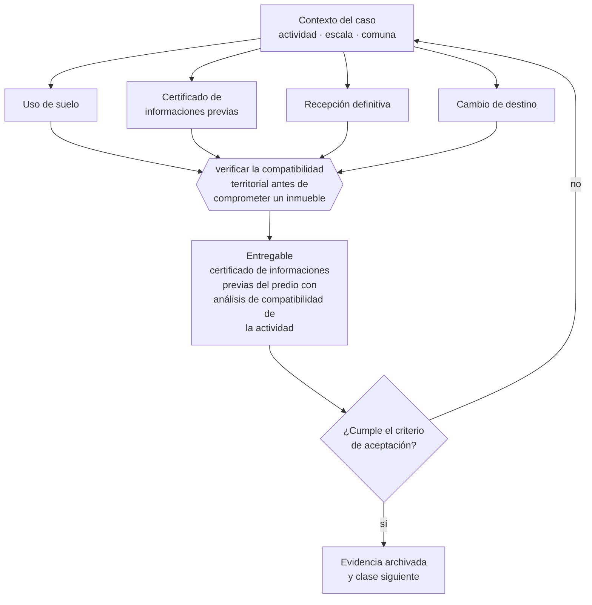

# Clase 226 — Uso de suelo, DOM y compatibilidad territorial

> **Parte 17 · Permisos, patentes y regulación sectorial** — clase 2 de 14

**Estado de evidencia:** `SECTORIAL` · **Jurisdicción:** Chile-first · **Fecha base normativa:** 07-08-2026 
**Decisión que habilita:** verificar la compatibilidad territorial antes de comprometer un inmueble 
**Entregable:** certificado de informaciones previas del predio con análisis de compatibilidad de la actividad

## 🎯 Propósito

Pedir el certificado de informaciones previas antes de comprometer un inmueble, porque es el documento que dice si la actividad es posible ahí.

## 📚 Resultados de aprendizaje

Al finalizar esta clase podrás:

1. **Definir** con precisión los cuatro conceptos de la tabla siguiente y usarlos para describir un caso real.
2. **Explicar** por qué esta materia condiciona decisiones de otras partes del programa.
3. **Decidir** —verificar la compatibilidad territorial antes de comprometer un inmueble— y justificar la decisión por escrito.
4. **Producir** el entregable de la clase y contrastarlo contra su criterio de aceptación.
5. **Distinguir** el dato estable del dato dinámico que exige revalidación en la fuente oficial.

## 🧩 Conceptos centrales

| Concepto | Comprensión verificable |
|---|---|
| **Uso de suelo** | Destino permitido para un inmueble según el instrumento de planificación. |
| **Certificado de informaciones previas** | Documento de la dom con las condiciones aplicables al predio. |
| **Recepción definitiva** | Aprobación municipal de la obra construida. |
| **Cambio de destino** | Trámite para modificar el uso autorizado del inmueble. |

## 🗺️ Flujo de razonamiento

## 📖 Desarrollo

### 1. El fondo del asunto

El certificado de informaciones previas de la Dirección de Obras Municipales indica qué actividades admite el predio. Es el primer documento que hay que pedir antes de comprometerse con un local: descubrir después que la actividad no está permitida obliga a mudarse o a un cambio de destino largo y costoso.

### 2. Cómo se traduce en la práctica

Cuesta poco y responde la pregunta que decide todo el proyecto. Descubrir después que el predio no admite la actividad obliga a mudarse o a un cambio de destino largo y costoso, y confiar en la declaración verbal del propietario es la forma más común de llegar a ese escenario.

### 3. Marco aplicable y quién interviene

- DL 3.063 sobre rentas municipales (patente municipal)
- Ley General de Urbanismo y Construcciones y su Ordenanza General
- Código Sanitario y DS 977 Reglamento Sanitario de los Alimentos
- Ley 19.300 sobre bases generales del medio ambiente
- Ley 20.667 y normativa sectorial de SEC, SUBTEL, SERNATUR, SENCE y MTT

**Autoridades o contrapartes involucradas:** Municipalidad y Dirección de Obras Municipales, SEREMI de Salud, SEC, SUBTEL, SERNATUR, SENCE, SEA, SMA.
**Profesionales de apoyo:** abogado regulatorio, arquitecto o DOM, prevencionista, consultor sectorial. La participación concreta depende del riesgo, del
tamaño de la empresa y de la actividad económica.

## 🧪 Taller guiado

Aplica esta clase a **una** de las siguientes líneas de negocio y repite después el ejercicio con
una segunda línea de carga regulatoria distinta:

| Línea | Carga regulatoria |
|---|---|
| SaaS B2B con IA | media |
| Servicios profesionales | baja |
| E-commerce D2C | media |
| Alimentos o foodtech | alta |
| Exportación de servicios | media |
| Fintech regulada | alta |
| Construcción o servicios técnicos | alta |

**Secuencia de trabajo:**

1. Delimita el contexto: actividad económica, escala, comuna y etapa de la empresa.
2. Reúne los antecedentes que la decisión exige y anota la fecha de cada fuente.
3. Identifica las alternativas reales, incluida la de no hacer nada.
4. Evalúa el impacto en mercado, caja, personas, regulación y operación.
5. Toma la decisión y regístrala con sus supuestos.
6. Produce el entregable.
7. Contrástalo contra el criterio de aceptación.
8. Anota lo que requiere validación profesional y programa su revisión.

### 📦 Entregable

Certificado de informaciones previas del predio con análisis de compatibilidad de la actividad.

Debe incluir decisión, supuestos, fuentes con fecha de consulta, responsable, riesgos
identificados y próximos pasos.

## 🏆 Reto verificable

Resuelve la misma materia para una segunda línea de negocio con distinta carga regulatoria y
explica por escrito **qué cambió, por qué y qué fuente lo determina**.

## ✅ Criterio de aceptación

- [ ] el certificado de informaciones previas está obtenido y analizado
- [ ] la recepción definitiva del inmueble está verificada
- [ ] cada afirmación regulatoria está referida a una fuente oficial con fecha de consulta;
- [ ] los datos dinámicos quedan marcados para revalidación;
- [ ] hay un responsable asignado y evidencia reproducible del trabajo.

## ⚠️ Errores frecuentes

**Propios de esta clase:**

- Arrendar confiando en la declaración verbal del propietario.
- Operar en un inmueble sin recepción definitiva.

**Característicos de la parte 17:**

- Arrendar un local cuyo uso de suelo no admite la actividad.
- Iniciar operación con permiso en trámite y exponerse a clausura.

## 🇨🇱 Checklist Chile

- [ ] ¿existe norma o autoridad específica para esta materia?
- [ ] ¿la fuente consultada está vigente a la fecha de ejecución?
- [ ] ¿se activa algún trámite ante el SII?
- [ ] ¿se activa algún requisito municipal o sectorial?
- [ ] ¿afecta a consumidores o al tratamiento de datos personales?
- [ ] ¿afecta a trabajadores o a la seguridad y salud en el trabajo?
- [ ] ¿afecta a impuestos, contabilidad o caja?
- [ ] ¿afecta a contratos o a propiedad intelectual?
- [ ] ¿requiere renovación, reporte periódico o revalidación?

## ❓ Preguntas de comprobación

1. ¿Pediste el certificado de informaciones previas antes de firmar el arriendo?
2. ¿Tiene el inmueble recepción definitiva y puedes acreditarlo?
3. ¿Qué actividades admite el predio según el instrumento de planificación?

## 🔗 Fuentes oficiales

**Biblioteca del Congreso Nacional · LeyChile — Normativa oficial consolidada**  
<https://www.bcn.cl/leychile/> · verificado 2026-08-19

- *Qué contiene:* Publica el texto oficial y consolidado de leyes, decretos y reglamentos, con la versión vigente a una fecha, el historial de modificaciones y la tramitación que las originó.
- *Cómo leerla:* Usa siempre el selector de versión vigente a la fecha en que ejecutarás el trámite, no la última publicada. Y lee el artículo transitorio: en normas en implantación gradual —jornada, datos personales— ahí está la fecha que realmente te aplica.
- *Uso en esta clase:* aporta el marco de «Normativa oficial consolidada» para verificar la compatibilidad territorial antes de comprometer un inmueble.

Complementos del repositorio: [glosario](../../../docs/19_GLOSSARY.md) ·
[ruta de lecturas](../../../docs/15_BOOKS_AND_LEARNING_PATH.md) ·
[catálogo de fuentes](../../../docs/16_OFFICIAL_SOURCE_CATALOG.md).

> [!IMPORTANT]
> Material educativo. Para una decisión real de alto impacto hay que verificar la fuente oficial
> vigente y validar con el profesional competente.

---

| Anterior | Índice | Siguiente |
|---|---|---|
| [← 225 · Patente municipal: flujo y evidencia](../class-01-patente-municipal-flujo-y-evidencia/README.md) | [Parte 17](../README.md) · [Programa](../../../README.md) | [227 · Autorización sanitaria general →](../class-03-autorizacion-sanitaria-general/README.md) |
