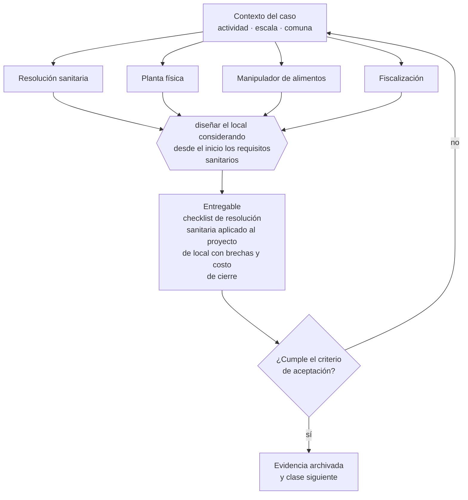

# Clase 229 — Resolución sanitaria para locales de alimentos

> **Parte 17 · Permisos, patentes y regulación sectorial** — clase 5 de 14

**Estado de evidencia:** `SECTORIAL` · **Jurisdicción:** Chile-first · **Fecha base normativa:** 07-08-2026 
**Decisión que habilita:** diseñar el local considerando desde el inicio los requisitos sanitarios 
**Entregable:** checklist de resolución sanitaria aplicado al proyecto de local con brechas y costo de cierre

## 🎯 Propósito

Diseñar el local considerando desde el inicio los requisitos de planta física, porque adaptarlos después cuesta más que construirlos bien.

## 📚 Resultados de aprendizaje

Al finalizar esta clase podrás:

1. **Definir** con precisión los cuatro conceptos de la tabla siguiente y usarlos para describir un caso real.
2. **Explicar** por qué esta materia condiciona decisiones de otras partes del programa.
3. **Decidir** —diseñar el local considerando desde el inicio los requisitos sanitarios— y justificar la decisión por escrito.
4. **Producir** el entregable de la clase y contrastarlo contra su criterio de aceptación.
5. **Distinguir** el dato estable del dato dinámico que exige revalidación en la fuente oficial.

## 🧩 Conceptos centrales

| Concepto | Comprensión verificable |
|---|---|
| **Resolución sanitaria** | Autorización específica para un establecimiento de alimentos. |
| **Planta física** | Condiciones de infraestructura exigidas. |
| **Manipulador de alimentos** | Persona con capacitación exigida. |
| **Fiscalización** | Inspección de la autoridad sanitaria. |

## 🗺️ Flujo de razonamiento

## 📖 Desarrollo

### 1. El fondo del asunto

La resolución sanitaria para locales de alimentos exige condiciones de planta física —superficies lavables, separación de áreas, agua potable, control de plagas— que deben resolverse en el diseño y no después. Modificar un local ya construido para cumplir suele costar más que haberlo diseñado bien.

### 2. Cómo se traduce en la práctica

Superficies lavables, separación de áreas, agua potable y control de plagas se resuelven en el diseño. Modificar un local ya construido para cumplir suele costar más que la diferencia de haberlo hecho correctamente, y mientras tanto el local no puede operar.

### 3. Marco aplicable y quién interviene

- DL 3.063 sobre rentas municipales (patente municipal)
- Ley General de Urbanismo y Construcciones y su Ordenanza General
- Código Sanitario y DS 977 Reglamento Sanitario de los Alimentos
- Ley 19.300 sobre bases generales del medio ambiente
- Ley 20.667 y normativa sectorial de SEC, SUBTEL, SERNATUR, SENCE y MTT

**Autoridades o contrapartes involucradas:** Municipalidad y Dirección de Obras Municipales, SEREMI de Salud, SEC, SUBTEL, SERNATUR, SENCE, SEA, SMA.
**Profesionales de apoyo:** abogado regulatorio, arquitecto o DOM, prevencionista, consultor sectorial. La participación concreta depende del riesgo, del
tamaño de la empresa y de la actividad económica.

## 🧪 Taller guiado

Aplica esta clase a **una** de las siguientes líneas de negocio y repite después el ejercicio con
una segunda línea de carga regulatoria distinta:

| Línea | Carga regulatoria |
|---|---|
| SaaS B2B con IA | media |
| Servicios profesionales | baja |
| E-commerce D2C | media |
| Alimentos o foodtech | alta |
| Exportación de servicios | media |
| Fintech regulada | alta |
| Construcción o servicios técnicos | alta |

**Secuencia de trabajo:**

1. Delimita el contexto: actividad económica, escala, comuna y etapa de la empresa.
2. Reúne los antecedentes que la decisión exige y anota la fecha de cada fuente.
3. Identifica las alternativas reales, incluida la de no hacer nada.
4. Evalúa el impacto en mercado, caja, personas, regulación y operación.
5. Toma la decisión y regístrala con sus supuestos.
6. Produce el entregable.
7. Contrástalo contra el criterio de aceptación.
8. Anota lo que requiere validación profesional y programa su revisión.

### 📦 Entregable

Checklist de resolución sanitaria aplicado al proyecto de local con brechas y costo de cierre.

Debe incluir decisión, supuestos, fuentes con fecha de consulta, responsable, riesgos
identificados y próximos pasos.

## 🏆 Reto verificable

Resuelve la misma materia para una segunda línea de negocio con distinta carga regulatoria y
explica por escrito **qué cambió, por qué y qué fuente lo determina**.

## ✅ Criterio de aceptación

- [ ] el diseño del local contempla los requisitos de planta física
- [ ] la capacitación del personal manipulador está planificada
- [ ] cada afirmación regulatoria está referida a una fuente oficial con fecha de consulta;
- [ ] los datos dinámicos quedan marcados para revalidación;
- [ ] hay un responsable asignado y evidencia reproducible del trabajo.

## ⚠️ Errores frecuentes

**Propios de esta clase:**

- Construir el local y después adaptar para cumplir el requisito sanitario.
- Operar con personal manipulador sin la capacitación exigida.

**Característicos de la parte 17:**

- Arrendar un local cuyo uso de suelo no admite la actividad.
- Iniciar operación con permiso en trámite y exponerse a clausura.

## 🇨🇱 Checklist Chile

- [ ] ¿existe norma o autoridad específica para esta materia?
- [ ] ¿la fuente consultada está vigente a la fecha de ejecución?
- [ ] ¿se activa algún trámite ante el SII?
- [ ] ¿se activa algún requisito municipal o sectorial?
- [ ] ¿afecta a consumidores o al tratamiento de datos personales?
- [ ] ¿afecta a trabajadores o a la seguridad y salud en el trabajo?
- [ ] ¿afecta a impuestos, contabilidad o caja?
- [ ] ¿afecta a contratos o a propiedad intelectual?
- [ ] ¿requiere renovación, reporte periódico o revalidación?

## ❓ Preguntas de comprobación

1. ¿Tu diseño contempla separación de áreas y superficies exigidas?
2. ¿Tu personal manipulador tiene la capacitación exigida y está vigente?
3. ¿Qué observación te haría un fiscalizador hoy si entrara a tu local?

## 🔗 Fuentes oficiales

**ChileAtiende · Autoridad Sanitaria Regional — Autorización sanitaria de alimentos**  
<https://www.chileatiende.gob.cl/fichas/172-autorizacion-sanitaria-de-alimentos> · verificado 2026-08-07

- *Qué contiene:* Detalla qué establecimientos requieren autorización sanitaria, qué antecedentes se presentan, qué condiciones de planta física se exigen y cuál es la vigencia del permiso.
- *Cómo leerla:* Léela antes de firmar el arriendo, no después: las exigencias de planta física —separación de áreas, superficies lavables, agua potable— se resuelven en el diseño y se vuelven carísimas de corregir sobre un local ya construido.

Complementos del repositorio: [glosario](../../../docs/19_GLOSSARY.md) ·
[ruta de lecturas](../../../docs/15_BOOKS_AND_LEARNING_PATH.md) ·
[catálogo de fuentes](../../../docs/16_OFFICIAL_SOURCE_CATALOG.md).

> [!IMPORTANT]
> Material educativo. Para una decisión real de alto impacto hay que verificar la fuente oficial
> vigente y validar con el profesional competente.

---

| Anterior | Índice | Siguiente |
|---|---|---|
| [← 228 · Alimentos y Reglamento Sanitario DS 977](../class-04-alimentos-y-reglamento-sanitario-ds-977/README.md) | [Parte 17](../README.md) · [Programa](../../../README.md) | [230 · Salud, prestaciones y datos sensibles →](../class-06-salud-prestaciones-y-datos-sensibles/README.md) |
