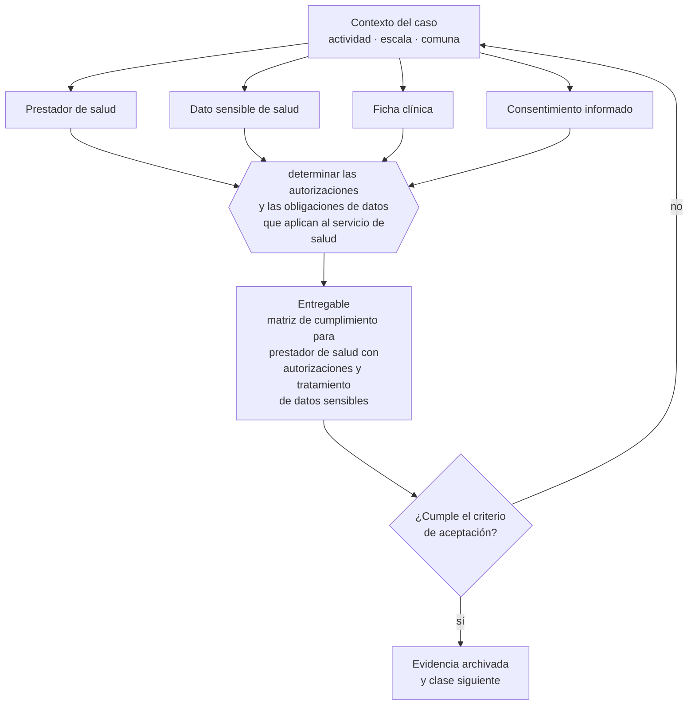

# Clase 230 — Salud, prestaciones y datos sensibles

> **Parte 17 · Permisos, patentes y regulación sectorial** — clase 6 de 14

**Estado de evidencia:** `SECTORIAL` · **Jurisdicción:** Chile-first · **Fecha base normativa:** 07-08-2026 
**Decisión que habilita:** determinar las autorizaciones y las obligaciones de datos que aplican al servicio de salud 
**Entregable:** matriz de cumplimiento para prestador de salud con autorizaciones y tratamiento de datos sensibles

## 🎯 Propósito

Combinar la autorización sanitaria del establecimiento con las obligaciones reforzadas de datos sensibles que impone el sector salud.

## 📚 Resultados de aprendizaje

Al finalizar esta clase podrás:

1. **Definir** con precisión los cuatro conceptos de la tabla siguiente y usarlos para describir un caso real.
2. **Explicar** por qué esta materia condiciona decisiones de otras partes del programa.
3. **Decidir** —determinar las autorizaciones y las obligaciones de datos que aplican al servicio de salud— y justificar la decisión por escrito.
4. **Producir** el entregable de la clase y contrastarlo contra su criterio de aceptación.
5. **Distinguir** el dato estable del dato dinámico que exige revalidación en la fuente oficial.

## 🧩 Conceptos centrales

| Concepto | Comprensión verificable |
|---|---|
| **Prestador de salud** | Entidad que otorga prestaciones, con registro y autorización. |
| **Dato sensible de salud** | Categoría con protección reforzada. |
| **Ficha clínica** | Documento con reglas propias de acceso y conservación. |
| **Consentimiento informado** | Autorización específica para prestaciones y tratamiento de datos. |

## 🗺️ Flujo de razonamiento

## 📖 Desarrollo

### 1. El fondo del asunto

Los negocios de salud combinan autorización sanitaria del establecimiento con obligaciones reforzadas de protección de datos. La ficha clínica tiene reglas específicas de acceso, conservación y entrega. La entrada en vigencia de la Ley 21.719 eleva significativamente las exigencias sobre datos sensibles.

### 2. Cómo se traduce en la práctica

La ficha clínica tiene reglas propias de acceso, conservación y entrega, y los datos de salud son categoría especial con protección reforzada bajo la Ley 21.719. Tratarlos con el mismo estándar que datos comunes es el error que más exposición genera en este rubro.

### 3. Marco aplicable y quién interviene

- DL 3.063 sobre rentas municipales (patente municipal)
- Ley General de Urbanismo y Construcciones y su Ordenanza General
- Código Sanitario y DS 977 Reglamento Sanitario de los Alimentos
- Ley 19.300 sobre bases generales del medio ambiente
- Ley 20.667 y normativa sectorial de SEC, SUBTEL, SERNATUR, SENCE y MTT

**Autoridades o contrapartes involucradas:** Municipalidad y Dirección de Obras Municipales, SEREMI de Salud, SEC, SUBTEL, SERNATUR, SENCE, SEA, SMA.
**Profesionales de apoyo:** abogado regulatorio, arquitecto o DOM, prevencionista, consultor sectorial. La participación concreta depende del riesgo, del
tamaño de la empresa y de la actividad económica.

## 🧪 Taller guiado

Aplica esta clase a **una** de las siguientes líneas de negocio y repite después el ejercicio con
una segunda línea de carga regulatoria distinta:

| Línea | Carga regulatoria |
|---|---|
| SaaS B2B con IA | media |
| Servicios profesionales | baja |
| E-commerce D2C | media |
| Alimentos o foodtech | alta |
| Exportación de servicios | media |
| Fintech regulada | alta |
| Construcción o servicios técnicos | alta |

**Secuencia de trabajo:**

1. Delimita el contexto: actividad económica, escala, comuna y etapa de la empresa.
2. Reúne los antecedentes que la decisión exige y anota la fecha de cada fuente.
3. Identifica las alternativas reales, incluida la de no hacer nada.
4. Evalúa el impacto en mercado, caja, personas, regulación y operación.
5. Toma la decisión y regístrala con sus supuestos.
6. Produce el entregable.
7. Contrástalo contra el criterio de aceptación.
8. Anota lo que requiere validación profesional y programa su revisión.

### 📦 Entregable

Matriz de cumplimiento para prestador de salud con autorizaciones y tratamiento de datos sensibles.

Debe incluir decisión, supuestos, fuentes con fecha de consulta, responsable, riesgos
identificados y próximos pasos.

## 🏆 Reto verificable

Resuelve la misma materia para una segunda línea de negocio con distinta carga regulatoria y
explica por escrito **qué cambió, por qué y qué fuente lo determina**.

## ✅ Criterio de aceptación

- [ ] las autorizaciones aplicables están identificadas
- [ ] el tratamiento de datos sensibles tiene controles reforzados
- [ ] cada afirmación regulatoria está referida a una fuente oficial con fecha de consulta;
- [ ] los datos dinámicos quedan marcados para revalidación;
- [ ] hay un responsable asignado y evidencia reproducible del trabajo.

## ⚠️ Errores frecuentes

**Propios de esta clase:**

- Tratar datos de salud con el mismo estándar que datos comunes.
- Almacenar fichas clínicas sin control de acceso ni registro de consultas.

**Característicos de la parte 17:**

- Arrendar un local cuyo uso de suelo no admite la actividad.
- Iniciar operación con permiso en trámite y exponerse a clausura.

## 🇨🇱 Checklist Chile

- [ ] ¿existe norma o autoridad específica para esta materia?
- [ ] ¿la fuente consultada está vigente a la fecha de ejecución?
- [ ] ¿se activa algún trámite ante el SII?
- [ ] ¿se activa algún requisito municipal o sectorial?
- [ ] ¿afecta a consumidores o al tratamiento de datos personales?
- [ ] ¿afecta a trabajadores o a la seguridad y salud en el trabajo?
- [ ] ¿afecta a impuestos, contabilidad o caja?
- [ ] ¿afecta a contratos o a propiedad intelectual?
- [ ] ¿requiere renovación, reporte periódico o revalidación?

## ❓ Preguntas de comprobación

1. ¿Qué autorizaciones exige tu prestación y están vigentes?
2. ¿Quién puede acceder a una ficha clínica y queda registro de cada consulta?
3. ¿Cómo obtienes y documentas el consentimiento informado?

## 🔗 Fuentes oficiales

**ChileAtiende · Autoridad Sanitaria Regional — Autorización sanitaria de alimentos**  
<https://www.chileatiende.gob.cl/fichas/172-autorizacion-sanitaria-de-alimentos> · verificado 2026-08-19

- *Qué contiene:* Detalla qué establecimientos requieren autorización sanitaria, qué antecedentes se presentan, qué condiciones de planta física se exigen y cuál es la vigencia del permiso.
- *Cómo leerla:* Léela antes de firmar el arriendo, no después: las exigencias de planta física —separación de áreas, superficies lavables, agua potable— se resuelven en el diseño y se vuelven carísimas de corregir sobre un local ya construido.
- *Uso en esta clase:* aporta el marco de «Autorización sanitaria de alimentos» para determinar las autorizaciones y las obligaciones de datos que aplican al servicio de salud.

**Biblioteca del Congreso Nacional · LeyChile — Normativa oficial consolidada**  
<https://www.bcn.cl/leychile/> · verificado 2026-08-19

- *Qué contiene:* Publica el texto oficial y consolidado de leyes, decretos y reglamentos, con la versión vigente a una fecha, el historial de modificaciones y la tramitación que las originó.
- *Cómo leerla:* Usa siempre el selector de versión vigente a la fecha en que ejecutarás el trámite, no la última publicada. Y lee el artículo transitorio: en normas en implantación gradual —jornada, datos personales— ahí está la fecha que realmente te aplica.
- *Uso en esta clase:* aporta el marco de «Normativa oficial consolidada» para determinar las autorizaciones y las obligaciones de datos que aplican al servicio de salud.

Complementos del repositorio: [glosario](../../../docs/19_GLOSSARY.md) ·
[ruta de lecturas](../../../docs/15_BOOKS_AND_LEARNING_PATH.md) ·
[catálogo de fuentes](../../../docs/16_OFFICIAL_SOURCE_CATALOG.md).

> [!IMPORTANT]
> Material educativo. Para una decisión real de alto impacto hay que verificar la fuente oficial
> vigente y validar con el profesional competente.

---

| Anterior | Índice | Siguiente |
|---|---|---|
| [← 229 · Resolución sanitaria para locales de alimentos](../class-05-resolucion-sanitaria-para-locales-de-alimentos/README.md) | [Parte 17](../README.md) · [Programa](../../../README.md) | [231 · Construcción, LGUC y OGUC →](../class-07-construccion-lguc-y-oguc/README.md) |
