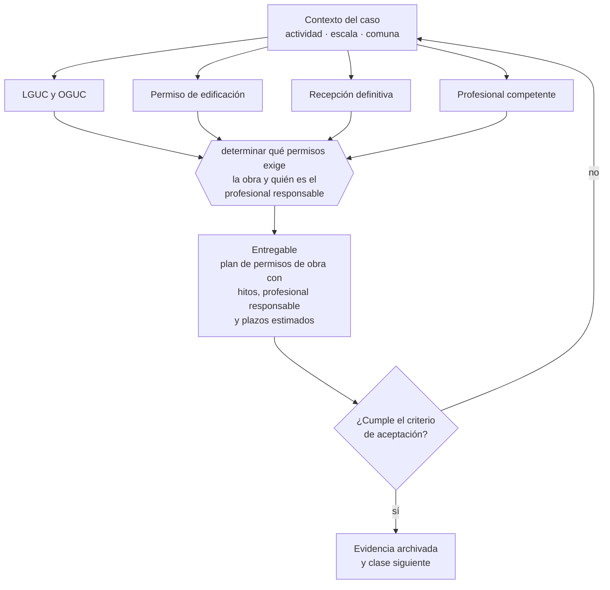

# Clase 231 — Construcción, LGUC y OGUC

> **Parte 17 · Permisos, patentes y regulación sectorial** — clase 7 de 14

**Estado de evidencia:** `SECTORIAL` · **Jurisdicción:** Chile-first · **Fecha base normativa:** 07-08-2026 
**Decisión que habilita:** determinar qué permisos exige la obra y quién es el profesional responsable 
**Entregable:** plan de permisos de obra con hitos, profesional responsable y plazos estimados

## 🎯 Propósito

Determinar qué permisos exige la obra y quién es el profesional responsable, incorporando el plazo de recepción definitiva al plan.

## 📚 Resultados de aprendizaje

Al finalizar esta clase podrás:

1. **Definir** con precisión los cuatro conceptos de la tabla siguiente y usarlos para describir un caso real.
2. **Explicar** por qué esta materia condiciona decisiones de otras partes del programa.
3. **Decidir** —determinar qué permisos exige la obra y quién es el profesional responsable— y justificar la decisión por escrito.
4. **Producir** el entregable de la clase y contrastarlo contra su criterio de aceptación.
5. **Distinguir** el dato estable del dato dinámico que exige revalidación en la fuente oficial.

## 🧩 Conceptos centrales

| Concepto | Comprensión verificable |
|---|---|
| **LGUC y OGUC** | Marco legal y reglamentario de urbanismo y construcciones. |
| **Permiso de edificación** | Autorización previa a construir. |
| **Recepción definitiva** | Aprobación final de la obra ejecutada. |
| **Profesional competente** | Arquitecto o ingeniero responsable ante la dom. |

## 🗺️ Flujo de razonamiento

## 📖 Desarrollo

### 1. El fondo del asunto

Construir o remodelar exige permiso de edificación previo y recepción definitiva posterior. Operar en obra sin recepción impide obtener patente y expone a sanciones. Las regularizaciones posteriores son posibles pero caras y lentas, y pueden no ser viables si la obra infringe normas urbanísticas.

### 2. Cómo se traduce en la práctica

Ejecutar sin permiso confiando en regularizar después es una apuesta que puede no tener retorno: si la obra infringe normas urbanísticas, la regularización simplemente no procede. Y operar sin recepción definitiva impide obtener la patente, de modo que el local queda terminado e inutilizable.

### 3. Marco aplicable y quién interviene

- DL 3.063 sobre rentas municipales (patente municipal)
- Ley General de Urbanismo y Construcciones y su Ordenanza General
- Código Sanitario y DS 977 Reglamento Sanitario de los Alimentos
- Ley 19.300 sobre bases generales del medio ambiente
- Ley 20.667 y normativa sectorial de SEC, SUBTEL, SERNATUR, SENCE y MTT

**Autoridades o contrapartes involucradas:** Municipalidad y Dirección de Obras Municipales, SEREMI de Salud, SEC, SUBTEL, SERNATUR, SENCE, SEA, SMA.
**Profesionales de apoyo:** abogado regulatorio, arquitecto o DOM, prevencionista, consultor sectorial. La participación concreta depende del riesgo, del
tamaño de la empresa y de la actividad económica.

## 🧪 Taller guiado

Aplica esta clase a **una** de las siguientes líneas de negocio y repite después el ejercicio con
una segunda línea de carga regulatoria distinta:

| Línea | Carga regulatoria |
|---|---|
| SaaS B2B con IA | media |
| Servicios profesionales | baja |
| E-commerce D2C | media |
| Alimentos o foodtech | alta |
| Exportación de servicios | media |
| Fintech regulada | alta |
| Construcción o servicios técnicos | alta |

**Secuencia de trabajo:**

1. Delimita el contexto: actividad económica, escala, comuna y etapa de la empresa.
2. Reúne los antecedentes que la decisión exige y anota la fecha de cada fuente.
3. Identifica las alternativas reales, incluida la de no hacer nada.
4. Evalúa el impacto en mercado, caja, personas, regulación y operación.
5. Toma la decisión y regístrala con sus supuestos.
6. Produce el entregable.
7. Contrástalo contra el criterio de aceptación.
8. Anota lo que requiere validación profesional y programa su revisión.

### 📦 Entregable

Plan de permisos de obra con hitos, profesional responsable y plazos estimados.

Debe incluir decisión, supuestos, fuentes con fecha de consulta, responsable, riesgos
identificados y próximos pasos.

## 🏆 Reto verificable

Resuelve la misma materia para una segunda línea de negocio con distinta carga regulatoria y
explica por escrito **qué cambió, por qué y qué fuente lo determina**.

## ✅ Criterio de aceptación

- [ ] los permisos exigidos por la obra están identificados
- [ ] el plazo de recepción definitiva está incorporado al plan
- [ ] cada afirmación regulatoria está referida a una fuente oficial con fecha de consulta;
- [ ] los datos dinámicos quedan marcados para revalidación;
- [ ] hay un responsable asignado y evidencia reproducible del trabajo.

## ⚠️ Errores frecuentes

**Propios de esta clase:**

- Ejecutar obras sin permiso confiando en regularizar después.
- Planificar la apertura sin considerar el plazo de recepción definitiva.

**Característicos de la parte 17:**

- Arrendar un local cuyo uso de suelo no admite la actividad.
- Iniciar operación con permiso en trámite y exponerse a clausura.

## 🇨🇱 Checklist Chile

- [ ] ¿existe norma o autoridad específica para esta materia?
- [ ] ¿la fuente consultada está vigente a la fecha de ejecución?
- [ ] ¿se activa algún trámite ante el SII?
- [ ] ¿se activa algún requisito municipal o sectorial?
- [ ] ¿afecta a consumidores o al tratamiento de datos personales?
- [ ] ¿afecta a trabajadores o a la seguridad y salud en el trabajo?
- [ ] ¿afecta a impuestos, contabilidad o caja?
- [ ] ¿afecta a contratos o a propiedad intelectual?
- [ ] ¿requiere renovación, reporte periódico o revalidación?

## ❓ Preguntas de comprobación

1. ¿Qué permisos exige tu obra y quién es el profesional responsable ante la DOM?
2. ¿Incorporaste el plazo de recepción definitiva a tu cronograma de apertura?
3. ¿Estás ejecutando algo confiando en regularizarlo después?

## 🔗 Fuentes oficiales

**Biblioteca del Congreso Nacional · LeyChile — Normativa oficial consolidada**  
<https://www.bcn.cl/leychile/> · verificado 2026-08-07

- *Qué contiene:* Publica el texto oficial y consolidado de leyes, decretos y reglamentos, con la versión vigente a una fecha, el historial de modificaciones y la tramitación que las originó.
- *Cómo leerla:* Usa siempre el selector de versión vigente a la fecha en que ejecutarás el trámite, no la última publicada. Y lee el artículo transitorio: en normas en implantación gradual —jornada, datos personales— ahí está la fecha que realmente te aplica.

Complementos del repositorio: [glosario](../../../docs/19_GLOSSARY.md) ·
[ruta de lecturas](../../../docs/15_BOOKS_AND_LEARNING_PATH.md) ·
[catálogo de fuentes](../../../docs/16_OFFICIAL_SOURCE_CATALOG.md).

> [!IMPORTANT]
> Material educativo. Para una decisión real de alto impacto hay que verificar la fuente oficial
> vigente y validar con el profesional competente.

---

| Anterior | Índice | Siguiente |
|---|---|---|
| [← 230 · Salud, prestaciones y datos sensibles](../class-06-salud-prestaciones-y-datos-sensibles/README.md) | [Parte 17](../README.md) · [Programa](../../../README.md) | [232 · Energía e instalaciones fiscalizadas por SEC →](../class-08-energia-e-instalaciones-fiscalizadas-por-sec/README.md) |
