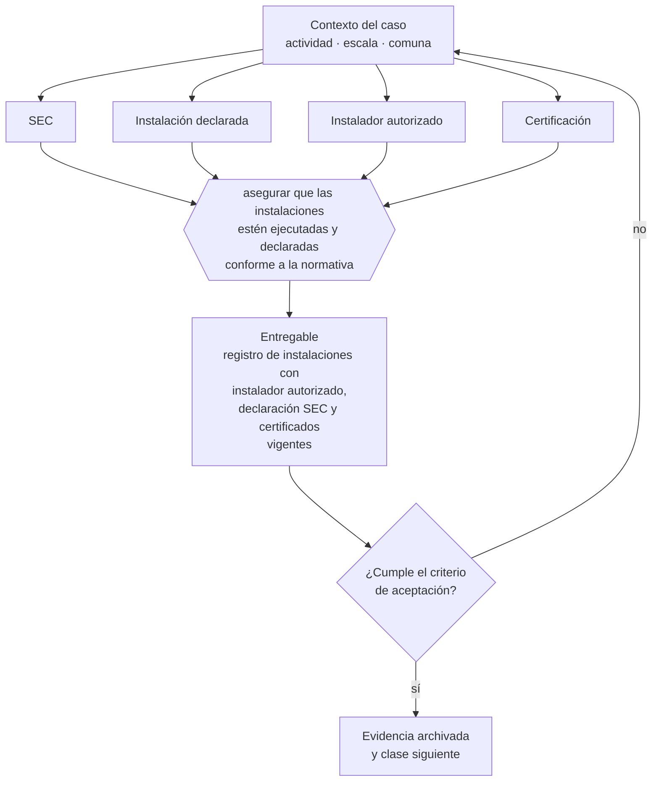

# Clase 232 — Energía e instalaciones fiscalizadas por SEC

> **Parte 17 · Permisos, patentes y regulación sectorial** — clase 8 de 14

**Estado de evidencia:** `SECTORIAL` · **Jurisdicción:** Chile-first · **Fecha base normativa:** 07-08-2026 
**Decisión que habilita:** asegurar que las instalaciones estén ejecutadas y declaradas conforme a la normativa 
**Entregable:** registro de instalaciones con instalador autorizado, declaración SEC y certificados vigentes

## 🎯 Propósito

Asegurar que las instalaciones eléctricas y de gas las ejecute un instalador autorizado y queden declaradas ante la SEC.

## 📚 Resultados de aprendizaje

Al finalizar esta clase podrás:

1. **Definir** con precisión los cuatro conceptos de la tabla siguiente y usarlos para describir un caso real.
2. **Explicar** por qué esta materia condiciona decisiones de otras partes del programa.
3. **Decidir** —asegurar que las instalaciones estén ejecutadas y declaradas conforme a la normativa— y justificar la decisión por escrito.
4. **Producir** el entregable de la clase y contrastarlo contra su criterio de aceptación.
5. **Distinguir** el dato estable del dato dinámico que exige revalidación en la fuente oficial.

## 🧩 Conceptos centrales

| Concepto | Comprensión verificable |
|---|---|
| **SEC** | Superintendencia de electricidad y combustibles. |
| **Instalación declarada** | Registro obligatorio de instalaciones eléctricas o de gas. |
| **Instalador autorizado** | Profesional con licencia habilitante. |
| **Certificación** | Documento que acredita la conformidad de la instalación. |

## 🗺️ Flujo de razonamiento

## 📖 Desarrollo

### 1. El fondo del asunto

Las instalaciones eléctricas y de gas deben ser ejecutadas por instalador autorizado y declaradas ante la SEC. La declaración es requisito para el empalme y suele exigirse por seguros y por la propia municipalidad. Una instalación no declarada puede invalidar la cobertura de seguro ante un siniestro.

### 2. Cómo se traduce en la práctica

La declaración es requisito para el empalme y suele exigirse por seguros y por la propia municipalidad. Una instalación no declarada puede invalidar la cobertura del seguro ante un siniestro, que es exactamente el momento en que se descubre que el ahorro inicial no compensaba.

### 3. Marco aplicable y quién interviene

- DL 3.063 sobre rentas municipales (patente municipal)
- Ley General de Urbanismo y Construcciones y su Ordenanza General
- Código Sanitario y DS 977 Reglamento Sanitario de los Alimentos
- Ley 19.300 sobre bases generales del medio ambiente
- Ley 20.667 y normativa sectorial de SEC, SUBTEL, SERNATUR, SENCE y MTT

**Autoridades o contrapartes involucradas:** Municipalidad y Dirección de Obras Municipales, SEREMI de Salud, SEC, SUBTEL, SERNATUR, SENCE, SEA, SMA.
**Profesionales de apoyo:** abogado regulatorio, arquitecto o DOM, prevencionista, consultor sectorial. La participación concreta depende del riesgo, del
tamaño de la empresa y de la actividad económica.

## 🧪 Taller guiado

Aplica esta clase a **una** de las siguientes líneas de negocio y repite después el ejercicio con
una segunda línea de carga regulatoria distinta:

| Línea | Carga regulatoria |
|---|---|
| SaaS B2B con IA | media |
| Servicios profesionales | baja |
| E-commerce D2C | media |
| Alimentos o foodtech | alta |
| Exportación de servicios | media |
| Fintech regulada | alta |
| Construcción o servicios técnicos | alta |

**Secuencia de trabajo:**

1. Delimita el contexto: actividad económica, escala, comuna y etapa de la empresa.
2. Reúne los antecedentes que la decisión exige y anota la fecha de cada fuente.
3. Identifica las alternativas reales, incluida la de no hacer nada.
4. Evalúa el impacto en mercado, caja, personas, regulación y operación.
5. Toma la decisión y regístrala con sus supuestos.
6. Produce el entregable.
7. Contrástalo contra el criterio de aceptación.
8. Anota lo que requiere validación profesional y programa su revisión.

### 📦 Entregable

Registro de instalaciones con instalador autorizado, declaración sec y certificados vigentes.

Debe incluir decisión, supuestos, fuentes con fecha de consulta, responsable, riesgos
identificados y próximos pasos.

## 🏆 Reto verificable

Resuelve la misma materia para una segunda línea de negocio con distinta carga regulatoria y
explica por escrito **qué cambió, por qué y qué fuente lo determina**.

## ✅ Criterio de aceptación

- [ ] las instalaciones cuentan con declaración vigente
- [ ] el instalador tiene licencia acreditada
- [ ] cada afirmación regulatoria está referida a una fuente oficial con fecha de consulta;
- [ ] los datos dinámicos quedan marcados para revalidación;
- [ ] hay un responsable asignado y evidencia reproducible del trabajo.

## ⚠️ Errores frecuentes

**Propios de esta clase:**

- Ejecutar instalaciones con personal no autorizado.
- No declarar la instalación y perder cobertura de seguro.

**Característicos de la parte 17:**

- Arrendar un local cuyo uso de suelo no admite la actividad.
- Iniciar operación con permiso en trámite y exponerse a clausura.

## 🇨🇱 Checklist Chile

- [ ] ¿existe norma o autoridad específica para esta materia?
- [ ] ¿la fuente consultada está vigente a la fecha de ejecución?
- [ ] ¿se activa algún trámite ante el SII?
- [ ] ¿se activa algún requisito municipal o sectorial?
- [ ] ¿afecta a consumidores o al tratamiento de datos personales?
- [ ] ¿afecta a trabajadores o a la seguridad y salud en el trabajo?
- [ ] ¿afecta a impuestos, contabilidad o caja?
- [ ] ¿afecta a contratos o a propiedad intelectual?
- [ ] ¿requiere renovación, reporte periódico o revalidación?

## ❓ Preguntas de comprobación

1. ¿Tiene licencia vigente el instalador que ejecutó o ejecutará tus instalaciones?
2. ¿Está la declaración SEC entre los entregables que exiges del trabajo?
3. ¿Tu póliza cubre un siniestro con instalación no declarada?

## 🔗 Fuentes oficiales

**Superintendencia de Electricidad y Combustibles — Instalaciones eléctricas y de gas**  
<https://www.sec.cl/> · verificado 2026-08-19

- *Qué contiene:* Regula la ejecución y declaración de instalaciones eléctricas y de gas, el registro de instaladores autorizados y las exigencias de seguridad de productos energéticos.
- *Cómo leerla:* Verifica la licencia del instalador antes de contratar y exige la declaración como entregable del trabajo: sin ella no hay empalme, y un siniestro sobre instalación no declarada compromete la cobertura del seguro.
- *Uso en esta clase:* aporta el marco de «Instalaciones eléctricas y de gas» para asegurar que las instalaciones estén ejecutadas y declaradas conforme a la normativa.

Complementos del repositorio: [glosario](../../../docs/19_GLOSSARY.md) ·
[ruta de lecturas](../../../docs/15_BOOKS_AND_LEARNING_PATH.md) ·
[catálogo de fuentes](../../../docs/16_OFFICIAL_SOURCE_CATALOG.md).

> [!IMPORTANT]
> Material educativo. Para una decisión real de alto impacto hay que verificar la fuente oficial
> vigente y validar con el profesional competente.

---

| Anterior | Índice | Siguiente |
|---|---|---|
| [← 231 · Construcción, LGUC y OGUC](../class-07-construccion-lguc-y-oguc/README.md) | [Parte 17](../README.md) · [Programa](../../../README.md) | [233 · Telecomunicaciones y SUBTEL →](../class-09-telecomunicaciones-y-subtel/README.md) |
