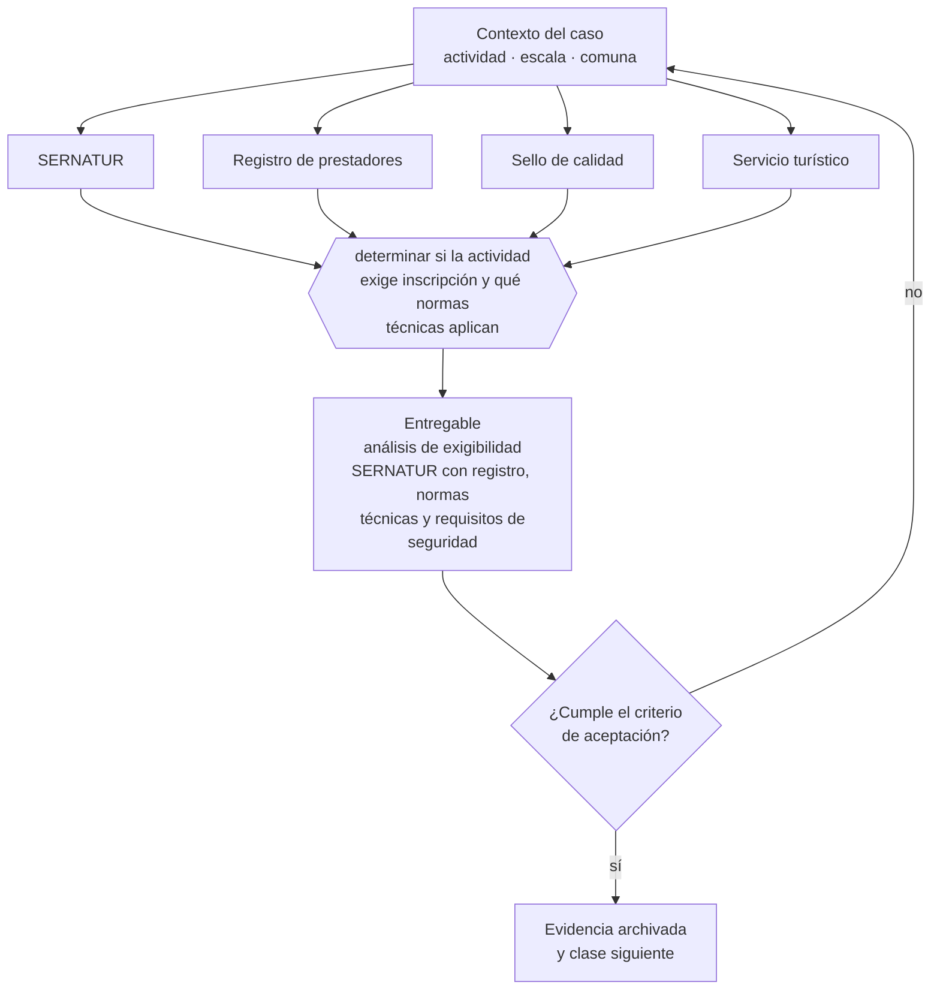

# Clase 234 — Turismo y registros sectoriales

> **Parte 17 · Permisos, patentes y regulación sectorial** — clase 10 de 14

**Estado de evidencia:** `SECTORIAL` · **Jurisdicción:** Chile-first · **Fecha base normativa:** 07-08-2026 
**Decisión que habilita:** determinar si la actividad exige inscripción y qué normas técnicas aplican 
**Entregable:** análisis de exigibilidad SERNATUR con registro, normas técnicas y requisitos de seguridad

## 🎯 Propósito

Determinar si la actividad exige inscripción en SERNATUR y qué normas técnicas de seguridad aplican, especialmente en turismo aventura.

## 📚 Resultados de aprendizaje

Al finalizar esta clase podrás:

1. **Definir** con precisión los cuatro conceptos de la tabla siguiente y usarlos para describir un caso real.
2. **Explicar** por qué esta materia condiciona decisiones de otras partes del programa.
3. **Decidir** —determinar si la actividad exige inscripción y qué normas técnicas aplican— y justificar la decisión por escrito.
4. **Producir** el entregable de la clase y contrastarlo contra su criterio de aceptación.
5. **Distinguir** el dato estable del dato dinámico que exige revalidación en la fuente oficial.

## 🧩 Conceptos centrales

| Concepto | Comprensión verificable |
|---|---|
| **SERNATUR** | Servicio nacional de turismo. |
| **Registro de prestadores** | Inscripción de servicios turísticos. |
| **Sello de calidad** | Distintivo voluntario asociado a estándares. |
| **Servicio turístico** | Categoría regulada según el tipo de prestación. |

## 🗺️ Flujo de razonamiento

## 📖 Desarrollo

### 1. El fondo del asunto

Los prestadores de servicios turísticos deben inscribirse en el registro de SERNATUR, y ciertas actividades de turismo aventura tienen normas técnicas y exigencias de seguridad específicas. La inscripción es además requisito para acceder a programas de promoción y para operar con ciertos canales.

### 2. Cómo se traduce en la práctica

La inscripción es además requisito para acceder a programas de promoción y para operar con ciertos canales de comercialización. En turismo aventura las normas técnicas definen personal, equipamiento y procedimientos: su incumplimiento es el riesgo mayor del modelo, muy por encima del comercial.

### 3. Marco aplicable y quién interviene

- DL 3.063 sobre rentas municipales (patente municipal)
- Ley General de Urbanismo y Construcciones y su Ordenanza General
- Código Sanitario y DS 977 Reglamento Sanitario de los Alimentos
- Ley 19.300 sobre bases generales del medio ambiente
- Ley 20.667 y normativa sectorial de SEC, SUBTEL, SERNATUR, SENCE y MTT

**Autoridades o contrapartes involucradas:** Municipalidad y Dirección de Obras Municipales, SEREMI de Salud, SEC, SUBTEL, SERNATUR, SENCE, SEA, SMA.
**Profesionales de apoyo:** abogado regulatorio, arquitecto o DOM, prevencionista, consultor sectorial. La participación concreta depende del riesgo, del
tamaño de la empresa y de la actividad económica.

## 🧪 Taller guiado

Aplica esta clase a **una** de las siguientes líneas de negocio y repite después el ejercicio con
una segunda línea de carga regulatoria distinta:

| Línea | Carga regulatoria |
|---|---|
| SaaS B2B con IA | media |
| Servicios profesionales | baja |
| E-commerce D2C | media |
| Alimentos o foodtech | alta |
| Exportación de servicios | media |
| Fintech regulada | alta |
| Construcción o servicios técnicos | alta |

**Secuencia de trabajo:**

1. Delimita el contexto: actividad económica, escala, comuna y etapa de la empresa.
2. Reúne los antecedentes que la decisión exige y anota la fecha de cada fuente.
3. Identifica las alternativas reales, incluida la de no hacer nada.
4. Evalúa el impacto en mercado, caja, personas, regulación y operación.
5. Toma la decisión y regístrala con sus supuestos.
6. Produce el entregable.
7. Contrástalo contra el criterio de aceptación.
8. Anota lo que requiere validación profesional y programa su revisión.

### 📦 Entregable

Análisis de exigibilidad sernatur con registro, normas técnicas y requisitos de seguridad.

Debe incluir decisión, supuestos, fuentes con fecha de consulta, responsable, riesgos
identificados y próximos pasos.

## 🏆 Reto verificable

Resuelve la misma materia para una segunda línea de negocio con distinta carga regulatoria y
explica por escrito **qué cambió, por qué y qué fuente lo determina**.

## ✅ Criterio de aceptación

- [ ] la categoría del servicio turístico está determinada
- [ ] las normas técnicas de seguridad aplicables están identificadas
- [ ] cada afirmación regulatoria está referida a una fuente oficial con fecha de consulta;
- [ ] los datos dinámicos quedan marcados para revalidación;
- [ ] hay un responsable asignado y evidencia reproducible del trabajo.

## ⚠️ Errores frecuentes

**Propios de esta clase:**

- Operar turismo aventura sin cumplir las normas técnicas de seguridad.
- No inscribirse y quedar fuera de canales y programas de promoción.

**Característicos de la parte 17:**

- Arrendar un local cuyo uso de suelo no admite la actividad.
- Iniciar operación con permiso en trámite y exponerse a clausura.

## 🇨🇱 Checklist Chile

- [ ] ¿existe norma o autoridad específica para esta materia?
- [ ] ¿la fuente consultada está vigente a la fecha de ejecución?
- [ ] ¿se activa algún trámite ante el SII?
- [ ] ¿se activa algún requisito municipal o sectorial?
- [ ] ¿afecta a consumidores o al tratamiento de datos personales?
- [ ] ¿afecta a trabajadores o a la seguridad y salud en el trabajo?
- [ ] ¿afecta a impuestos, contabilidad o caja?
- [ ] ¿afecta a contratos o a propiedad intelectual?
- [ ] ¿requiere renovación, reporte periódico o revalidación?

## ❓ Preguntas de comprobación

1. ¿Qué categoría de servicio turístico prestas y exige inscripción?
2. ¿Qué normas técnicas de seguridad aplican a tus actividades?
3. ¿Tu personal cumple los requisitos de calificación exigidos?

## 🔗 Fuentes oficiales

**Servicio Nacional de Turismo — Registro de prestadores de servicios turísticos**  
<https://www.sernatur.cl/> · verificado 2026-08-07

- *Qué contiene:* Administra el registro obligatorio de prestadores de servicios turísticos, las categorías de servicio y las normas técnicas aplicables, en particular al turismo aventura.
- *Cómo leerla:* Si tu actividad es turismo aventura, ve directo a las normas técnicas de seguridad: definen personal, equipamiento y procedimientos, y su incumplimiento es el riesgo mayor del modelo.

Complementos del repositorio: [glosario](../../../docs/19_GLOSSARY.md) ·
[ruta de lecturas](../../../docs/15_BOOKS_AND_LEARNING_PATH.md) ·
[catálogo de fuentes](../../../docs/16_OFFICIAL_SOURCE_CATALOG.md).

> [!IMPORTANT]
> Material educativo. Para una decisión real de alto impacto hay que verificar la fuente oficial
> vigente y validar con el profesional competente.

---

| Anterior | Índice | Siguiente |
|---|---|---|
| [← 233 · Telecomunicaciones y SUBTEL](../class-09-telecomunicaciones-y-subtel/README.md) | [Parte 17](../README.md) · [Programa](../../../README.md) | [235 · Transporte, logística y permisos →](../class-11-transporte-logistica-y-permisos/README.md) |
