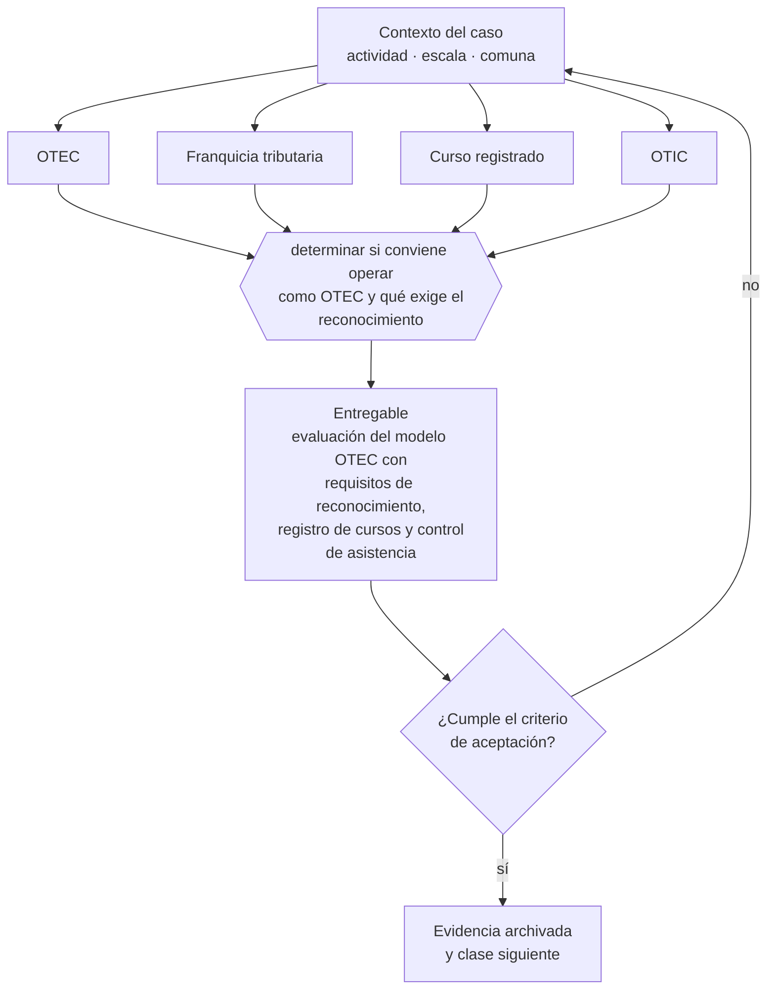

# Clase 236 — OTEC, capacitación y SENCE

> **Parte 17 · Permisos, patentes y regulación sectorial** — clase 12 de 14

**Estado de evidencia:** `SECTORIAL` · **Jurisdicción:** Chile-first · **Fecha base normativa:** 07-08-2026 
**Decisión que habilita:** determinar si conviene operar como OTEC y qué exige el reconocimiento 
**Entregable:** evaluación del modelo OTEC con requisitos de reconocimiento, registro de cursos y control de asistencia

## 🎯 Propósito

Evaluar si conviene operar como OTEC reconocido, separando esa decisión de la de usar la franquicia tributaria.

## 📚 Resultados de aprendizaje

Al finalizar esta clase podrás:

1. **Definir** con precisión los cuatro conceptos de la tabla siguiente y usarlos para describir un caso real.
2. **Explicar** por qué esta materia condiciona decisiones de otras partes del programa.
3. **Decidir** —determinar si conviene operar como OTEC y qué exige el reconocimiento— y justificar la decisión por escrito.
4. **Producir** el entregable de la clase y contrastarlo contra su criterio de aceptación.
5. **Distinguir** el dato estable del dato dinámico que exige revalidación en la fuente oficial.

## 🧩 Conceptos centrales

| Concepto | Comprensión verificable |
|---|---|
| **OTEC** | Organismo técnico de capacitación reconocido por sence. |
| **Franquicia tributaria** | Beneficio que permite descontar capacitación del impuesto. |
| **Curso registrado** | Programa aprobado con código y horas. |
| **OTIC** | Organismo intermedio que administra la franquicia. |

## 🗺️ Flujo de razonamiento

## 📖 Desarrollo

### 1. El fondo del asunto

Operar como OTEC exige reconocimiento de SENCE, certificación de calidad y cursos registrados. El atractivo del modelo está en la franquicia tributaria que permite a las empresas descontar la capacitación, pero exige cumplimiento estricto de registro de asistencia y ejecución.

### 2. Cómo se traduce en la práctica

La franquicia permite a las empresas descontar la capacitación del impuesto, y solo existe si el organismo está reconocido por SENCE con cursos registrados. Su contrapartida es un cumplimiento estricto de registro de asistencia y ejecución: incumplirlo hace perder la franquicia al cliente, no solo al proveedor.

### 3. Marco aplicable y quién interviene

- DL 3.063 sobre rentas municipales (patente municipal)
- Ley General de Urbanismo y Construcciones y su Ordenanza General
- Código Sanitario y DS 977 Reglamento Sanitario de los Alimentos
- Ley 19.300 sobre bases generales del medio ambiente
- Ley 20.667 y normativa sectorial de SEC, SUBTEL, SERNATUR, SENCE y MTT

**Autoridades o contrapartes involucradas:** Municipalidad y Dirección de Obras Municipales, SEREMI de Salud, SEC, SUBTEL, SERNATUR, SENCE, SEA, SMA.
**Profesionales de apoyo:** abogado regulatorio, arquitecto o DOM, prevencionista, consultor sectorial. La participación concreta depende del riesgo, del
tamaño de la empresa y de la actividad económica.

## 🧪 Taller guiado

Aplica esta clase a **una** de las siguientes líneas de negocio y repite después el ejercicio con
una segunda línea de carga regulatoria distinta:

| Línea | Carga regulatoria |
|---|---|
| SaaS B2B con IA | media |
| Servicios profesionales | baja |
| E-commerce D2C | media |
| Alimentos o foodtech | alta |
| Exportación de servicios | media |
| Fintech regulada | alta |
| Construcción o servicios técnicos | alta |

**Secuencia de trabajo:**

1. Delimita el contexto: actividad económica, escala, comuna y etapa de la empresa.
2. Reúne los antecedentes que la decisión exige y anota la fecha de cada fuente.
3. Identifica las alternativas reales, incluida la de no hacer nada.
4. Evalúa el impacto en mercado, caja, personas, regulación y operación.
5. Toma la decisión y regístrala con sus supuestos.
6. Produce el entregable.
7. Contrástalo contra el criterio de aceptación.
8. Anota lo que requiere validación profesional y programa su revisión.

### 📦 Entregable

Evaluación del modelo otec con requisitos de reconocimiento, registro de cursos y control de asistencia.

Debe incluir decisión, supuestos, fuentes con fecha de consulta, responsable, riesgos
identificados y próximos pasos.

## 🏆 Reto verificable

Resuelve la misma materia para una segunda línea de negocio con distinta carga regulatoria y
explica por escrito **qué cambió, por qué y qué fuente lo determina**.

## ✅ Criterio de aceptación

- [ ] los requisitos de reconocimiento están verificados
- [ ] el control de asistencia y ejecución está diseñado
- [ ] cada afirmación regulatoria está referida a una fuente oficial con fecha de consulta;
- [ ] los datos dinámicos quedan marcados para revalidación;
- [ ] hay un responsable asignado y evidencia reproducible del trabajo.

## ⚠️ Errores frecuentes

**Propios de esta clase:**

- Ofrecer capacitación con franquicia sin ser otec reconocido.
- Incumplir el registro de asistencia y perder la franquicia para el cliente.

**Característicos de la parte 17:**

- Arrendar un local cuyo uso de suelo no admite la actividad.
- Iniciar operación con permiso en trámite y exponerse a clausura.

## 🇨🇱 Checklist Chile

- [ ] ¿existe norma o autoridad específica para esta materia?
- [ ] ¿la fuente consultada está vigente a la fecha de ejecución?
- [ ] ¿se activa algún trámite ante el SII?
- [ ] ¿se activa algún requisito municipal o sectorial?
- [ ] ¿afecta a consumidores o al tratamiento de datos personales?
- [ ] ¿afecta a trabajadores o a la seguridad y salud en el trabajo?
- [ ] ¿afecta a impuestos, contabilidad o caja?
- [ ] ¿afecta a contratos o a propiedad intelectual?
- [ ] ¿requiere renovación, reporte periódico o revalidación?

## ❓ Preguntas de comprobación

1. ¿Tu modelo depende de la franquicia tributaria para ser atractivo?
2. ¿Qué exige el reconocimiento como OTEC y puedes sostenerlo?
3. ¿Cómo controlarás asistencia y ejecución para no perder la franquicia?

## 🔗 Fuentes oficiales

**Servicio Nacional de Capacitación y Empleo — OTEC, franquicia tributaria y cursos**  
<https://sence.gob.cl/> · verificado 2026-08-19

- *Qué contiene:* Regula el reconocimiento de organismos técnicos de capacitación, el registro de cursos y el uso de la franquicia tributaria que permite a las empresas descontar capacitación.
- *Cómo leerla:* Separa dos decisiones que la página presenta juntas: ser OTEC reconocido y usar la franquicia. La segunda solo existe si tienes la primera, y arrastra exigencias estrictas de registro de asistencia y ejecución.
- *Uso en esta clase:* aporta el marco de «OTEC, franquicia tributaria y cursos» para determinar si conviene operar como OTEC y qué exige el reconocimiento.

Complementos del repositorio: [glosario](../../../docs/19_GLOSSARY.md) ·
[ruta de lecturas](../../../docs/15_BOOKS_AND_LEARNING_PATH.md) ·
[catálogo de fuentes](../../../docs/16_OFFICIAL_SOURCE_CATALOG.md).

> [!IMPORTANT]
> Material educativo. Para una decisión real de alto impacto hay que verificar la fuente oficial
> vigente y validar con el profesional competente.

---

| Anterior | Índice | Siguiente |
|---|---|---|
| [← 235 · Transporte, logística y permisos](../class-11-transporte-logistica-y-permisos/README.md) | [Parte 17](../README.md) · [Programa](../../../README.md) | [237 · Medio ambiente, SEA, SMA y permisos sectoriales →](../class-13-medio-ambiente-sea-sma-y-permisos-sectoriales/README.md) |
