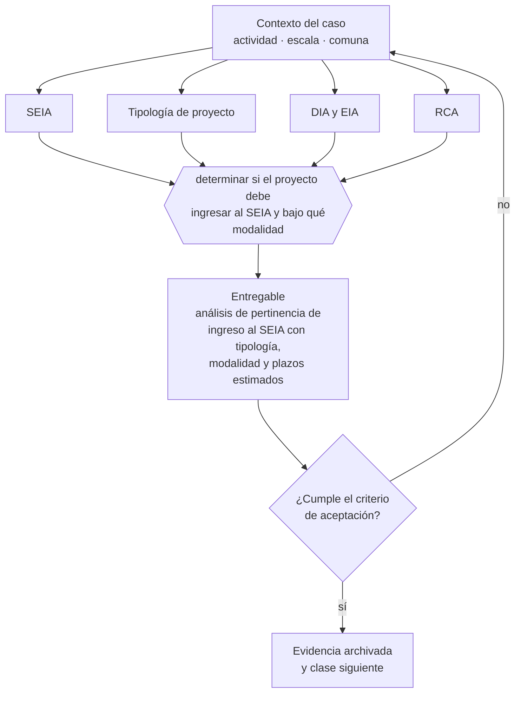

# Clase 237 — Medio ambiente, SEA, SMA y permisos sectoriales

> **Parte 17 · Permisos, patentes y regulación sectorial** — clase 13 de 14

**Estado de evidencia:** `SECTORIAL` · **Jurisdicción:** Chile-first · **Fecha base normativa:** 07-08-2026 
**Decisión que habilita:** determinar si el proyecto debe ingresar al SEIA y bajo qué modalidad 
**Entregable:** análisis de pertinencia de ingreso al SEIA con tipología, modalidad y plazos estimados

## 🎯 Propósito

Evaluar la pertinencia de ingreso al SEIA según tipología y magnitud, antes de iniciar obras.

## 📚 Resultados de aprendizaje

Al finalizar esta clase podrás:

1. **Definir** con precisión los cuatro conceptos de la tabla siguiente y usarlos para describir un caso real.
2. **Explicar** por qué esta materia condiciona decisiones de otras partes del programa.
3. **Decidir** —determinar si el proyecto debe ingresar al SEIA y bajo qué modalidad— y justificar la decisión por escrito.
4. **Producir** el entregable de la clase y contrastarlo contra su criterio de aceptación.
5. **Distinguir** el dato estable del dato dinámico que exige revalidación en la fuente oficial.

## 🧩 Conceptos centrales

| Concepto | Comprensión verificable |
|---|---|
| **SEIA** | Sistema de evaluación de impacto ambiental. |
| **Tipología de proyecto** | Categoría que determina si debe ingresar al sistema. |
| **DIA y EIA** | Declaración o estudio, según la magnitud del impacto. |
| **RCA** | Resolución de calificación ambiental y sus condiciones. |

## 🗺️ Flujo de razonamiento

## 📖 Desarrollo

### 1. El fondo del asunto

Ciertos proyectos deben ingresar al SEIA según su tipología y magnitud. Ejecutar sin la resolución correspondiente expone a sanciones de la SMA, incluida la paralización. Las condiciones de la RCA son obligaciones permanentes y fiscalizables durante toda la vida del proyecto.

### 2. Cómo se traduce en la práctica

Ejecutar sin la resolución correspondiente expone a sanciones de la SMA, incluida la paralización. Y las condiciones de la RCA son obligaciones permanentes y fiscalizables durante toda la vida del proyecto: leerlas como requisitos de una sola vez produce incumplimientos años después de la aprobación.

### 3. Marco aplicable y quién interviene

- DL 3.063 sobre rentas municipales (patente municipal)
- Ley General de Urbanismo y Construcciones y su Ordenanza General
- Código Sanitario y DS 977 Reglamento Sanitario de los Alimentos
- Ley 19.300 sobre bases generales del medio ambiente
- Ley 20.667 y normativa sectorial de SEC, SUBTEL, SERNATUR, SENCE y MTT

**Autoridades o contrapartes involucradas:** Municipalidad y Dirección de Obras Municipales, SEREMI de Salud, SEC, SUBTEL, SERNATUR, SENCE, SEA, SMA.
**Profesionales de apoyo:** abogado regulatorio, arquitecto o DOM, prevencionista, consultor sectorial. La participación concreta depende del riesgo, del
tamaño de la empresa y de la actividad económica.

## 🧪 Taller guiado

Aplica esta clase a **una** de las siguientes líneas de negocio y repite después el ejercicio con
una segunda línea de carga regulatoria distinta:

| Línea | Carga regulatoria |
|---|---|
| SaaS B2B con IA | media |
| Servicios profesionales | baja |
| E-commerce D2C | media |
| Alimentos o foodtech | alta |
| Exportación de servicios | media |
| Fintech regulada | alta |
| Construcción o servicios técnicos | alta |

**Secuencia de trabajo:**

1. Delimita el contexto: actividad económica, escala, comuna y etapa de la empresa.
2. Reúne los antecedentes que la decisión exige y anota la fecha de cada fuente.
3. Identifica las alternativas reales, incluida la de no hacer nada.
4. Evalúa el impacto en mercado, caja, personas, regulación y operación.
5. Toma la decisión y regístrala con sus supuestos.
6. Produce el entregable.
7. Contrástalo contra el criterio de aceptación.
8. Anota lo que requiere validación profesional y programa su revisión.

### 📦 Entregable

Análisis de pertinencia de ingreso al seia con tipología, modalidad y plazos estimados.

Debe incluir decisión, supuestos, fuentes con fecha de consulta, responsable, riesgos
identificados y próximos pasos.

## 🏆 Reto verificable

Resuelve la misma materia para una segunda línea de negocio con distinta carga regulatoria y
explica por escrito **qué cambió, por qué y qué fuente lo determina**.

## ✅ Criterio de aceptación

- [ ] la tipología del proyecto está evaluada contra el reglamento
- [ ] las obligaciones permanentes de una eventual RCA están identificadas
- [ ] cada afirmación regulatoria está referida a una fuente oficial con fecha de consulta;
- [ ] los datos dinámicos quedan marcados para revalidación;
- [ ] hay un responsable asignado y evidencia reproducible del trabajo.

## ⚠️ Errores frecuentes

**Propios de esta clase:**

- Iniciar obras antes de contar con la resolución ambiental.
- Tratar las condiciones de la rca como requisitos de una sola vez.

**Característicos de la parte 17:**

- Arrendar un local cuyo uso de suelo no admite la actividad.
- Iniciar operación con permiso en trámite y exponerse a clausura.

## 🇨🇱 Checklist Chile

- [ ] ¿existe norma o autoridad específica para esta materia?
- [ ] ¿la fuente consultada está vigente a la fecha de ejecución?
- [ ] ¿se activa algún trámite ante el SII?
- [ ] ¿se activa algún requisito municipal o sectorial?
- [ ] ¿afecta a consumidores o al tratamiento de datos personales?
- [ ] ¿afecta a trabajadores o a la seguridad y salud en el trabajo?
- [ ] ¿afecta a impuestos, contabilidad o caja?
- [ ] ¿afecta a contratos o a propiedad intelectual?
- [ ] ¿requiere renovación, reporte periódico o revalidación?

## ❓ Preguntas de comprobación

1. ¿Tu proyecto calza en alguna tipología del reglamento del SEIA?
2. ¿Qué obligaciones permanentes tendrías si obtuvieras una RCA?
3. ¿Iniciarías obras antes de tener la resolución ambiental?

## 🔗 Fuentes oficiales

**Servicio de Evaluación Ambiental — Sistema de Evaluación de Impacto Ambiental**  
<https://www.sea.gob.cl/> · verificado 2026-08-07

- *Qué contiene:* Define qué proyectos deben ingresar al SEIA según su tipología y magnitud, la diferencia entre declaración y estudio de impacto, y publica las resoluciones de calificación ambiental otorgadas.
- *Cómo leerla:* Consulta primero la tipología del reglamento para saber si ingresas; y si ingresas, lee resoluciones de proyectos parecidos: sus condiciones te anticipan las obligaciones permanentes que tendrás.

**Superintendencia del Medio Ambiente — Fiscalización y sanción ambiental**  
<https://portal.sma.gob.cl/> · verificado 2026-08-07

- *Qué contiene:* Fiscaliza el cumplimiento de las resoluciones de calificación ambiental y de las normas de emisión, y publica procedimientos sancionatorios y programas de cumplimiento.
- *Cómo leerla:* Revisa los procedimientos sancionatorios de tu sector: muestran qué incumplimientos se persiguen en la práctica y con qué evidencia, que es más útil que la lectura general de la norma.

**Biblioteca del Congreso Nacional · LeyChile — Normativa oficial consolidada**  
<https://www.bcn.cl/leychile/> · verificado 2026-08-07

- *Qué contiene:* Publica el texto oficial y consolidado de leyes, decretos y reglamentos, con la versión vigente a una fecha, el historial de modificaciones y la tramitación que las originó.
- *Cómo leerla:* Usa siempre el selector de versión vigente a la fecha en que ejecutarás el trámite, no la última publicada. Y lee el artículo transitorio: en normas en implantación gradual —jornada, datos personales— ahí está la fecha que realmente te aplica.

Complementos del repositorio: [glosario](../../../docs/19_GLOSSARY.md) ·
[ruta de lecturas](../../../docs/15_BOOKS_AND_LEARNING_PATH.md) ·
[catálogo de fuentes](../../../docs/16_OFFICIAL_SOURCE_CATALOG.md).

> [!IMPORTANT]
> Material educativo. Para una decisión real de alto impacto hay que verificar la fuente oficial
> vigente y validar con el profesional competente.

---

| Anterior | Índice | Siguiente |
|---|---|---|
| [← 236 · OTEC, capacitación y SENCE](../class-12-otec-capacitacion-y-sence/README.md) | [Parte 17](../README.md) · [Programa](../../../README.md) | [238 · Matriz regulatoria por actividad económica →](../class-14-matriz-regulatoria-por-actividad-economica/README.md) |
