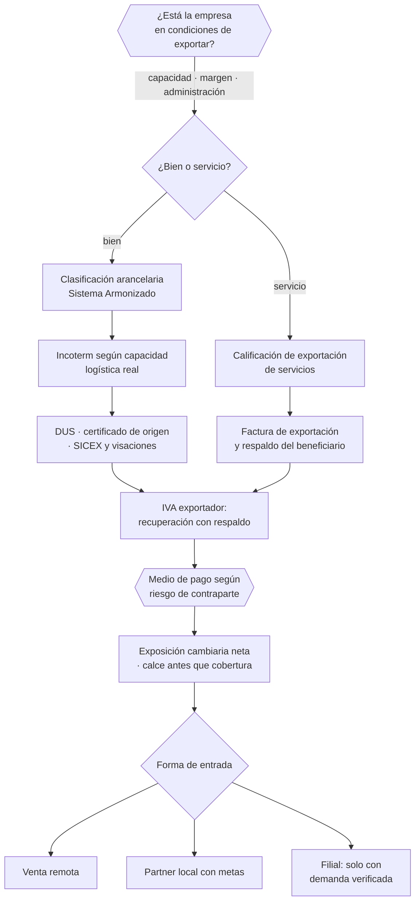

# Parte 18 — Comercio exterior e internacionalización

> *Exportar agrega aduanas, moneda, logística y tributación internacional*

🔴 **Etapa 5 — Operar, vender y crecer** · salida de la etapa: Empresa habilitada, operando y creciendo con control

**Estado de evidencia:** `VERIFICADO-FUENTE` · **Clases:** 14 (239–252) · **Fecha base normativa:** 07-08-2026 
**Contenido central:** Preparación exportadora, Incoterms, clasificación arancelaria, DUS, IVA exportador, FX y entrada 
**Conceptos definidos en esta parte:** 56

## 🎯 De qué trata esta parte

Vender fuera de Chile no es vender lo mismo más lejos: agrega cuatro sistemas nuevos que hay que gestionar a la vez. La aduana clasifica y grava, el Incoterm reparte riesgo y costo, el medio de pago define quién asume el riesgo de contraparte, y la moneda introduce una exposición que puede consumir todo el margen si ingresos y costos no calzan.

La clasificación arancelaria es la decisión técnica de mayor efecto: determina arancel, certificaciones exigibles y si aplica un acuerdo comercial. Clasificar por parecido de nombre en vez de por las reglas del Sistema Armonizado produce diferencias, multas y demoras; cuando hay duda, existe el mecanismo formal de consulta de clasificación y conviene usarlo antes de embarcar.

La exportación de servicios merece atención propia porque es la vía más accesible para empresas chilenas de software y consultoría. Su tratamiento tributario favorable exige cumplir condiciones de calificación y documentar que el beneficiario reside y utiliza el servicio en el extranjero. Aplicar la exención sin ese respaldo es una contingencia que aparece en la primera fiscalización.

## 📚 Resultados de la parte

Al terminar esta parte podrás:

1. **Determinar si la empresa está en condiciones reales de exportar**.
2. **Elegir Incoterm y medio de pago coherentes con el riesgo asumido**.
3. **Ejecutar o simular el flujo documental de exportación e importación**.
4. **Tratar correctamente IVA, retenciones y doble tributación en operaciones cruzadas**.

## 🗺️ Mapa de la parte

## ⚖️ Marco aplicable

- Ordenanza de Aduanas y arancel aduanero chileno
- DL 825 en materia de exportación de bienes y servicios y recuperación de IVA exportador
- convenios para evitar la doble tributación suscritos por Chile
- Incoterms de la Cámara de Comercio Internacional

**Autoridades o contrapartes:** Servicio Nacional de Aduanas, SII, ProChile, Banco Central de Chile, SAG y SEREMI de Salud según producto.
**Profesionales de apoyo:** agente de aduana, abogado de comercio internacional, asesor tributario internacional, freight forwarder.

## ⚠️ Riesgos característicos

- Clasificar mal la partida arancelaria y pagar derechos o multas.
- Elegir un incoterm que traslada un riesgo logístico que la empresa no puede gestionar.
- No calzar moneda de ingresos y de costos y perder el margen en el tipo de cambio.
- Exportar servicios sin la calificación que habilita el tratamiento tributario correspondiente.

## 📘 Las 14 clases

| # | Global | Clase | Decisión que habilita |
|---:|---:|---|---|
| 01 | 239 | [Preparación exportadora](class-01-preparacion-exportadora/README.md) | determinar si la empresa está en condiciones reales de exportar y a qué costo |
| 02 | 240 | [Incoterms y responsabilidades](class-02-incoterms-y-responsabilidades/README.md) | elegir el Incoterm coherente con la capacidad logística de la empresa |
| 03 | 241 | [Clasificación arancelaria](class-03-clasificacion-arancelaria/README.md) | clasificar correctamente la mercancía antes de operar |
| 04 | 242 | [Importación de bienes a Chile](class-04-importacion-de-bienes-a-chile/README.md) | calcular el costo total de internación antes de comprometer una importación |
| 05 | 243 | [Exportación de bienes](class-05-exportacion-de-bienes/README.md) | ejecutar el flujo documental de exportación asegurando la recuperación del IVA |
| 06 | 244 | [Exportación de servicios](class-06-exportacion-de-servicios/README.md) | determinar si el servicio califica como exportación y qué documentación exige |
| 07 | 245 | [Aduanas, DUS/DUSS y SICEX](class-07-aduanas-dus-duss-y-sicex/README.md) | identificar las visaciones exigidas y su secuencia antes de despachar |
| 08 | 246 | [Factura de exportación y tratamiento tributario](class-08-factura-de-exportacion-y-tratamiento-tributario/README.md) | emitir la documentación tributaria de exportación de forma coherente y completa |
| 09 | 247 | [Medios de pago internacionales](class-09-medios-de-pago-internacionales/README.md) | elegir el medio de pago internacional según el riesgo de la contraparte |
| 10 | 248 | [FX y riesgo cambiario](class-10-fx-y-riesgo-cambiario/README.md) | medir la exposición cambiaria neta y decidir cómo se gestiona |
| 11 | 249 | [Contratos internacionales](class-11-contratos-internacionales/README.md) | definir ley aplicable y foro considerando la ejecutabilidad real |
| 12 | 250 | [IVA, retenciones y doble tributación](class-12-iva-retenciones-y-doble-tributacion/README.md) | determinar el tratamiento tributario de los flujos internacionales antes de facturar |
| 13 | 251 | [ProChile y entrada a mercados](class-13-prochile-y-entrada-a-mercados/README.md) | definir el mercado objetivo y la estrategia de entrada con apoyo institucional |
| 14 | 252 | [Filial, partner o venta remota](class-14-filial-partner-o-venta-remota/README.md) | elegir la forma de entrada proporcional a la evidencia de demanda |

## 🔤 Glosario de la parte

| Concepto | Definición operacional |
|---|---|
| **Adecuación cultural** | Ajuste de la oferta a las prácticas del mercado destino. |
| **Adecuación de producto** | Cambios exigidos por normativa o preferencias del mercado destino. |
| **Agente de aduana** | Profesional que tramita ante el servicio. |
| **Calce de monedas** | Correspondencia entre moneda de ingresos y de costos. |
| **Calificación** | Reconocimiento que habilita el tratamiento tributario especial. |
| **Capacidad productiva** | Volumen sostenible para atender demanda externa. |
| **Carta de crédito** | Instrumento bancario que garantiza el pago contra documentos. |
| **Certificado de origen** | Documento que acredita origen para acuerdos comerciales. |
| **Certificado de residencia** | Documento que acredita residencia tributaria para aplicar el convenio. |
| **Clasificación errónea** | Error que genera diferencias, multas y demoras. |
| **Cobertura** | Instrumento que fija el tipo de cambio futuro. |
| **Cobranza documentaria** | Gestión bancaria de cobro sin garantía de pago. |
| **Convención de Viena** | Normativa uniforme sobre compraventa internacional de mercaderías. |
| **Convenio** | Tratado que reduce o elimina la doble tributación. |
| **Costo de entrada** | Inversión en certificaciones, adecuación y promoción. |
| **Costo de estructura** | Carga de mantener presencia legal y operativa en destino. |
| **Costo de internación** | Arancel, iva, transporte, almacenaje y gastos. |
| **Declaración de ingreso** | Documento aduanero de la operación. |
| **Derecho ad valorem** | Arancel calculado sobre el valor. |
| **Doble tributación** | Gravamen del mismo ingreso en dos jurisdicciones. |
| **Documentación de respaldo** | Evidencia de que el beneficiario está en el extranjero. |
| **DUS** | Documento único de salida. |
| **Ejecución de sentencia** | Posibilidad real de hacer cumplir el fallo en el país de la contraparte. |
| **Estudio de mercado** | Análisis del país destino y su demanda. |
| **Exención de IVA** | Tratamiento aplicable a servicios calificados como exportación. |
| **Exportación** | Salida legal de mercancía del territorio nacional. |
| **Exportación de servicios** | Prestación a un residente en el extranjero. |
| **Exposición neta** | Diferencia entre activos y pasivos en moneda extranjera. |
| **EXW y DDP** | Extremos de mínima y máxima obligación del vendedor. |
| **Factura de exportación** | Documento tributario propio de la operación de exportación. |
| **Filial** | Entidad propia constituida en el extranjero. |
| **Foro** | Tribunal o arbitraje competente. |
| **Importación** | Ingreso legal de mercancía al territorio nacional. |
| **Incoterm** | Regla que define obligaciones, costos y riesgos en la entrega internacional. |
| **IVA exportador** | Mecanismo de recuperación del iva soportado. |
| **Ley aplicable** | Ordenamiento que rige el contrato internacional. |
| **Misión comercial** | Actividad de contacto con compradores potenciales. |
| **Pago anticipado** | Cobro previo al embarque. |
| **Partida arancelaria** | Código que clasifica la mercancía. |
| **Partner local** | Distribuidor o representante en el mercado destino. |
| **Plazo de retorno** | Tiempo dentro del cual deben cumplirse obligaciones asociadas. |
| **Preparación exportadora** | Conjunto de capacidades necesarias para vender al exterior. |
| **ProChile** | Institución de promoción de exportaciones. |
| **Punto de transferencia de riesgo** | Momento en que el riesgo pasa al comprador. |
| **Recuperación de IVA** | Devolución del impuesto soportado en insumos. |
| **Retención en la fuente** | Impuesto retenido por el pagador extranjero o local. |
| **Riesgo cambiario** | Exposición a variaciones del tipo de cambio. |
| **Riesgo de contraparte** | Probabilidad de que el comprador no pague. |
| **Seguro de la carga** | Cobertura del riesgo durante el transporte. |
| **SICEX** | Sistema integrado de comercio exterior. |
| **Sistema Armonizado** | Clasificación internacional de mercancías. |
| **Trazabilidad documental** | Seguimiento del estado de cada trámite. |
| **Valor FOB** | Valor de la mercancía puesta a bordo. |
| **Venta remota** | Exportación desde chile sin presencia en destino. |
| **Ventanilla única** | Punto único de trámite entre servicios. |
| **Visación** | Autorización de un servicio previa al despacho. |

## 🔗 Cómo se conecta

Amplía el mercado de la parte 14 con la operación de la parte 13. Su tratamiento tributario se conecta con la parte 07, sus contratos con la parte 10 y su gestión de riesgo cambiario con la parte 09.

## 📖 Pauta bibliográfica

- Ordenanza de Aduanas y arancel aduanero chileno; reglas del Sistema Armonizado.
- Incoterms 2020 de la Cámara de Comercio Internacional.
- DL 825 en exportación y convenios para evitar la doble tributación suscritos por Chile.

## 🏛️ Fuentes oficiales de la parte

**Servicio Nacional de Aduanas — Importación, exportación y clasificación arancelaria**  
<https://www.aduana.cl/> · verificado 2026-08-19

- *Qué contiene:* Publica el arancel aduanero con la clasificación del Sistema Armonizado, los regímenes de importación y exportación, la documentación exigida y las estadísticas de comercio exterior.
- *Cómo leerla:* La partida arancelaria decide arancel, certificaciones y acuerdos aplicables. Ante duda, usa el mecanismo de consulta de clasificación en vez de decidir por parecido de nombre: el error se paga en diferencias y multas.

**Sistema Integrado de Comercio Exterior — Ventanilla única de comercio exterior**  
<https://www.sicexchile.cl/> · verificado 2026-08-19

- *Qué contiene:* Integra en una sola plataforma los trámites de los servicios que intervienen en una operación de comercio exterior, con el estado de cada visación.
- *Cómo leerla:* Úsala para descubrir qué servicios intervienen en tu producto antes de embarcar. La mercancía detenida en puerto esperando una visación es el costo típico de no haber hecho esta consulta a tiempo.

**ProChile — Exportación de servicios**  
<https://www.prochile.gob.cl/exportadores/exportacion-de-servicios> · verificado 2026-08-07

- *Qué contiene:* Explica qué se entiende por exportación de servicios, qué condiciones deben cumplirse para acceder al tratamiento tributario correspondiente y qué documentación de respaldo se exige.
- *Cómo leerla:* Contrástala siempre con la resolución del SII aplicable: ProChile explica el concepto y el mercado, pero la calificación que habilita el tratamiento de IVA la resuelve la normativa tributaria.

**ProChile — Programas, estudios de mercado y promoción**  
<https://www.prochile.gob.cl/> · verificado 2026-08-19

- *Qué contiene:* Publica estudios de mercado por país y sector, agendas de negocios, ferias, y los programas de cofinanciamiento de actividades de promoción.
- *Cómo leerla:* Los estudios de mercado por país son el mejor uso gratuito: entregan tamaño, canales, competencia y requisitos de entrada verificados, que es justo lo que una estimación bottom-up necesita.

**Servicio de Impuestos Internos — Nuevos contribuyentes, inicio de actividades y DTE**  
<https://www.sii.cl/ayudas/nuevos_contribuyentes/boleta-vys-facturador.html> · verificado 2026-08-19

- *Qué contiene:* Reúne el circuito completo del contribuyente nuevo: obtención de RUT, declaración de inicio de actividades, elección de códigos de actividad económica y habilitación para emitir documentos tributarios electrónicos.
- *Cómo leerla:* Sepáralo en dos actos distintos que la página trata seguidos: el RUT identifica, el inicio de actividades habilita. Lo que te bloquea para facturar casi siempre está en el segundo, no en el primero.

**Biblioteca del Congreso Nacional · LeyChile — Normativa oficial consolidada**  
<https://www.bcn.cl/leychile/> · verificado 2026-08-19

- *Qué contiene:* Publica el texto oficial y consolidado de leyes, decretos y reglamentos, con la versión vigente a una fecha, el historial de modificaciones y la tramitación que las originó.
- *Cómo leerla:* Usa siempre el selector de versión vigente a la fecha en que ejecutarás el trámite, no la última publicada. Y lee el artículo transitorio: en normas en implantación gradual —jornada, datos personales— ahí está la fecha que realmente te aplica.

---

| Anterior | Índice | Siguiente |
|---|---|---|
| [← Parte 17 · Permisos, patentes y regulación sectorial](../part-17-permisos-patentes-y-regulacion-sectorial/README.md) | [Currículo](../../CURRICULUM.md) · [Programa](../../README.md) | [Parte 19 · Compliance, riesgos y responsabilidad empresarial →](../part-19-compliance-riesgos-y-responsabilidad-empresarial/README.md) |
