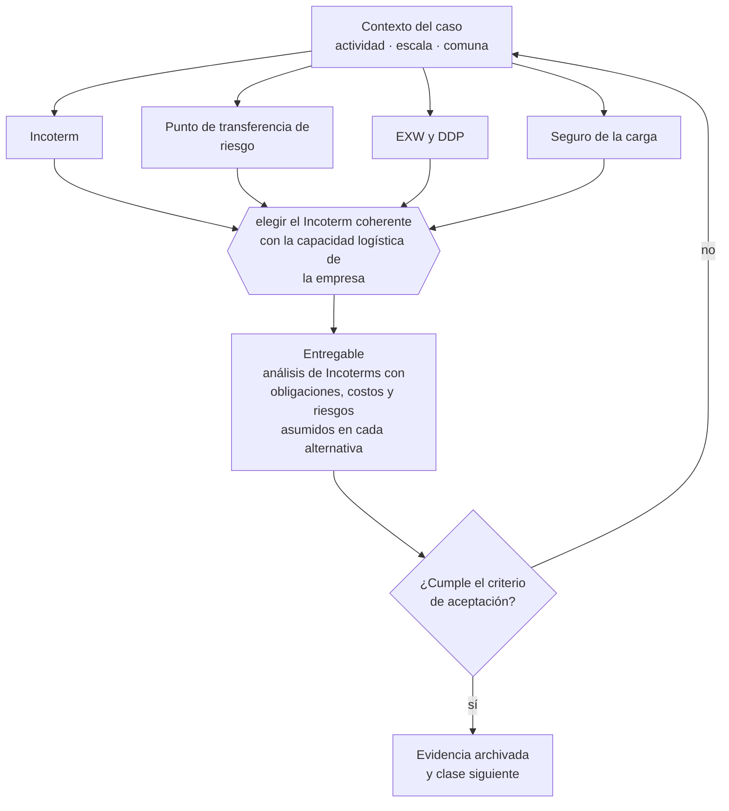

# Clase 240 — Incoterms y responsabilidades

> **Parte 18 · Comercio exterior e internacionalización** — clase 2 de 14

**Estado de evidencia:** `VERIFICADO-FUENTE` · **Jurisdicción:** Chile-first · **Fecha base normativa:** 07-08-2026 
**Decisión que habilita:** elegir el Incoterm coherente con la capacidad logística de la empresa 
**Entregable:** análisis de Incoterms con obligaciones, costos y riesgos asumidos en cada alternativa

## 🎯 Propósito

Elegir el Incoterm coherente con la capacidad logística real de la empresa, no con lo que suena más atractivo comercialmente.

## 📚 Resultados de aprendizaje

Al finalizar esta clase podrás:

1. **Definir** con precisión los cuatro conceptos de la tabla siguiente y usarlos para describir un caso real.
2. **Explicar** por qué esta materia condiciona decisiones de otras partes del programa.
3. **Decidir** —elegir el Incoterm coherente con la capacidad logística de la empresa— y justificar la decisión por escrito.
4. **Producir** el entregable de la clase y contrastarlo contra su criterio de aceptación.
5. **Distinguir** el dato estable del dato dinámico que exige revalidación en la fuente oficial.

## 🧩 Conceptos centrales

| Concepto | Comprensión verificable |
|---|---|
| **Incoterm** | Regla que define obligaciones, costos y riesgos en la entrega internacional. |
| **Punto de transferencia de riesgo** | Momento en que el riesgo pasa al comprador. |
| **EXW y DDP** | Extremos de mínima y máxima obligación del vendedor. |
| **Seguro de la carga** | Cobertura del riesgo durante el transporte. |

## 🗺️ Flujo de razonamiento

## 📖 Desarrollo

### 1. El fondo del asunto

El Incoterm define quién contrata el transporte, quién asume el riesgo y hasta dónde. Elegir DDP sin capacidad de gestionar la aduana de destino traslada a la empresa un riesgo que no puede controlar; elegir EXW simplifica pero reduce el atractivo comercial de la oferta.

### 2. Cómo se traduce en la práctica

Pactar DDP sin capacidad de gestionar la aduana de destino traslada a la empresa un riesgo que no puede controlar ni cuantificar. Elegir EXW simplifica pero reduce el atractivo de la oferta; entre ambos extremos hay opciones que reparten riesgo de forma proporcional a la capacidad de cada parte.

### 3. Marco aplicable y quién interviene

- Ordenanza de Aduanas y arancel aduanero chileno
- DL 825 en materia de exportación de bienes y servicios y recuperación de IVA exportador
- convenios para evitar la doble tributación suscritos por Chile
- Incoterms de la Cámara de Comercio Internacional

**Autoridades o contrapartes involucradas:** Servicio Nacional de Aduanas, SII, ProChile, Banco Central de Chile, SAG y SEREMI de Salud según producto.
**Profesionales de apoyo:** agente de aduana, abogado de comercio internacional, asesor tributario internacional, freight forwarder. La participación concreta depende del riesgo, del
tamaño de la empresa y de la actividad económica.

## 🧪 Taller guiado

Aplica esta clase a **una** de las siguientes líneas de negocio y repite después el ejercicio con
una segunda línea de carga regulatoria distinta:

| Línea | Carga regulatoria |
|---|---|
| SaaS B2B con IA | media |
| Servicios profesionales | baja |
| E-commerce D2C | media |
| Alimentos o foodtech | alta |
| Exportación de servicios | media |
| Fintech regulada | alta |
| Construcción o servicios técnicos | alta |

**Secuencia de trabajo:**

1. Delimita el contexto: actividad económica, escala, comuna y etapa de la empresa.
2. Reúne los antecedentes que la decisión exige y anota la fecha de cada fuente.
3. Identifica las alternativas reales, incluida la de no hacer nada.
4. Evalúa el impacto en mercado, caja, personas, regulación y operación.
5. Toma la decisión y regístrala con sus supuestos.
6. Produce el entregable.
7. Contrástalo contra el criterio de aceptación.
8. Anota lo que requiere validación profesional y programa su revisión.

### 📦 Entregable

Análisis de incoterms con obligaciones, costos y riesgos asumidos en cada alternativa.

Debe incluir decisión, supuestos, fuentes con fecha de consulta, responsable, riesgos
identificados y próximos pasos.

## 🏆 Reto verificable

Resuelve la misma materia para una segunda línea de negocio con distinta carga regulatoria y
explica por escrito **qué cambió, por qué y qué fuente lo determina**.

## ✅ Criterio de aceptación

- [ ] el Incoterm elegido corresponde a la capacidad real de la empresa
- [ ] el punto de transferencia de riesgo está claro y asegurado
- [ ] cada afirmación regulatoria está referida a una fuente oficial con fecha de consulta;
- [ ] los datos dinámicos quedan marcados para revalidación;
- [ ] hay un responsable asignado y evidencia reproducible del trabajo.

## ⚠️ Errores frecuentes

**Propios de esta clase:**

- Pactar ddp sin capacidad de gestionar la aduana del país destino.
- No contratar seguro de carga en el tramo donde se asume el riesgo.

**Característicos de la parte 18:**

- Clasificar mal la partida arancelaria y pagar derechos o multas.
- Elegir un incoterm que traslada un riesgo logístico que la empresa no puede gestionar.

## 🇨🇱 Checklist Chile

- [ ] ¿existe norma o autoridad específica para esta materia?
- [ ] ¿la fuente consultada está vigente a la fecha de ejecución?
- [ ] ¿se activa algún trámite ante el SII?
- [ ] ¿se activa algún requisito municipal o sectorial?
- [ ] ¿afecta a consumidores o al tratamiento de datos personales?
- [ ] ¿afecta a trabajadores o a la seguridad y salud en el trabajo?
- [ ] ¿afecta a impuestos, contabilidad o caja?
- [ ] ¿afecta a contratos o a propiedad intelectual?
- [ ] ¿requiere renovación, reporte periódico o revalidación?

## ❓ Preguntas de comprobación

1. ¿En qué punto exacto pasa el riesgo al comprador con tu Incoterm actual?
2. ¿Tienes capacidad de gestionar lo que el Incoterm te asigna?
3. ¿Está asegurada la carga en el tramo donde tú asumes el riesgo?

## 🔗 Fuentes oficiales

**Servicio Nacional de Aduanas — Importación, exportación y clasificación arancelaria**  
<https://www.aduana.cl/> · verificado 2026-08-19

- *Qué contiene:* Publica el arancel aduanero con la clasificación del Sistema Armonizado, los regímenes de importación y exportación, la documentación exigida y las estadísticas de comercio exterior.
- *Cómo leerla:* La partida arancelaria decide arancel, certificaciones y acuerdos aplicables. Ante duda, usa el mecanismo de consulta de clasificación en vez de decidir por parecido de nombre: el error se paga en diferencias y multas.
- *Uso en esta clase:* aporta el marco de «Importación, exportación y clasificación arancelaria» para elegir el Incoterm coherente con la capacidad logística de la empresa.

Complementos del repositorio: [glosario](../../../docs/19_GLOSSARY.md) ·
[ruta de lecturas](../../../docs/15_BOOKS_AND_LEARNING_PATH.md) ·
[catálogo de fuentes](../../../docs/16_OFFICIAL_SOURCE_CATALOG.md).

> [!IMPORTANT]
> Material educativo. Para una decisión real de alto impacto hay que verificar la fuente oficial
> vigente y validar con el profesional competente.

---

| Anterior | Índice | Siguiente |
|---|---|---|
| [← 239 · Preparación exportadora](../class-01-preparacion-exportadora/README.md) | [Parte 18](../README.md) · [Programa](../../../README.md) | [241 · Clasificación arancelaria →](../class-03-clasificacion-arancelaria/README.md) |
