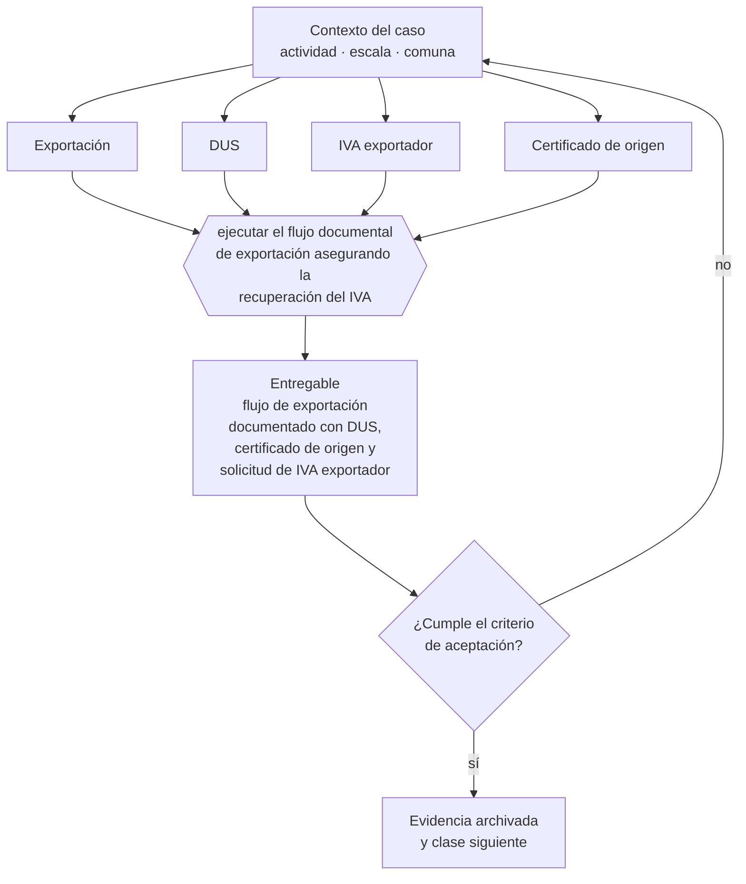

# Clase 243 — Exportación de bienes

> **Parte 18 · Comercio exterior e internacionalización** — clase 5 de 14

**Estado de evidencia:** `VERIFICADO-FUENTE` · **Jurisdicción:** Chile-first · **Fecha base normativa:** 07-08-2026 
**Decisión que habilita:** ejecutar el flujo documental de exportación asegurando la recuperación del IVA 
**Entregable:** flujo de exportación documentado con DUS, certificado de origen y solicitud de IVA exportador

## 🎯 Propósito

Ejecutar el flujo documental de exportación asegurando la recuperación del IVA, que cambia materialmente el margen del exportador.

## 📚 Resultados de aprendizaje

Al finalizar esta clase podrás:

1. **Definir** con precisión los cuatro conceptos de la tabla siguiente y usarlos para describir un caso real.
2. **Explicar** por qué esta materia condiciona decisiones de otras partes del programa.
3. **Decidir** —ejecutar el flujo documental de exportación asegurando la recuperación del IVA— y justificar la decisión por escrito.
4. **Producir** el entregable de la clase y contrastarlo contra su criterio de aceptación.
5. **Distinguir** el dato estable del dato dinámico que exige revalidación en la fuente oficial.

## 🧩 Conceptos centrales

| Concepto | Comprensión verificable |
|---|---|
| **Exportación** | Salida legal de mercancía del territorio nacional. |
| **DUS** | Documento único de salida. |
| **IVA exportador** | Mecanismo de recuperación del iva soportado. |
| **Certificado de origen** | Documento que acredita origen para acuerdos comerciales. |

## 🗺️ Flujo de razonamiento

## 📖 Desarrollo

### 1. El fondo del asunto

La exportación de bienes permite recuperar el IVA soportado en las compras asociadas, lo que cambia materialmente el margen. Ese beneficio exige documentación completa y correcta: sin ella, la recuperación se retrasa o se pierde, afectando la caja del exportador.

### 2. Cómo se traduce en la práctica

El beneficio exige documentación completa y correcta: sin ella la recuperación se retrasa o se pierde, afectando directamente la caja. El certificado de origen, por su parte, es lo que permite al comprador aprovechar el acuerdo comercial: omitirlo le hace pagar arancel evitable y encarece tu oferta.

### 3. Marco aplicable y quién interviene

- Ordenanza de Aduanas y arancel aduanero chileno
- DL 825 en materia de exportación de bienes y servicios y recuperación de IVA exportador
- convenios para evitar la doble tributación suscritos por Chile
- Incoterms de la Cámara de Comercio Internacional

**Autoridades o contrapartes involucradas:** Servicio Nacional de Aduanas, SII, ProChile, Banco Central de Chile, SAG y SEREMI de Salud según producto.
**Profesionales de apoyo:** agente de aduana, abogado de comercio internacional, asesor tributario internacional, freight forwarder. La participación concreta depende del riesgo, del
tamaño de la empresa y de la actividad económica.

## 🧪 Taller guiado

Aplica esta clase a **una** de las siguientes líneas de negocio y repite después el ejercicio con
una segunda línea de carga regulatoria distinta:

| Línea | Carga regulatoria |
|---|---|
| SaaS B2B con IA | media |
| Servicios profesionales | baja |
| E-commerce D2C | media |
| Alimentos o foodtech | alta |
| Exportación de servicios | media |
| Fintech regulada | alta |
| Construcción o servicios técnicos | alta |

**Secuencia de trabajo:**

1. Delimita el contexto: actividad económica, escala, comuna y etapa de la empresa.
2. Reúne los antecedentes que la decisión exige y anota la fecha de cada fuente.
3. Identifica las alternativas reales, incluida la de no hacer nada.
4. Evalúa el impacto en mercado, caja, personas, regulación y operación.
5. Toma la decisión y regístrala con sus supuestos.
6. Produce el entregable.
7. Contrástalo contra el criterio de aceptación.
8. Anota lo que requiere validación profesional y programa su revisión.

### 📦 Entregable

Flujo de exportación documentado con dus, certificado de origen y solicitud de iva exportador.

Debe incluir decisión, supuestos, fuentes con fecha de consulta, responsable, riesgos
identificados y próximos pasos.

## 🏆 Reto verificable

Resuelve la misma materia para una segunda línea de negocio con distinta carga regulatoria y
explica por escrito **qué cambió, por qué y qué fuente lo determina**.

## ✅ Criterio de aceptación

- [ ] el flujo documental está completo y verificado
- [ ] el mecanismo de recuperación de IVA está gestionado
- [ ] cada afirmación regulatoria está referida a una fuente oficial con fecha de consulta;
- [ ] los datos dinámicos quedan marcados para revalidación;
- [ ] hay un responsable asignado y evidencia reproducible del trabajo.

## ⚠️ Errores frecuentes

**Propios de esta clase:**

- No reunir el respaldo exigido y perder la recuperación del iva.
- Omitir el certificado de origen y pagar arancel evitable en destino.

**Característicos de la parte 18:**

- Clasificar mal la partida arancelaria y pagar derechos o multas.
- Elegir un incoterm que traslada un riesgo logístico que la empresa no puede gestionar.

## 🇨🇱 Checklist Chile

- [ ] ¿existe norma o autoridad específica para esta materia?
- [ ] ¿la fuente consultada está vigente a la fecha de ejecución?
- [ ] ¿se activa algún trámite ante el SII?
- [ ] ¿se activa algún requisito municipal o sectorial?
- [ ] ¿afecta a consumidores o al tratamiento de datos personales?
- [ ] ¿afecta a trabajadores o a la seguridad y salud en el trabajo?
- [ ] ¿afecta a impuestos, contabilidad o caja?
- [ ] ¿afecta a contratos o a propiedad intelectual?
- [ ] ¿requiere renovación, reporte periódico o revalidación?

## ❓ Preguntas de comprobación

1. ¿Qué respaldo exige la recuperación del IVA exportador y lo tienes completo?
2. ¿Emites certificado de origen y tu comprador lo está aprovechando?
3. ¿Cuánto tarda en llegar la recuperación y lo consideraste en tu flujo?

## 🔗 Fuentes oficiales

**Servicio Nacional de Aduanas — Importación, exportación y clasificación arancelaria**  
<https://www.aduana.cl/> · verificado 2026-08-19

- *Qué contiene:* Publica el arancel aduanero con la clasificación del Sistema Armonizado, los regímenes de importación y exportación, la documentación exigida y las estadísticas de comercio exterior.
- *Cómo leerla:* La partida arancelaria decide arancel, certificaciones y acuerdos aplicables. Ante duda, usa el mecanismo de consulta de clasificación en vez de decidir por parecido de nombre: el error se paga en diferencias y multas.
- *Uso en esta clase:* aporta el marco de «Importación, exportación y clasificación arancelaria» para ejecutar el flujo documental de exportación asegurando la recuperación del IVA.

**Sistema Integrado de Comercio Exterior — Ventanilla única de comercio exterior**  
<https://www.sicexchile.cl/> · verificado 2026-08-19

- *Qué contiene:* Integra en una sola plataforma los trámites de los servicios que intervienen en una operación de comercio exterior, con el estado de cada visación.
- *Cómo leerla:* Úsala para descubrir qué servicios intervienen en tu producto antes de embarcar. La mercancía detenida en puerto esperando una visación es el costo típico de no haber hecho esta consulta a tiempo.
- *Uso en esta clase:* aporta el marco de «Ventanilla única de comercio exterior» para ejecutar el flujo documental de exportación asegurando la recuperación del IVA.

**Servicio de Impuestos Internos — Nuevos contribuyentes, inicio de actividades y DTE**  
<https://www.sii.cl/ayudas/nuevos_contribuyentes/boleta-vys-facturador.html> · verificado 2026-08-19

- *Qué contiene:* Reúne el circuito completo del contribuyente nuevo: obtención de RUT, declaración de inicio de actividades, elección de códigos de actividad económica y habilitación para emitir documentos tributarios electrónicos.
- *Cómo leerla:* Sepáralo en dos actos distintos que la página trata seguidos: el RUT identifica, el inicio de actividades habilita. Lo que te bloquea para facturar casi siempre está en el segundo, no en el primero.
- *Uso en esta clase:* aporta el marco de «Nuevos contribuyentes, inicio de actividades y DTE» para ejecutar el flujo documental de exportación asegurando la recuperación del IVA.

Complementos del repositorio: [glosario](../../../docs/19_GLOSSARY.md) ·
[ruta de lecturas](../../../docs/15_BOOKS_AND_LEARNING_PATH.md) ·
[catálogo de fuentes](../../../docs/16_OFFICIAL_SOURCE_CATALOG.md).

> [!IMPORTANT]
> Material educativo. Para una decisión real de alto impacto hay que verificar la fuente oficial
> vigente y validar con el profesional competente.

---

| Anterior | Índice | Siguiente |
|---|---|---|
| [← 242 · Importación de bienes a Chile](../class-04-importacion-de-bienes-a-chile/README.md) | [Parte 18](../README.md) · [Programa](../../../README.md) | [244 · Exportación de servicios →](../class-06-exportacion-de-servicios/README.md) |
