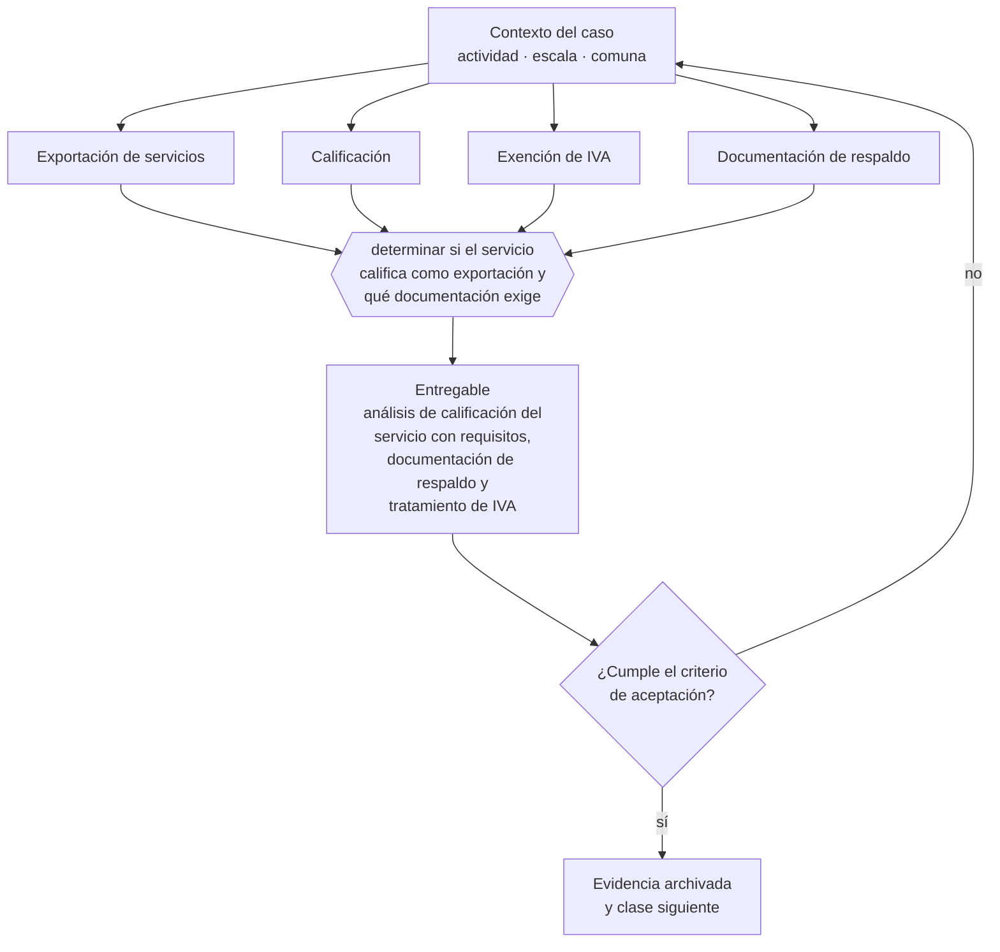

# Clase 244 — Exportación de servicios

> **Parte 18 · Comercio exterior e internacionalización** — clase 6 de 14

**Estado de evidencia:** `VERIFICADO-FUENTE` · **Jurisdicción:** Chile-first · **Fecha base normativa:** 07-08-2026 
**Decisión que habilita:** determinar si el servicio califica como exportación y qué documentación exige 
**Entregable:** análisis de calificación del servicio con requisitos, documentación de respaldo y tratamiento de IVA

## 🎯 Propósito

Verificar que el servicio califica como exportación y documentar que el beneficiario reside y utiliza el servicio en el extranjero.

## 📚 Resultados de aprendizaje

Al finalizar esta clase podrás:

1. **Definir** con precisión los cuatro conceptos de la tabla siguiente y usarlos para describir un caso real.
2. **Explicar** por qué esta materia condiciona decisiones de otras partes del programa.
3. **Decidir** —determinar si el servicio califica como exportación y qué documentación exige— y justificar la decisión por escrito.
4. **Producir** el entregable de la clase y contrastarlo contra su criterio de aceptación.
5. **Distinguir** el dato estable del dato dinámico que exige revalidación en la fuente oficial.

## 🧩 Conceptos centrales

| Concepto | Comprensión verificable |
|---|---|
| **Exportación de servicios** | Prestación a un residente en el extranjero. |
| **Calificación** | Reconocimiento que habilita el tratamiento tributario especial. |
| **Exención de IVA** | Tratamiento aplicable a servicios calificados como exportación. |
| **Documentación de respaldo** | Evidencia de que el beneficiario está en el extranjero. |

## 🗺️ Flujo de razonamiento

## 📖 Desarrollo

### 1. El fondo del asunto

La exportación de servicios —desarrollo de software, consultoría, diseño— puede acceder a exención de IVA cuando cumple las condiciones y calificaciones aplicables. La clave es documentar que el beneficiario del servicio reside en el extranjero y que el servicio se utiliza allá.

### 2. Cómo se traduce en la práctica

Aplicar la exención sin cumplir los requisitos de calificación es una contingencia que aparece en la primera fiscalización, con impuesto, intereses y multas retroactivos. La documentación de respaldo debe definirse por operación y guardarse, no reconstruirse cuando llega el requerimiento.

### 3. Marco aplicable y quién interviene

- Ordenanza de Aduanas y arancel aduanero chileno
- DL 825 en materia de exportación de bienes y servicios y recuperación de IVA exportador
- convenios para evitar la doble tributación suscritos por Chile
- Incoterms de la Cámara de Comercio Internacional

**Autoridades o contrapartes involucradas:** Servicio Nacional de Aduanas, SII, ProChile, Banco Central de Chile, SAG y SEREMI de Salud según producto.
**Profesionales de apoyo:** agente de aduana, abogado de comercio internacional, asesor tributario internacional, freight forwarder. La participación concreta depende del riesgo, del
tamaño de la empresa y de la actividad económica.

## 🧪 Taller guiado

Aplica esta clase a **una** de las siguientes líneas de negocio y repite después el ejercicio con
una segunda línea de carga regulatoria distinta:

| Línea | Carga regulatoria |
|---|---|
| SaaS B2B con IA | media |
| Servicios profesionales | baja |
| E-commerce D2C | media |
| Alimentos o foodtech | alta |
| Exportación de servicios | media |
| Fintech regulada | alta |
| Construcción o servicios técnicos | alta |

**Secuencia de trabajo:**

1. Delimita el contexto: actividad económica, escala, comuna y etapa de la empresa.
2. Reúne los antecedentes que la decisión exige y anota la fecha de cada fuente.
3. Identifica las alternativas reales, incluida la de no hacer nada.
4. Evalúa el impacto en mercado, caja, personas, regulación y operación.
5. Toma la decisión y regístrala con sus supuestos.
6. Produce el entregable.
7. Contrástalo contra el criterio de aceptación.
8. Anota lo que requiere validación profesional y programa su revisión.

### 📦 Entregable

Análisis de calificación del servicio con requisitos, documentación de respaldo y tratamiento de iva.

Debe incluir decisión, supuestos, fuentes con fecha de consulta, responsable, riesgos
identificados y próximos pasos.

## 🏆 Reto verificable

Resuelve la misma materia para una segunda línea de negocio con distinta carga regulatoria y
explica por escrito **qué cambió, por qué y qué fuente lo determina**.

## ✅ Criterio de aceptación

- [ ] los requisitos de calificación están verificados en fuente oficial
- [ ] la documentación de respaldo está definida por operación
- [ ] cada afirmación regulatoria está referida a una fuente oficial con fecha de consulta;
- [ ] los datos dinámicos quedan marcados para revalidación;
- [ ] hay un responsable asignado y evidencia reproducible del trabajo.

## ⚠️ Errores frecuentes

**Propios de esta clase:**

- Aplicar la exención sin cumplir los requisitos de calificación.
- No documentar la residencia del beneficiario y perder el tratamiento.

**Característicos de la parte 18:**

- Clasificar mal la partida arancelaria y pagar derechos o multas.
- Elegir un incoterm que traslada un riesgo logístico que la empresa no puede gestionar.

## 🇨🇱 Checklist Chile

- [ ] ¿existe norma o autoridad específica para esta materia?
- [ ] ¿la fuente consultada está vigente a la fecha de ejecución?
- [ ] ¿se activa algún trámite ante el SII?
- [ ] ¿se activa algún requisito municipal o sectorial?
- [ ] ¿afecta a consumidores o al tratamiento de datos personales?
- [ ] ¿afecta a trabajadores o a la seguridad y salud en el trabajo?
- [ ] ¿afecta a impuestos, contabilidad o caja?
- [ ] ¿afecta a contratos o a propiedad intelectual?
- [ ] ¿requiere renovación, reporte periódico o revalidación?

## ❓ Preguntas de comprobación

1. ¿Tu servicio cumple los requisitos de calificación y lo verificaste en fuente oficial?
2. ¿Qué documento acredita que el beneficiario está en el extranjero?
3. ¿Guardas ese respaldo por cada operación o solo por algunas?

## 🔗 Fuentes oficiales

**ProChile — Exportación de servicios**  
<https://www.prochile.gob.cl/exportadores/exportacion-de-servicios> · verificado 2026-08-07

- *Qué contiene:* Explica qué se entiende por exportación de servicios, qué condiciones deben cumplirse para acceder al tratamiento tributario correspondiente y qué documentación de respaldo se exige.
- *Cómo leerla:* Contrástala siempre con la resolución del SII aplicable: ProChile explica el concepto y el mercado, pero la calificación que habilita el tratamiento de IVA la resuelve la normativa tributaria.
- *Uso en esta clase:* aporta el marco de «Exportación de servicios» para determinar si el servicio califica como exportación y qué documentación exige.

**Servicio de Impuestos Internos — Nuevos contribuyentes, inicio de actividades y DTE**  
<https://www.sii.cl/ayudas/nuevos_contribuyentes/boleta-vys-facturador.html> · verificado 2026-08-19

- *Qué contiene:* Reúne el circuito completo del contribuyente nuevo: obtención de RUT, declaración de inicio de actividades, elección de códigos de actividad económica y habilitación para emitir documentos tributarios electrónicos.
- *Cómo leerla:* Sepáralo en dos actos distintos que la página trata seguidos: el RUT identifica, el inicio de actividades habilita. Lo que te bloquea para facturar casi siempre está en el segundo, no en el primero.
- *Uso en esta clase:* aporta el marco de «Nuevos contribuyentes, inicio de actividades y DTE» para determinar si el servicio califica como exportación y qué documentación exige.

**Servicio Nacional de Aduanas — Importación, exportación y clasificación arancelaria**  
<https://www.aduana.cl/> · verificado 2026-08-19

- *Qué contiene:* Publica el arancel aduanero con la clasificación del Sistema Armonizado, los regímenes de importación y exportación, la documentación exigida y las estadísticas de comercio exterior.
- *Cómo leerla:* La partida arancelaria decide arancel, certificaciones y acuerdos aplicables. Ante duda, usa el mecanismo de consulta de clasificación en vez de decidir por parecido de nombre: el error se paga en diferencias y multas.
- *Uso en esta clase:* aporta el marco de «Importación, exportación y clasificación arancelaria» para determinar si el servicio califica como exportación y qué documentación exige.

Complementos del repositorio: [glosario](../../../docs/19_GLOSSARY.md) ·
[ruta de lecturas](../../../docs/15_BOOKS_AND_LEARNING_PATH.md) ·
[catálogo de fuentes](../../../docs/16_OFFICIAL_SOURCE_CATALOG.md).

> [!IMPORTANT]
> Material educativo. Para una decisión real de alto impacto hay que verificar la fuente oficial
> vigente y validar con el profesional competente.

---

| Anterior | Índice | Siguiente |
|---|---|---|
| [← 243 · Exportación de bienes](../class-05-exportacion-de-bienes/README.md) | [Parte 18](../README.md) · [Programa](../../../README.md) | [245 · Aduanas, DUS/DUSS y SICEX →](../class-07-aduanas-dus-duss-y-sicex/README.md) |
