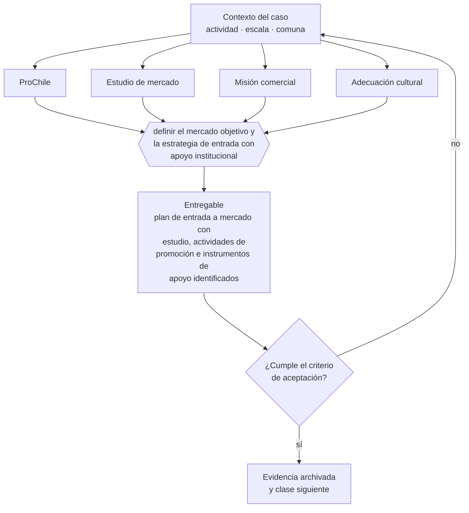

# Clase 251 — ProChile y entrada a mercados

> **Parte 18 · Comercio exterior e internacionalización** — clase 13 de 14

**Estado de evidencia:** `VERIFICADO-FUENTE` · **Jurisdicción:** Chile-first · **Fecha base normativa:** 07-08-2026 
**Decisión que habilita:** definir el mercado objetivo y la estrategia de entrada con apoyo institucional 
**Entregable:** plan de entrada a mercado con estudio, actividades de promoción e instrumentos de apoyo identificados

## 🎯 Propósito

Elegir mercado objetivo con estudio y planificar una promoción sostenida, no una feria aislada.

## 📚 Resultados de aprendizaje

Al finalizar esta clase podrás:

1. **Definir** con precisión los cuatro conceptos de la tabla siguiente y usarlos para describir un caso real.
2. **Explicar** por qué esta materia condiciona decisiones de otras partes del programa.
3. **Decidir** —definir el mercado objetivo y la estrategia de entrada con apoyo institucional— y justificar la decisión por escrito.
4. **Producir** el entregable de la clase y contrastarlo contra su criterio de aceptación.
5. **Distinguir** el dato estable del dato dinámico que exige revalidación en la fuente oficial.

## 🧩 Conceptos centrales

| Concepto | Comprensión verificable |
|---|---|
| **ProChile** | Institución de promoción de exportaciones. |
| **Estudio de mercado** | Análisis del país destino y su demanda. |
| **Misión comercial** | Actividad de contacto con compradores potenciales. |
| **Adecuación cultural** | Ajuste de la oferta a las prácticas del mercado destino. |

## 🗺️ Flujo de razonamiento

## 📖 Desarrollo

### 1. El fondo del asunto

ProChile ofrece estudios de mercado, agendas de negocios, ferias y cofinanciamiento de promoción. Su valor mayor está en la información y el contacto validado, que reducen el costo de aprendizaje. La entrada a un mercado exige presupuesto de promoción sostenido, no una feria aislada.

### 2. Cómo se traduce en la práctica

Los estudios de mercado por país de ProChile entregan tamaño, canales, competencia y requisitos de entrada verificados, que es exactamente el insumo de una estimación bottom-up seria. Participar en un evento sin plan de seguimiento produce contactos que se enfrían en semanas.

### 3. Marco aplicable y quién interviene

- Ordenanza de Aduanas y arancel aduanero chileno
- DL 825 en materia de exportación de bienes y servicios y recuperación de IVA exportador
- convenios para evitar la doble tributación suscritos por Chile
- Incoterms de la Cámara de Comercio Internacional

**Autoridades o contrapartes involucradas:** Servicio Nacional de Aduanas, SII, ProChile, Banco Central de Chile, SAG y SEREMI de Salud según producto.
**Profesionales de apoyo:** agente de aduana, abogado de comercio internacional, asesor tributario internacional, freight forwarder. La participación concreta depende del riesgo, del
tamaño de la empresa y de la actividad económica.

## 🧪 Taller guiado

Aplica esta clase a **una** de las siguientes líneas de negocio y repite después el ejercicio con
una segunda línea de carga regulatoria distinta:

| Línea | Carga regulatoria |
|---|---|
| SaaS B2B con IA | media |
| Servicios profesionales | baja |
| E-commerce D2C | media |
| Alimentos o foodtech | alta |
| Exportación de servicios | media |
| Fintech regulada | alta |
| Construcción o servicios técnicos | alta |

**Secuencia de trabajo:**

1. Delimita el contexto: actividad económica, escala, comuna y etapa de la empresa.
2. Reúne los antecedentes que la decisión exige y anota la fecha de cada fuente.
3. Identifica las alternativas reales, incluida la de no hacer nada.
4. Evalúa el impacto en mercado, caja, personas, regulación y operación.
5. Toma la decisión y regístrala con sus supuestos.
6. Produce el entregable.
7. Contrástalo contra el criterio de aceptación.
8. Anota lo que requiere validación profesional y programa su revisión.

### 📦 Entregable

Plan de entrada a mercado con estudio, actividades de promoción e instrumentos de apoyo identificados.

Debe incluir decisión, supuestos, fuentes con fecha de consulta, responsable, riesgos
identificados y próximos pasos.

## 🏆 Reto verificable

Resuelve la misma materia para una segunda línea de negocio con distinta carga regulatoria y
explica por escrito **qué cambió, por qué y qué fuente lo determina**.

## ✅ Criterio de aceptación

- [ ] el mercado objetivo está justificado con estudio
- [ ] el plan de promoción tiene continuidad más allá de un evento
- [ ] cada afirmación regulatoria está referida a una fuente oficial con fecha de consulta;
- [ ] los datos dinámicos quedan marcados para revalidación;
- [ ] hay un responsable asignado y evidencia reproducible del trabajo.

## ⚠️ Errores frecuentes

**Propios de esta clase:**

- Participar en una feria aislada sin plan de seguimiento.
- Elegir mercado por cercanía sin estudio de demanda y competencia.

**Característicos de la parte 18:**

- Clasificar mal la partida arancelaria y pagar derechos o multas.
- Elegir un incoterm que traslada un riesgo logístico que la empresa no puede gestionar.

## 🇨🇱 Checklist Chile

- [ ] ¿existe norma o autoridad específica para esta materia?
- [ ] ¿la fuente consultada está vigente a la fecha de ejecución?
- [ ] ¿se activa algún trámite ante el SII?
- [ ] ¿se activa algún requisito municipal o sectorial?
- [ ] ¿afecta a consumidores o al tratamiento de datos personales?
- [ ] ¿afecta a trabajadores o a la seguridad y salud en el trabajo?
- [ ] ¿afecta a impuestos, contabilidad o caja?
- [ ] ¿afecta a contratos o a propiedad intelectual?
- [ ] ¿requiere renovación, reporte periódico o revalidación?

## ❓ Preguntas de comprobación

1. ¿Qué estudio respalda la elección de tu mercado objetivo?
2. ¿Qué harás con los contactos en las cuatro semanas siguientes a una feria?
3. ¿Tu presupuesto de promoción cubre más de un evento?

## 🔗 Fuentes oficiales

**ProChile — Programas, estudios de mercado y promoción**  
<https://www.prochile.gob.cl/> · verificado 2026-08-07

- *Qué contiene:* Publica estudios de mercado por país y sector, agendas de negocios, ferias, y los programas de cofinanciamiento de actividades de promoción.
- *Cómo leerla:* Los estudios de mercado por país son el mejor uso gratuito: entregan tamaño, canales, competencia y requisitos de entrada verificados, que es justo lo que una estimación bottom-up necesita.

**ProChile — Exportación de servicios**  
<https://www.prochile.gob.cl/exportadores/exportacion-de-servicios> · verificado 2026-08-07

- *Qué contiene:* Explica qué se entiende por exportación de servicios, qué condiciones deben cumplirse para acceder al tratamiento tributario correspondiente y qué documentación de respaldo se exige.
- *Cómo leerla:* Contrástala siempre con la resolución del SII aplicable: ProChile explica el concepto y el mercado, pero la calificación que habilita el tratamiento de IVA la resuelve la normativa tributaria.

Complementos del repositorio: [glosario](../../../docs/19_GLOSSARY.md) ·
[ruta de lecturas](../../../docs/15_BOOKS_AND_LEARNING_PATH.md) ·
[catálogo de fuentes](../../../docs/16_OFFICIAL_SOURCE_CATALOG.md).

> [!IMPORTANT]
> Material educativo. Para una decisión real de alto impacto hay que verificar la fuente oficial
> vigente y validar con el profesional competente.

---

| Anterior | Índice | Siguiente |
|---|---|---|
| [← 250 · IVA, retenciones y doble tributación](../class-12-iva-retenciones-y-doble-tributacion/README.md) | [Parte 18](../README.md) · [Programa](../../../README.md) | [252 · Filial, partner o venta remota →](../class-14-filial-partner-o-venta-remota/README.md) |
