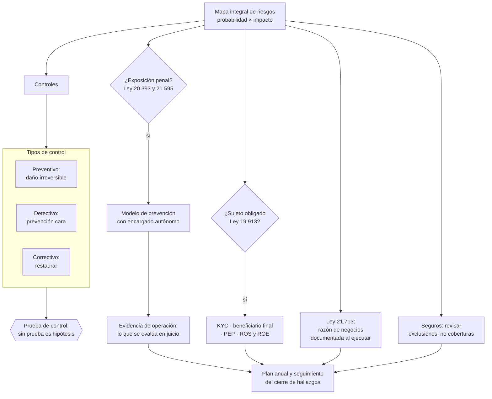

# Parte 19 — Compliance, riesgos y responsabilidad empresarial

> *El riesgo penal corporativo dejó de ser tema exclusivo de grandes empresas*

**Estado de evidencia:** `VERIFICADO-FUENTE` · **Clases:** 14 (253–266) · **Fecha base normativa:** 07-08-2026 
**Conceptos definidos en esta parte:** 56

## 🎯 De qué trata esta parte

La Ley 21.595 de delitos económicos amplió de forma significativa el catálogo de figuras que pueden generar responsabilidad penal de la persona jurídica y endureció las sanciones. El efecto práctico es que un modelo de prevención de delitos dejó de ser un asunto de grandes corporaciones y pasó a ser una decisión que cualquier empresa con exposición debe evaluar de forma explícita.

El criterio que distingue un modelo real de uno de papel es la evidencia de operación: capacitaciones realizadas, revisiones hechas, casos gestionados, decisiones documentadas. Un modelo perfecto que nadie ejecutó no defiende a nadie. Lo mismo vale para el canal de denuncias: sirve si las personas confían en él, y confían si hay confidencialidad real, independencia del investigador y constancia de que los casos anteriores se gestionaron.

La parte incorpora además dos obligaciones que se descubren tarde. La condición de sujeto obligado ante la UAF alcanza a sectores que no se perciben financieros —inmobiliarias, corredores, actividades con manejo de efectivo— y desconocerla no exime de la sanción. Y la Ley 21.713 exige razón de negocios documentada de forma contemporánea a cada estructura u operación relevante, no reconstruida cuando llega la fiscalización.

## 📚 Resultados de la parte

Al terminar esta parte podrás:

1. **Levantar un mapa de riesgos con controles preventivos, detectivos y correctivos**.
2. **Diseñar un modelo de prevención de delitos proporcional al tamaño y actividad**.
3. **Determinar si la empresa es sujeto obligado ante la UAF y qué debe reportar**.
4. **Operar un canal de denuncias e investigaciones con debido proceso**.

## 🗺️ Mapa de la parte

## ⚖️ Marco aplicable

- Ley 20.393 sobre responsabilidad penal de la persona jurídica
- Ley 21.595 sobre delitos económicos y ambientales
- Ley 19.913 que crea la UAF y establece sujetos obligados
- Ley 21.713 sobre cumplimiento de obligaciones tributarias
- Ley 21.643 en lo relativo a canal de denuncias e investigación interna

**Autoridades o contrapartes:** Ministerio Público, UAF, SII, CMF, Dirección del Trabajo.
**Profesionales de apoyo:** oficial de cumplimiento, abogado penal económico, auditor interno, corredor de seguros.

## ⚠️ Riesgos característicos

- Modelo de prevención de delitos en papel, sin evidencia de operación.
- No identificar la condición de sujeto obligado uaf y omitir reportes.
- Canal de denuncias sin garantías de confidencialidad ni protección al denunciante.
- Seguros contratados sin revisar exclusiones que dejan fuera el riesgo real.

## 📘 Las 14 clases

| # | Global | Clase | Decisión que habilita |
|---:|---:|---|---|
| 01 | 253 | [Mapa integral de riesgos](class-01-mapa-integral-de-riesgos/README.md) | identificar y priorizar los riesgos con responsable y control por cada uno |
| 02 | 254 | [Controles preventivos, detectivos y correctivos](class-02-controles-preventivos-detectivos-y-correctivos/README.md) | diseñar la combinación de controles y su plan de pruebas |
| 03 | 255 | [Ley 20.393 y responsabilidad penal de la persona jurídica](class-03-ley-20-393-y-responsabilidad-penal-de-la-persona-juridica/README.md) | determinar la exposición de la empresa y si corresponde implementar un modelo de prevención |
| 04 | 256 | [Ley 21.595 de Delitos Económicos](class-04-ley-21-595-de-delitos-economicos/README.md) | reevaluar la exposición de la empresa tras la ampliación del catálogo |
| 05 | 257 | [Modelo de prevención de delitos](class-05-modelo-de-prevencion-de-delitos/README.md) | diseñar el modelo proporcional al tamaño y a las actividades de riesgo |
| 06 | 258 | [Canal de denuncias e investigaciones](class-06-canal-de-denuncias-e-investigaciones/README.md) | implementar el canal y el procedimiento de investigación con garantías reales |
| 07 | 259 | [UAF, Ley 19.913 y sujetos obligados](class-07-uaf-ley-19-913-y-sujetos-obligados/README.md) | determinar si la empresa es sujeto obligado y qué deberes activa |
| 08 | 260 | [KYC, PEP, beneficiario final y debida diligencia](class-08-kyc-pep-beneficiario-final-y-debida-diligencia/README.md) | definir el procedimiento de conocimiento del cliente y su actualización |
| 09 | 261 | [Anticorrupción, regalos y conflictos](class-09-anticorrupcion-regalos-y-conflictos/README.md) | definir la política de regalos, hospitalidad y declaración de conflictos |
| 10 | 262 | [Fraude interno y segregación de funciones](class-10-fraude-interno-y-segregacion-de-funciones/README.md) | definir la segregación posible y los controles compensatorios donde no la haya |
| 11 | 263 | [Compliance tributario y Ley 21.713](class-11-compliance-tributario-y-ley-21-713/README.md) | documentar la razón de negocios de cada estructura u operación relevante |
| 12 | 264 | [Ciberseguridad y obligaciones sectoriales](class-12-ciberseguridad-y-obligaciones-sectoriales/README.md) | identificar las obligaciones de ciberseguridad directas y las trasladadas por clientes |
| 13 | 265 | [Seguros empresariales y transferencia de riesgo](class-13-seguros-empresariales-y-transferencia-de-riesgo/README.md) | determinar qué riesgos se transfieren a seguro y verificar sus exclusiones |
| 14 | 266 | [Auditoría interna y plan anual de cumplimiento](class-14-auditoria-interna-y-plan-anual-de-cumplimiento/README.md) | definir el plan anual de revisiones y el mecanismo de seguimiento de hallazgos |

## 🔤 Glosario de la parte

| Concepto | Definición operacional |
|---|---|
| **Ampliación del catálogo** | Aumento de figuras que generan responsabilidad de la persona jurídica. |
| **Anticorrupción** | Conjunto de controles frente a soborno y cohecho. |
| **Apetito de riesgo** | Nivel que la empresa decide aceptar. |
| **Auditoría interna** | Revisión independiente del funcionamiento de los controles. |
| **Beneficiario final** | Persona natural que controla en última instancia. |
| **Canal de denuncias** | Medio confidencial para reportar irregularidades. |
| **Certificación** | Validación externa voluntaria del modelo. |
| **Cobertura** | Riesgos y montos efectivamente amparados. |
| **Conciliación independiente** | Revisión hecha por alguien distinto del ejecutor. |
| **Confidencialidad** | Protección de la identidad del denunciante. |
| **Control correctivo** | Restaura la situación tras el evento. |
| **Control detectivo** | Identifica el evento después de ocurrido. |
| **Control preventivo** | Evita que el evento ocurra. |
| **Deber de dirección y supervisión** | Obligación cuyo incumplimiento habilita la responsabilidad. |
| **Debida diligencia continua** | Actualización periódica de la información del cliente. |
| **Deducible** | Monto que asume el asegurado en cada siniestro. |
| **Delito base** | Figura penal que puede generar responsabilidad de la empresa. |
| **Determinación de la pena** | Sistema de penas y multas aplicable. |
| **Documentación de respaldo** | Evidencia que sustenta la operación. |
| **Encargado de prevención** | Responsable designado con autonomía y recursos. |
| **Evaluación de proveedores** | Revisión de seguridad de terceros. |
| **Evidencia de operación** | Registros que acreditan que el modelo funciona. |
| **Exclusión** | Situación que la póliza no cubre. |
| **Facilitación** | Pago para agilizar un trámite, prohibido en la mayoría de los marcos. |
| **Fraude interno** | Apropiación o manipulación por personas de la organización. |
| **Hallazgo** | Desviación detectada con su causa y efecto. |
| **Investigación interna** | Procedimiento reglado de esclarecimiento. |
| **KYC** | Conocimiento del cliente. |
| **Ley 20.393** | Responsabilidad penal de la persona jurídica. |
| **Ley 21.595** | Ley de delitos económicos y ambientales. |
| **Ley 21.713** | Normas para asegurar el cumplimiento de obligaciones tributarias. |
| **Matriz de riesgos penales** | Mapeo de procesos expuestos a delitos base. |
| **Modelo de prevención** | Sistema de organización y administración para prevenir delitos. |
| **Modelo de prevención de delitos** | Sistema con identificación de riesgos, controles y supervisión. |
| **No represalia** | Garantía de que denunciar no genera perjuicio. |
| **Norma antielusiva** | Regla que permite recalificar operaciones sin razón de negocios. |
| **Obligación sectorial de ciberseguridad** | Exigencia impuesta por regulador o por contrato. |
| **PEP** | Persona expuesta políticamente, con debida diligencia reforzada. |
| **Plan anual** | Programación de revisiones por área y riesgo. |
| **Probabilidad e impacto** | Dimensiones para priorizar riesgos. |
| **Prueba de control** | Verificación de que el control opera efectivamente. |
| **Razón de negocios** | Justificación económica distinta del ahorro tributario. |
| **Regalo y hospitalidad** | Atención cuyo valor puede constituir influencia indebida. |
| **Registro de conflictos** | Declaración periódica de intereses del personal. |
| **Reporte de incidentes** | Obligación de informar en plazos definidos. |
| **Riesgo** | Evento que puede impedir el logro de objetivos. |
| **Riesgo residual** | Exposición que queda después de los controles. |
| **ROE** | Reporte de operaciones en efectivo sobre el umbral. |
| **ROS** | Reporte de operación sospechosa. |
| **Segregación de funciones** | Separación entre quien autoriza, ejecuta y registra. |
| **Seguimiento** | Verificación del cierre de los hallazgos. |
| **Seguro empresarial** | Transferencia del riesgo a una aseguradora. |
| **Sujeto obligado** | Entidad con deberes de reporte por su actividad. |
| **Traslado contractual** | Exigencia que un cliente regulado impone a su proveedor. |
| **Triángulo del fraude** | Oportunidad, presión y racionalización. |
| **UAF** | Unidad de análisis financiero. |

## 🔗 Cómo se conecta

Recoge obligaciones de las partes 07, 11, 12 y 17 y las convierte en un sistema con controles y evidencia. Su canal de denuncias comparte infraestructura con el de la Ley Karin de la parte 12, y sus hallazgos se limpian antes de la venta en la parte 22.

## 📖 Pauta bibliográfica

- Ley 20.393 y Ley 21.595 sobre responsabilidad penal de la persona jurídica.
- Ley 19.913 (UAF) y Ley 21.713 sobre cumplimiento de obligaciones tributarias.
- UAF — listado de sujetos obligados y guías de debida diligencia por sector.

## 🏛️ Fuentes oficiales de la parte

**Unidad de Análisis Financiero — Sujetos obligados · Ley 19.913**  
<https://www.uaf.cl/entidades/quienes.aspx> · verificado 2026-08-07

- *Qué contiene:* Enumera los sectores obligados a reportar, las obligaciones que se activan —designar oficial de cumplimiento, mantener registros, reportar ROS y ROE— y los umbrales aplicables.
- *Cómo leerla:* Busca tu actividad en la lista literal antes de asumir que no te aplica: inmobiliarias, casas de cambio, corredores y varias actividades con manejo de efectivo entran sin ser instituciones financieras.

**Biblioteca del Congreso Nacional · LeyChile — Normativa oficial consolidada**  
<https://www.bcn.cl/leychile/> · verificado 2026-08-07

- *Qué contiene:* Publica el texto oficial y consolidado de leyes, decretos y reglamentos, con la versión vigente a una fecha, el historial de modificaciones y la tramitación que las originó.
- *Cómo leerla:* Usa siempre el selector de versión vigente a la fecha en que ejecutarás el trámite, no la última publicada. Y lee el artículo transitorio: en normas en implantación gradual —jornada, datos personales— ahí está la fecha que realmente te aplica.

**Servicio de Impuestos Internos — Nuevos contribuyentes, inicio de actividades y DTE**  
<https://www.sii.cl/ayudas/nuevos_contribuyentes/boleta-vys-facturador.html> · verificado 2026-08-07

- *Qué contiene:* Reúne el circuito completo del contribuyente nuevo: obtención de RUT, declaración de inicio de actividades, elección de códigos de actividad económica y habilitación para emitir documentos tributarios electrónicos.
- *Cómo leerla:* Sepáralo en dos actos distintos que la página trata seguidos: el RUT identifica, el inicio de actividades habilita. Lo que te bloquea para facturar casi siempre está en el segundo, no en el primero.

**Comisión para el Mercado Financiero — Registro de Prestadores de Servicios Financieros · Ley 21.521**  
<https://www.cmfchile.cl/portal/principal/613/w3-propertyvalue-18591.html> · verificado 2026-08-07

- *Qué contiene:* Establece qué servicios financieros tecnológicos requieren inscripción o autorización ante la CMF, con qué requisitos de capital, gobierno corporativo y gestión de riesgos.
- *Cómo leerla:* Califica primero tu servicio contra la lista de actividades reguladas; el nombre comercial no decide. Si califica, los requisitos de capital y gobierno son la variable que define si el modelo es viable, antes que el producto.

---

| Anterior | Índice | Siguiente |
|---|---|---|
| [← Parte 18 · Comercio exterior e internacionalización](../part-18-comercio-exterior-e-internacionalizacion/README.md) | [Currículo](../../CURRICULUM.md) · [Programa](../../README.md) | [Parte 20 · Escalamiento, organización y gobierno avanzado →](../part-20-escalamiento-organizacion-y-gobierno-avanzado/README.md) |
