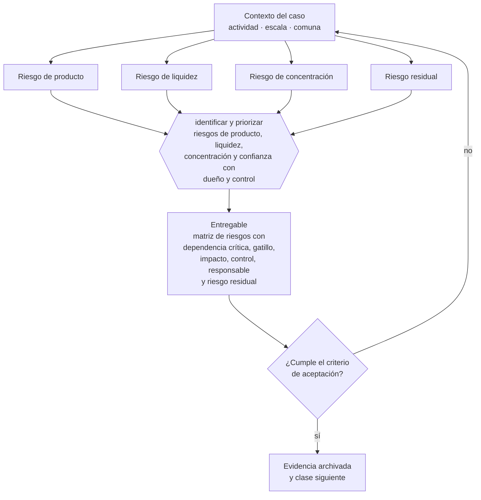

# Clase 253 — Mapa integral de riesgos

> **Parte 19 · Compliance, riesgos y responsabilidad empresarial** — clase 1 de 14

**Estado de evidencia:** `VERIFICADO-FUENTE` · **Jurisdicción:** Chile-first · **Fecha base normativa:** 07-08-2026 
**Decisión que habilita:** identificar y priorizar riesgos de producto, liquidez, concentración y confianza con dueño y control 
**Entregable:** matriz de riesgos con dependencia crítica, gatillo, impacto, control, responsable y riesgo residual

## 🎯 Propósito

Mapear cómo fallas de producto, liquidez, concentración y confianza se propagan y qué exposición queda después de los controles.

## 📚 Resultados de aprendizaje

Al finalizar esta clase podrás:

1. **Definir** con precisión los cuatro conceptos de la tabla siguiente y usarlos para describir un caso real.
2. **Explicar** por qué esta materia condiciona decisiones de otras partes del programa.
3. **Decidir** —identificar y priorizar riesgos de producto, liquidez, concentración y confianza con dueño y control— y justificar la decisión por escrito.
4. **Producir** el entregable de la clase y contrastarlo contra su criterio de aceptación.
5. **Distinguir** el dato estable del dato dinámico que exige revalidación en la fuente oficial.

## 🧩 Conceptos centrales

| Concepto | Comprensión verificable |
|---|---|
| **Riesgo de producto** | Posibilidad de que el mecanismo central no cumpla lo prometido bajo estrés. |
| **Riesgo de liquidez** | Incapacidad de atender obligaciones o retiros cuando vencen. |
| **Riesgo de concentración** | Exposición excesiva a un activo, contraparte, relacionada o fuente de ingresos. |
| **Riesgo residual** | Exposición que queda después de los controles. |

## 🗺️ Flujo de razonamiento

## 📖 Desarrollo

### 1. El fondo del asunto

El mapa debe conectar el producto con sus dependencias económicas, tecnológicas y de liquidez. Celsius enseña a preguntar de dónde proviene el rendimiento y si los activos calzan con retiros; Terra/UST/LUNA, a probar qué ocurre si fallan simultáneamente el mecanismo de estabilización, la liquidez y la confianza. La insolvencia describe incapacidad financiera y no acredita por sí sola fraude: conducta, evidencia y estado procesal se analizan por separado.

### 2. Cómo se traduce en la práctica

Celsius y Terra permiten practicar riesgos correlacionados: un activo pierde valor, cae la liquidez, aumentan retiros y la comunicación acelera la pérdida de confianza. El mapa debe mostrar esa cadena, el indicador que la detecta y quién puede detener el producto o activar continuidad. La insolvencia puede ser consecuencia de múltiples causas y no decide por sí sola una calificación penal.

### 3. Marco aplicable y quién interviene

- Ley 20.393 sobre responsabilidad penal de la persona jurídica
- Ley 21.595 sobre delitos económicos y ambientales
- Ley 19.913 que crea la UAF y establece sujetos obligados
- Ley 21.713 sobre cumplimiento de obligaciones tributarias
- Ley 21.643 en lo relativo a canal de denuncias e investigación interna

**Autoridades o contrapartes involucradas:** Ministerio Público, UAF, SII, CMF, Dirección del Trabajo.
**Profesionales de apoyo:** oficial de cumplimiento, abogado penal económico, auditor interno, corredor de seguros. La participación concreta depende del riesgo, del
tamaño de la empresa y de la actividad económica.

## 🧪 Taller guiado

Aplica esta clase a **una** de las siguientes líneas de negocio y repite después el ejercicio con
una segunda línea de carga regulatoria distinta:

| Línea | Carga regulatoria |
|---|---|
| SaaS B2B con IA | media |
| Servicios profesionales | baja |
| E-commerce D2C | media |
| Alimentos o foodtech | alta |
| Exportación de servicios | media |
| Fintech regulada | alta |
| Construcción o servicios técnicos | alta |

**Secuencia de trabajo:**

1. Delimita el contexto: actividad económica, escala, comuna y etapa de la empresa.
2. Reúne los antecedentes que la decisión exige y anota la fecha de cada fuente.
3. Identifica las alternativas reales, incluida la de no hacer nada.
4. Evalúa el impacto en mercado, caja, personas, regulación y operación.
5. Toma la decisión y regístrala con sus supuestos.
6. Produce el entregable.
7. Contrástalo contra el criterio de aceptación.
8. Anota lo que requiere validación profesional y programa su revisión.

### 📦 Entregable

Matriz de riesgos con dependencia crítica, gatillo, impacto, control, responsable y riesgo residual.

Debe incluir decisión, supuestos, fuentes con fecha de consulta, responsable, riesgos
identificados y próximos pasos.

## 🏆 Reto verificable

Resuelve la misma materia para una segunda línea de negocio con distinta carga regulatoria y
explica por escrito **qué cambió, por qué y qué fuente lo determina**.

## ✅ Criterio de aceptación

- [ ] cada promesa del producto se vincula con una dependencia, un escenario de falla y un indicador
- [ ] el riesgo residual incluye correlación, concentración y velocidad de retiros
- [ ] cada afirmación regulatoria está referida a una fuente oficial con fecha de consulta;
- [ ] los datos dinámicos quedan marcados para revalidación;
- [ ] hay un responsable asignado y evidencia reproducible del trabajo.

## ⚠️ Errores frecuentes

**Propios de esta clase:**

- Evaluar cada riesgo aisladamente cuando varias dependencias pueden fallar a la vez.
- Confundir insolvencia, mal diseño de producto y fraude como si fueran la misma conclusión.

**Característicos de la parte 19:**

- Modelo de prevención de delitos en papel, sin evidencia de operación.
- No identificar la condición de sujeto obligado uaf y omitir reportes.

## 🇨🇱 Checklist Chile

- [ ] ¿existe norma o autoridad específica para esta materia?
- [ ] ¿la fuente consultada está vigente a la fecha de ejecución?
- [ ] ¿se activa algún trámite ante el SII?
- [ ] ¿se activa algún requisito municipal o sectorial?
- [ ] ¿afecta a consumidores o al tratamiento de datos personales?
- [ ] ¿afecta a trabajadores o a la seguridad y salud en el trabajo?
- [ ] ¿afecta a impuestos, contabilidad o caja?
- [ ] ¿afecta a contratos o a propiedad intelectual?
- [ ] ¿requiere renovación, reporte periódico o revalidación?

## ❓ Preguntas de comprobación

1. ¿Qué dos riesgos de tu producto pueden activarse al mismo tiempo?
2. ¿Qué indicador anticipa el quiebre antes de que falte caja?
3. ¿Quién tiene autoridad para detener nuevas ventas, rendimientos o retiros discrecionales?

## 🔗 Fuentes oficiales

**Departamento de Justicia de Estados Unidos — Celsius: declaración de culpabilidad y sentencia del fundador**  
<https://www.justice.gov/usao-sdny/pr/founder-celsius-sentenced-12-years-fraud-and-market-manipulation> · verificado 2026-09-28

- *Qué contiene:* Registra que Alexander Mashinsky se declaró culpable en diciembre de 2024 y fue sentenciado en mayo de 2025, y describe hallazgos sobre sostenibilidad de rendimientos, liquidez, uso de depósitos y comunicación de riesgos.
- *Cómo leerla:* Distingue los hechos reconocidos en la declaración de culpabilidad y considerados en la sentencia de las reglas aplicables a una empresa chilena. El aprendizaje empresarial es probar la fuente del rendimiento, el calce de liquidez y la evidencia detrás de cada comunicación.
- *Uso en esta clase:* aporta el marco de «Celsius: declaración de culpabilidad y sentencia del fundador» para identificar y priorizar riesgos de producto, liquidez, concentración y confianza con dueño y control.

**Departamento de Justicia de Estados Unidos — Terraform, UST y LUNA: declaración de culpabilidad y sentencia de Do Kwon**  
<https://www.justice.gov/usao-sdny/pr/crypto-enabled-fraudster-sentenced-orchestrating-40-billion-fraud> · verificado 2026-09-28

- *Qué contiene:* Registra la declaración de culpabilidad de agosto de 2025 y la sentencia de diciembre de 2025, y describe hechos sobre el funcionamiento comunicado de UST, intervenciones no reveladas y respuesta posterior a la pérdida de estabilidad.
- *Cómo leerla:* Úsala para someter a estrés el mecanismo del producto, sus dependencias, incentivos, liquidez y comunicación. La sentencia estadounidense acredita conducta en ese proceso; no crea por sí sola una regla jurídica aplicable en Chile.
- *Uso en esta clase:* aporta el marco de «Terraform, UST y LUNA: declaración de culpabilidad y sentencia de Do Kwon» para identificar y priorizar riesgos de producto, liquidez, concentración y confianza con dueño y control.

Complementos del repositorio: [glosario](../../../docs/19_GLOSSARY.md) ·
[ruta de lecturas](../../../docs/15_BOOKS_AND_LEARNING_PATH.md) ·
[catálogo de fuentes](../../../docs/16_OFFICIAL_SOURCE_CATALOG.md).

> [!IMPORTANT]
> Material educativo. Para una decisión real de alto impacto hay que verificar la fuente oficial
> vigente y validar con el profesional competente.

---

| Anterior | Índice | Siguiente |
|---|---|---|
| **Inicio de la parte** | [Parte 19](../README.md) · [Programa](../../../README.md) | [254 · Controles preventivos, detectivos y correctivos →](../class-02-controles-preventivos-detectivos-y-correctivos/README.md) |
