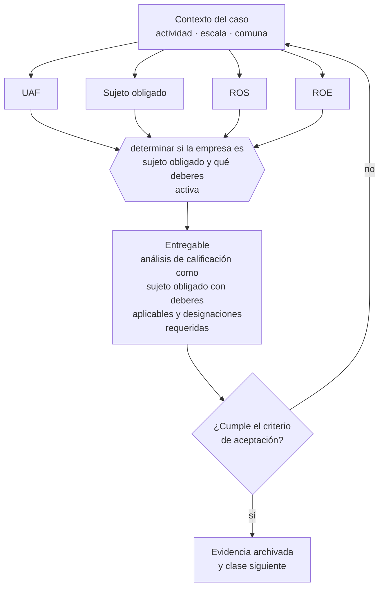

# Clase 259 — UAF, Ley 19.913 y sujetos obligados

> **Parte 19 · Compliance, riesgos y responsabilidad empresarial** — clase 7 de 14

**Estado de evidencia:** `VERIFICADO-FUENTE` · **Jurisdicción:** Chile-first · **Fecha base normativa:** 07-08-2026 
**Decisión que habilita:** determinar si la empresa es sujeto obligado y qué deberes activa 
**Entregable:** análisis de calificación como sujeto obligado con deberes aplicables y designaciones requeridas

## 🎯 Propósito

Verificar si la empresa es sujeto obligado ante la UAF buscando su actividad en el listado literal, no por intuición.

## 📚 Resultados de aprendizaje

Al finalizar esta clase podrás:

1. **Definir** con precisión los cuatro conceptos de la tabla siguiente y usarlos para describir un caso real.
2. **Explicar** por qué esta materia condiciona decisiones de otras partes del programa.
3. **Decidir** —determinar si la empresa es sujeto obligado y qué deberes activa— y justificar la decisión por escrito.
4. **Producir** el entregable de la clase y contrastarlo contra su criterio de aceptación.
5. **Distinguir** el dato estable del dato dinámico que exige revalidación en la fuente oficial.

## 🧩 Conceptos centrales

| Concepto | Comprensión verificable |
|---|---|
| **UAF** | Unidad de análisis financiero. |
| **Sujeto obligado** | Entidad con deberes de reporte por su actividad. |
| **ROS** | Reporte de operación sospechosa. |
| **ROE** | Reporte de operaciones en efectivo sobre el umbral. |

## 🗺️ Flujo de razonamiento

## 📖 Desarrollo

### 1. El fondo del asunto

La Ley 19.913 define los sectores obligados a reportar: entre otros, inmobiliarias, casas de cambio, notarios, corredores, casinos y ciertas actividades con manejo de efectivo. Ser sujeto obligado implica designar oficial de cumplimiento, mantener registros y reportar. Desconocerlo no exime de la sanción.

### 2. Cómo se traduce en la práctica

Inmobiliarias, casas de cambio, notarios, corredores, casinos y varias actividades con manejo de efectivo entran sin ser instituciones financieras. Desconocer la condición no exime de la sanción, y las obligaciones se activan completas: oficial de cumplimiento, registros y reportes.

### 3. Marco aplicable y quién interviene

- Ley 20.393 sobre responsabilidad penal de la persona jurídica
- Ley 21.595 sobre delitos económicos y ambientales
- Ley 19.913 que crea la UAF y establece sujetos obligados
- Ley 21.713 sobre cumplimiento de obligaciones tributarias
- Ley 21.643 en lo relativo a canal de denuncias e investigación interna

**Autoridades o contrapartes involucradas:** Ministerio Público, UAF, SII, CMF, Dirección del Trabajo.
**Profesionales de apoyo:** oficial de cumplimiento, abogado penal económico, auditor interno, corredor de seguros. La participación concreta depende del riesgo, del
tamaño de la empresa y de la actividad económica.

## 🧪 Taller guiado

Aplica esta clase a **una** de las siguientes líneas de negocio y repite después el ejercicio con
una segunda línea de carga regulatoria distinta:

| Línea | Carga regulatoria |
|---|---|
| SaaS B2B con IA | media |
| Servicios profesionales | baja |
| E-commerce D2C | media |
| Alimentos o foodtech | alta |
| Exportación de servicios | media |
| Fintech regulada | alta |
| Construcción o servicios técnicos | alta |

**Secuencia de trabajo:**

1. Delimita el contexto: actividad económica, escala, comuna y etapa de la empresa.
2. Reúne los antecedentes que la decisión exige y anota la fecha de cada fuente.
3. Identifica las alternativas reales, incluida la de no hacer nada.
4. Evalúa el impacto en mercado, caja, personas, regulación y operación.
5. Toma la decisión y regístrala con sus supuestos.
6. Produce el entregable.
7. Contrástalo contra el criterio de aceptación.
8. Anota lo que requiere validación profesional y programa su revisión.

### 📦 Entregable

Análisis de calificación como sujeto obligado con deberes aplicables y designaciones requeridas.

Debe incluir decisión, supuestos, fuentes con fecha de consulta, responsable, riesgos
identificados y próximos pasos.

## 🏆 Reto verificable

Resuelve la misma materia para una segunda línea de negocio con distinta carga regulatoria y
explica por escrito **qué cambió, por qué y qué fuente lo determina**.

## ✅ Criterio de aceptación

- [ ] la calificación se verificó contra el listado oficial vigente
- [ ] los deberes aplicables están identificados con responsable
- [ ] cada afirmación regulatoria está referida a una fuente oficial con fecha de consulta;
- [ ] los datos dinámicos quedan marcados para revalidación;
- [ ] hay un responsable asignado y evidencia reproducible del trabajo.

## ⚠️ Errores frecuentes

**Propios de esta clase:**

- Desconocer la condición de sujeto obligado por el rubro.
- No reportar operaciones en efectivo sobre el umbral establecido.

**Característicos de la parte 19:**

- Modelo de prevención de delitos en papel, sin evidencia de operación.
- No identificar la condición de sujeto obligado uaf y omitir reportes.

## 🇨🇱 Checklist Chile

- [ ] ¿existe norma o autoridad específica para esta materia?
- [ ] ¿la fuente consultada está vigente a la fecha de ejecución?
- [ ] ¿se activa algún trámite ante el SII?
- [ ] ¿se activa algún requisito municipal o sectorial?
- [ ] ¿afecta a consumidores o al tratamiento de datos personales?
- [ ] ¿afecta a trabajadores o a la seguridad y salud en el trabajo?
- [ ] ¿afecta a impuestos, contabilidad o caja?
- [ ] ¿afecta a contratos o a propiedad intelectual?
- [ ] ¿requiere renovación, reporte periódico o revalidación?

## ❓ Preguntas de comprobación

1. ¿Está tu actividad en el listado literal de sujetos obligados?
2. Si lo estás, ¿designaste oficial de cumplimiento y llevas los registros?
3. ¿Reportas operaciones en efectivo sobre el umbral establecido?

## 🔗 Fuentes oficiales

**Unidad de Análisis Financiero — Sujetos obligados · Ley 19.913**  
<https://www.uaf.cl/entidades/quienes.aspx> · verificado 2026-08-07

- *Qué contiene:* Enumera los sectores obligados a reportar, las obligaciones que se activan —designar oficial de cumplimiento, mantener registros, reportar ROS y ROE— y los umbrales aplicables.
- *Cómo leerla:* Busca tu actividad en la lista literal antes de asumir que no te aplica: inmobiliarias, casas de cambio, corredores y varias actividades con manejo de efectivo entran sin ser instituciones financieras.

**Biblioteca del Congreso Nacional · LeyChile — Normativa oficial consolidada**  
<https://www.bcn.cl/leychile/> · verificado 2026-08-07

- *Qué contiene:* Publica el texto oficial y consolidado de leyes, decretos y reglamentos, con la versión vigente a una fecha, el historial de modificaciones y la tramitación que las originó.
- *Cómo leerla:* Usa siempre el selector de versión vigente a la fecha en que ejecutarás el trámite, no la última publicada. Y lee el artículo transitorio: en normas en implantación gradual —jornada, datos personales— ahí está la fecha que realmente te aplica.

Complementos del repositorio: [glosario](../../../docs/19_GLOSSARY.md) ·
[ruta de lecturas](../../../docs/15_BOOKS_AND_LEARNING_PATH.md) ·
[catálogo de fuentes](../../../docs/16_OFFICIAL_SOURCE_CATALOG.md).

> [!IMPORTANT]
> Material educativo. Para una decisión real de alto impacto hay que verificar la fuente oficial
> vigente y validar con el profesional competente.

---

| Anterior | Índice | Siguiente |
|---|---|---|
| [← 258 · Canal de denuncias e investigaciones](../class-06-canal-de-denuncias-e-investigaciones/README.md) | [Parte 19](../README.md) · [Programa](../../../README.md) | [260 · KYC, PEP, beneficiario final y debida diligencia →](../class-08-kyc-pep-beneficiario-final-y-debida-diligencia/README.md) |
