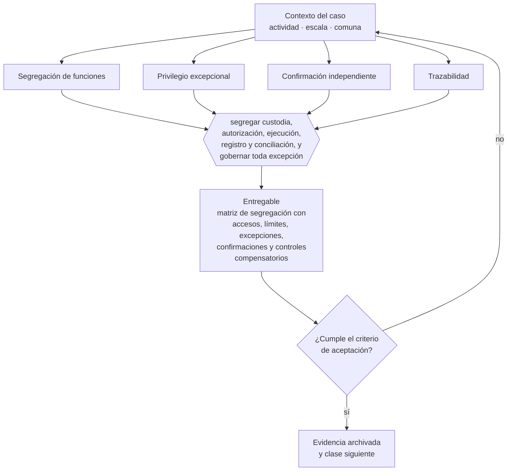

# Clase 262 — Fraude interno y segregación de funciones

> **Parte 19 · Compliance, riesgos y responsabilidad empresarial** — clase 10 de 14

**Estado de evidencia:** `VERIFICADO-FUENTE` · **Jurisdicción:** Chile-first · **Fecha base normativa:** 07-08-2026 
**Decisión que habilita:** segregar custodia, autorización, ejecución, registro y conciliación, y gobernar toda excepción 
**Entregable:** matriz de segregación con accesos, límites, excepciones, confirmaciones y controles compensatorios

## 🎯 Propósito

Separar custodia, autorización, ejecución, registro y conciliación, con privilegios excepcionales visibles y caducables.

## 📚 Resultados de aprendizaje

Al finalizar esta clase podrás:

1. **Definir** con precisión los cuatro conceptos de la tabla siguiente y usarlos para describir un caso real.
2. **Explicar** por qué esta materia condiciona decisiones de otras partes del programa.
3. **Decidir** —segregar custodia, autorización, ejecución, registro y conciliación, y gobernar toda excepción— y justificar la decisión por escrito.
4. **Producir** el entregable de la clase y contrastarlo contra su criterio de aceptación.
5. **Distinguir** el dato estable del dato dinámico que exige revalidación en la fuente oficial.

## 🧩 Conceptos centrales

| Concepto | Comprensión verificable |
|---|---|
| **Segregación de funciones** | Separación entre custodia, autorización, ejecución, registro y conciliación. |
| **Privilegio excepcional** | Permiso que omite un control ordinario y requiere aprobación y monitoreo reforzados. |
| **Confirmación independiente** | Validación realizada con evidencia ajena al ejecutor y al registro interno. |
| **Trazabilidad** | Capacidad de reconstruir la operación, su autorización y su beneficiario. |

## 🗺️ Flujo de razonamiento

```mermaid
flowchart TB
    C["Contexto del caso<br/>actividad · escala · comuna"]
    C --> A1["Segregación de funciones"]
    C --> A2["Privilegio excepcional"]
    C --> A3["Confirmación independiente"]
    C --> A4["Trazabilidad"]
    A1 & A2 & A3 & A4 --> D{{"segregar custodia,<br/>autorización, ejecución,<br/>registro y conciliación, y<br/>gobernar toda excepción"}}
    D --> E["Entregable<br/>matriz de segregación con<br/>accesos, límites, excepciones,<br/>confirmaciones y controles<br/>compensatorios"]
    E --> V{"¿Cumple el criterio<br/>de aceptación?"}
    V -->|sí| S["Evidencia archivada<br/>y clase siguiente"]
    V -->|no| C
```

## 📖 Desarrollo

### 1. El fondo del asunto

Los casos FTX/Alameda y Madoff muestran fallas distintas con una raíz de control común: concentración de custodia, decisión, registro o confirmación sin contrapeso independiente. En una empresa pequeña puede haber pocas personas, pero no debe haber una operación crítica sin segundo control: límites técnicos, doble aprobación, conciliación externa, alertas de excepción y revisión del directorio compensan la falta de dotación.

### 2. Cómo se traduce en la práctica

FTX/Alameda y Madoff muestran por qué la concentración no se corrige con confianza personal. Un equipo pequeño puede compensar con límites de sistema, doble firma, confirmación directa, alertas automáticas y revisión del directorio. La excepción debe ser más visible que la operación ordinaria: aprobador independiente, motivo, monto, vencimiento y prueba posterior.

### 3. Marco aplicable y quién interviene

- Ley 20.393 sobre responsabilidad penal de la persona jurídica
- Ley 21.595 sobre delitos económicos y ambientales
- Ley 19.913 que crea la UAF y establece sujetos obligados
- Ley 21.713 sobre cumplimiento de obligaciones tributarias
- Ley 21.643 en lo relativo a canal de denuncias e investigación interna

**Autoridades o contrapartes involucradas:** Ministerio Público, UAF, SII, CMF, Dirección del Trabajo.
**Profesionales de apoyo:** oficial de cumplimiento, abogado penal económico, auditor interno, corredor de seguros. La participación concreta depende del riesgo, del
tamaño de la empresa y de la actividad económica.

## 🧪 Taller guiado

Aplica esta clase a **una** de las siguientes líneas de negocio y repite después el ejercicio con
una segunda línea de carga regulatoria distinta:

| Línea | Carga regulatoria |
|---|---|
| SaaS B2B con IA | media |
| Servicios profesionales | baja |
| E-commerce D2C | media |
| Alimentos o foodtech | alta |
| Exportación de servicios | media |
| Fintech regulada | alta |
| Construcción o servicios técnicos | alta |

**Secuencia de trabajo:**

1. Delimita el contexto: actividad económica, escala, comuna y etapa de la empresa.
2. Reúne los antecedentes que la decisión exige y anota la fecha de cada fuente.
3. Identifica las alternativas reales, incluida la de no hacer nada.
4. Evalúa el impacto en mercado, caja, personas, regulación y operación.
5. Toma la decisión y regístrala con sus supuestos.
6. Produce el entregable.
7. Contrástalo contra el criterio de aceptación.
8. Anota lo que requiere validación profesional y programa su revisión.

### 📦 Entregable

Matriz de segregación con accesos, límites, excepciones, confirmaciones y controles compensatorios.

Debe incluir decisión, supuestos, fuentes con fecha de consulta, responsable, riesgos
identificados y próximos pasos.

## 🏆 Reto verificable

Resuelve la misma materia para una segunda línea de negocio con distinta carga regulatoria y
explica por escrito **qué cambió, por qué y qué fuente lo determina**.

## ✅ Criterio de aceptación

- [ ] ninguna operación crítica reúne custodia, autorización, ejecución, registro y conciliación en un mismo actor
- [ ] cada excepción tiene aprobador independiente, límite, alerta, caducidad y evidencia de revisión
- [ ] cada afirmación regulatoria está referida a una fuente oficial con fecha de consulta;
- [ ] los datos dinámicos quedan marcados para revalidación;
- [ ] hay un responsable asignado y evidencia reproducible del trabajo.

## ⚠️ Errores frecuentes

**Propios de esta clase:**

- Otorgar a una persona o relacionada privilegios que el sistema no registra ni limita.
- Aceptar antigüedad, reputación o autoridad jerárquica como sustituto de confirmación independiente.

**Característicos de la parte 19:**

- Modelo de prevención de delitos en papel, sin evidencia de operación.
- No identificar la condición de sujeto obligado uaf y omitir reportes.

## 🇨🇱 Checklist Chile

- [ ] ¿existe norma o autoridad específica para esta materia?
- [ ] ¿la fuente consultada está vigente a la fecha de ejecución?
- [ ] ¿se activa algún trámite ante el SII?
- [ ] ¿se activa algún requisito municipal o sectorial?
- [ ] ¿afecta a consumidores o al tratamiento de datos personales?
- [ ] ¿afecta a trabajadores o a la seguridad y salud en el trabajo?
- [ ] ¿afecta a impuestos, contabilidad o caja?
- [ ] ¿afecta a contratos o a propiedad intelectual?
- [ ] ¿requiere renovación, reporte periódico o revalidación?

## ❓ Preguntas de comprobación

1. ¿Quién puede mover activos y también alterar el registro o el límite?
2. ¿Qué privilegio excepcional existe, quién lo aprobó y cuándo caduca?
3. ¿Qué confirmación llega directamente a alguien ajeno a la ejecución?

## 🔗 Fuentes oficiales

**Departamento de Justicia de Estados Unidos — FTX y Alameda: condena y sentencia de Samuel Bankman-Fried**  
<https://www.justice.gov/archives/opa/pr/samuel-bankman-fried-sentenced-25-years-his-orchestration-multiple-fraudulent-schemes> · verificado 2026-10-01

- *Qué contiene:* Resume la condena dictada tras juicio y la sentencia de marzo de 2024, incluidos hechos acreditados sobre fondos de clientes, privilegios de Alameda, información financiera y ocultamiento a clientes, inversionistas y prestamistas.
- *Cómo leerla:* Úsala para estudiar segregación de fondos, partes relacionadas, autorización, tesorería y evidencia de gobierno. No copies tipos penales ni reglas estadounidenses a Chile: contrasta cada obligación local con contrato, actividad y norma chilena aplicable.
- *Uso en esta clase:* aporta el marco de «FTX y Alameda: condena y sentencia de Samuel Bankman-Fried» para segregar custodia, autorización, ejecución, registro y conciliación, y gobernar toda excepción.

**U.S. Securities and Exchange Commission — Reformas posteriores a Madoff sobre custodia y verificación independiente**  
<https://www.sec.gov/spotlight/secpostmadoffreforms.htm> · verificado 2026-09-28

- *Qué contiene:* Explica controles adoptados después del caso Madoff, entre ellos custodia independiente, exámenes sorpresa, revisión por terceros y confirmación de que los activos informados existen.
- *Cómo leerla:* Toma los principios de independencia, confirmación y separación de custodia como aprendizaje de control. Sus exigencias concretas pertenecen al marco estadounidense y no deben presentarse como obligaciones chilenas sin una norma local aplicable.
- *Uso en esta clase:* aporta el marco de «Reformas posteriores a Madoff sobre custodia y verificación independiente» para segregar custodia, autorización, ejecución, registro y conciliación, y gobernar toda excepción.

Complementos del repositorio: [glosario](../../../docs/19_GLOSSARY.md) ·
[ruta de lecturas](../../../docs/15_BOOKS_AND_LEARNING_PATH.md) ·
[catálogo de fuentes](../../../docs/16_OFFICIAL_SOURCE_CATALOG.md).

> [!IMPORTANT]
> Material educativo. Para una decisión real de alto impacto hay que verificar la fuente oficial
> vigente y validar con el profesional competente.

---

| Anterior | Índice | Siguiente |
|---|---|---|
| [← 261 · Anticorrupción, regalos y conflictos](../class-09-anticorrupcion-regalos-y-conflictos/README.md) | [Parte 19](../README.md) · [Programa](../../../README.md) | [263 · Compliance tributario y Ley 21.713 →](../class-11-compliance-tributario-y-ley-21-713/README.md) |
