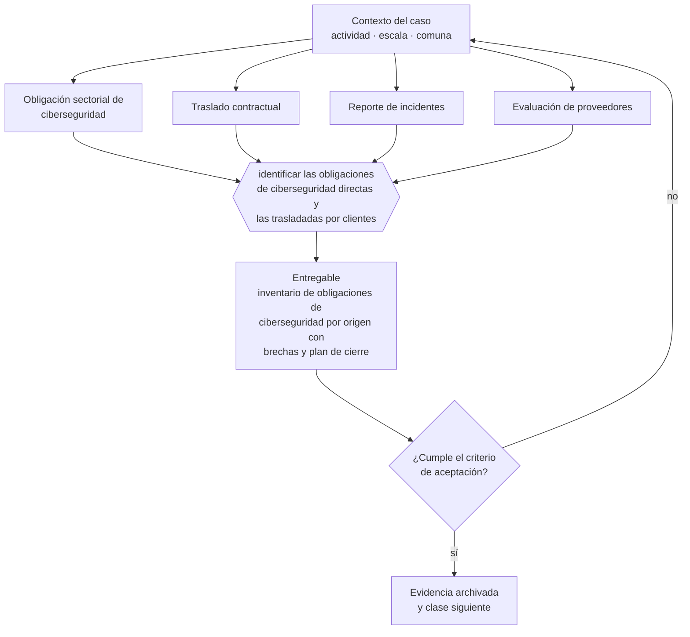

# Clase 264 — Ciberseguridad y obligaciones sectoriales

> **Parte 19 · Compliance, riesgos y responsabilidad empresarial** — clase 12 de 14

**Estado de evidencia:** `VERIFICADO-FUENTE` · **Jurisdicción:** Chile-first · **Fecha base normativa:** 07-08-2026 
**Decisión que habilita:** identificar las obligaciones de ciberseguridad directas y las trasladadas por clientes 
**Entregable:** inventario de obligaciones de ciberseguridad por origen con brechas y plan de cierre

## 🎯 Propósito

Inventariar las obligaciones de ciberseguridad por origen —regulatorias directas y trasladadas por contrato— y cerrar las brechas antes de negociar.

## 📚 Resultados de aprendizaje

Al finalizar esta clase podrás:

1. **Definir** con precisión los cuatro conceptos de la tabla siguiente y usarlos para describir un caso real.
2. **Explicar** por qué esta materia condiciona decisiones de otras partes del programa.
3. **Decidir** —identificar las obligaciones de ciberseguridad directas y las trasladadas por clientes— y justificar la decisión por escrito.
4. **Producir** el entregable de la clase y contrastarlo contra su criterio de aceptación.
5. **Distinguir** el dato estable del dato dinámico que exige revalidación en la fuente oficial.

## 🧩 Conceptos centrales

| Concepto | Comprensión verificable |
|---|---|
| **Obligación sectorial de ciberseguridad** | Exigencia impuesta por regulador o por contrato. |
| **Traslado contractual** | Exigencia que un cliente regulado impone a su proveedor. |
| **Reporte de incidentes** | Obligación de informar en plazos definidos. |
| **Evaluación de proveedores** | Revisión de seguridad de terceros. |

## 🗺️ Flujo de razonamiento

## 📖 Desarrollo

### 1. El fondo del asunto

Aunque la empresa no sea operador de importancia vital, sus clientes regulados le trasladarán exigencias por contrato: controles, auditorías, notificación de incidentes y cláusulas de responsabilidad. Anticiparlas convierte el cumplimiento en ventaja comercial en vez de obstáculo.

### 2. Cómo se traduce en la práctica

Los clientes regulados trasladan exigencias de controles, auditorías y notificación de incidentes por cláusula. Descubrirlas durante la negociación de un contrato importante deja a la empresa eligiendo entre aceptar obligaciones que no puede cumplir o perder la operación.

### 3. Marco aplicable y quién interviene

- Ley 20.393 sobre responsabilidad penal de la persona jurídica
- Ley 21.595 sobre delitos económicos y ambientales
- Ley 19.913 que crea la UAF y establece sujetos obligados
- Ley 21.713 sobre cumplimiento de obligaciones tributarias
- Ley 21.643 en lo relativo a canal de denuncias e investigación interna

**Autoridades o contrapartes involucradas:** Ministerio Público, UAF, SII, CMF, Dirección del Trabajo.
**Profesionales de apoyo:** oficial de cumplimiento, abogado penal económico, auditor interno, corredor de seguros. La participación concreta depende del riesgo, del
tamaño de la empresa y de la actividad económica.

## 🧪 Taller guiado

Aplica esta clase a **una** de las siguientes líneas de negocio y repite después el ejercicio con
una segunda línea de carga regulatoria distinta:

| Línea | Carga regulatoria |
|---|---|
| SaaS B2B con IA | media |
| Servicios profesionales | baja |
| E-commerce D2C | media |
| Alimentos o foodtech | alta |
| Exportación de servicios | media |
| Fintech regulada | alta |
| Construcción o servicios técnicos | alta |

**Secuencia de trabajo:**

1. Delimita el contexto: actividad económica, escala, comuna y etapa de la empresa.
2. Reúne los antecedentes que la decisión exige y anota la fecha de cada fuente.
3. Identifica las alternativas reales, incluida la de no hacer nada.
4. Evalúa el impacto en mercado, caja, personas, regulación y operación.
5. Toma la decisión y regístrala con sus supuestos.
6. Produce el entregable.
7. Contrástalo contra el criterio de aceptación.
8. Anota lo que requiere validación profesional y programa su revisión.

### 📦 Entregable

Inventario de obligaciones de ciberseguridad por origen con brechas y plan de cierre.

Debe incluir decisión, supuestos, fuentes con fecha de consulta, responsable, riesgos
identificados y próximos pasos.

## 🏆 Reto verificable

Resuelve la misma materia para una segunda línea de negocio con distinta carga regulatoria y
explica por escrito **qué cambió, por qué y qué fuente lo determina**.

## ✅ Criterio de aceptación

- [ ] las obligaciones están clasificadas por origen
- [ ] las brechas tienen plan de cierre con fecha
- [ ] cada afirmación regulatoria está referida a una fuente oficial con fecha de consulta;
- [ ] los datos dinámicos quedan marcados para revalidación;
- [ ] hay un responsable asignado y evidencia reproducible del trabajo.

## ⚠️ Errores frecuentes

**Propios de esta clase:**

- Descubrir las exigencias durante la negociación de un contrato importante.
- Aceptar cláusulas de auditoría y notificación sin capacidad de cumplirlas.

**Característicos de la parte 19:**

- Modelo de prevención de delitos en papel, sin evidencia de operación.
- No identificar la condición de sujeto obligado uaf y omitir reportes.

## 🇨🇱 Checklist Chile

- [ ] ¿existe norma o autoridad específica para esta materia?
- [ ] ¿la fuente consultada está vigente a la fecha de ejecución?
- [ ] ¿se activa algún trámite ante el SII?
- [ ] ¿se activa algún requisito municipal o sectorial?
- [ ] ¿afecta a consumidores o al tratamiento de datos personales?
- [ ] ¿afecta a trabajadores o a la seguridad y salud en el trabajo?
- [ ] ¿afecta a impuestos, contabilidad o caja?
- [ ] ¿afecta a contratos o a propiedad intelectual?
- [ ] ¿requiere renovación, reporte periódico o revalidación?

## ❓ Preguntas de comprobación

1. ¿Qué exigencias de seguridad te ha trasladado un cliente por contrato?
2. ¿Aceptaste cláusulas de auditoría o notificación que hoy no podrías cumplir?
3. ¿Qué brecha cerrarías primero si mañana te auditara un cliente grande?

## 🔗 Fuentes oficiales

**Biblioteca del Congreso Nacional · LeyChile — Normativa oficial consolidada**  
<https://www.bcn.cl/leychile/> · verificado 2026-08-19

- *Qué contiene:* Publica el texto oficial y consolidado de leyes, decretos y reglamentos, con la versión vigente a una fecha, el historial de modificaciones y la tramitación que las originó.
- *Cómo leerla:* Usa siempre el selector de versión vigente a la fecha en que ejecutarás el trámite, no la última publicada. Y lee el artículo transitorio: en normas en implantación gradual —jornada, datos personales— ahí está la fecha que realmente te aplica.
- *Uso en esta clase:* aporta el marco de «Normativa oficial consolidada» para identificar las obligaciones de ciberseguridad directas y las trasladadas por clientes.

Complementos del repositorio: [glosario](../../../docs/19_GLOSSARY.md) ·
[ruta de lecturas](../../../docs/15_BOOKS_AND_LEARNING_PATH.md) ·
[catálogo de fuentes](../../../docs/16_OFFICIAL_SOURCE_CATALOG.md).

> [!IMPORTANT]
> Material educativo. Para una decisión real de alto impacto hay que verificar la fuente oficial
> vigente y validar con el profesional competente.

---

| Anterior | Índice | Siguiente |
|---|---|---|
| [← 263 · Compliance tributario y Ley 21.713](../class-11-compliance-tributario-y-ley-21-713/README.md) | [Parte 19](../README.md) · [Programa](../../../README.md) | [265 · Seguros empresariales y transferencia de riesgo →](../class-13-seguros-empresariales-y-transferencia-de-riesgo/README.md) |
