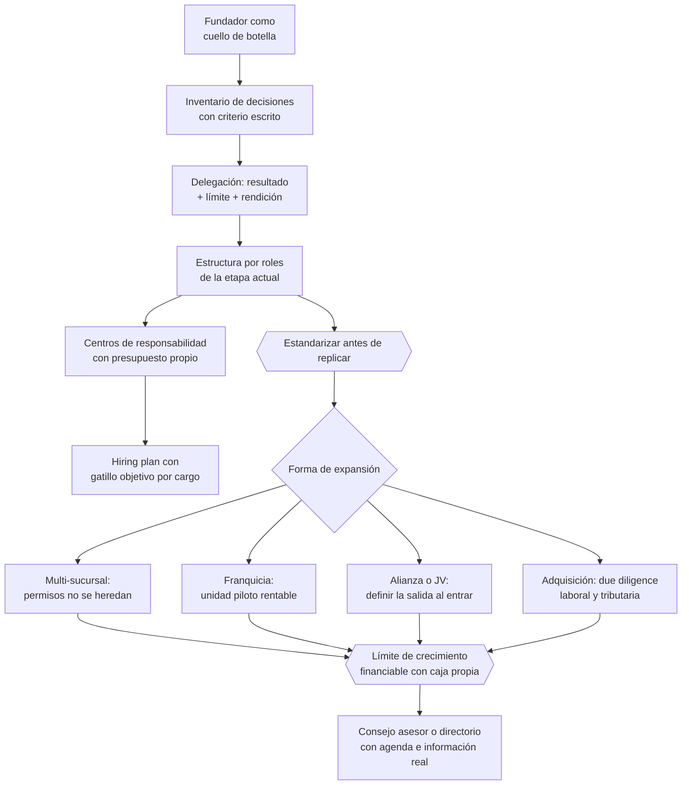

# Parte 20 — Escalamiento, organización y gobierno avanzado

> *Crecer rompe lo que funcionaba*

**Estado de evidencia:** `GUIA-PRACTICA` · **Clases:** 14 (267–280) · **Fecha base normativa:** 07-08-2026 
**Conceptos definidos en esta parte:** 56

## 🎯 De qué trata esta parte

El primer límite de crecimiento suele ser el fundador: todas las decisiones pasan por él y el sistema se satura. Salir de ahí exige documentar criterios de decisión, no solo tareas, y aceptar que otros decidirán distinto dentro de límites definidos. Delegar sin límite produce sorpresas; delegar sin resultado comprometido produce actividad sin efecto. El par correcto es resultado más límite, revisado en una instancia periódica.

La segunda unidad —la segunda sucursal, el segundo turno, la segunda línea— es siempre la más difícil, porque revela todo lo que dependía de la presencia del fundador. De ahí la regla de secuencia de esta parte: estandarizar antes de replicar. Si el proceso funciona porque alguien lo ajusta sobre la marcha, no se puede copiar. La prueba práctica es si una persona nueva alcanza el mismo resultado con el manual en la mano.

Y sobre todo lo anterior hay una restricción financiera dura: existe una tasa máxima de crecimiento que la empresa puede financiar con su propia generación. Superarla exige capital externo o produce crisis de caja. Calcular ese límite y contrastarlo con el plan comercial evita el escenario más frecuente de todos: quebrar creciendo.

## 📚 Resultados de la parte

Al terminar esta parte podrás:

1. **Diseñar la estructura organizacional que corresponde a la etapa actual y no a la aspiracional**.
2. **Delegar con decisión, límite y métrica en vez de delegar tareas**.
3. **Estandarizar los procesos críticos antes de replicarlos en una segunda unidad**.
4. **Controlar que el crecimiento no destruya la caja**.

## 🗺️ Mapa de la parte

## ⚖️ Marco aplicable

- presupuesto por centros de responsabilidad y control de gestión
- gobierno corporativo escalonado: consejo asesor, directorio y comités
- marcos de franquicia y licenciamiento de formato

**Autoridades o contrapartes:** CMF para sociedades anónimas, FNE en operaciones de concentración, SII en reorganizaciones.
**Profesionales de apoyo:** gerencia general, control de gestión, abogado corporativo, consultor organizacional.

## ⚠️ Riesgos característicos

- Abrir una segunda sucursal antes de que la primera tenga proceso estable.
- Crecer en headcount por encima de la capacidad de caja.
- Franquiciar sin manual operativo ni control de calidad de marca.
- Adquirir una empresa sin due diligence laboral y tributaria.

## 📘 Las 14 clases

| # | Global | Clase | Decisión que habilita |
|---:|---:|---|---|
| 01 | 267 | [De fundador a organización](class-01-de-fundador-a-organizacion/README.md) | identificar qué decisiones deben dejar de pasar por el fundador |
| 02 | 268 | [Diseño organizacional por etapas](class-02-diseno-organizacional-por-etapas/README.md) | definir la estructura de roles que corresponde a la etapa actual |
| 03 | 269 | [Delegación y accountability](class-03-delegacion-y-accountability/README.md) | definir resultados comprometidos, límites de decisión e instancias de rendición |
| 04 | 270 | [Presupuesto por centros de responsabilidad](class-04-presupuesto-por-centros-de-responsabilidad/README.md) | definir los centros de responsabilidad y su rutina de análisis de desviaciones |
| 05 | 271 | [Hiring plan y workforce planning](class-05-hiring-plan-y-workforce-planning/README.md) | definir qué cargos se abren, en qué orden y con qué gatillo |
| 06 | 272 | [Procesos que deben estandarizarse antes de crecer](class-06-procesos-que-deben-estandarizarse-antes-de-crecer/README.md) | identificar qué procesos deben estandarizarse antes de crecer |
| 07 | 273 | [Multi-sucursal y expansión geográfica](class-07-multi-sucursal-y-expansion-geografica/README.md) | decidir si abrir una nueva ubicación y qué debe estar resuelto antes |
| 08 | 274 | [Franquiciar un negocio](class-08-franquiciar-un-negocio/README.md) | determinar si el negocio está en condiciones de franquiciarse |
| 09 | 275 | [Alianzas estratégicas y joint ventures](class-09-alianzas-estrategicas-y-joint-ventures/README.md) | definir aportes, gobierno y mecanismo de salida antes de iniciar la alianza |
| 10 | 276 | [Adquisición de competidores o capacidades](class-10-adquisicion-de-competidores-o-capacidades/README.md) | determinar si adquirir y cómo se cubren las contingencias detectadas |
| 11 | 277 | [Consejo asesor y directorio](class-11-consejo-asesor-y-directorio/README.md) | decidir si corresponde consejo asesor o directorio y con qué agenda |
| 12 | 278 | [Auditoría externa y control de gestión](class-12-auditoria-externa-y-control-de-gestion/README.md) | determinar si corresponde auditoría externa y qué función de control de gestión se necesita |
| 13 | 279 | [Internacionalización organizacional](class-13-internacionalizacion-organizacional/README.md) | definir el modelo operativo internacional y sus obligaciones locales |
| 14 | 280 | [Evitar que el crecimiento destruya la caja](class-14-evitar-que-el-crecimiento-destruya-la-caja/README.md) | determinar el límite de crecimiento financiable y ajustar el plan comercial |

## 🔤 Glosario de la parte

| Concepto | Definición operacional |
|---|---|
| **Accountability** | Responsabilidad por un resultado, no por una actividad. |
| **Adaptación local** | Ajuste a condiciones regulatorias y de mercado de la nueva comuna o región. |
| **Adquisición** | Compra de otra empresa o de sus activos. |
| **Agenda de gobierno** | Materias que el órgano revisa periódicamente. |
| **Alianza estratégica** | Acuerdo de colaboración sin fusionar patrimonios. |
| **Análisis de desviaciones** | Explicación de las diferencias y acción correctiva. |
| **Aporte de cada parte** | Lo que cada uno pone y lo que espera obtener. |
| **Auditoría externa** | Revisión independiente de los estados financieros. |
| **Calidad del crecimiento** | Proporción del crecimiento que proviene de clientes rentables. |
| **Carta de control interno** | Observaciones del auditor sobre debilidades detectadas. |
| **Centro de responsabilidad** | Unidad con presupuesto y resultado propio. |
| **Consejo asesor** | Grupo sin facultades formales que aporta criterio. |
| **Consumo de caja del crecimiento** | Capital de trabajo adicional que exige cada peso de venta. |
| **Control de calidad de red** | Mecanismo que asegura consistencia entre unidades. |
| **Control de gestión** | Función que monitorea el desempeño contra el plan. |
| **Costo de coordinación** | Carga de gestionar múltiples ubicaciones. |
| **Costo total del cargo** | Remuneración, cotizaciones, equipamiento y tiempo de rampa. |
| **Crecimiento rentable** | Aumento de ventas que no destruye caja ni margen. |
| **Cuello de botella del fundador** | Decisiones que se detienen porque solo el fundador las toma. |
| **Cumplimiento local** | Obligaciones laborales y tributarias del país destino. |
| **Delegación efectiva** | Transferencia de decisión con criterio y límite. |
| **Desviación** | Diferencia entre lo presupuestado y lo real. |
| **Directorio** | Órgano con facultades de administración y responsabilidad legal. |
| **Diseño organizacional** | Estructura de roles, reportes y decisiones. |
| **Due diligence** | Verificación previa de la empresa objetivo. |
| **Economía de la unidad** | Resultado de una sucursal individual. |
| **Estandarización** | Definición de una forma única de ejecutar. |
| **Etapa organizacional** | Fase que determina qué estructura corresponde. |
| **Expansión geográfica** | Apertura de operación en una nueva zona. |
| **Franquiciar** | Ceder el formato del negocio a un tercero. |
| **Gatillo de contratación** | Condición que habilita abrir el cargo. |
| **Hiring plan** | Plan de contrataciones asociado al crecimiento. |
| **Huso horario y idioma** | Factores que afectan coordinación y servicio. |
| **Independencia** | Condición del miembro sin vínculo económico relevante. |
| **Institucionalización** | Traslado del conocimiento a procesos y roles. |
| **Integración post-adquisición** | Proceso que determina si la sinergia se materializa. |
| **Internacionalización organizacional** | Adaptación de la estructura para operar fuera de chile. |
| **Joint venture** | Vehículo conjunto con aporte y gobierno definidos. |
| **Límite de crecimiento financiable** | Tasa máxima sostenible con los recursos disponibles. |
| **Límite de decisión** | Monto o materia hasta donde el rol decide sin consultar. |
| **Manual de franquicia** | Documento que transfiere el sistema completo. |
| **Manual operativo** | Documento que permite replicar sin el fundador presente. |
| **Modelo operativo** | Forma en que se coordinan las operaciones entre países. |
| **Opinión de auditoría** | Conclusión del auditor sobre los estados financieros. |
| **Presupuesto** | Asignación de recursos con meta asociada. |
| **Proceso crítico** | Aquel cuya variación destruye la promesa al cliente. |
| **RACI** | Matriz de responsable, aprobador, consultado e informado. |
| **Rendición de cuentas** | Instancia periódica de revisión del resultado comprometido. |
| **Replicabilidad** | Capacidad de reproducir el proceso en otra unidad. |
| **Rol versus persona** | Distinción entre lo que el cargo requiere y quién lo ocupa hoy. |
| **Salida de la alianza** | Mecanismo de término y reparto. |
| **Sinergia** | Valor adicional que se genera al integrar. |
| **Tiempo de rampa** | Período hasta que la persona es productiva. |
| **Transición fundador-organización** | Paso de decisiones personales a decisiones institucionales. |
| **Unidad piloto** | Operación propia que valida el modelo. |
| **Ámbito de control** | Número de reportes directos manejable. |

## 🔗 Cómo se conecta

Ejecuta el roadmap de la parte 04 dentro del límite financiero de la parte 09. Multiplica las obligaciones de las partes 12 y 17 en cada nueva unidad, y su gobierno prepara la transferibilidad que evalúa la parte 22.

## 📖 Pauta bibliográfica

- Greiner, L. — *Evolution and Revolution as Organizations Grow*: crisis por etapa.
- Collins, J. — *Good to Great*: disciplina de foco y personas antes que estrategia.
- Reglas de operaciones de concentración de la FNE cuando la expansión es por adquisición.

## 🏛️ Fuentes oficiales de la parte

**Corporación de Fomento de la Producción — Innovación, inversión y garantías**  
<https://www.corfo.cl/> · verificado 2026-08-07

- *Qué contiene:* Reúne los instrumentos de fomento a la innovación y la inversión, incluidos programas de capital semilla, escalamiento, garantías y cobertura de riesgo para el sistema financiero.
- *Cómo leerla:* Filtra por etapa de la empresa antes que por monto. Y verifica el componente de innovación que exige cada instrumento: presentar una expansión comercial como innovación es la causa más común de rechazo.

**Servicio de Impuestos Internos — Nuevos contribuyentes, inicio de actividades y DTE**  
<https://www.sii.cl/ayudas/nuevos_contribuyentes/boleta-vys-facturador.html> · verificado 2026-08-07

- *Qué contiene:* Reúne el circuito completo del contribuyente nuevo: obtención de RUT, declaración de inicio de actividades, elección de códigos de actividad económica y habilitación para emitir documentos tributarios electrónicos.
- *Cómo leerla:* Sepáralo en dos actos distintos que la página trata seguidos: el RUT identifica, el inicio de actividades habilita. Lo que te bloquea para facturar casi siempre está en el segundo, no en el primero.

**Biblioteca del Congreso Nacional · LeyChile — Normativa oficial consolidada**  
<https://www.bcn.cl/leychile/> · verificado 2026-08-07

- *Qué contiene:* Publica el texto oficial y consolidado de leyes, decretos y reglamentos, con la versión vigente a una fecha, el historial de modificaciones y la tramitación que las originó.
- *Cómo leerla:* Usa siempre el selector de versión vigente a la fecha en que ejecutarás el trámite, no la última publicada. Y lee el artículo transitorio: en normas en implantación gradual —jornada, datos personales— ahí está la fecha que realmente te aplica.

---

| Anterior | Índice | Siguiente |
|---|---|---|
| [← Parte 19 · Compliance, riesgos y responsabilidad empresarial](../part-19-compliance-riesgos-y-responsabilidad-empresarial/README.md) | [Currículo](../../CURRICULUM.md) · [Programa](../../README.md) | [Parte 21 · Crisis, continuidad, insolvencia y recuperación →](../part-21-crisis-continuidad-insolvencia-y-recuperacion/README.md) |
