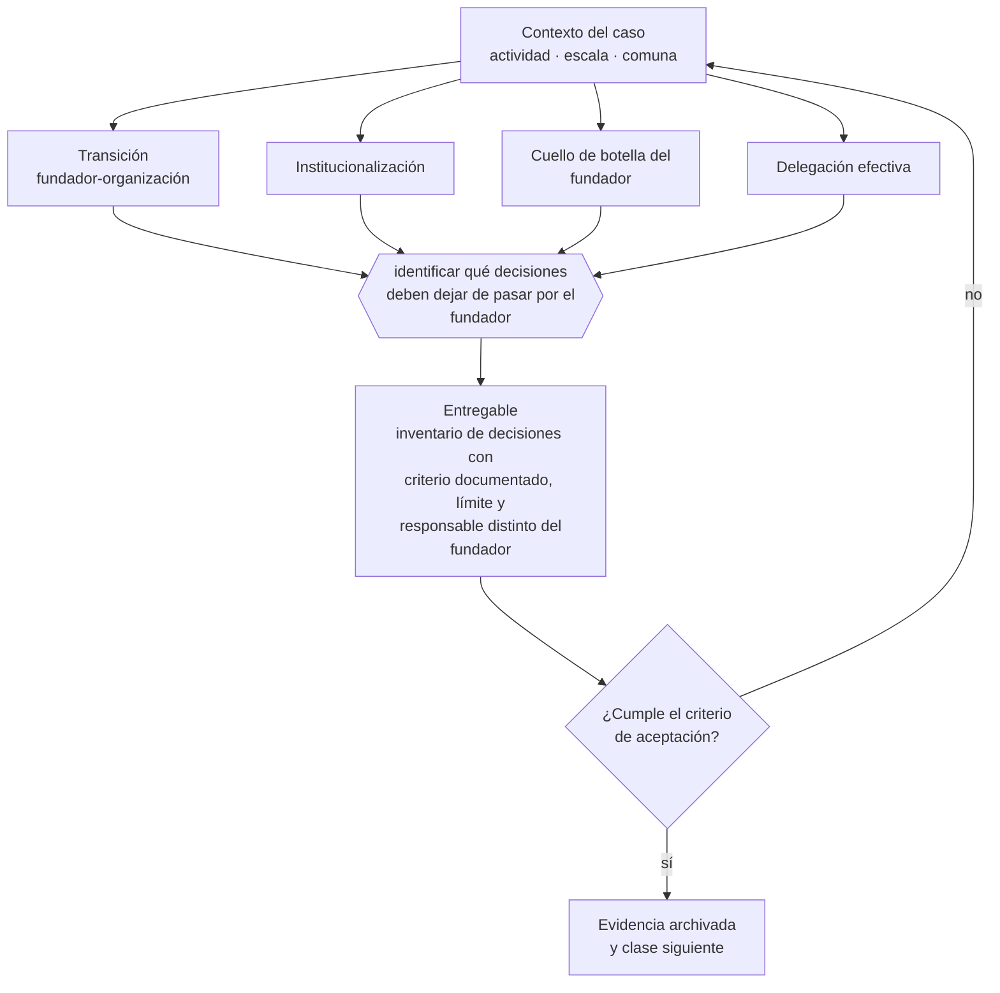

# Clase 267 — De fundador a organización

> **Parte 20 · Escalamiento, organización y gobierno avanzado** — clase 1 de 14

**Estado de evidencia:** `GUIA-PRACTICA` · **Jurisdicción:** Chile-first · **Fecha base normativa:** 07-08-2026 
**Decisión que habilita:** identificar qué decisiones deben dejar de pasar por el fundador 
**Entregable:** inventario de decisiones con criterio documentado, límite y responsable distinto del fundador

## 🎯 Propósito

Identificar qué decisiones deben dejar de pasar por el fundador y documentar el criterio, no solo la tarea.

## 📚 Resultados de aprendizaje

Al finalizar esta clase podrás:

1. **Definir** con precisión los cuatro conceptos de la tabla siguiente y usarlos para describir un caso real.
2. **Explicar** por qué esta materia condiciona decisiones de otras partes del programa.
3. **Decidir** —identificar qué decisiones deben dejar de pasar por el fundador— y justificar la decisión por escrito.
4. **Producir** el entregable de la clase y contrastarlo contra su criterio de aceptación.
5. **Distinguir** el dato estable del dato dinámico que exige revalidación en la fuente oficial.

## 🧩 Conceptos centrales

| Concepto | Comprensión verificable |
|---|---|
| **Transición fundador-organización** | Paso de decisiones personales a decisiones institucionales. |
| **Institucionalización** | Traslado del conocimiento a procesos y roles. |
| **Cuello de botella del fundador** | Decisiones que se detienen porque solo el fundador las toma. |
| **Delegación efectiva** | Transferencia de decisión con criterio y límite. |

## 🗺️ Flujo de razonamiento

## 📖 Desarrollo

### 1. El fondo del asunto

El primer límite de crecimiento suele ser el fundador: todas las decisiones pasan por él y el sistema se satura. Salir de ahí exige documentar criterios de decisión, no solo tareas, y aceptar que otros decidirán distinto de como él lo haría, dentro de límites definidos.

### 2. Cómo se traduce en la práctica

Delegar tareas sin delegar el criterio produce consultas permanentes que saturan igual. Y retomar la decisión delegada al primer error del responsable enseña a la organización que la delegación era aparente, con lo cual todo vuelve al punto de partida y nadie vuelve a intentarlo.

### 3. Marco aplicable y quién interviene

- presupuesto por centros de responsabilidad y control de gestión
- gobierno corporativo escalonado: consejo asesor, directorio y comités
- marcos de franquicia y licenciamiento de formato

**Autoridades o contrapartes involucradas:** CMF para sociedades anónimas, FNE en operaciones de concentración, SII en reorganizaciones.
**Profesionales de apoyo:** gerencia general, control de gestión, abogado corporativo, consultor organizacional. La participación concreta depende del riesgo, del
tamaño de la empresa y de la actividad económica.

## 🧪 Taller guiado

Aplica esta clase a **una** de las siguientes líneas de negocio y repite después el ejercicio con
una segunda línea de carga regulatoria distinta:

| Línea | Carga regulatoria |
|---|---|
| SaaS B2B con IA | media |
| Servicios profesionales | baja |
| E-commerce D2C | media |
| Alimentos o foodtech | alta |
| Exportación de servicios | media |
| Fintech regulada | alta |
| Construcción o servicios técnicos | alta |

**Secuencia de trabajo:**

1. Delimita el contexto: actividad económica, escala, comuna y etapa de la empresa.
2. Reúne los antecedentes que la decisión exige y anota la fecha de cada fuente.
3. Identifica las alternativas reales, incluida la de no hacer nada.
4. Evalúa el impacto en mercado, caja, personas, regulación y operación.
5. Toma la decisión y regístrala con sus supuestos.
6. Produce el entregable.
7. Contrástalo contra el criterio de aceptación.
8. Anota lo que requiere validación profesional y programa su revisión.

### 📦 Entregable

Inventario de decisiones con criterio documentado, límite y responsable distinto del fundador.

Debe incluir decisión, supuestos, fuentes con fecha de consulta, responsable, riesgos
identificados y próximos pasos.

## 🏆 Reto verificable

Resuelve la misma materia para una segunda línea de negocio con distinta carga regulatoria y
explica por escrito **qué cambió, por qué y qué fuente lo determina**.

## ✅ Criterio de aceptación

- [ ] cada decisión delegada tiene criterio y límite escrito
- [ ] el inventario identifica las decisiones que hoy saturan al fundador
- [ ] cada afirmación regulatoria está referida a una fuente oficial con fecha de consulta;
- [ ] los datos dinámicos quedan marcados para revalidación;
- [ ] hay un responsable asignado y evidencia reproducible del trabajo.

## ⚠️ Errores frecuentes

**Propios de esta clase:**

- Delegar tareas sin delegar el criterio de decisión.
- Retomar la decisión delegada al primer error del responsable.

**Característicos de la parte 20:**

- Abrir una segunda sucursal antes de que la primera tenga proceso estable.
- Crecer en headcount por encima de la capacidad de caja.

## 🇨🇱 Checklist Chile

- [ ] ¿existe norma o autoridad específica para esta materia?
- [ ] ¿la fuente consultada está vigente a la fecha de ejecución?
- [ ] ¿se activa algún trámite ante el SII?
- [ ] ¿se activa algún requisito municipal o sectorial?
- [ ] ¿afecta a consumidores o al tratamiento de datos personales?
- [ ] ¿afecta a trabajadores o a la seguridad y salud en el trabajo?
- [ ] ¿afecta a impuestos, contabilidad o caja?
- [ ] ¿afecta a contratos o a propiedad intelectual?
- [ ] ¿requiere renovación, reporte periódico o revalidación?

## ❓ Preguntas de comprobación

1. ¿Qué decisiones se detienen hoy esperando tu respuesta?
2. ¿Delegaste el criterio o solo la ejecución?
3. ¿Qué decisión delegada retomaste después de un error y por qué?

## 🔗 Fuentes oficiales

**Corporación de Fomento de la Producción — Innovación, inversión y garantías**  
<https://www.corfo.cl/> · verificado 2026-08-19

- *Qué contiene:* Reúne los instrumentos de fomento a la innovación y la inversión, incluidos programas de capital semilla, escalamiento, garantías y cobertura de riesgo para el sistema financiero.
- *Cómo leerla:* Filtra por etapa de la empresa antes que por monto. Y verifica el componente de innovación que exige cada instrumento: presentar una expansión comercial como innovación es la causa más común de rechazo.
- *Uso en esta clase:* aporta el marco de «Innovación, inversión y garantías» para identificar qué decisiones deben dejar de pasar por el fundador.

**Servicio de Impuestos Internos — Nuevos contribuyentes, inicio de actividades y DTE**  
<https://www.sii.cl/ayudas/nuevos_contribuyentes/boleta-vys-facturador.html> · verificado 2026-08-19

- *Qué contiene:* Reúne el circuito completo del contribuyente nuevo: obtención de RUT, declaración de inicio de actividades, elección de códigos de actividad económica y habilitación para emitir documentos tributarios electrónicos.
- *Cómo leerla:* Sepáralo en dos actos distintos que la página trata seguidos: el RUT identifica, el inicio de actividades habilita. Lo que te bloquea para facturar casi siempre está en el segundo, no en el primero.
- *Uso en esta clase:* aporta el marco de «Nuevos contribuyentes, inicio de actividades y DTE» para identificar qué decisiones deben dejar de pasar por el fundador.

**Biblioteca del Congreso Nacional · LeyChile — Normativa oficial consolidada**  
<https://www.bcn.cl/leychile/> · verificado 2026-08-19

- *Qué contiene:* Publica el texto oficial y consolidado de leyes, decretos y reglamentos, con la versión vigente a una fecha, el historial de modificaciones y la tramitación que las originó.
- *Cómo leerla:* Usa siempre el selector de versión vigente a la fecha en que ejecutarás el trámite, no la última publicada. Y lee el artículo transitorio: en normas en implantación gradual —jornada, datos personales— ahí está la fecha que realmente te aplica.
- *Uso en esta clase:* aporta el marco de «Normativa oficial consolidada» para identificar qué decisiones deben dejar de pasar por el fundador.

Complementos del repositorio: [glosario](../../../docs/19_GLOSSARY.md) ·
[ruta de lecturas](../../../docs/15_BOOKS_AND_LEARNING_PATH.md) ·
[catálogo de fuentes](../../../docs/16_OFFICIAL_SOURCE_CATALOG.md).

> [!IMPORTANT]
> Material educativo. Para una decisión real de alto impacto hay que verificar la fuente oficial
> vigente y validar con el profesional competente.

---

| Anterior | Índice | Siguiente |
|---|---|---|
| **Inicio de la parte** | [Parte 20](../README.md) · [Programa](../../../README.md) | [268 · Diseño organizacional por etapas →](../class-02-diseno-organizacional-por-etapas/README.md) |
