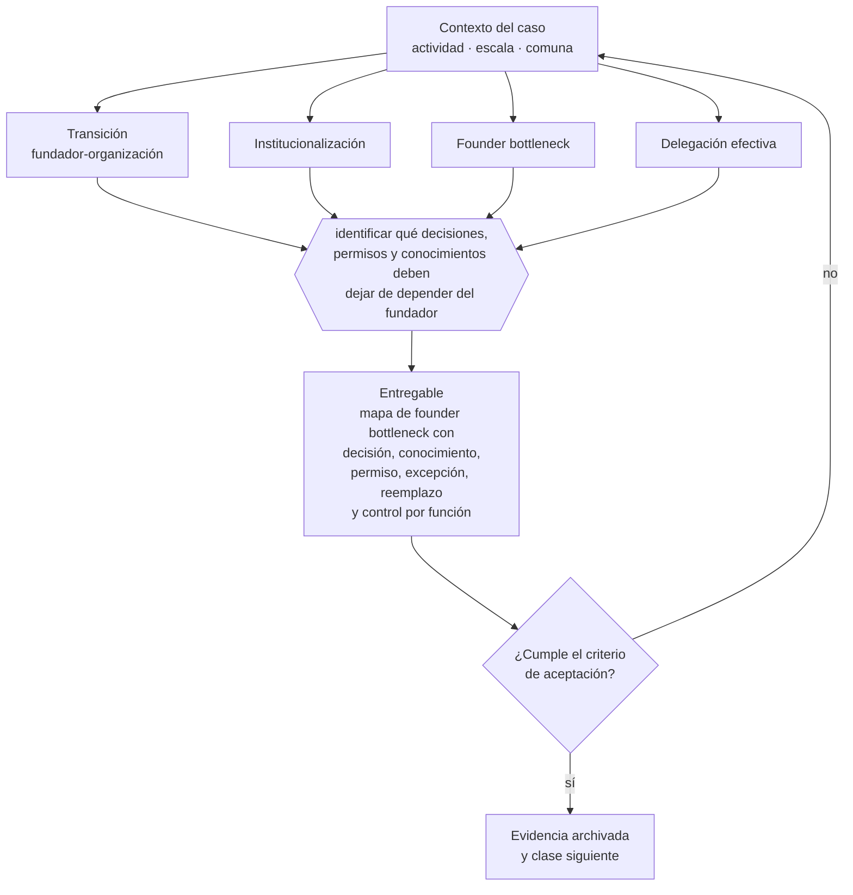

# Clase 267 — De fundador a organización

> **Parte 20 · Escalamiento, organización y gobierno avanzado** — clase 1 de 14

**Estado de evidencia:** `GUIA-PRACTICA` · **Jurisdicción:** Chile-first · **Fecha base normativa:** 07-08-2026 
**Decisión que habilita:** identificar qué decisiones, permisos y conocimientos deben dejar de depender del fundador 
**Entregable:** mapa de founder bottleneck con decisión, conocimiento, permiso, excepción, reemplazo y control por función

## 🎯 Propósito

Identificar qué decisiones deben dejar de pasar por el fundador y documentar el criterio, no solo la tarea.

## 📚 Resultados de aprendizaje

Al finalizar esta clase podrás:

1. **Definir** con precisión los cuatro conceptos de la tabla siguiente y usarlos para describir un caso real.
2. **Explicar** por qué esta materia condiciona decisiones de otras partes del programa.
3. **Decidir** —identificar qué decisiones, permisos y conocimientos deben dejar de depender del fundador— y justificar la decisión por escrito.
4. **Producir** el entregable de la clase y contrastarlo contra su criterio de aceptación.
5. **Distinguir** el dato estable del dato dinámico que exige revalidación en la fuente oficial.

## 🧩 Conceptos centrales

| Concepto | Comprensión verificable |
|---|---|
| **Transición fundador-organización** | Paso de decisiones personales a decisiones institucionales. |
| **Institucionalización** | Traslado del conocimiento a procesos y roles. |
| **Founder bottleneck** | Concentración de conocimiento, decisiones, permisos y excepciones en una o dos personas. |
| **Delegación efectiva** | Transferencia de decisión con criterio, límite, evidencia y responsable. |

## 🗺️ Flujo de razonamiento

```mermaid
flowchart TB
    C["Contexto del caso<br/>actividad · escala · comuna"]
    C --> A1["Transición<br/>fundador-organización"]
    C --> A2["Institucionalización"]
    C --> A3["Founder bottleneck"]
    C --> A4["Delegación efectiva"]
    A1 & A2 & A3 & A4 --> D{{"identificar qué decisiones,<br/>permisos y conocimientos deben<br/>dejar de depender del fundador"}}
    D --> E["Entregable<br/>mapa de founder bottleneck con<br/>decisión, conocimiento,<br/>permiso, excepción, reemplazo<br/>y control por función"]
    E --> V{"¿Cumple el criterio<br/>de aceptación?"}
    V -->|sí| S["Evidencia archivada<br/>y clase siguiente"]
    V -->|no| C
```

## 📖 Desarrollo

### 1. El fondo del asunto

Eliminar puestos mediante automatización puede aumentar simultáneamente velocidad y founder bottleneck: más conocimiento, permisos, excepciones, relaciones y responsabilidad terminan concentrados en una o dos personas. Salir de ahí exige documentar criterios de decisión, segregar accesos, formar reemplazos y crear controles que no dependan de que el fundador revise personalmente cada caso.

### 2. Cómo se traduce en la práctica

Delegar tareas sin delegar el criterio produce consultas permanentes que saturan igual. Y retomar la decisión delegada al primer error del responsable enseña a la organización que la delegación era aparente, con lo cual todo vuelve al punto de partida y nadie vuelve a intentarlo.

### 3. Marco aplicable y quién interviene

- presupuesto por centros de responsabilidad y control de gestión
- gobierno corporativo escalonado: consejo asesor, directorio y comités
- marcos de franquicia y licenciamiento de formato

**Autoridades o contrapartes involucradas:** CMF para sociedades anónimas, FNE en operaciones de concentración, SII en reorganizaciones.
**Profesionales de apoyo:** gerencia general, control de gestión, abogado corporativo, consultor organizacional. La participación concreta depende del riesgo, del
tamaño de la empresa y de la actividad económica.

## 🔬 Caso aplicado: MEDVi

[MEDVi: empresa AI-native, red externa y control al crecer](../../../case-studies/21-medvi-empresa-ai-native-y-control.md#7-founder-bottleneck-y-matrices-de-tension)

**Lente para esta clase:** medir cómo una plantilla mínima puede concentrar conocimiento, decisiones, permisos, responsabilidad y riesgo en una o dos personas.

El expediente separa hechos verificados, cifras reportadas, alegaciones periodísticas,
actuaciones regulatorias, respuesta de la empresa e interpretación pedagógica. No uses una
categoría como prueba automática de otra.

## 🧪 Taller guiado

Aplica esta clase a **una** de las siguientes líneas de negocio y repite después el ejercicio con
una segunda línea de carga regulatoria distinta:

| Línea | Carga regulatoria |
|---|---|
| SaaS B2B con IA | media |
| Servicios profesionales | baja |
| E-commerce D2C | media |
| Alimentos o foodtech | alta |
| Exportación de servicios | media |
| Fintech regulada | alta |
| Construcción o servicios técnicos | alta |

**Secuencia de trabajo:**

1. Delimita el contexto: actividad económica, escala, comuna y etapa de la empresa.
2. Reúne los antecedentes que la decisión exige y anota la fecha de cada fuente.
3. Identifica las alternativas reales, incluida la de no hacer nada.
4. Evalúa el impacto en mercado, caja, personas, regulación y operación.
5. Toma la decisión y regístrala con sus supuestos.
6. Produce el entregable.
7. Contrástalo contra el criterio de aceptación.
8. Anota lo que requiere validación profesional y programa su revisión.

### 📦 Entregable

Mapa de founder bottleneck con decisión, conocimiento, permiso, excepción, reemplazo y control por función.

Debe incluir decisión, supuestos, fuentes con fecha de consulta, responsable, riesgos
identificados y próximos pasos.

## 🏆 Reto verificable

Resuelve la misma materia para una segunda línea de negocio con distinta carga regulatoria y
explica por escrito **qué cambió, por qué y qué fuente lo determina**.

## ✅ Criterio de aceptación

- [ ] cada decisión y permiso crítico tiene criterio, límite, evidencia y segundo responsable
- [ ] el mapa somete a prueba la ausencia simultánea del fundador y del proveedor principal
- [ ] cada afirmación regulatoria está referida a una fuente oficial con fecha de consulta;
- [ ] los datos dinámicos quedan marcados para revalidación;
- [ ] hay un responsable asignado y evidencia reproducible del trabajo.

## ⚠️ Errores frecuentes

**Propios de esta clase:**

- Confundir una plantilla interna mínima con una organización resiliente.
- Automatizar tareas sin distribuir conocimiento, permisos, supervisión y autoridad de escalamiento.

**Característicos de la parte 20:**

- Abrir una segunda sucursal antes de que la primera tenga proceso estable.
- Crecer en headcount por encima de la capacidad de caja.

## 🇨🇱 Checklist Chile

- [ ] ¿existe norma o autoridad específica para esta materia?
- [ ] ¿la fuente consultada está vigente a la fecha de ejecución?
- [ ] ¿se activa algún trámite ante el SII?
- [ ] ¿se activa algún requisito municipal o sectorial?
- [ ] ¿afecta a consumidores o al tratamiento de datos personales?
- [ ] ¿afecta a trabajadores o a la seguridad y salud en el trabajo?
- [ ] ¿afecta a impuestos, contabilidad o caja?
- [ ] ¿afecta a contratos o a propiedad intelectual?
- [ ] ¿requiere renovación, reporte periódico o revalidación?

## ❓ Preguntas de comprobación

1. ¿Qué decisiones se detienen hoy esperando tu respuesta?
2. ¿Delegaste el criterio o solo la ejecución?
3. ¿Qué decisión delegada retomaste después de un error y por qué?

## 🔗 Fuentes oficiales

**Corporación de Fomento de la Producción — Innovación, inversión y garantías**  
<https://www.corfo.cl/> · verificado 2026-09-01

- *Qué contiene:* Reúne los instrumentos de fomento a la innovación y la inversión, incluidos programas de capital semilla, escalamiento, garantías y cobertura de riesgo para el sistema financiero.
- *Cómo leerla:* Filtra por etapa de la empresa antes que por monto. Y verifica el componente de innovación que exige cada instrumento: presentar una expansión comercial como innovación es la causa más común de rechazo.
- *Uso en esta clase:* aporta el marco de «Innovación, inversión y garantías» para identificar qué decisiones, permisos y conocimientos deben dejar de depender del fundador.

**Biblioteca del Congreso Nacional · LeyChile — Normativa oficial consolidada**  
<https://www.bcn.cl/leychile/> · verificado 2026-09-01

- *Qué contiene:* Publica el texto oficial y consolidado de leyes, decretos y reglamentos, con la versión vigente a una fecha, el historial de modificaciones y la tramitación que las originó.
- *Cómo leerla:* Usa siempre el selector de versión vigente a la fecha en que ejecutarás el trámite, no la última publicada. Y lee el artículo transitorio: en normas en implantación gradual —jornada, datos personales— ahí está la fecha que realmente te aplica.
- *Uso en esta clase:* aporta el marco de «Normativa oficial consolidada» para identificar qué decisiones, permisos y conocimientos deben dejar de depender del fundador.

**The New York Times · republicado por GV Wire — A $1.8 Billion Company With Two Employees? AI Made It Possible**  
<https://gvwire.com/2026/04/05/a-1-8-billion-company-with-two-employees-ai-made-it-possible/> · verificado 2026-10-04

- *Qué contiene:* Perfil empresarial que declara acceso del New York Times a estados financieros y contrapartes, y documenta capital inicial, tiempo de construcción, ventas, margen, herramientas de IA, contratistas y proveedores externos.
- *Cómo leerla:* Distingue cifras verificadas por el medio, afirmaciones del fundador y proyecciones. La meta de US$1.800 millones es una proyección de ventas, no valoración; dos empleados no significa dos ejecutores de toda la cadena.
- *Uso en esta clase:* aporta el marco de «A $1.8 Billion Company With Two Employees? AI Made It Possible» para identificar qué decisiones, permisos y conocimientos deben dejar de depender del fundador.

**U.S. Food and Drug Administration — MEDVi, LLC dba MEDVi: Warning Letter MARCS-CMS 721455**  
<https://www.fda.gov/inspections-compliance-enforcement-and-criminal-investigations/warning-letters/medvi-llc-dba-medvi-721455-02202026> · verificado 2026-10-04

- *Qué contiene:* Carta de advertencia fechada el 20 de febrero de 2026, dirigida a MEDVi, LLC dba MEDVi, sobre claims y rotulado observados por FDA en medvi.io durante diciembre de 2025.
- *Cómo leerla:* Distingue lo que FDA observó y calificó como misbranding de cualquier conclusión penal o de falsificación. Registra destinatario, dominio, claims, normas citadas, plazo de respuesta y medidas advertidas sin ampliar su alcance.
- *Uso en esta clase:* aporta el marco de «MEDVi, LLC dba MEDVi: Warning Letter MARCS-CMS 721455» para identificar qué decisiones, permisos y conocimientos deben dejar de depender del fundador.

Complementos del repositorio: [glosario](../../../docs/19_GLOSSARY.md) ·
[ruta de lecturas](../../../docs/15_BOOKS_AND_LEARNING_PATH.md) ·
[catálogo de fuentes](../../../docs/16_OFFICIAL_SOURCE_CATALOG.md).

> [!IMPORTANT]
> Material educativo. Para una decisión real de alto impacto hay que verificar la fuente oficial
> vigente y validar con el profesional competente.

---

| Anterior | Índice | Siguiente |
|---|---|---|
| **Inicio de la parte** | [Parte 20](../README.md) · [Programa](../../../README.md) | [268 · Diseño organizacional por etapas →](../class-02-diseno-organizacional-por-etapas/README.md) |
