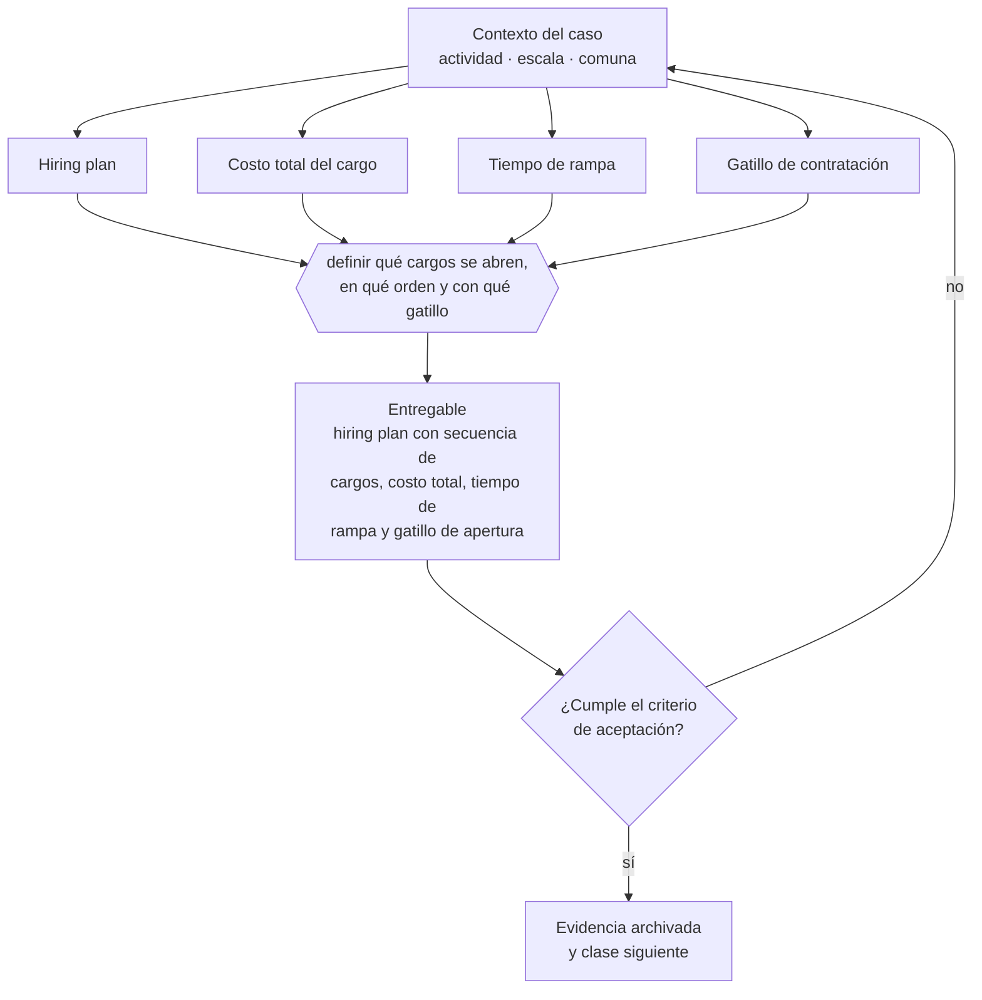

# Clase 271 — Hiring plan y workforce planning

> **Parte 20 · Escalamiento, organización y gobierno avanzado** — clase 5 de 14

**Estado de evidencia:** `GUIA-PRACTICA` · **Jurisdicción:** Chile-first · **Fecha base normativa:** 07-08-2026 
**Decisión que habilita:** definir qué cargos se abren, en qué orden y con qué gatillo 
**Entregable:** hiring plan con secuencia de cargos, costo total, tiempo de rampa y gatillo de apertura

## 🎯 Propósito

Definir gatillos objetivos de contratación y calcular el costo total del cargo, no la remuneración líquida.

## 📚 Resultados de aprendizaje

Al finalizar esta clase podrás:

1. **Definir** con precisión los cuatro conceptos de la tabla siguiente y usarlos para describir un caso real.
2. **Explicar** por qué esta materia condiciona decisiones de otras partes del programa.
3. **Decidir** —definir qué cargos se abren, en qué orden y con qué gatillo— y justificar la decisión por escrito.
4. **Producir** el entregable de la clase y contrastarlo contra su criterio de aceptación.
5. **Distinguir** el dato estable del dato dinámico que exige revalidación en la fuente oficial.

## 🧩 Conceptos centrales

| Concepto | Comprensión verificable |
|---|---|
| **Hiring plan** | Plan de contrataciones asociado al crecimiento. |
| **Costo total del cargo** | Remuneración, cotizaciones, equipamiento y tiempo de rampa. |
| **Tiempo de rampa** | Período hasta que la persona es productiva. |
| **Gatillo de contratación** | Condición que habilita abrir el cargo. |

## 🗺️ Flujo de razonamiento

## 📖 Desarrollo

### 1. El fondo del asunto

Cada contratación debe tener un gatillo objetivo: un nivel de venta, de volumen o de carga que la justifique. Contratar por anticipación al crecimiento esperado es la forma más rápida de comprometer caja contra ingresos que aún no existen.

### 2. Cómo se traduce en la práctica

Contratar en anticipación a un crecimiento esperado es la forma más rápida de comprometer caja contra ingresos que aún no existen. El costo total incluye cotizaciones, equipamiento, espacio y el tiempo de rampa hasta que la persona es productiva, que en cargos complejos son meses.

### 3. Marco aplicable y quién interviene

- presupuesto por centros de responsabilidad y control de gestión
- gobierno corporativo escalonado: consejo asesor, directorio y comités
- marcos de franquicia y licenciamiento de formato

**Autoridades o contrapartes involucradas:** CMF para sociedades anónimas, FNE en operaciones de concentración, SII en reorganizaciones.
**Profesionales de apoyo:** gerencia general, control de gestión, abogado corporativo, consultor organizacional. La participación concreta depende del riesgo, del
tamaño de la empresa y de la actividad económica.

## 🧪 Taller guiado

Aplica esta clase a **una** de las siguientes líneas de negocio y repite después el ejercicio con
una segunda línea de carga regulatoria distinta:

| Línea | Carga regulatoria |
|---|---|
| SaaS B2B con IA | media |
| Servicios profesionales | baja |
| E-commerce D2C | media |
| Alimentos o foodtech | alta |
| Exportación de servicios | media |
| Fintech regulada | alta |
| Construcción o servicios técnicos | alta |

**Secuencia de trabajo:**

1. Delimita el contexto: actividad económica, escala, comuna y etapa de la empresa.
2. Reúne los antecedentes que la decisión exige y anota la fecha de cada fuente.
3. Identifica las alternativas reales, incluida la de no hacer nada.
4. Evalúa el impacto en mercado, caja, personas, regulación y operación.
5. Toma la decisión y regístrala con sus supuestos.
6. Produce el entregable.
7. Contrástalo contra el criterio de aceptación.
8. Anota lo que requiere validación profesional y programa su revisión.

### 📦 Entregable

Hiring plan con secuencia de cargos, costo total, tiempo de rampa y gatillo de apertura.

Debe incluir decisión, supuestos, fuentes con fecha de consulta, responsable, riesgos
identificados y próximos pasos.

## 🏆 Reto verificable

Resuelve la misma materia para una segunda línea de negocio con distinta carga regulatoria y
explica por escrito **qué cambió, por qué y qué fuente lo determina**.

## ✅ Criterio de aceptación

- [ ] cada cargo tiene gatillo objetivo de apertura
- [ ] el costo total del cargo está calculado, no solo el sueldo
- [ ] cada afirmación regulatoria está referida a una fuente oficial con fecha de consulta;
- [ ] los datos dinámicos quedan marcados para revalidación;
- [ ] hay un responsable asignado y evidencia reproducible del trabajo.

## ⚠️ Errores frecuentes

**Propios de esta clase:**

- Contratar en anticipación a un crecimiento que aún no ocurre.
- Estimar el costo del cargo solo por la remuneración líquida.

**Característicos de la parte 20:**

- Abrir una segunda sucursal antes de que la primera tenga proceso estable.
- Crecer en headcount por encima de la capacidad de caja.

## 🇨🇱 Checklist Chile

- [ ] ¿existe norma o autoridad específica para esta materia?
- [ ] ¿la fuente consultada está vigente a la fecha de ejecución?
- [ ] ¿se activa algún trámite ante el SII?
- [ ] ¿se activa algún requisito municipal o sectorial?
- [ ] ¿afecta a consumidores o al tratamiento de datos personales?
- [ ] ¿afecta a trabajadores o a la seguridad y salud en el trabajo?
- [ ] ¿afecta a impuestos, contabilidad o caja?
- [ ] ¿afecta a contratos o a propiedad intelectual?
- [ ] ¿requiere renovación, reporte periódico o revalidación?

## ❓ Preguntas de comprobación

1. ¿Qué condición objetiva gatilla la apertura de cada cargo de tu plan?
2. ¿Cuál es el costo total del cargo, incluido el tiempo de rampa?
3. ¿Qué contrataciones hiciste anticipando ventas que no llegaron?

## 🔗 Fuentes oficiales

**Dirección del Trabajo — Relaciones laborales y obligaciones del empleador**  
<https://www.dt.gob.cl/> · verificado 2026-08-07

- *Qué contiene:* Concentra el Código del Trabajo aplicado: dictámenes que interpretan la norma en casos concretos, la plataforma Mi DT para registrar contratos y finiquitos, y las guías de fiscalización.
- *Cómo leerla:* Los dictámenes valen más que las guías divulgativas: describen cómo la autoridad resolvió un caso real. Busca por materia y contrasta la fecha, porque un dictamen posterior puede cambiar el criterio anterior.

Complementos del repositorio: [glosario](../../../docs/19_GLOSSARY.md) ·
[ruta de lecturas](../../../docs/15_BOOKS_AND_LEARNING_PATH.md) ·
[catálogo de fuentes](../../../docs/16_OFFICIAL_SOURCE_CATALOG.md).

> [!IMPORTANT]
> Material educativo. Para una decisión real de alto impacto hay que verificar la fuente oficial
> vigente y validar con el profesional competente.

---

| Anterior | Índice | Siguiente |
|---|---|---|
| [← 270 · Presupuesto por centros de responsabilidad](../class-04-presupuesto-por-centros-de-responsabilidad/README.md) | [Parte 20](../README.md) · [Programa](../../../README.md) | [272 · Procesos que deben estandarizarse antes de crecer →](../class-06-procesos-que-deben-estandarizarse-antes-de-crecer/README.md) |
