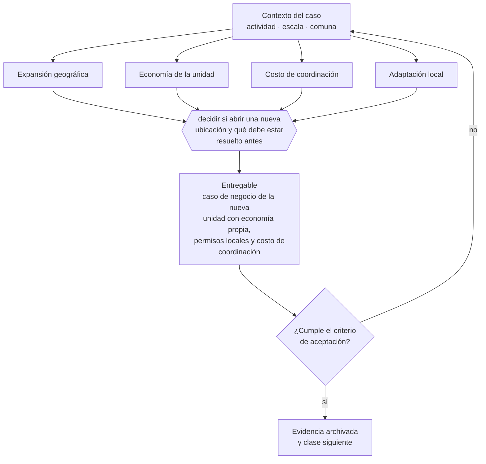

# Clase 273 — Multi-sucursal y expansión geográfica

> **Parte 20 · Escalamiento, organización y gobierno avanzado** — clase 7 de 14

**Estado de evidencia:** `GUIA-PRACTICA` · **Jurisdicción:** Chile-first · **Fecha base normativa:** 07-08-2026 
**Decisión que habilita:** decidir si abrir una nueva ubicación y qué debe estar resuelto antes 
**Entregable:** caso de negocio de la nueva unidad con economía propia, permisos locales y costo de coordinación

## 🎯 Propósito

Evaluar la nueva ubicación con economía propia y verificar que los permisos no se heredan de la primera.

## 📚 Resultados de aprendizaje

Al finalizar esta clase podrás:

1. **Definir** con precisión los cuatro conceptos de la tabla siguiente y usarlos para describir un caso real.
2. **Explicar** por qué esta materia condiciona decisiones de otras partes del programa.
3. **Decidir** —decidir si abrir una nueva ubicación y qué debe estar resuelto antes— y justificar la decisión por escrito.
4. **Producir** el entregable de la clase y contrastarlo contra su criterio de aceptación.
5. **Distinguir** el dato estable del dato dinámico que exige revalidación en la fuente oficial.

## 🧩 Conceptos centrales

| Concepto | Comprensión verificable |
|---|---|
| **Expansión geográfica** | Apertura de operación en una nueva zona. |
| **Economía de la unidad** | Resultado de una sucursal individual. |
| **Costo de coordinación** | Carga de gestionar múltiples ubicaciones. |
| **Adaptación local** | Ajuste a condiciones regulatorias y de mercado de la nueva comuna o región. |

## 🗺️ Flujo de razonamiento

## 📖 Desarrollo

### 1. El fondo del asunto

La segunda sucursal es la más difícil porque revela todo lo que dependía de la presencia del fundador. Además, cada comuna tiene su propia patente, uso de suelo y a veces exigencias sanitarias distintas: la habilitación no se hereda de la primera ubicación.

### 2. Cómo se traduce en la práctica

Cada comuna tiene su patente, su uso de suelo y a veces exigencias sanitarias distintas: la habilitación se rehace completa. Y la segunda sucursal revela todo lo que dependía de la presencia del fundador en la primera, que es la razón por la que suele ser la más difícil de todas.

### 3. Marco aplicable y quién interviene

- presupuesto por centros de responsabilidad y control de gestión
- gobierno corporativo escalonado: consejo asesor, directorio y comités
- marcos de franquicia y licenciamiento de formato

**Autoridades o contrapartes involucradas:** CMF para sociedades anónimas, FNE en operaciones de concentración, SII en reorganizaciones.
**Profesionales de apoyo:** gerencia general, control de gestión, abogado corporativo, consultor organizacional. La participación concreta depende del riesgo, del
tamaño de la empresa y de la actividad económica.

## 🧪 Taller guiado

Aplica esta clase a **una** de las siguientes líneas de negocio y repite después el ejercicio con
una segunda línea de carga regulatoria distinta:

| Línea | Carga regulatoria |
|---|---|
| SaaS B2B con IA | media |
| Servicios profesionales | baja |
| E-commerce D2C | media |
| Alimentos o foodtech | alta |
| Exportación de servicios | media |
| Fintech regulada | alta |
| Construcción o servicios técnicos | alta |

**Secuencia de trabajo:**

1. Delimita el contexto: actividad económica, escala, comuna y etapa de la empresa.
2. Reúne los antecedentes que la decisión exige y anota la fecha de cada fuente.
3. Identifica las alternativas reales, incluida la de no hacer nada.
4. Evalúa el impacto en mercado, caja, personas, regulación y operación.
5. Toma la decisión y regístrala con sus supuestos.
6. Produce el entregable.
7. Contrástalo contra el criterio de aceptación.
8. Anota lo que requiere validación profesional y programa su revisión.

### 📦 Entregable

Caso de negocio de la nueva unidad con economía propia, permisos locales y costo de coordinación.

Debe incluir decisión, supuestos, fuentes con fecha de consulta, responsable, riesgos
identificados y próximos pasos.

## 🏆 Reto verificable

Resuelve la misma materia para una segunda línea de negocio con distinta carga regulatoria y
explica por escrito **qué cambió, por qué y qué fuente lo determina**.

## ✅ Criterio de aceptación

- [ ] la economía de la unidad está proyectada de forma independiente
- [ ] los permisos locales de la nueva comuna están identificados
- [ ] cada afirmación regulatoria está referida a una fuente oficial con fecha de consulta;
- [ ] los datos dinámicos quedan marcados para revalidación;
- [ ] hay un responsable asignado y evidencia reproducible del trabajo.

## ⚠️ Errores frecuentes

**Propios de esta clase:**

- Asumir que los permisos de la primera ubicación sirven en la nueva comuna.
- Replicar antes de que la primera unidad tenga resultado estable.

**Característicos de la parte 20:**

- Abrir una segunda sucursal antes de que la primera tenga proceso estable.
- Crecer en headcount por encima de la capacidad de caja.

## 🇨🇱 Checklist Chile

- [ ] ¿existe norma o autoridad específica para esta materia?
- [ ] ¿la fuente consultada está vigente a la fecha de ejecución?
- [ ] ¿se activa algún trámite ante el SII?
- [ ] ¿se activa algún requisito municipal o sectorial?
- [ ] ¿afecta a consumidores o al tratamiento de datos personales?
- [ ] ¿afecta a trabajadores o a la seguridad y salud en el trabajo?
- [ ] ¿afecta a impuestos, contabilidad o caja?
- [ ] ¿afecta a contratos o a propiedad intelectual?
- [ ] ¿requiere renovación, reporte periódico o revalidación?

## ❓ Preguntas de comprobación

1. ¿La economía de la nueva unidad se sostiene por sí sola en tu proyección?
2. ¿Verificaste los permisos de la nueva comuna o asumiste que aplican los mismos?
3. ¿Tiene la primera unidad resultados estables y proceso documentado?

## 🔗 Fuentes oficiales

**Biblioteca del Congreso Nacional · LeyChile — Normativa oficial consolidada**  
<https://www.bcn.cl/leychile/> · verificado 2026-08-07

- *Qué contiene:* Publica el texto oficial y consolidado de leyes, decretos y reglamentos, con la versión vigente a una fecha, el historial de modificaciones y la tramitación que las originó.
- *Cómo leerla:* Usa siempre el selector de versión vigente a la fecha en que ejecutarás el trámite, no la última publicada. Y lee el artículo transitorio: en normas en implantación gradual —jornada, datos personales— ahí está la fecha que realmente te aplica.

Complementos del repositorio: [glosario](../../../docs/19_GLOSSARY.md) ·
[ruta de lecturas](../../../docs/15_BOOKS_AND_LEARNING_PATH.md) ·
[catálogo de fuentes](../../../docs/16_OFFICIAL_SOURCE_CATALOG.md).

> [!IMPORTANT]
> Material educativo. Para una decisión real de alto impacto hay que verificar la fuente oficial
> vigente y validar con el profesional competente.

---

| Anterior | Índice | Siguiente |
|---|---|---|
| [← 272 · Procesos que deben estandarizarse antes de crecer](../class-06-procesos-que-deben-estandarizarse-antes-de-crecer/README.md) | [Parte 20](../README.md) · [Programa](../../../README.md) | [274 · Franquiciar un negocio →](../class-08-franquiciar-un-negocio/README.md) |
