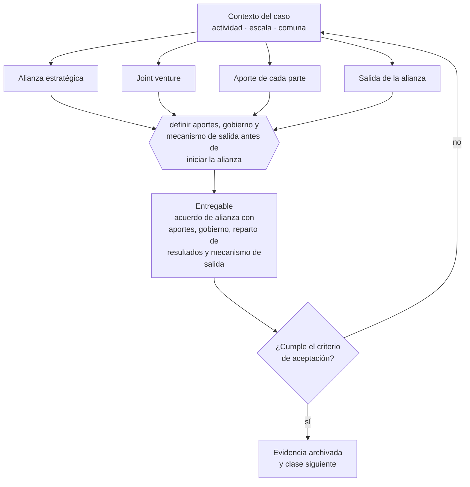

# Clase 275 — Alianzas estratégicas y joint ventures

> **Parte 20 · Escalamiento, organización y gobierno avanzado** — clase 9 de 14

**Estado de evidencia:** `GUIA-PRACTICA` · **Jurisdicción:** Chile-first · **Fecha base normativa:** 07-08-2026 
**Decisión que habilita:** definir aportes, gobierno y mecanismo de salida antes de iniciar la alianza 
**Entregable:** acuerdo de alianza con aportes, gobierno, reparto de resultados y mecanismo de salida

## 🎯 Propósito

Definir aportes, gobierno y mecanismo de salida antes de iniciar la alianza, porque definir la salida es lo que permite que funcione.

## 📚 Resultados de aprendizaje

Al finalizar esta clase podrás:

1. **Definir** con precisión los cuatro conceptos de la tabla siguiente y usarlos para describir un caso real.
2. **Explicar** por qué esta materia condiciona decisiones de otras partes del programa.
3. **Decidir** —definir aportes, gobierno y mecanismo de salida antes de iniciar la alianza— y justificar la decisión por escrito.
4. **Producir** el entregable de la clase y contrastarlo contra su criterio de aceptación.
5. **Distinguir** el dato estable del dato dinámico que exige revalidación en la fuente oficial.

## 🧩 Conceptos centrales

| Concepto | Comprensión verificable |
|---|---|
| **Alianza estratégica** | Acuerdo de colaboración sin fusionar patrimonios. |
| **Joint venture** | Vehículo conjunto con aporte y gobierno definidos. |
| **Aporte de cada parte** | Lo que cada uno pone y lo que espera obtener. |
| **Salida de la alianza** | Mecanismo de término y reparto. |

## 🗺️ Flujo de razonamiento

## 📖 Desarrollo

### 1. El fondo del asunto

Las alianzas fracasan por falta de definición: qué aporta cada uno, cómo se decide, cómo se reparte y cómo se sale. Definir la salida al inicio es lo que permite que la alianza funcione, porque quita el temor de quedar atrapado en un acuerdo que dejó de servir.

### 2. Cómo se traduce en la práctica

Las alianzas fracasan por falta de definición: qué aporta cada uno, cómo se decide, cómo se reparte y cómo se sale. Acordar la salida al inicio quita el temor de quedar atrapado y hace posible comprometerse; postergarla convierte cualquier desacuerdo en un bloqueo sin válvula.

### 3. Marco aplicable y quién interviene

- presupuesto por centros de responsabilidad y control de gestión
- gobierno corporativo escalonado: consejo asesor, directorio y comités
- marcos de franquicia y licenciamiento de formato

**Autoridades o contrapartes involucradas:** CMF para sociedades anónimas, FNE en operaciones de concentración, SII en reorganizaciones.
**Profesionales de apoyo:** gerencia general, control de gestión, abogado corporativo, consultor organizacional. La participación concreta depende del riesgo, del
tamaño de la empresa y de la actividad económica.

## 🧪 Taller guiado

Aplica esta clase a **una** de las siguientes líneas de negocio y repite después el ejercicio con
una segunda línea de carga regulatoria distinta:

| Línea | Carga regulatoria |
|---|---|
| SaaS B2B con IA | media |
| Servicios profesionales | baja |
| E-commerce D2C | media |
| Alimentos o foodtech | alta |
| Exportación de servicios | media |
| Fintech regulada | alta |
| Construcción o servicios técnicos | alta |

**Secuencia de trabajo:**

1. Delimita el contexto: actividad económica, escala, comuna y etapa de la empresa.
2. Reúne los antecedentes que la decisión exige y anota la fecha de cada fuente.
3. Identifica las alternativas reales, incluida la de no hacer nada.
4. Evalúa el impacto en mercado, caja, personas, regulación y operación.
5. Toma la decisión y regístrala con sus supuestos.
6. Produce el entregable.
7. Contrástalo contra el criterio de aceptación.
8. Anota lo que requiere validación profesional y programa su revisión.

### 📦 Entregable

Acuerdo de alianza con aportes, gobierno, reparto de resultados y mecanismo de salida.

Debe incluir decisión, supuestos, fuentes con fecha de consulta, responsable, riesgos
identificados y próximos pasos.

## 🏆 Reto verificable

Resuelve la misma materia para una segunda línea de negocio con distinta carga regulatoria y
explica por escrito **qué cambió, por qué y qué fuente lo determina**.

## ✅ Criterio de aceptación

- [ ] el acuerdo define gobierno y mecanismo de salida
- [ ] la propiedad de lo desarrollado conjuntamente está asignada
- [ ] cada afirmación regulatoria está referida a una fuente oficial con fecha de consulta;
- [ ] los datos dinámicos quedan marcados para revalidación;
- [ ] hay un responsable asignado y evidencia reproducible del trabajo.

## ⚠️ Errores frecuentes

**Propios de esta clase:**

- Iniciar la colaboración con un acuerdo de intenciones sin reglas de decisión.
- No definir la propiedad de lo desarrollado conjuntamente.

**Característicos de la parte 20:**

- Abrir una segunda sucursal antes de que la primera tenga proceso estable.
- Crecer en headcount por encima de la capacidad de caja.

## 🇨🇱 Checklist Chile

- [ ] ¿existe norma o autoridad específica para esta materia?
- [ ] ¿la fuente consultada está vigente a la fecha de ejecución?
- [ ] ¿se activa algún trámite ante el SII?
- [ ] ¿se activa algún requisito municipal o sectorial?
- [ ] ¿afecta a consumidores o al tratamiento de datos personales?
- [ ] ¿afecta a trabajadores o a la seguridad y salud en el trabajo?
- [ ] ¿afecta a impuestos, contabilidad o caja?
- [ ] ¿afecta a contratos o a propiedad intelectual?
- [ ] ¿requiere renovación, reporte periódico o revalidación?

## ❓ Preguntas de comprobación

1. ¿Qué aporta exactamente cada parte y qué espera obtener?
2. ¿Cómo se toman las decisiones y qué pasa ante un desacuerdo?
3. ¿A quién pertenece lo desarrollado conjuntamente si la alianza termina?

## 🔗 Fuentes oficiales

**Biblioteca del Congreso Nacional · LeyChile — Normativa oficial consolidada**  
<https://www.bcn.cl/leychile/> · verificado 2026-08-19

- *Qué contiene:* Publica el texto oficial y consolidado de leyes, decretos y reglamentos, con la versión vigente a una fecha, el historial de modificaciones y la tramitación que las originó.
- *Cómo leerla:* Usa siempre el selector de versión vigente a la fecha en que ejecutarás el trámite, no la última publicada. Y lee el artículo transitorio: en normas en implantación gradual —jornada, datos personales— ahí está la fecha que realmente te aplica.
- *Uso en esta clase:* aporta el marco de «Normativa oficial consolidada» para definir aportes, gobierno y mecanismo de salida antes de iniciar la alianza.

Complementos del repositorio: [glosario](../../../docs/19_GLOSSARY.md) ·
[ruta de lecturas](../../../docs/15_BOOKS_AND_LEARNING_PATH.md) ·
[catálogo de fuentes](../../../docs/16_OFFICIAL_SOURCE_CATALOG.md).

> [!IMPORTANT]
> Material educativo. Para una decisión real de alto impacto hay que verificar la fuente oficial
> vigente y validar con el profesional competente.

---

| Anterior | Índice | Siguiente |
|---|---|---|
| [← 274 · Franquiciar un negocio](../class-08-franquiciar-un-negocio/README.md) | [Parte 20](../README.md) · [Programa](../../../README.md) | [276 · Adquisición de competidores o capacidades →](../class-10-adquisicion-de-competidores-o-capacidades/README.md) |
