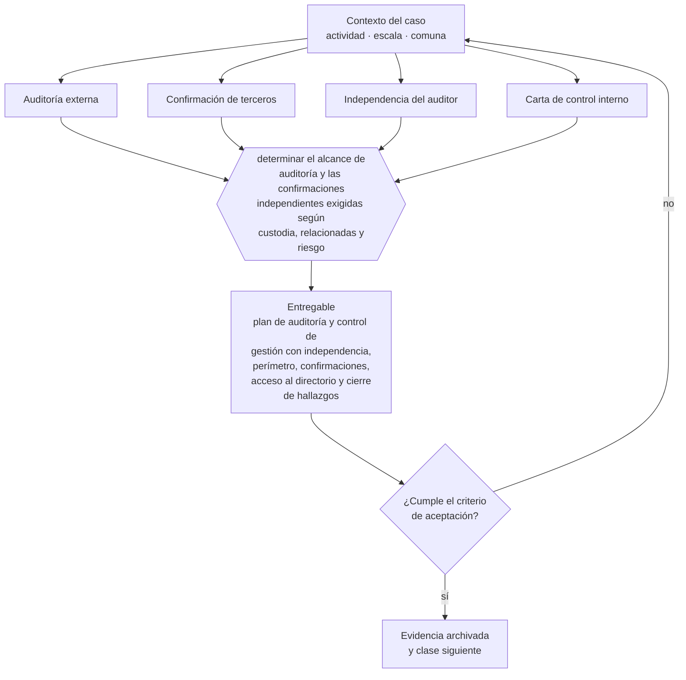

# Clase 278 — Auditoría externa y control de gestión

> **Parte 20 · Escalamiento, organización y gobierno avanzado** — clase 12 de 14

**Estado de evidencia:** `GUIA-PRACTICA` · **Jurisdicción:** Chile-first · **Fecha base normativa:** 07-08-2026 
**Decisión que habilita:** determinar el alcance de auditoría y las confirmaciones independientes exigidas según custodia, relacionadas y riesgo 
**Entregable:** plan de auditoría y control de gestión con independencia, perímetro, confirmaciones, acceso al directorio y cierre de hallazgos

## 🎯 Propósito

Diseñar auditoría y control de gestión que confirmen activos, custodios, relacionadas y operaciones con independencia real.

## 📚 Resultados de aprendizaje

Al finalizar esta clase podrás:

1. **Definir** con precisión los cuatro conceptos de la tabla siguiente y usarlos para describir un caso real.
2. **Explicar** por qué esta materia condiciona decisiones de otras partes del programa.
3. **Decidir** —determinar el alcance de auditoría y las confirmaciones independientes exigidas según custodia, relacionadas y riesgo— y justificar la decisión por escrito.
4. **Producir** el entregable de la clase y contrastarlo contra su criterio de aceptación.
5. **Distinguir** el dato estable del dato dinámico que exige revalidación en la fuente oficial.

## 🧩 Conceptos centrales

| Concepto | Comprensión verificable |
|---|---|
| **Auditoría externa** | Revisión independiente con alcance y evidencia definidos. |
| **Confirmación de terceros** | Respuesta recibida directamente de banco, custodio, cliente o contraparte. |
| **Independencia del auditor** | Ausencia de relaciones que comprometan juicio, alcance o reporte. |
| **Carta de control interno** | Observaciones del auditor sobre debilidades y respuesta de la administración. |

## 🗺️ Flujo de razonamiento

```mermaid
flowchart TB
    C["Contexto del caso<br/>actividad · escala · comuna"]
    C --> A1["Auditoría externa"]
    C --> A2["Confirmación de terceros"]
    C --> A3["Independencia del auditor"]
    C --> A4["Carta de control interno"]
    A1 & A2 & A3 & A4 --> D{{"determinar el alcance de<br/>auditoría y las confirmaciones<br/>independientes exigidas según<br/>custodia, relacionadas y<br/>riesgo"}}
    D --> E["Entregable<br/>plan de auditoría y control de<br/>gestión con independencia,<br/>perímetro, confirmaciones,<br/>acceso al directorio y cierre<br/>de hallazgos"]
    E --> V{"¿Cumple el criterio<br/>de aceptación?"}
    V -->|sí| S["Evidencia archivada<br/>y clase siguiente"]
    V -->|no| C
```

## 📖 Desarrollo

### 1. El fondo del asunto

Madoff demuestra que la mera existencia de un informe no reemplaza la independencia, la competencia ni la confirmación de activos y operaciones. FTX agrega la necesidad de entender el perímetro del grupo y sus relacionadas. Directorio y administración deben definir alcance, acceso directo del auditor al órgano de gobierno, confirmaciones externas y seguimiento de hallazgos; una opinión anual no sustituye el control de gestión permanente.

### 2. Cómo se traduce en la práctica

Madoff obliga a mirar detrás del informe: quién audita, qué independencia y capacidad tiene, qué activos confirma directamente y qué restricciones encontró. FTX obliga a definir el perímetro completo de entidades y relacionadas. El auditor necesita canal directo con el directorio; la administración debe responder hallazgos, pero no controlar la evidencia ni filtrar la comunicación.

### 3. Marco aplicable y quién interviene

- presupuesto por centros de responsabilidad y control de gestión
- gobierno corporativo escalonado: consejo asesor, directorio y comités
- marcos de franquicia y licenciamiento de formato

**Autoridades o contrapartes involucradas:** CMF para sociedades anónimas, FNE en operaciones de concentración, SII en reorganizaciones.
**Profesionales de apoyo:** gerencia general, control de gestión, abogado corporativo, consultor organizacional. La participación concreta depende del riesgo, del
tamaño de la empresa y de la actividad económica.

## 🧪 Taller guiado

Aplica esta clase a **una** de las siguientes líneas de negocio y repite después el ejercicio con
una segunda línea de carga regulatoria distinta:

| Línea | Carga regulatoria |
|---|---|
| SaaS B2B con IA | media |
| Servicios profesionales | baja |
| E-commerce D2C | media |
| Alimentos o foodtech | alta |
| Exportación de servicios | media |
| Fintech regulada | alta |
| Construcción o servicios técnicos | alta |

**Secuencia de trabajo:**

1. Delimita el contexto: actividad económica, escala, comuna y etapa de la empresa.
2. Reúne los antecedentes que la decisión exige y anota la fecha de cada fuente.
3. Identifica las alternativas reales, incluida la de no hacer nada.
4. Evalúa el impacto en mercado, caja, personas, regulación y operación.
5. Toma la decisión y regístrala con sus supuestos.
6. Produce el entregable.
7. Contrástalo contra el criterio de aceptación.
8. Anota lo que requiere validación profesional y programa su revisión.

### 📦 Entregable

Plan de auditoría y control de gestión con independencia, perímetro, confirmaciones, acceso al directorio y cierre de hallazgos.

Debe incluir decisión, supuestos, fuentes con fecha de consulta, responsable, riesgos
identificados y próximos pasos.

## 🏆 Reto verificable

Resuelve la misma materia para una segunda línea de negocio con distinta carga regulatoria y
explica por escrito **qué cambió, por qué y qué fuente lo determina**.

## ✅ Criterio de aceptación

- [ ] el alcance identifica entidades, relacionadas, custodios, cuentas y confirmaciones externas
- [ ] cada hallazgo tiene dueño, plazo, evidencia de cierre y reporte directo al órgano de gobierno
- [ ] cada afirmación regulatoria está referida a una fuente oficial con fecha de consulta;
- [ ] los datos dinámicos quedan marcados para revalidación;
- [ ] hay un responsable asignado y evidencia reproducible del trabajo.

## ⚠️ Errores frecuentes

**Propios de esta clase:**

- Aceptar un sello de auditoría sin verificar independencia, alcance, custodios y partes relacionadas.
- Permitir que la administración filtre confirmaciones o comunicaciones entre auditor y directorio.

**Característicos de la parte 20:**

- Abrir una segunda sucursal antes de que la primera tenga proceso estable.
- Crecer en headcount por encima de la capacidad de caja.

## 🇨🇱 Checklist Chile

- [ ] ¿existe norma o autoridad específica para esta materia?
- [ ] ¿la fuente consultada está vigente a la fecha de ejecución?
- [ ] ¿se activa algún trámite ante el SII?
- [ ] ¿se activa algún requisito municipal o sectorial?
- [ ] ¿afecta a consumidores o al tratamiento de datos personales?
- [ ] ¿afecta a trabajadores o a la seguridad y salud en el trabajo?
- [ ] ¿afecta a impuestos, contabilidad o caja?
- [ ] ¿afecta a contratos o a propiedad intelectual?
- [ ] ¿requiere renovación, reporte periódico o revalidación?

## ❓ Preguntas de comprobación

1. ¿Qué activos y operaciones se confirman directamente con terceros?
2. ¿El alcance cubre todas las entidades y relacionadas relevantes?
3. ¿Puede el auditor informar al directorio sin permiso ni filtro de la administración?

## 🔗 Fuentes oficiales

**Comisión para el Mercado Financiero — Registro de Prestadores de Servicios Financieros · Ley 21.521**  
<https://www.cmfchile.cl/portal/principal/623/w4-article-60920.html> · verificado 2026-09-01

- *Qué contiene:* Establece qué servicios financieros tecnológicos requieren inscripción o autorización ante la CMF, con qué requisitos de capital, gobierno corporativo y gestión de riesgos.
- *Cómo leerla:* Califica primero tu servicio contra la lista de actividades reguladas; el nombre comercial no decide. Si califica, los requisitos de capital y gobierno son la variable que define si el modelo es viable, antes que el producto.
- *Uso en esta clase:* aporta el marco de «Registro de Prestadores de Servicios Financieros · Ley 21.521» para determinar el alcance de auditoría y las confirmaciones independientes exigidas según custodia, relacionadas y riesgo.

**U.S. Securities and Exchange Commission — Reformas posteriores a Madoff sobre custodia y verificación independiente**  
<https://www.sec.gov/spotlight/secpostmadoffreforms.htm> · verificado 2026-09-28

- *Qué contiene:* Explica controles adoptados después del caso Madoff, entre ellos custodia independiente, exámenes sorpresa, revisión por terceros y confirmación de que los activos informados existen.
- *Cómo leerla:* Toma los principios de independencia, confirmación y separación de custodia como aprendizaje de control. Sus exigencias concretas pertenecen al marco estadounidense y no deben presentarse como obligaciones chilenas sin una norma local aplicable.
- *Uso en esta clase:* aporta el marco de «Reformas posteriores a Madoff sobre custodia y verificación independiente» para determinar el alcance de auditoría y las confirmaciones independientes exigidas según custodia, relacionadas y riesgo.

**Departamento de Justicia de Estados Unidos — FTX y Alameda: condena y sentencia de Samuel Bankman-Fried**  
<https://www.justice.gov/archives/opa/pr/samuel-bankman-fried-sentenced-25-years-his-orchestration-multiple-fraudulent-schemes> · verificado 2026-09-28

- *Qué contiene:* Resume la condena dictada tras juicio y la sentencia de marzo de 2024, incluidos hechos acreditados sobre fondos de clientes, privilegios de Alameda, información financiera y ocultamiento a clientes, inversionistas y prestamistas.
- *Cómo leerla:* Úsala para estudiar segregación de fondos, partes relacionadas, autorización, tesorería y evidencia de gobierno. No copies tipos penales ni reglas estadounidenses a Chile: contrasta cada obligación local con contrato, actividad y norma chilena aplicable.
- *Uso en esta clase:* aporta el marco de «FTX y Alameda: condena y sentencia de Samuel Bankman-Fried» para determinar el alcance de auditoría y las confirmaciones independientes exigidas según custodia, relacionadas y riesgo.

Complementos del repositorio: [glosario](../../../docs/19_GLOSSARY.md) ·
[ruta de lecturas](../../../docs/15_BOOKS_AND_LEARNING_PATH.md) ·
[catálogo de fuentes](../../../docs/16_OFFICIAL_SOURCE_CATALOG.md).

> [!IMPORTANT]
> Material educativo. Para una decisión real de alto impacto hay que verificar la fuente oficial
> vigente y validar con el profesional competente.

---

| Anterior | Índice | Siguiente |
|---|---|---|
| [← 277 · Consejo asesor y directorio](../class-11-consejo-asesor-y-directorio/README.md) | [Parte 20](../README.md) · [Programa](../../../README.md) | [279 · Internacionalización organizacional →](../class-13-internacionalizacion-organizacional/README.md) |
