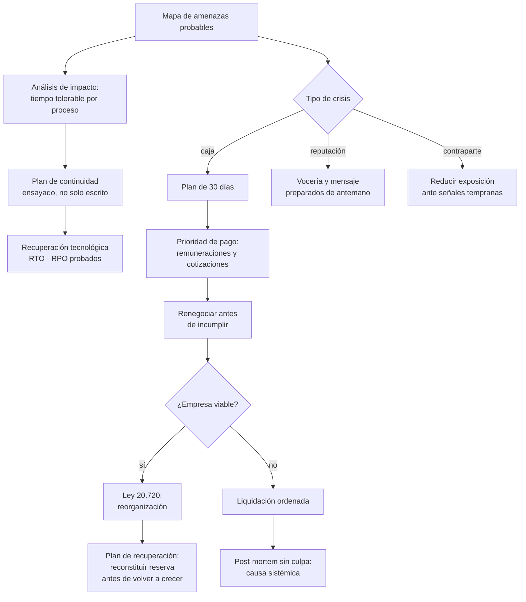

# Parte 21 — Crisis, continuidad, insolvencia y recuperación

> *Toda empresa enfrenta una crisis; la diferencia es si tenía un plan antes*

**Estado de evidencia:** `VERIFICADO-FUENTE` · **Clases:** 14 (281–294) · **Fecha base normativa:** 07-08-2026 
**Conceptos definidos en esta parte:** 56

## 🎯 De qué trata esta parte

Las crisis que quiebran empresas rara vez son catástrofes espectaculares. Son la pérdida del cliente que representaba el 40% de los ingresos, la salida de la persona que sabía cómo funcionaba todo, el proveedor único que dejó de entregar, el incidente informático de un martes cualquiera. Por eso el mapa de amenazas de esta parte prioriza lo probable y define, para cada proceso, cuánto tiempo puede estar detenido antes de producir daño irreversible.

Ante una fuga de caja el orden importa más que la velocidad: medir con exactitud la posición, congelar salidas no críticas, proteger remuneraciones y cotizaciones, acelerar cobranza y negociar plazos **antes** de incumplir. Negociar antes conserva credibilidad; negociar después la elimina. Y el recorte debe respetar una jerarquía: primero lo discrecional, luego renegociar lo estructural, y solo al final la capacidad que genera ingreso, porque cortarla primero produce una espiral de caída.

La Ley 20.720 aparece en esta parte no como final sino como herramienta. La reorganización permite a una empresa viable acordar con sus acreedores bajo protección financiera concursal, pero exige llegar a tiempo: una empresa que ya agotó caja y crédito rara vez tiene con qué sostener el procedimiento.

## 📚 Resultados de la parte

Al terminar esta parte podrás:

1. **Levantar escenarios de crisis con impacto, probabilidad y plan de respuesta**.
2. **Construir un plan de continuidad con RTO y RPO definidos**.
3. **Ejecutar un plan de 30 días ante fuga de caja**.
4. **Conocer las alternativas de la Ley 20.720 antes de estar en cesación de pagos**.

## 🗺️ Mapa de la parte

## ⚖️ Marco aplicable

- Ley 20.720 sobre reorganización y liquidación de empresas y personas
- Ley 19.983 sobre mérito ejecutivo de la factura para cobranza
- continuidad de negocio: BIA, RTO, RPO y plan de comunicación de crisis

**Autoridades o contrapartes:** Superintendencia de Insolvencia y Reemprendimiento, Tribunales civiles, Dirección del Trabajo.
**Profesionales de apoyo:** abogado de insolvencia, veedor o liquidador, CFO, comunicaciones.

## ⚠️ Riesgos característicos

- Esperar a la cesación de pagos para buscar asesoría y perder la opción de reorganización.
- Recortar costos destruyendo la capacidad que permite recuperarse.
- Comunicar tarde o de forma inconsistente a trabajadores, clientes y proveedores.
- Plan de continuidad escrito que nunca se ensayó.

## 📘 Las 14 clases

| # | Global | Clase | Decisión que habilita |
|---:|---:|---|---|
| 01 | 281 | [Mapa de amenazas y escenarios de crisis](class-01-mapa-de-amenazas-y-escenarios-de-crisis/README.md) | identificar las amenazas concretas del negocio y su tiempo tolerable de indisponibilidad |
| 02 | 282 | [Business Continuity Plan](class-02-business-continuity-plan/README.md) | definir qué procesos se restablecen primero y con qué recursos |
| 03 | 283 | [Disaster Recovery para tecnología](class-03-disaster-recovery-para-tecnologia/README.md) | definir el orden de recuperación tecnológica y probarlo |
| 04 | 284 | [Gestión de crisis reputacional](class-04-gestion-de-crisis-reputacional/README.md) | definir vocería, mensaje y canales antes de que ocurra la crisis |
| 05 | 285 | [Fuga de caja y plan de 30 días](class-05-fuga-de-caja-y-plan-de-30-dias/README.md) | ejecutar el plan de estabilización de caja con prioridades definidas |
| 06 | 286 | [Cliente o proveedor crítico en insolvencia](class-06-cliente-o-proveedor-critico-en-insolvencia/README.md) | definir cómo se monitorea el riesgo de contraparte y cómo se reduce la exposición |
| 07 | 287 | [Renegociación de deuda](class-07-renegociacion-de-deuda/README.md) | preparar y ejecutar la renegociación con propuesta fundada |
| 08 | 288 | [Cobranza y gestión de incobrables](class-08-cobranza-y-gestion-de-incobrables/README.md) | definir la política de cobranza y los criterios de castigo |
| 09 | 289 | [Ley 20.720: reorganización y liquidación](class-09-ley-20-720-reorganizacion-y-liquidacion/README.md) | conocer las alternativas concursales antes de estar en cesación de pagos |
| 10 | 290 | [Protección de documentación y evidencia](class-10-proteccion-de-documentacion-y-evidencia/README.md) | identificar la documentación crítica y asegurar su custodia y disponibilidad |
| 11 | 291 | [Plan de reducción de costos sin destruir capacidad](class-11-plan-de-reduccion-de-costos-sin-destruir-capacidad/README.md) | definir la secuencia de reducción de costos preservando capacidad de recuperación |
| 12 | 292 | [Comunicaciones con trabajadores y clientes](class-12-comunicaciones-con-trabajadores-y-clientes/README.md) | definir qué se comunica, a quién, cuándo y con qué cadencia |
| 13 | 293 | [Post-mortem y aprendizaje organizacional](class-13-post-mortem-y-aprendizaje-organizacional/README.md) | definir cómo se analizan los eventos adversos y cómo se incorporan los aprendizajes |
| 14 | 294 | [Plan de recuperación y vuelta a crecimiento](class-14-plan-de-recuperacion-y-vuelta-a-crecimiento/README.md) | definir los hitos de estabilización y la secuencia de recuperación |

## 🔤 Glosario de la parte

| Concepto | Definición operacional |
|---|---|
| **Amenaza** | Evento externo o interno que puede interrumpir la operación. |
| **Aprendizaje organizacional** | Incorporación del hallazgo a procesos y decisiones. |
| **BCP** | Plan de continuidad del negocio. |
| **BIA** | Análisis de impacto que prioriza procesos críticos. |
| **Cadena de custodia** | Registro que preserva el valor probatorio. |
| **Cadencia** | Frecuencia comprometida de actualización. |
| **Capacidad de recuperación** | Posibilidad de volver a crecer después del ajuste. |
| **Castigo** | Reconocimiento contable de la pérdida. |
| **Causa raíz** | Origen real del problema, distinto del síntoma. |
| **Cobranza** | Gestión de recuperación de deuda vencida. |
| **Comunicación a clientes** | Información sobre continuidad del servicio. |
| **Comunicación de crisis interna** | Información al equipo sobre la situación y las medidas. |
| **Costo discrecional** | Gasto postergable sin afectar la operación. |
| **Costo estructural** | Gasto que sostiene la capacidad de generar ingreso. |
| **Crisis reputacional** | Evento que daña la confianza de clientes o del entorno. |
| **Cultura sin culpa** | Enfoque que busca causas sistémicas y no responsables individuales. |
| **Custodia** | Resguardo con acceso controlado y respaldo. |
| **Documentación crítica** | Información sin la cual no se puede acreditar derechos. |
| **DRP** | Plan de recuperación tecnológica. |
| **Ensayo** | Ejercicio que verifica que el plan funciona. |
| **Escenario de crisis** | Descripción concreta de la materialización de una amenaza. |
| **Exposición** | Monto en riesgo frente a esa contraparte. |
| **Fuga de caja** | Salida de efectivo superior a la entrada de forma sostenida. |
| **Hito de estabilización** | Condición que indica que la crisis está contenida. |
| **Impacto operacional** | Efecto sobre la capacidad de entregar. |
| **Incobrable** | Deuda cuya recuperación se estima improbable. |
| **Insolvencia de contraparte** | Incapacidad de un cliente o proveedor de cumplir. |
| **Ley 20.720** | Ley de reorganización y liquidación de empresas y personas. |
| **Liquidación** | Procedimiento de realización de activos y pago. |
| **Mensaje central** | Posición única sostenida en todos los canales. |
| **Mérito ejecutivo** | Condición que permite cobrar judicialmente sin juicio declarativo previo. |
| **Negociación de plazos** | Acuerdo con proveedores y acreedores. |
| **Plan de 30 días** | Conjunto de acciones inmediatas de estabilización. |
| **Plan de recuperación** | Secuencia para volver a la operación y al crecimiento. |
| **Posición negociadora** | Fuerza relativa de las partes en la negociación. |
| **Post-mortem** | Análisis estructurado de un evento adverso. |
| **Prioridad de pago** | Orden que protege la continuidad y el cumplimiento legal. |
| **Proceso crítico** | Aquel cuya interrupción produce el mayor daño. |
| **Prueba de recuperación** | Ejercicio de restauración completo. |
| **Quita** | Reducción del monto adeudado. |
| **Reconstrucción de capacidad** | Recuperación de recursos recortados durante la crisis. |
| **Reducción de costos** | Disminución de gasto con criterio de preservación de capacidad. |
| **Renegociación** | Modificación de condiciones de la deuda. |
| **Reorganización** | Procedimiento para acordar con acreedores y continuar operando. |
| **Reprogramación** | Extensión de plazos con nuevo calendario. |
| **Reserva reconstituida** | Restablecimiento del colchón de caja. |
| **Retención legal** | Obligación de conservar documentos por plazos definidos. |
| **RTO y RPO** | Tiempo de recuperación y pérdida de datos tolerables. |
| **Rumor** | Información no oficial que llena el vacío comunicacional. |
| **Señal temprana** | Comportamiento que anticipa el problema. |
| **Sitio alternativo** | Infraestructura de respaldo para operar. |
| **Tiempo de indisponibilidad tolerable** | Plazo máximo antes de daño irreversible. |
| **Tiempo de respuesta** | Rapidez con que la empresa se pronuncia. |
| **Veedor y liquidador** | Profesionales que intervienen en cada procedimiento. |
| **Verificación de crédito** | Revisión periódica de la salud del cliente. |
| **Vocería** | Persona designada para comunicar. |

## 🔗 Cómo se conecta

Convierte los escenarios de la parte 04 en planes ejecutables y protege las obligaciones laborales de la parte 12 y tributarias de la parte 07. Si la crisis termina en cierre, entrega el caso a la parte 22.

## 📖 Pauta bibliográfica

- Ley 20.720 sobre reorganización y liquidación de empresas y personas.
- ISO 22301 — sistema de gestión de continuidad de negocio como referencia.
- Superintendencia de Insolvencia y Reemprendimiento — boletín concursal y guías de procedimiento.

## 🏛️ Fuentes oficiales de la parte

**Biblioteca del Congreso Nacional · LeyChile — Normativa oficial consolidada**  
<https://www.bcn.cl/leychile/> · verificado 2026-08-07

- *Qué contiene:* Publica el texto oficial y consolidado de leyes, decretos y reglamentos, con la versión vigente a una fecha, el historial de modificaciones y la tramitación que las originó.
- *Cómo leerla:* Usa siempre el selector de versión vigente a la fecha en que ejecutarás el trámite, no la última publicada. Y lee el artículo transitorio: en normas en implantación gradual —jornada, datos personales— ahí está la fecha que realmente te aplica.

**Dirección del Trabajo — Relaciones laborales y obligaciones del empleador**  
<https://www.dt.gob.cl/> · verificado 2026-08-07

- *Qué contiene:* Concentra el Código del Trabajo aplicado: dictámenes que interpretan la norma en casos concretos, la plataforma Mi DT para registrar contratos y finiquitos, y las guías de fiscalización.
- *Cómo leerla:* Los dictámenes valen más que las guías divulgativas: describen cómo la autoridad resolvió un caso real. Busca por materia y contrasta la fecha, porque un dictamen posterior puede cambiar el criterio anterior.

---

| Anterior | Índice | Siguiente |
|---|---|---|
| [← Parte 20 · Escalamiento, organización y gobierno avanzado](../part-20-escalamiento-organizacion-y-gobierno-avanzado/README.md) | [Currículo](../../CURRICULUM.md) · [Programa](../../README.md) | [Parte 22 · Venta, sucesión, transformación y cierre →](../part-22-venta-sucesion-transformacion-y-cierre/README.md) |
