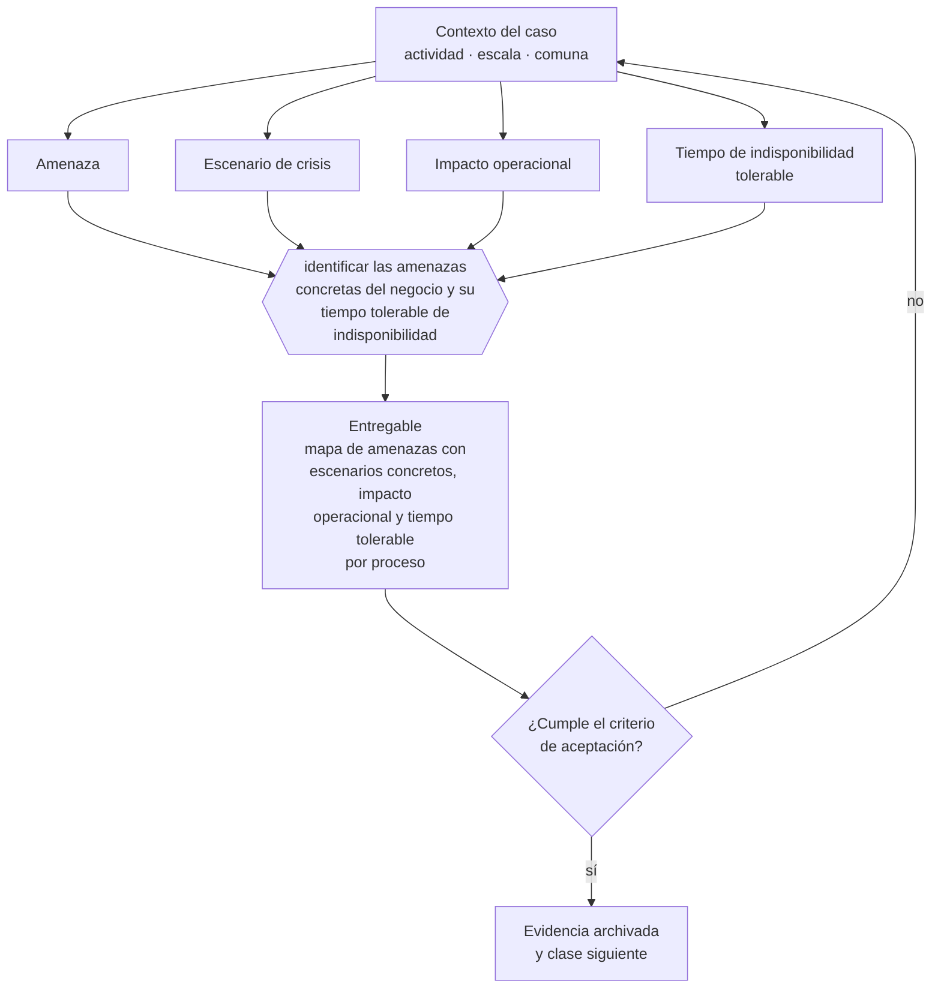

# Clase 281 — Mapa de amenazas y escenarios de crisis

> **Parte 21 · Crisis, continuidad, insolvencia y recuperación** — clase 1 de 14

**Estado de evidencia:** `VERIFICADO-FUENTE` · **Jurisdicción:** Chile-first · **Fecha base normativa:** 07-08-2026 
**Decisión que habilita:** identificar las amenazas concretas del negocio y su tiempo tolerable de indisponibilidad 
**Entregable:** mapa de amenazas con escenarios concretos, impacto operacional y tiempo tolerable por proceso

## 🎯 Propósito

Mapear las amenazas probables del negocio concreto y definir, para cada proceso, cuánto tiempo puede estar detenido antes del daño irreversible.

## 📚 Resultados de aprendizaje

Al finalizar esta clase podrás:

1. **Definir** con precisión los cuatro conceptos de la tabla siguiente y usarlos para describir un caso real.
2. **Explicar** por qué esta materia condiciona decisiones de otras partes del programa.
3. **Decidir** —identificar las amenazas concretas del negocio y su tiempo tolerable de indisponibilidad— y justificar la decisión por escrito.
4. **Producir** el entregable de la clase y contrastarlo contra su criterio de aceptación.
5. **Distinguir** el dato estable del dato dinámico que exige revalidación en la fuente oficial.

## 🧩 Conceptos centrales

| Concepto | Comprensión verificable |
|---|---|
| **Amenaza** | Evento externo o interno que puede interrumpir la operación. |
| **Escenario de crisis** | Descripción concreta de la materialización de una amenaza. |
| **Impacto operacional** | Efecto sobre la capacidad de entregar. |
| **Tiempo de indisponibilidad tolerable** | Plazo máximo antes de daño irreversible. |

## 🗺️ Flujo de razonamiento

## 📖 Desarrollo

### 1. El fondo del asunto

El mapa de amenazas debe cubrir lo probable y no solo lo espectacular: pérdida de un cliente concentrado, salida de una persona clave, falla de un proveedor único, incidente informático, fiscalización, corte prolongado de suministro. Priorizar por impacto y por tiempo tolerable de indisponibilidad.

### 2. Cómo se traduce en la práctica

Los mapas que solo listan catástrofes espectaculares dejan fuera lo que realmente ocurre: la pérdida del cliente concentrado, la salida de la persona clave, el proveedor único que falla. Sin tiempo tolerable definido por proceso no se puede priorizar la respuesta ni dimensionar la inversión en continuidad.

### 3. Marco aplicable y quién interviene

- Ley 20.720 sobre reorganización y liquidación de empresas y personas
- Ley 19.983 sobre mérito ejecutivo de la factura para cobranza
- continuidad de negocio: BIA, RTO, RPO y plan de comunicación de crisis

**Autoridades o contrapartes involucradas:** Superintendencia de Insolvencia y Reemprendimiento, Tribunales civiles, Dirección del Trabajo.
**Profesionales de apoyo:** abogado de insolvencia, veedor o liquidador, CFO, comunicaciones. La participación concreta depende del riesgo, del
tamaño de la empresa y de la actividad económica.

## 🧪 Taller guiado

Aplica esta clase a **una** de las siguientes líneas de negocio y repite después el ejercicio con
una segunda línea de carga regulatoria distinta:

| Línea | Carga regulatoria |
|---|---|
| SaaS B2B con IA | media |
| Servicios profesionales | baja |
| E-commerce D2C | media |
| Alimentos o foodtech | alta |
| Exportación de servicios | media |
| Fintech regulada | alta |
| Construcción o servicios técnicos | alta |

**Secuencia de trabajo:**

1. Delimita el contexto: actividad económica, escala, comuna y etapa de la empresa.
2. Reúne los antecedentes que la decisión exige y anota la fecha de cada fuente.
3. Identifica las alternativas reales, incluida la de no hacer nada.
4. Evalúa el impacto en mercado, caja, personas, regulación y operación.
5. Toma la decisión y regístrala con sus supuestos.
6. Produce el entregable.
7. Contrástalo contra el criterio de aceptación.
8. Anota lo que requiere validación profesional y programa su revisión.

### 📦 Entregable

Mapa de amenazas con escenarios concretos, impacto operacional y tiempo tolerable por proceso.

Debe incluir decisión, supuestos, fuentes con fecha de consulta, responsable, riesgos
identificados y próximos pasos.

## 🏆 Reto verificable

Resuelve la misma materia para una segunda línea de negocio con distinta carga regulatoria y
explica por escrito **qué cambió, por qué y qué fuente lo determina**.

## ✅ Criterio de aceptación

- [ ] los escenarios son concretos y propios del negocio
- [ ] cada proceso crítico tiene tiempo tolerable definido
- [ ] cada afirmación regulatoria está referida a una fuente oficial con fecha de consulta;
- [ ] los datos dinámicos quedan marcados para revalidación;
- [ ] hay un responsable asignado y evidencia reproducible del trabajo.

## ⚠️ Errores frecuentes

**Propios de esta clase:**

- Mapear solo catástrofes y omitir las interrupciones frecuentes y probables.
- No definir el tiempo tolerable y no poder priorizar la respuesta.

**Característicos de la parte 21:**

- Esperar a la cesación de pagos para buscar asesoría y perder la opción de reorganización.
- Recortar costos destruyendo la capacidad que permite recuperarse.

## 🇨🇱 Checklist Chile

- [ ] ¿existe norma o autoridad específica para esta materia?
- [ ] ¿la fuente consultada está vigente a la fecha de ejecución?
- [ ] ¿se activa algún trámite ante el SII?
- [ ] ¿se activa algún requisito municipal o sectorial?
- [ ] ¿afecta a consumidores o al tratamiento de datos personales?
- [ ] ¿afecta a trabajadores o a la seguridad y salud en el trabajo?
- [ ] ¿afecta a impuestos, contabilidad o caja?
- [ ] ¿afecta a contratos o a propiedad intelectual?
- [ ] ¿requiere renovación, reporte periódico o revalidación?

## ❓ Preguntas de comprobación

1. ¿Qué tres eventos probables detendrían tu operación este año?
2. ¿Cuánto tiempo puede estar detenido cada proceso crítico antes del daño irreversible?
3. ¿Qué amenaza descartaste por improbable que en realidad ya ocurrió en tu sector?

## 🔗 Fuentes oficiales

**Biblioteca del Congreso Nacional · LeyChile — Normativa oficial consolidada**  
<https://www.bcn.cl/leychile/> · verificado 2026-08-19

- *Qué contiene:* Publica el texto oficial y consolidado de leyes, decretos y reglamentos, con la versión vigente a una fecha, el historial de modificaciones y la tramitación que las originó.
- *Cómo leerla:* Usa siempre el selector de versión vigente a la fecha en que ejecutarás el trámite, no la última publicada. Y lee el artículo transitorio: en normas en implantación gradual —jornada, datos personales— ahí está la fecha que realmente te aplica.
- *Uso en esta clase:* aporta el marco de «Normativa oficial consolidada» para identificar las amenazas concretas del negocio y su tiempo tolerable de indisponibilidad.

**Dirección del Trabajo — Relaciones laborales y obligaciones del empleador**  
<https://www.dt.gob.cl/> · verificado 2026-08-19

- *Qué contiene:* Concentra el Código del Trabajo aplicado: dictámenes que interpretan la norma en casos concretos, la plataforma Mi DT para registrar contratos y finiquitos, y las guías de fiscalización.
- *Cómo leerla:* Los dictámenes valen más que las guías divulgativas: describen cómo la autoridad resolvió un caso real. Busca por materia y contrasta la fecha, porque un dictamen posterior puede cambiar el criterio anterior.
- *Uso en esta clase:* aporta el marco de «Relaciones laborales y obligaciones del empleador» para identificar las amenazas concretas del negocio y su tiempo tolerable de indisponibilidad.

Complementos del repositorio: [glosario](../../../docs/19_GLOSSARY.md) ·
[ruta de lecturas](../../../docs/15_BOOKS_AND_LEARNING_PATH.md) ·
[catálogo de fuentes](../../../docs/16_OFFICIAL_SOURCE_CATALOG.md).

> [!IMPORTANT]
> Material educativo. Para una decisión real de alto impacto hay que verificar la fuente oficial
> vigente y validar con el profesional competente.

---

| Anterior | Índice | Siguiente |
|---|---|---|
| **Inicio de la parte** | [Parte 21](../README.md) · [Programa](../../../README.md) | [282 · Business Continuity Plan →](../class-02-business-continuity-plan/README.md) |
