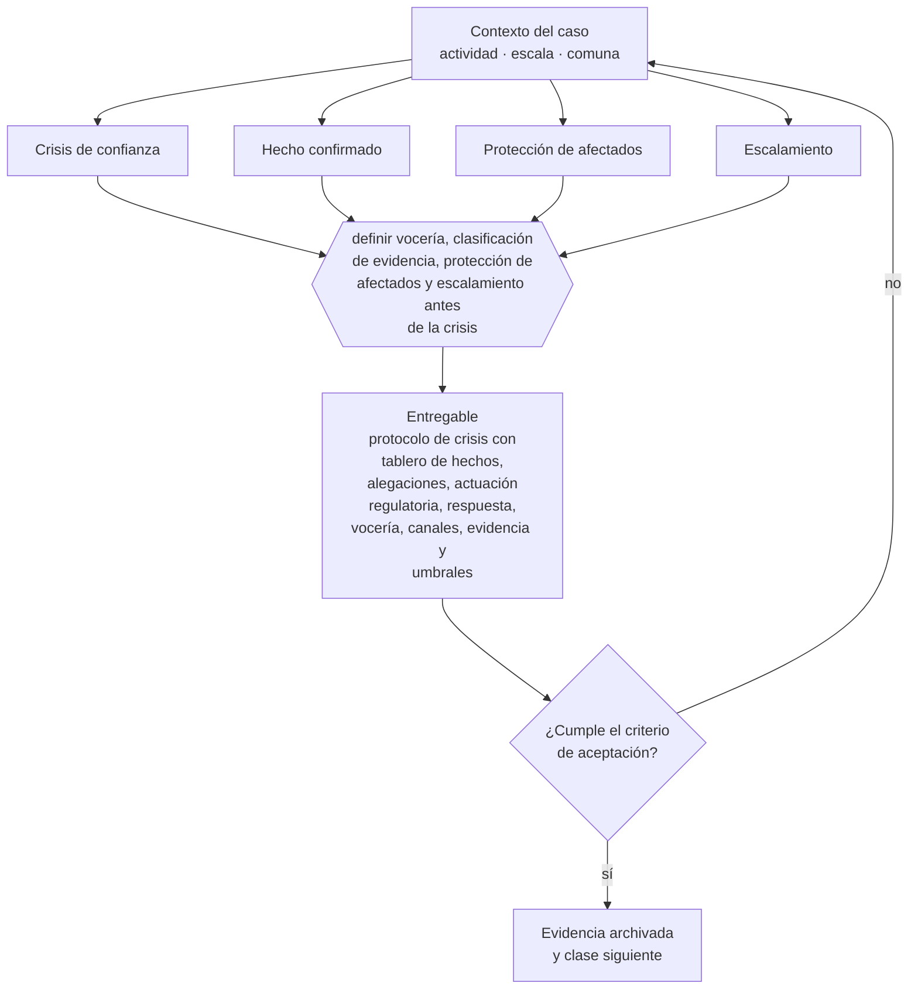

# Clase 284 — Gestión de crisis reputacional

> **Parte 21 · Crisis, continuidad, insolvencia y recuperación** — clase 4 de 14

**Estado de evidencia:** `VERIFICADO-FUENTE` · **Jurisdicción:** Chile-first · **Fecha base normativa:** 07-08-2026 
**Decisión que habilita:** definir vocería, clasificación de evidencia, protección de afectados y escalamiento antes de la crisis 
**Entregable:** protocolo de crisis con tablero de hechos, alegaciones, actuación regulatoria, respuesta, vocería, canales, evidencia y umbrales

## 🎯 Propósito

Responder a una crisis de confianza con hechos confirmados, protección de afectados, continuidad, evidencia y escalamiento.

## 📚 Resultados de aprendizaje

Al finalizar esta clase podrás:

1. **Definir** con precisión los cuatro conceptos de la tabla siguiente y usarlos para describir un caso real.
2. **Explicar** por qué esta materia condiciona decisiones de otras partes del programa.
3. **Decidir** —definir vocería, clasificación de evidencia, protección de afectados y escalamiento antes de la crisis— y justificar la decisión por escrito.
4. **Producir** el entregable de la clase y contrastarlo contra su criterio de aceptación.
5. **Distinguir** el dato estable del dato dinámico que exige revalidación en la fuente oficial.

## 🧩 Conceptos centrales

| Concepto | Comprensión verificable |
|---|---|
| **Crisis de confianza** | Evento que acelera retiros, reclamos o pérdida de contrapartes. |
| **Hecho confirmado** | Dato validado que puede comunicarse sin especulación. |
| **Protección de afectados** | Medidas para detener daño, preservar derechos y habilitar canales de atención. |
| **Escalamiento** | Activación de dirección, asesores, autoridades y continuidad según umbral. |

## 🗺️ Flujo de razonamiento

```mermaid
flowchart TB
    C["Contexto del caso<br/>actividad · escala · comuna"]
    C --> A1["Crisis de confianza"]
    C --> A2["Hecho confirmado"]
    C --> A3["Protección de afectados"]
    C --> A4["Escalamiento"]
    A1 & A2 & A3 & A4 --> D{{"definir vocería, clasificación<br/>de evidencia, protección de<br/>afectados y escalamiento antes<br/>de la crisis"}}
    D --> E["Entregable<br/>protocolo de crisis con<br/>tablero de hechos,<br/>alegaciones, actuación<br/>regulatoria, respuesta,<br/>vocería, canales, evidencia y<br/>umbrales"]
    E --> V{"¿Cumple el criterio<br/>de aceptación?"}
    V -->|sí| S["Evidencia archivada<br/>y clase siguiente"]
    V -->|no| C
```

## 📖 Desarrollo

### 1. El fondo del asunto

Celsius, Terra y MEDVi muestran que una crisis de producto, regulación o confianza también es una crisis de clasificación de evidencia. La respuesta debe distinguir el documento del regulador, lo alegado por periodistas o terceros, la versión de la empresa, lo ya corregido y lo aún no resuelto; preservar anuncios, aprobaciones y registros; proteger a clientes; y coordinar continuidad, asesoría y autoridades. Comunicar que un tercero ejecutó la pieza no sustituye explicar el control ejercido sobre ese tercero.

### 2. Cómo se traduce en la práctica

Celsius y Terra enseñan que comunicar solvencia, liquidez o estabilidad sin evidencia vigente puede amplificar la crisis. El primer mensaje debe decir qué se sabe, qué no, qué medida protege a los afectados, qué canal funciona y cuándo será la próxima actualización. En paralelo se preservan registros, se activa continuidad y se evalúan deberes regulatorios con asesoría local.

### 3. Marco aplicable y quién interviene

- Ley 20.720 sobre reorganización y liquidación de empresas y personas
- Ley 19.983 sobre mérito ejecutivo de la factura para cobranza
- continuidad de negocio: BIA, RTO, RPO y plan de comunicación de crisis

**Autoridades o contrapartes involucradas:** Superintendencia de Insolvencia y Reemprendimiento, Tribunales civiles, Dirección del Trabajo.
**Profesionales de apoyo:** abogado de insolvencia, veedor o liquidador, CFO, comunicaciones. La participación concreta depende del riesgo, del
tamaño de la empresa y de la actividad económica.

## 🔬 Caso aplicado: MEDVi

[MEDVi: empresa AI-native, red externa y control al crecer](../../../case-studies/21-medvi-empresa-ai-native-y-control.md#9-crisis-reputacion-y-respuesta)

**Lente para esta clase:** construir una respuesta que preserve evidencia, proteja afectados y no mezcle hecho, alegación, actuación regulatoria, respuesta corporativa e interpretación.

El expediente separa hechos verificados, cifras reportadas, alegaciones periodísticas,
actuaciones regulatorias, respuesta de la empresa e interpretación pedagógica. No uses una
categoría como prueba automática de otra.

## 🧪 Taller guiado

Aplica esta clase a **una** de las siguientes líneas de negocio y repite después el ejercicio con
una segunda línea de carga regulatoria distinta:

| Línea | Carga regulatoria |
|---|---|
| SaaS B2B con IA | media |
| Servicios profesionales | baja |
| E-commerce D2C | media |
| Alimentos o foodtech | alta |
| Exportación de servicios | media |
| Fintech regulada | alta |
| Construcción o servicios técnicos | alta |

**Secuencia de trabajo:**

1. Delimita el contexto: actividad económica, escala, comuna y etapa de la empresa.
2. Reúne los antecedentes que la decisión exige y anota la fecha de cada fuente.
3. Identifica las alternativas reales, incluida la de no hacer nada.
4. Evalúa el impacto en mercado, caja, personas, regulación y operación.
5. Toma la decisión y regístrala con sus supuestos.
6. Produce el entregable.
7. Contrástalo contra el criterio de aceptación.
8. Anota lo que requiere validación profesional y programa su revisión.

### 📦 Entregable

Protocolo de crisis con tablero de hechos, alegaciones, actuación regulatoria, respuesta, vocería, canales, evidencia y umbrales.

Debe incluir decisión, supuestos, fuentes con fecha de consulta, responsable, riesgos
identificados y próximos pasos.

## 🏆 Reto verificable

Resuelve la misma materia para una segunda línea de negocio con distinta carga regulatoria y
explica por escrito **qué cambió, por qué y qué fuente lo determina**.

## ✅ Criterio de aceptación

- [ ] cada mensaje separa hecho verificado, alegación, actuación regulatoria, respuesta e interpretación
- [ ] los umbrales activan responsables, continuidad, preservación de evidencia, protección y evaluación regulatoria
- [ ] cada afirmación regulatoria está referida a una fuente oficial con fecha de consulta;
- [ ] los datos dinámicos quedan marcados para revalidación;
- [ ] hay un responsable asignado y evidencia reproducible del trabajo.

## ⚠️ Errores frecuentes

**Propios de esta clase:**

- Responder a una carta regulatoria como si fuera solo un problema de reputación o relaciones públicas.
- Atribuir el incidente a un afiliado sin reconstruir contrato, control, beneficio, aprobación y medidas correctivas.

**Característicos de la parte 21:**

- Esperar a la cesación de pagos para buscar asesoría y perder la opción de reorganización.
- Recortar costos destruyendo la capacidad que permite recuperarse.

## 🇨🇱 Checklist Chile

- [ ] ¿existe norma o autoridad específica para esta materia?
- [ ] ¿la fuente consultada está vigente a la fecha de ejecución?
- [ ] ¿se activa algún trámite ante el SII?
- [ ] ¿se activa algún requisito municipal o sectorial?
- [ ] ¿afecta a consumidores o al tratamiento de datos personales?
- [ ] ¿afecta a trabajadores o a la seguridad y salud en el trabajo?
- [ ] ¿afecta a impuestos, contabilidad o caja?
- [ ] ¿afecta a contratos o a propiedad intelectual?
- [ ] ¿requiere renovación, reporte periódico o revalidación?

## ❓ Preguntas de comprobación

1. ¿Qué afirmación puedes respaldar hoy con evidencia revisada?
2. ¿Qué medida inmediata reduce el daño a clientes y trabajadores?
3. ¿Qué umbral activa autoridades, continuidad y preservación reforzada de evidencia?

## 🔗 Fuentes oficiales

**Departamento de Justicia de Estados Unidos — Celsius: declaración de culpabilidad y sentencia del fundador**  
<https://www.justice.gov/usao-sdny/pr/founder-celsius-sentenced-12-years-fraud-and-market-manipulation> · verificado 2026-09-28

- *Qué contiene:* Registra que Alexander Mashinsky se declaró culpable en diciembre de 2024 y fue sentenciado en mayo de 2025, y describe hallazgos sobre sostenibilidad de rendimientos, liquidez, uso de depósitos y comunicación de riesgos.
- *Cómo leerla:* Distingue los hechos reconocidos en la declaración de culpabilidad y considerados en la sentencia de las reglas aplicables a una empresa chilena. El aprendizaje empresarial es probar la fuente del rendimiento, el calce de liquidez y la evidencia detrás de cada comunicación.
- *Uso en esta clase:* aporta el marco de «Celsius: declaración de culpabilidad y sentencia del fundador» para definir vocería, clasificación de evidencia, protección de afectados y escalamiento antes de la crisis.

**Departamento de Justicia de Estados Unidos — Terraform, UST y LUNA: declaración de culpabilidad y sentencia de Do Kwon**  
<https://www.justice.gov/usao-sdny/pr/crypto-enabled-fraudster-sentenced-orchestrating-40-billion-fraud> · verificado 2026-09-28

- *Qué contiene:* Registra la declaración de culpabilidad de agosto de 2025 y la sentencia de diciembre de 2025, y describe hechos sobre el funcionamiento comunicado de UST, intervenciones no reveladas y respuesta posterior a la pérdida de estabilidad.
- *Cómo leerla:* Úsala para someter a estrés el mecanismo del producto, sus dependencias, incentivos, liquidez y comunicación. La sentencia estadounidense acredita conducta en ese proceso; no crea por sí sola una regla jurídica aplicable en Chile.
- *Uso en esta clase:* aporta el marco de «Terraform, UST y LUNA: declaración de culpabilidad y sentencia de Do Kwon» para definir vocería, clasificación de evidencia, protección de afectados y escalamiento antes de la crisis.

**U.S. Food and Drug Administration — MEDVi, LLC dba MEDVi: Warning Letter MARCS-CMS 721455**  
<https://www.fda.gov/inspections-compliance-enforcement-and-criminal-investigations/warning-letters/medvi-llc-dba-medvi-721455-02202026> · verificado 2026-10-04

- *Qué contiene:* Carta de advertencia fechada el 20 de febrero de 2026, dirigida a MEDVi, LLC dba MEDVi, sobre claims y rotulado observados por FDA en medvi.io durante diciembre de 2025.
- *Cómo leerla:* Distingue lo que FDA observó y calificó como misbranding de cualquier conclusión penal o de falsificación. Registra destinatario, dominio, claims, normas citadas, plazo de respuesta y medidas advertidas sin ampliar su alcance.
- *Uso en esta clase:* aporta el marco de «MEDVi, LLC dba MEDVi: Warning Letter MARCS-CMS 721455» para definir vocería, clasificación de evidencia, protección de afectados y escalamiento antes de la crisis.

**MEDVi · versión corporativa — MEDVi statement in response to external speculation**  
<https://home.medvi.org/communication> · verificado 2026-10-04

- *Qué contiene:* Declaración corporativa del 8 de abril de 2026 sobre la carta FDA, un supuesto sitio de afiliado, publicidad con posibles médicos generados por IA, correcciones y estructura de proveedores clínicos y farmacias.
- *Cómo leerla:* Trátala como la versión de MEDVi, no como verificación independiente. Contrasta cada afirmación con el destinatario y contenido de la carta FDA, archivos del sitio, contratos, responsables y evidencia de las medidas correctivas.
- *Uso en esta clase:* aporta el marco de «MEDVi statement in response to external speculation» para definir vocería, clasificación de evidencia, protección de afectados y escalamiento antes de la crisis.

**Futurism · investigación periodística — Look Out for AI-Generated Ozempic!**  
<https://futurism.com/medvi-ai-ozempic> · verificado 2026-10-04

- *Qué contiene:* Investigación publicada el 29 de mayo de 2025 sobre imágenes de pacientes, anuncios, logos de medios, testimonios y profesionales presentados en el sitio de MEDVi, con metodología y ejemplos rastreados.
- *Cómo leerla:* Atribuye cada hallazgo al medio y conserva la diferencia entre evidencia reproducida, inferencia periodística y acusación de terceros. Contrástala con la respuesta posterior de MEDVi y con la actuación primaria de FDA.
- *Uso en esta clase:* aporta el marco de «Look Out for AI-Generated Ozempic!» para definir vocería, clasificación de evidencia, protección de afectados y escalamiento antes de la crisis.

Complementos del repositorio: [glosario](../../../docs/19_GLOSSARY.md) ·
[ruta de lecturas](../../../docs/15_BOOKS_AND_LEARNING_PATH.md) ·
[catálogo de fuentes](../../../docs/16_OFFICIAL_SOURCE_CATALOG.md).

> [!IMPORTANT]
> Material educativo. Para una decisión real de alto impacto hay que verificar la fuente oficial
> vigente y validar con el profesional competente.

---

| Anterior | Índice | Siguiente |
|---|---|---|
| [← 283 · Disaster Recovery para tecnología](../class-03-disaster-recovery-para-tecnologia/README.md) | [Parte 21](../README.md) · [Programa](../../../README.md) | [285 · Fuga de caja y plan de 30 días →](../class-05-fuga-de-caja-y-plan-de-30-dias/README.md) |
