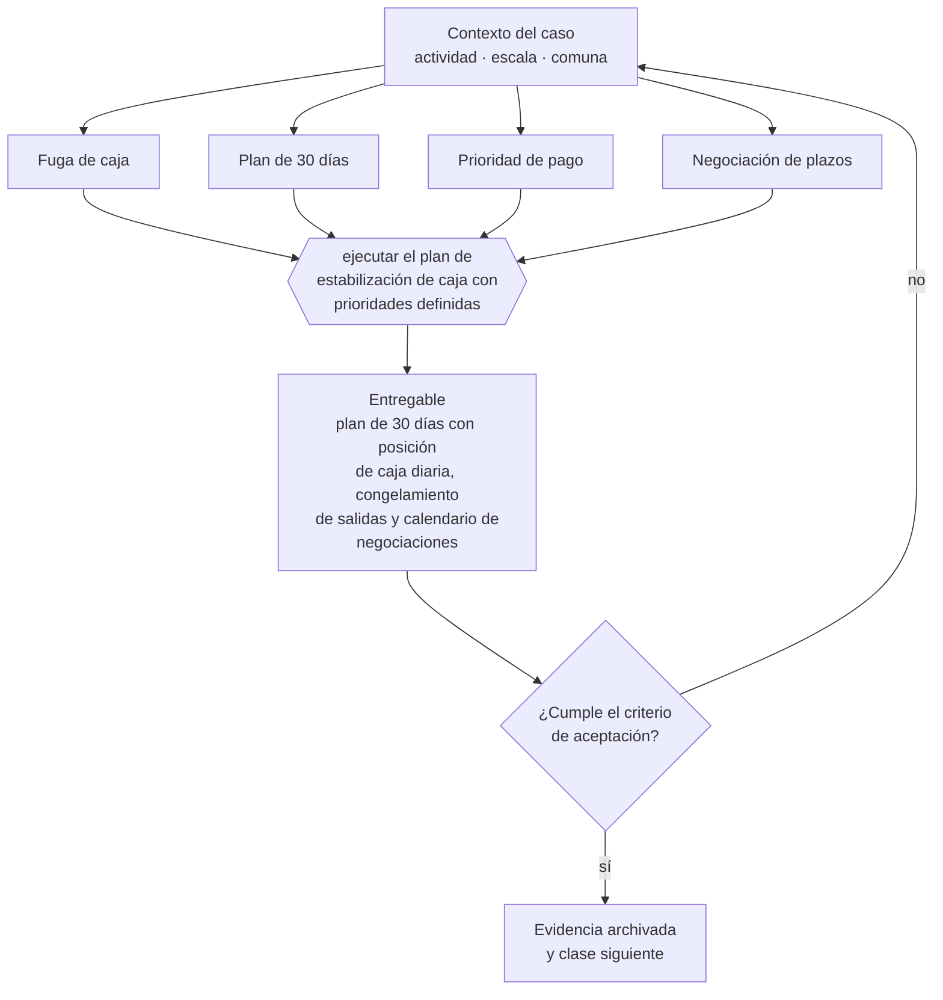

# Clase 285 — Fuga de caja y plan de 30 días

> **Parte 21 · Crisis, continuidad, insolvencia y recuperación** — clase 5 de 14

**Estado de evidencia:** `VERIFICADO-FUENTE` · **Jurisdicción:** Chile-first · **Fecha base normativa:** 07-08-2026 
**Decisión que habilita:** ejecutar el plan de estabilización de caja con prioridades definidas 
**Entregable:** plan de 30 días con posición de caja diaria, congelamiento de salidas y calendario de negociaciones

## 🎯 Propósito

Ejecutar el plan de 30 días con prioridades definidas, negociando plazos antes de incumplir y no después.

## 📚 Resultados de aprendizaje

Al finalizar esta clase podrás:

1. **Definir** con precisión los cuatro conceptos de la tabla siguiente y usarlos para describir un caso real.
2. **Explicar** por qué esta materia condiciona decisiones de otras partes del programa.
3. **Decidir** —ejecutar el plan de estabilización de caja con prioridades definidas— y justificar la decisión por escrito.
4. **Producir** el entregable de la clase y contrastarlo contra su criterio de aceptación.
5. **Distinguir** el dato estable del dato dinámico que exige revalidación en la fuente oficial.

## 🧩 Conceptos centrales

| Concepto | Comprensión verificable |
|---|---|
| **Fuga de caja** | Salida de efectivo superior a la entrada de forma sostenida. |
| **Plan de 30 días** | Conjunto de acciones inmediatas de estabilización. |
| **Prioridad de pago** | Orden que protege la continuidad y el cumplimiento legal. |
| **Negociación de plazos** | Acuerdo con proveedores y acreedores. |

## 🗺️ Flujo de razonamiento

## 📖 Desarrollo

### 1. El fondo del asunto

Ante fuga de caja el orden es: medir con exactitud la posición, congelar salidas no críticas, priorizar remuneraciones y cotizaciones, acelerar cobranza y negociar plazos antes de incumplir. Negociar antes del incumplimiento conserva credibilidad; hacerlo después la elimina.

### 2. Cómo se traduce en la práctica

Negociar antes conserva credibilidad; negociar después la elimina y encarece cualquier acuerdo. Y dejar de pagar cotizaciones para aliviar la caja del mes es la peor decisión disponible: además de apropiarse de dinero del trabajador, impide poner término válido a cualquier contrato.

### 3. Marco aplicable y quién interviene

- Ley 20.720 sobre reorganización y liquidación de empresas y personas
- Ley 19.983 sobre mérito ejecutivo de la factura para cobranza
- continuidad de negocio: BIA, RTO, RPO y plan de comunicación de crisis

**Autoridades o contrapartes involucradas:** Superintendencia de Insolvencia y Reemprendimiento, Tribunales civiles, Dirección del Trabajo.
**Profesionales de apoyo:** abogado de insolvencia, veedor o liquidador, CFO, comunicaciones. La participación concreta depende del riesgo, del
tamaño de la empresa y de la actividad económica.

## 🧪 Taller guiado

Aplica esta clase a **una** de las siguientes líneas de negocio y repite después el ejercicio con
una segunda línea de carga regulatoria distinta:

| Línea | Carga regulatoria |
|---|---|
| SaaS B2B con IA | media |
| Servicios profesionales | baja |
| E-commerce D2C | media |
| Alimentos o foodtech | alta |
| Exportación de servicios | media |
| Fintech regulada | alta |
| Construcción o servicios técnicos | alta |

**Secuencia de trabajo:**

1. Delimita el contexto: actividad económica, escala, comuna y etapa de la empresa.
2. Reúne los antecedentes que la decisión exige y anota la fecha de cada fuente.
3. Identifica las alternativas reales, incluida la de no hacer nada.
4. Evalúa el impacto en mercado, caja, personas, regulación y operación.
5. Toma la decisión y regístrala con sus supuestos.
6. Produce el entregable.
7. Contrástalo contra el criterio de aceptación.
8. Anota lo que requiere validación profesional y programa su revisión.

### 📦 Entregable

Plan de 30 días con posición de caja diaria, congelamiento de salidas y calendario de negociaciones.

Debe incluir decisión, supuestos, fuentes con fecha de consulta, responsable, riesgos
identificados y próximos pasos.

## 🏆 Reto verificable

Resuelve la misma materia para una segunda línea de negocio con distinta carga regulatoria y
explica por escrito **qué cambió, por qué y qué fuente lo determina**.

## ✅ Criterio de aceptación

- [ ] las prioridades de pago protegen obligaciones legales
- [ ] las negociaciones se inician antes del incumplimiento
- [ ] cada afirmación regulatoria está referida a una fuente oficial con fecha de consulta;
- [ ] los datos dinámicos quedan marcados para revalidación;
- [ ] hay un responsable asignado y evidencia reproducible del trabajo.

## ⚠️ Errores frecuentes

**Propios de esta clase:**

- Dejar de pagar cotizaciones para aliviar la caja del mes.
- Esperar al incumplimiento para llamar a proveedores y acreedores.

**Característicos de la parte 21:**

- Esperar a la cesación de pagos para buscar asesoría y perder la opción de reorganización.
- Recortar costos destruyendo la capacidad que permite recuperarse.

## 🇨🇱 Checklist Chile

- [ ] ¿existe norma o autoridad específica para esta materia?
- [ ] ¿la fuente consultada está vigente a la fecha de ejecución?
- [ ] ¿se activa algún trámite ante el SII?
- [ ] ¿se activa algún requisito municipal o sectorial?
- [ ] ¿afecta a consumidores o al tratamiento de datos personales?
- [ ] ¿afecta a trabajadores o a la seguridad y salud en el trabajo?
- [ ] ¿afecta a impuestos, contabilidad o caja?
- [ ] ¿afecta a contratos o a propiedad intelectual?
- [ ] ¿requiere renovación, reporte periódico o revalidación?

## ❓ Preguntas de comprobación

1. ¿Cuál es tu posición de caja diaria y cuántas semanas cubre?
2. ¿Qué salidas congelarías primero y cuáles son ineludibles?
3. ¿A qué acreedores llamarías esta semana, antes de incumplir?

## 🔗 Fuentes oficiales

**Dirección del Trabajo — Relaciones laborales y obligaciones del empleador**  
<https://www.dt.gob.cl/> · verificado 2026-08-19

- *Qué contiene:* Concentra el Código del Trabajo aplicado: dictámenes que interpretan la norma en casos concretos, la plataforma Mi DT para registrar contratos y finiquitos, y las guías de fiscalización.
- *Cómo leerla:* Los dictámenes valen más que las guías divulgativas: describen cómo la autoridad resolvió un caso real. Busca por materia y contrasta la fecha, porque un dictamen posterior puede cambiar el criterio anterior.
- *Uso en esta clase:* aporta el marco de «Relaciones laborales y obligaciones del empleador» para ejecutar el plan de estabilización de caja con prioridades definidas.

**Servicio de Impuestos Internos — Nuevos contribuyentes, inicio de actividades y DTE**  
<https://www.sii.cl/ayudas/nuevos_contribuyentes/boleta-vys-facturador.html> · verificado 2026-08-19

- *Qué contiene:* Reúne el circuito completo del contribuyente nuevo: obtención de RUT, declaración de inicio de actividades, elección de códigos de actividad económica y habilitación para emitir documentos tributarios electrónicos.
- *Cómo leerla:* Sepáralo en dos actos distintos que la página trata seguidos: el RUT identifica, el inicio de actividades habilita. Lo que te bloquea para facturar casi siempre está en el segundo, no en el primero.
- *Uso en esta clase:* aporta el marco de «Nuevos contribuyentes, inicio de actividades y DTE» para ejecutar el plan de estabilización de caja con prioridades definidas.

Complementos del repositorio: [glosario](../../../docs/19_GLOSSARY.md) ·
[ruta de lecturas](../../../docs/15_BOOKS_AND_LEARNING_PATH.md) ·
[catálogo de fuentes](../../../docs/16_OFFICIAL_SOURCE_CATALOG.md).

> [!IMPORTANT]
> Material educativo. Para una decisión real de alto impacto hay que verificar la fuente oficial
> vigente y validar con el profesional competente.

---

| Anterior | Índice | Siguiente |
|---|---|---|
| [← 284 · Gestión de crisis reputacional](../class-04-gestion-de-crisis-reputacional/README.md) | [Parte 21](../README.md) · [Programa](../../../README.md) | [286 · Cliente o proveedor crítico en insolvencia →](../class-06-cliente-o-proveedor-critico-en-insolvencia/README.md) |
