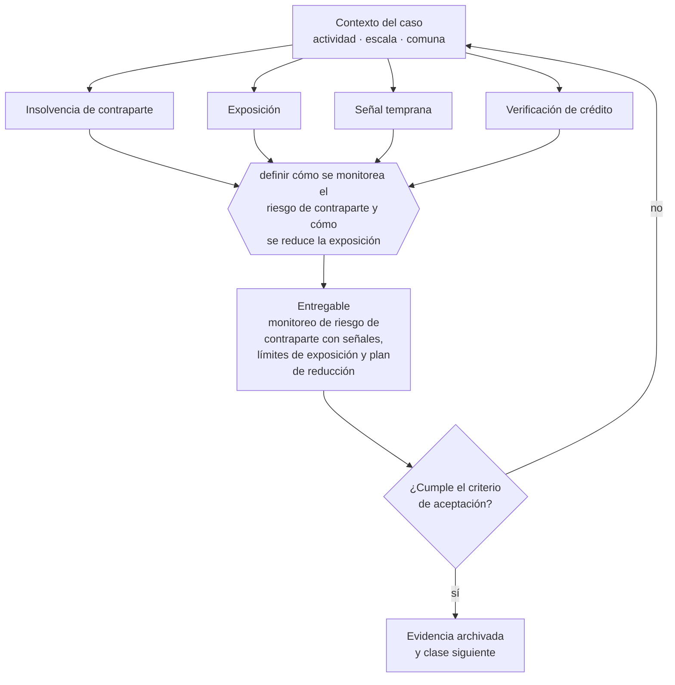

# Clase 286 — Cliente o proveedor crítico en insolvencia

> **Parte 21 · Crisis, continuidad, insolvencia y recuperación** — clase 6 de 14

**Estado de evidencia:** `VERIFICADO-FUENTE` · **Jurisdicción:** Chile-first · **Fecha base normativa:** 07-08-2026 
**Decisión que habilita:** definir cómo se monitorea el riesgo de contraparte y cómo se reduce la exposición 
**Entregable:** monitoreo de riesgo de contraparte con señales, límites de exposición y plan de reducción

## 🎯 Propósito

Monitorear señales tempranas de insolvencia en clientes y proveedores críticos y reducir exposición mientras aún se puede negociar.

## 📚 Resultados de aprendizaje

Al finalizar esta clase podrás:

1. **Definir** con precisión los cuatro conceptos de la tabla siguiente y usarlos para describir un caso real.
2. **Explicar** por qué esta materia condiciona decisiones de otras partes del programa.
3. **Decidir** —definir cómo se monitorea el riesgo de contraparte y cómo se reduce la exposición— y justificar la decisión por escrito.
4. **Producir** el entregable de la clase y contrastarlo contra su criterio de aceptación.
5. **Distinguir** el dato estable del dato dinámico que exige revalidación en la fuente oficial.

## 🧩 Conceptos centrales

| Concepto | Comprensión verificable |
|---|---|
| **Insolvencia de contraparte** | Incapacidad de un cliente o proveedor de cumplir. |
| **Exposición** | Monto en riesgo frente a esa contraparte. |
| **Señal temprana** | Comportamiento que anticipa el problema. |
| **Verificación de crédito** | Revisión periódica de la salud del cliente. |

## 🗺️ Flujo de razonamiento

## 📖 Desarrollo

### 1. El fondo del asunto

Las señales tempranas de insolvencia de un cliente son observables: atrasos crecientes, promesas incumplidas, cambios de interlocutor, pedidos mayores con plazos más largos. Detectarlas permite reducir exposición antes del incumplimiento, cuando aún se puede negociar garantías.

### 2. Cómo se traduce en la práctica

Atrasos crecientes, promesas incumplidas, cambios de interlocutor y pedidos mayores con plazos más largos son señales observables. Aumentar el crédito a un cliente que ya muestra atrasos es la reacción exactamente contraria a la que corresponde, y es la más frecuente por presión comercial.

### 3. Marco aplicable y quién interviene

- Ley 20.720 sobre reorganización y liquidación de empresas y personas
- Ley 19.983 sobre mérito ejecutivo de la factura para cobranza
- continuidad de negocio: BIA, RTO, RPO y plan de comunicación de crisis

**Autoridades o contrapartes involucradas:** Superintendencia de Insolvencia y Reemprendimiento, Tribunales civiles, Dirección del Trabajo.
**Profesionales de apoyo:** abogado de insolvencia, veedor o liquidador, CFO, comunicaciones. La participación concreta depende del riesgo, del
tamaño de la empresa y de la actividad económica.

## 🧪 Taller guiado

Aplica esta clase a **una** de las siguientes líneas de negocio y repite después el ejercicio con
una segunda línea de carga regulatoria distinta:

| Línea | Carga regulatoria |
|---|---|
| SaaS B2B con IA | media |
| Servicios profesionales | baja |
| E-commerce D2C | media |
| Alimentos o foodtech | alta |
| Exportación de servicios | media |
| Fintech regulada | alta |
| Construcción o servicios técnicos | alta |

**Secuencia de trabajo:**

1. Delimita el contexto: actividad económica, escala, comuna y etapa de la empresa.
2. Reúne los antecedentes que la decisión exige y anota la fecha de cada fuente.
3. Identifica las alternativas reales, incluida la de no hacer nada.
4. Evalúa el impacto en mercado, caja, personas, regulación y operación.
5. Toma la decisión y regístrala con sus supuestos.
6. Produce el entregable.
7. Contrástalo contra el criterio de aceptación.
8. Anota lo que requiere validación profesional y programa su revisión.

### 📦 Entregable

Monitoreo de riesgo de contraparte con señales, límites de exposición y plan de reducción.

Debe incluir decisión, supuestos, fuentes con fecha de consulta, responsable, riesgos
identificados y próximos pasos.

## 🏆 Reto verificable

Resuelve la misma materia para una segunda línea de negocio con distinta carga regulatoria y
explica por escrito **qué cambió, por qué y qué fuente lo determina**.

## ✅ Criterio de aceptación

- [ ] existen límites de exposición por contraparte
- [ ] las señales tempranas están definidas y se monitorean
- [ ] cada afirmación regulatoria está referida a una fuente oficial con fecha de consulta;
- [ ] los datos dinámicos quedan marcados para revalidación;
- [ ] hay un responsable asignado y evidencia reproducible del trabajo.

## ⚠️ Errores frecuentes

**Propios de esta clase:**

- Aumentar el crédito a un cliente que ya muestra atrasos.
- Concentrar exposición en un cliente sin garantía ni límite.

**Característicos de la parte 21:**

- Esperar a la cesación de pagos para buscar asesoría y perder la opción de reorganización.
- Recortar costos destruyendo la capacidad que permite recuperarse.

## 🇨🇱 Checklist Chile

- [ ] ¿existe norma o autoridad específica para esta materia?
- [ ] ¿la fuente consultada está vigente a la fecha de ejecución?
- [ ] ¿se activa algún trámite ante el SII?
- [ ] ¿se activa algún requisito municipal o sectorial?
- [ ] ¿afecta a consumidores o al tratamiento de datos personales?
- [ ] ¿afecta a trabajadores o a la seguridad y salud en el trabajo?
- [ ] ¿afecta a impuestos, contabilidad o caja?
- [ ] ¿afecta a contratos o a propiedad intelectual?
- [ ] ¿requiere renovación, reporte periódico o revalidación?

## ❓ Preguntas de comprobación

1. ¿Qué límite de exposición tienes por contraparte y quién lo controla?
2. ¿Qué cliente muestra hoy señales de deterioro y qué hiciste al respecto?
3. ¿Consultaste el boletín concursal de tus contrapartes críticas?

## 🔗 Fuentes oficiales

**Biblioteca del Congreso Nacional · LeyChile — Normativa oficial consolidada**  
<https://www.bcn.cl/leychile/> · verificado 2026-08-19

- *Qué contiene:* Publica el texto oficial y consolidado de leyes, decretos y reglamentos, con la versión vigente a una fecha, el historial de modificaciones y la tramitación que las originó.
- *Cómo leerla:* Usa siempre el selector de versión vigente a la fecha en que ejecutarás el trámite, no la última publicada. Y lee el artículo transitorio: en normas en implantación gradual —jornada, datos personales— ahí está la fecha que realmente te aplica.
- *Uso en esta clase:* aporta el marco de «Normativa oficial consolidada» para definir cómo se monitorea el riesgo de contraparte y cómo se reduce la exposición.

Complementos del repositorio: [glosario](../../../docs/19_GLOSSARY.md) ·
[ruta de lecturas](../../../docs/15_BOOKS_AND_LEARNING_PATH.md) ·
[catálogo de fuentes](../../../docs/16_OFFICIAL_SOURCE_CATALOG.md).

> [!IMPORTANT]
> Material educativo. Para una decisión real de alto impacto hay que verificar la fuente oficial
> vigente y validar con el profesional competente.

---

| Anterior | Índice | Siguiente |
|---|---|---|
| [← 285 · Fuga de caja y plan de 30 días](../class-05-fuga-de-caja-y-plan-de-30-dias/README.md) | [Parte 21](../README.md) · [Programa](../../../README.md) | [287 · Renegociación de deuda →](../class-07-renegociacion-de-deuda/README.md) |
