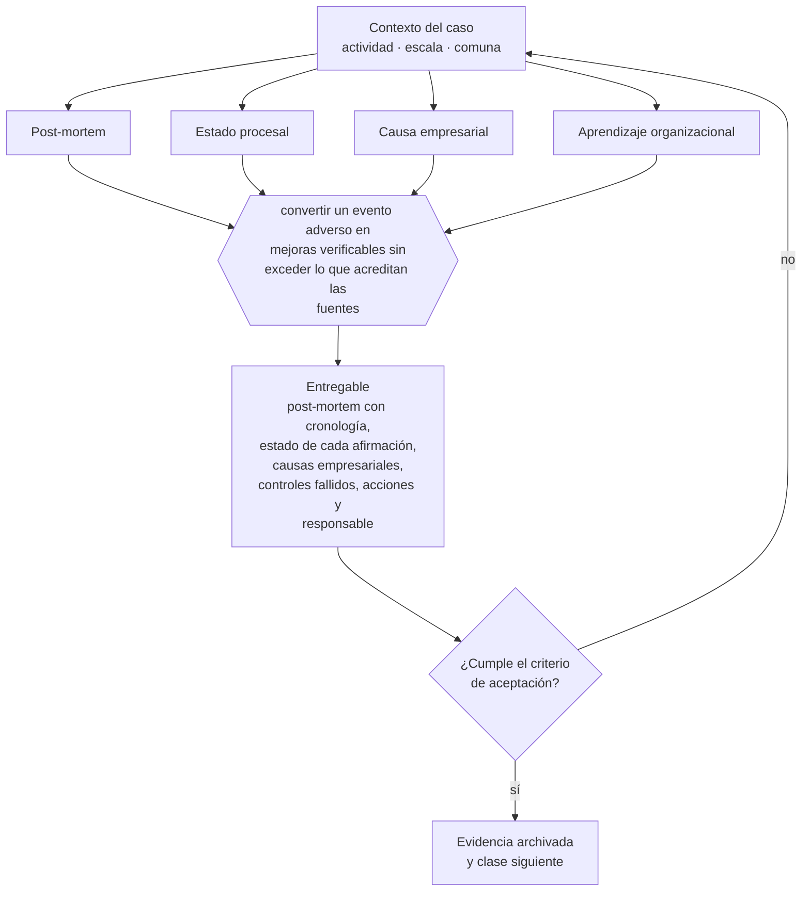

# Clase 293 — Post-mortem y aprendizaje organizacional

> **Parte 21 · Crisis, continuidad, insolvencia y recuperación** — clase 13 de 14

**Estado de evidencia:** `VERIFICADO-FUENTE` · **Jurisdicción:** Chile-first · **Fecha base normativa:** 07-08-2026 
**Decisión que habilita:** convertir un evento adverso en mejoras verificables sin exceder lo que acreditan las fuentes 
**Entregable:** post-mortem con cronología, estado de cada afirmación, causas empresariales, controles fallidos, acciones y responsable

## 🎯 Propósito

Extraer aprendizajes empresariales sin confundir señales, insolvencia, investigaciones, acusaciones, resoluciones civiles y sentencias.

## 📚 Resultados de aprendizaje

Al finalizar esta clase podrás:

1. **Definir** con precisión los cuatro conceptos de la tabla siguiente y usarlos para describir un caso real.
2. **Explicar** por qué esta materia condiciona decisiones de otras partes del programa.
3. **Decidir** —convertir un evento adverso en mejoras verificables sin exceder lo que acreditan las fuentes— y justificar la decisión por escrito.
4. **Producir** el entregable de la clase y contrastarlo contra su criterio de aceptación.
5. **Distinguir** el dato estable del dato dinámico que exige revalidación en la fuente oficial.

## 🧩 Conceptos centrales

| Concepto | Comprensión verificable |
|---|---|
| **Post-mortem** | Análisis estructurado de hechos, decisiones, controles y consecuencias. |
| **Estado procesal** | Calidad jurídica de una afirmación: investigación, acusación, declaración de culpabilidad, sentencia, resolución civil o recurso. |
| **Causa empresarial** | Falla de producto, liquidez, gobierno, control o comunicación que puede coexistir sin equivaler a delito. |
| **Aprendizaje organizacional** | Incorporación verificable del hallazgo a procesos y decisiones. |

## 🗺️ Flujo de razonamiento

```mermaid
flowchart TB
    C["Contexto del caso<br/>actividad · escala · comuna"]
    C --> A1["Post-mortem"]
    C --> A2["Estado procesal"]
    C --> A3["Causa empresarial"]
    C --> A4["Aprendizaje organizacional"]
    A1 & A2 & A3 & A4 --> D{{"convertir un evento adverso en<br/>mejoras verificables sin<br/>exceder lo que acreditan las<br/>fuentes"}}
    D --> E["Entregable<br/>post-mortem con cronología,<br/>estado de cada afirmación,<br/>causas empresariales,<br/>controles fallidos, acciones y<br/>responsable"]
    E --> V{"¿Cumple el criterio<br/>de aceptación?"}
    V -->|sí| S["Evidencia archivada<br/>y clase siguiente"]
    V -->|no| C
```

## 📖 Desarrollo

### 1. El fondo del asunto

El aprendizaje comparado exige separar hechos acreditados, alegaciones y estado procesal, además de distinguir causa empresarial de calificación jurídica. FTX, Celsius, Terra, OneCoin, Madoff y AC Inversions permiten revisar custodia, rendimientos, producto, captación, auditoría, gobierno y crisis sin convertir el programa en un catálogo de fraudes. Una insolvencia no prueba fraude; una parte relacionada no es ilícita por sí misma; una rentabilidad alta exige evidencia reforzada.

### 2. Cómo se traduce en la práctica

La comparación de los seis casos se organiza por competencia —custodia, rendimiento, producto, captación, auditoría, gobierno y crisis—, no por morbo. Cada afirmación debe llevar fuente, fecha, jurisdicción y estado procesal. El cierre propone controles verificables y conserva tres límites: rentabilidad alta no prueba delito, insolvencia no equivale a fraude y una relacionada puede operar legítimamente con revelación, autorización y control.

### 3. Marco aplicable y quién interviene

- Ley 20.720 sobre reorganización y liquidación de empresas y personas
- Ley 19.983 sobre mérito ejecutivo de la factura para cobranza
- continuidad de negocio: BIA, RTO, RPO y plan de comunicación de crisis

**Autoridades o contrapartes involucradas:** Superintendencia de Insolvencia y Reemprendimiento, Tribunales civiles, Dirección del Trabajo.
**Profesionales de apoyo:** abogado de insolvencia, veedor o liquidador, CFO, comunicaciones. La participación concreta depende del riesgo, del
tamaño de la empresa y de la actividad económica.

## 🧪 Taller guiado

Aplica esta clase a **una** de las siguientes líneas de negocio y repite después el ejercicio con
una segunda línea de carga regulatoria distinta:

| Línea | Carga regulatoria |
|---|---|
| SaaS B2B con IA | media |
| Servicios profesionales | baja |
| E-commerce D2C | media |
| Alimentos o foodtech | alta |
| Exportación de servicios | media |
| Fintech regulada | alta |
| Construcción o servicios técnicos | alta |

**Secuencia de trabajo:**

1. Delimita el contexto: actividad económica, escala, comuna y etapa de la empresa.
2. Reúne los antecedentes que la decisión exige y anota la fecha de cada fuente.
3. Identifica las alternativas reales, incluida la de no hacer nada.
4. Evalúa el impacto en mercado, caja, personas, regulación y operación.
5. Toma la decisión y regístrala con sus supuestos.
6. Produce el entregable.
7. Contrástalo contra el criterio de aceptación.
8. Anota lo que requiere validación profesional y programa su revisión.

### 📦 Entregable

Post-mortem con cronología, estado de cada afirmación, causas empresariales, controles fallidos, acciones y responsable.

Debe incluir decisión, supuestos, fuentes con fecha de consulta, responsable, riesgos
identificados y próximos pasos.

## 🏆 Reto verificable

Resuelve la misma materia para una segunda línea de negocio con distinta carga regulatoria y
explica por escrito **qué cambió, por qué y qué fuente lo determina**.

## ✅ Criterio de aceptación

- [ ] cada afirmación jurídica identifica jurisdicción, fuente, fecha y estado procesal
- [ ] cada causa empresarial deriva en una acción con responsable, plazo y prueba de efectividad
- [ ] cada afirmación regulatoria está referida a una fuente oficial con fecha de consulta;
- [ ] los datos dinámicos quedan marcados para revalidación;
- [ ] hay un responsable asignado y evidencia reproducible del trabajo.

## ⚠️ Errores frecuentes

**Propios de esta clase:**

- Presentar una acusación o investigación como si fuera sentencia firme.
- Usar la etiqueta fraude como explicación total y omitir fallas de gobierno, producto, liquidez y control.

**Característicos de la parte 21:**

- Esperar a la cesación de pagos para buscar asesoría y perder la opción de reorganización.
- Recortar costos destruyendo la capacidad que permite recuperarse.

## 🇨🇱 Checklist Chile

- [ ] ¿existe norma o autoridad específica para esta materia?
- [ ] ¿la fuente consultada está vigente a la fecha de ejecución?
- [ ] ¿se activa algún trámite ante el SII?
- [ ] ¿se activa algún requisito municipal o sectorial?
- [ ] ¿afecta a consumidores o al tratamiento de datos personales?
- [ ] ¿afecta a trabajadores o a la seguridad y salud en el trabajo?
- [ ] ¿afecta a impuestos, contabilidad o caja?
- [ ] ¿afecta a contratos o a propiedad intelectual?
- [ ] ¿requiere renovación, reporte periódico o revalidación?

## ❓ Preguntas de comprobación

1. ¿Qué afirmaciones del caso son hechos acreditados y cuáles alegaciones o etapas previas?
2. ¿Qué falla empresarial explica el daño sin anticipar una calificación penal?
3. ¿Qué control concreto cambiarás, quién lo implementará y cómo probarás su efectividad?

## 🔗 Fuentes oficiales

**Departamento de Justicia de Estados Unidos — FTX y Alameda: condena y sentencia de Samuel Bankman-Fried**  
<https://www.justice.gov/archives/opa/pr/samuel-bankman-fried-sentenced-25-years-his-orchestration-multiple-fraudulent-schemes> · verificado 2026-10-01

- *Qué contiene:* Resume la condena dictada tras juicio y la sentencia de marzo de 2024, incluidos hechos acreditados sobre fondos de clientes, privilegios de Alameda, información financiera y ocultamiento a clientes, inversionistas y prestamistas.
- *Cómo leerla:* Úsala para estudiar segregación de fondos, partes relacionadas, autorización, tesorería y evidencia de gobierno. No copies tipos penales ni reglas estadounidenses a Chile: contrasta cada obligación local con contrato, actividad y norma chilena aplicable.
- *Uso en esta clase:* aporta el marco de «FTX y Alameda: condena y sentencia de Samuel Bankman-Fried» para convertir un evento adverso en mejoras verificables sin exceder lo que acreditan las fuentes.

**Departamento de Justicia de Estados Unidos — Celsius: declaración de culpabilidad y sentencia del fundador**  
<https://www.justice.gov/usao-sdny/pr/founder-celsius-sentenced-12-years-fraud-and-market-manipulation> · verificado 2026-10-01

- *Qué contiene:* Registra que Alexander Mashinsky se declaró culpable en diciembre de 2024 y fue sentenciado en mayo de 2025, y describe hallazgos sobre sostenibilidad de rendimientos, liquidez, uso de depósitos y comunicación de riesgos.
- *Cómo leerla:* Distingue los hechos reconocidos en la declaración de culpabilidad y considerados en la sentencia de las reglas aplicables a una empresa chilena. El aprendizaje empresarial es probar la fuente del rendimiento, el calce de liquidez y la evidencia detrás de cada comunicación.
- *Uso en esta clase:* aporta el marco de «Celsius: declaración de culpabilidad y sentencia del fundador» para convertir un evento adverso en mejoras verificables sin exceder lo que acreditan las fuentes.

**Departamento de Justicia de Estados Unidos — Terraform, UST y LUNA: declaración de culpabilidad y sentencia de Do Kwon**  
<https://www.justice.gov/usao-sdny/pr/crypto-enabled-fraudster-sentenced-orchestrating-40-billion-fraud> · verificado 2026-10-01

- *Qué contiene:* Registra la declaración de culpabilidad de agosto de 2025 y la sentencia de diciembre de 2025, y describe hechos sobre el funcionamiento comunicado de UST, intervenciones no reveladas y respuesta posterior a la pérdida de estabilidad.
- *Cómo leerla:* Úsala para someter a estrés el mecanismo del producto, sus dependencias, incentivos, liquidez y comunicación. La sentencia estadounidense acredita conducta en ese proceso; no crea por sí sola una regla jurídica aplicable en Chile.
- *Uso en esta clase:* aporta el marco de «Terraform, UST y LUNA: declaración de culpabilidad y sentencia de Do Kwon» para convertir un evento adverso en mejoras verificables sin exceder lo que acreditan las fuentes.

**Departamento de Justicia de Estados Unidos — OneCoin: sentencia del cofundador Karl Sebastian Greenwood**  
<https://www.justice.gov/usao-sdny/pr/co-founder-multibillion-dollar-cryptocurrency-scheme-onecoin-sentenced-20-years-prison> · verificado 2026-10-01

- *Qué contiene:* Documenta la sentencia de septiembre de 2023 de un cofundador y describe la comercialización multinivel de un producto presentado como criptomoneda, mientras la otra cofundadora permanecía prófuga a la fecha de la fuente.
- *Cómo leerla:* Separa el estado procesal de cada persona. Para debida diligencia, verifica existencia y funcionamiento del producto, infraestructura, posibilidad real de transar, modelo comercial, gobierno y evidencia independiente antes de evaluar promesas de rentabilidad.
- *Uso en esta clase:* aporta el marco de «OneCoin: sentencia del cofundador Karl Sebastian Greenwood» para convertir un evento adverso en mejoras verificables sin exceder lo que acreditan las fuentes.

**U.S. Securities and Exchange Commission — Reformas posteriores a Madoff sobre custodia y verificación independiente**  
<https://www.sec.gov/spotlight/secpostmadoffreforms.htm> · verificado 2026-09-28

- *Qué contiene:* Explica controles adoptados después del caso Madoff, entre ellos custodia independiente, exámenes sorpresa, revisión por terceros y confirmación de que los activos informados existen.
- *Cómo leerla:* Toma los principios de independencia, confirmación y separación de custodia como aprendizaje de control. Sus exigencias concretas pertenecen al marco estadounidense y no deben presentarse como obligaciones chilenas sin una norma local aplicable.
- *Uso en esta clase:* aporta el marco de «Reformas posteriores a Madoff sobre custodia y verificación independiente» para convertir un evento adverso en mejoras verificables sin exceder lo que acreditan las fuentes.

**Ministerio Público de Chile — AC Inversions: reformalización y peritajes contables de la investigación**  
<https://www.fiscaliadechile.cl/actualidad/noticias/regionales/caso-ac-inversions-fiscalia-de-alta-complejidad-reformalizo> · verificado 2026-10-01

- *Qué contiene:* Informa la reformalización de febrero de 2018 y los resultados entonces atribuidos por la Fiscalía a peritajes contables sobre captación y perjuicio en la investigación por estafa, infracción a la Ley de Bancos y lavado de activos.
- *Cómo leerla:* Es una fuente de investigación y reformalización, no una sentencia. Sirve para diseñar verificaciones chilenas sobre captación, contratos, cuentas receptoras, autorización para operar, procedencia del rendimiento y peritaje contable sin anticipar conclusiones penales.
- *Uso en esta clase:* aporta el marco de «AC Inversions: reformalización y peritajes contables de la investigación» para convertir un evento adverso en mejoras verificables sin exceder lo que acreditan las fuentes.

Complementos del repositorio: [glosario](../../../docs/19_GLOSSARY.md) ·
[ruta de lecturas](../../../docs/15_BOOKS_AND_LEARNING_PATH.md) ·
[catálogo de fuentes](../../../docs/16_OFFICIAL_SOURCE_CATALOG.md).

> [!IMPORTANT]
> Material educativo. Para una decisión real de alto impacto hay que verificar la fuente oficial
> vigente y validar con el profesional competente.

---

| Anterior | Índice | Siguiente |
|---|---|---|
| [← 292 · Comunicaciones con trabajadores y clientes](../class-12-comunicaciones-con-trabajadores-y-clientes/README.md) | [Parte 21](../README.md) · [Programa](../../../README.md) | [294 · Plan de recuperación y vuelta a crecimiento →](../class-14-plan-de-recuperacion-y-vuelta-a-crecimiento/README.md) |
