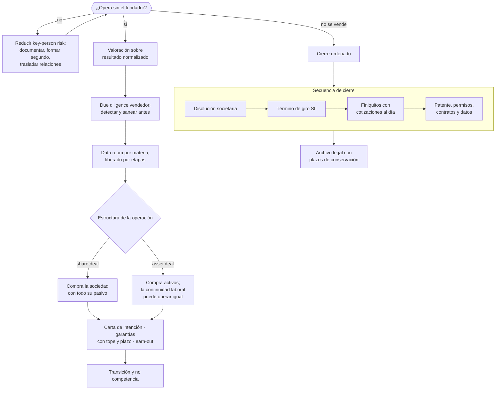

# Parte 22 — Venta, sucesión, transformación y cierre

> *Una empresa vale lo que puede operar sin su fundador*

⚫ **Etapa 6 — Crisis, salida y práctica integrada** · salida de la etapa: Caso completo defendido y capacidad de operar bajo estrés

**Estado de evidencia:** `VERIFICADO-FUENTE` · **Clases:** 14 (295–308) · **Fecha base normativa:** 07-08-2026 
**Contenido central:** Transferibilidad, key-person risk, valoración, data room, asset o share deal, sucesión y cierre 
**Conceptos definidos en esta parte:** 56

## 🎯 De qué trata esta parte

El valor de una empresa pequeña se descuenta por tres factores que casi siempre están presentes: dependencia del fundador, concentración de clientes e información financiera no confiable. Reducir esos tres aumenta el precio más que cualquier mejora marginal de resultado, y ninguno se arregla en los meses previos a una venta. Por eso la decisión de hacer la empresa vendible se toma años antes de querer venderla.

La preparación técnica pasa por hacerse la due diligence a uno mismo antes que el comprador. En Chile los hallazgos que más afectan precio son laborales —honorarios que encubrían relación de dependencia, cotizaciones impagas, finiquitos mal formalizados— y tributarios. Detectarlos y sanearlos vale más que negociarlos después; y lo que no se puede sanear, se divulga: un hallazgo divulgado se negocia, uno descubierto destruye la confianza de toda la operación.

La parte también trata el escenario que nadie quiere planificar: el cierre ordenado. Disolución societaria, término de giro ante el SII, finiquitos con cotizaciones al día, cancelación de patente y permisos, y destino de los datos personales tratados. Cada pendiente sigue generando obligaciones después de que la empresa dejó de operar.

## 📚 Resultados de la parte

Al terminar esta parte podrás:

1. **Medir y reducir la dependencia del fundador**.
2. **Preparar un data room que resista due diligence**.
3. **Elegir entre venta de activos y venta de acciones con criterio tributario y de riesgo**.
4. **Ejecutar un cierre ordenado: societario, tributario, laboral y de permisos**.

## 🗺️ Mapa de la parte

## ⚖️ Marco aplicable

- Ley 20.720 en escenarios de cierre por insolvencia
- Código Tributario y normas del SII sobre término de giro
- Código del Trabajo en materia de finiquitos y causales de término
- normas societarias sobre disolución y liquidación

**Autoridades o contrapartes:** SII, Dirección del Trabajo, Registro de Empresas y Sociedades, Conservador de Bienes Raíces.
**Profesionales de apoyo:** abogado corporativo y tributario, banquero de inversión o asesor M&A, contador, abogado laboral.

## ⚠️ Riesgos característicos

- Vender una empresa cuya operación depende de relaciones personales del fundador.
- No ordenar contratos, propiedad intelectual y laboral antes de la due diligence.
- Cerrar la sociedad sin término de giro y arrastrar contingencia tributaria.
- Finiquitar sin la documentación completa y exponerse a demanda laboral.

## 📘 Las 14 clases

| # | Global | Clase | Decisión que habilita |
|---:|---:|---|---|
| 01 | 295 | [Construir una empresa transferible](class-01-construir-una-empresa-transferible/README.md) | identificar qué falta para que la empresa opere sin su fundador |
| 02 | 296 | [Dependencia del fundador y key-person risk](class-02-dependencia-del-fundador-y-key-person-risk/README.md) | identificar las personas críticas y reducir la dependencia de cada una |
| 03 | 297 | [Valoración para venta](class-03-valoracion-para-venta/README.md) | estimar el rango de valor esperable con resultado normalizado |
| 04 | 298 | [Preparar un data room de M&A](class-04-preparar-un-data-room-de-m-a/README.md) | preparar el data room y definir la liberación por etapas |
| 05 | 299 | [Due diligence vendedor](class-05-due-diligence-vendedor/README.md) | detectar y sanear las contingencias antes de abrir el proceso de venta |
| 06 | 300 | [Asset deal versus share deal](class-06-asset-deal-versus-share-deal/README.md) | elegir la estructura de la transacción con criterio tributario y de riesgo |
| 07 | 301 | [Negociación de compraventa empresarial](class-07-negociacion-de-compraventa-empresarial/README.md) | negociar las condiciones principales y el alcance de las garantías |
| 08 | 302 | [Transición, earn-out y no competencia](class-08-transicion-earn-out-y-no-competencia/README.md) | definir el período de transición y las condiciones del earn-out |
| 09 | 303 | [Sucesión familiar o ejecutiva](class-09-sucesion-familiar-o-ejecutiva/README.md) | definir las reglas de sucesión y la separación entre propiedad y gestión |
| 10 | 304 | [Disolución societaria](class-10-disolucion-societaria/README.md) | ejecutar la disolución con las formalidades y el orden correcto |
| 11 | 305 | [Término de giro ante SII](class-11-termino-de-giro-ante-sii/README.md) | ejecutar el término de giro en plazo y con la información completa |
| 12 | 306 | [Finiquitos y cierre laboral](class-12-finiquitos-y-cierre-laboral/README.md) | ejecutar el cierre laboral con causal correcta y formalidades completas |
| 13 | 307 | [Cierre de permisos, contratos, datos y cuentas](class-13-cierre-de-permisos-contratos-datos-y-cuentas/README.md) | ejecutar el cierre completo de habilitaciones, contratos, datos y cuentas |
| 14 | 308 | [Lecciones aprendidas y archivo legal](class-14-lecciones-aprendidas-y-archivo-legal/README.md) | definir qué se conserva, por cuánto tiempo y quién responde |

## 🔤 Glosario de la parte

| Concepto | Definición operacional |
|---|---|
| **Activo intangible documentado** | Conocimiento, procesos y relaciones registrados en la empresa. |
| **Acuerdo de confidencialidad** | Condición previa al acceso. |
| **Ajuste normalizador** | Corrección de gastos personales o extraordinarios del dueño. |
| **Alineación de incentivos** | Coherencia entre el earn-out y el control efectivo. |
| **Archivo legal** | Conjunto de documentos que deben conservarse tras el cierre. |
| **Asset deal** | Venta de activos determinados. |
| **Cancelación de patente** | Aviso al municipio del cese de actividad. |
| **Carta de intención** | Documento preliminar con condiciones principales. |
| **Causal de término** | Fundamento legal invocado. |
| **Certificado de término de giro** | Documento que acredita el cierre tributario. |
| **Cierre de cuentas** | Término de relaciones bancarias y de servicios. |
| **Cierre de permisos** | Término formal de habilitaciones vigentes. |
| **Conocimiento tácito** | Saber no documentado que vive en una persona. |
| **Contingencia** | Obligación probable no registrada. |
| **Contrato a nombre de la empresa** | Vínculo que no depende de la persona del fundador. |
| **Data room de M&A** | Repositorio ordenado para el proceso de venta. |
| **Declaraciones y garantías** | Afirmaciones del vendedor que soportan el precio. |
| **Descuento por dependencia** | Reducción de valor por la dependencia del dueño actual. |
| **Disolución** | Acuerdo o causa que pone fin a la sociedad. |
| **Distribución del remanente** | Reparto entre socios de lo que queda. |
| **Divulgación** | Revelación de un problema conocido al comprador. |
| **Due diligence vendedor** | Revisión previa hecha por el propio vendedor. |
| **Earn-out** | Parte del precio condicionada a resultados futuros. |
| **Efecto tributario** | Carga impositiva de cada estructura. |
| **Eliminación o entrega de datos** | Cumplimiento de obligaciones sobre datos personales al cerrar. |
| **Empresa transferible** | Aquella que opera y vale con otro dueño. |
| **Exclusividad** | Período en que el vendedor no negocia con otros. |
| **Finiquito** | Documento que liquida la relación laboral. |
| **Impuesto de término de giro** | Gravamen sobre rentas acumuladas al cierre. |
| **Indemnización** | Pago que corresponde según causal y antigüedad. |
| **Información sensible** | Datos que se liberan por etapas del proceso. |
| **Key-person risk** | Dependencia crítica de una persona. |
| **Lecciones aprendidas** | Análisis de lo que funcionó y lo que no. |
| **Liquidación societaria** | Proceso de realizar activos y pagar pasivos. |
| **Múltiplo de mercado** | Factor observado en transacciones comparables. |
| **No competencia** | Obligación del vendedor de no competir por un plazo. |
| **Plan de formación** | Preparación del sucesor. |
| **Plan de sucesión** | Preparación de un reemplazo para un rol crítico. |
| **Plazo de conservación** | Período legal de retención posterior. |
| **Plazo legal** | Tiempo desde el cese para presentar el aviso. |
| **Precio y ajuste** | Monto y mecanismo de corrección al cierre. |
| **Protocolo familiar** | Acuerdo que regula la relación entre familia y empresa. |
| **Publicidad del acto** | Inscripción y publicación exigidas. |
| **Rango de negociación** | Banda dentro de la cual es razonable acordar. |
| **Ratificación** | Suscripción con las formalidades que la ley exige. |
| **Redundancia** | Existencia de más de una persona capaz de ejecutar. |
| **Responsabilidad posterior** | Obligaciones que sobreviven al cierre. |
| **Saneamiento previo** | Corrección de hallazgos antes de abrir el proceso. |
| **Separación de roles** | Distinción entre propiedad, gobierno y gestión. |
| **Share deal** | Venta de las acciones o derechos de la sociedad. |
| **Sucesión** | Transferencia de la conducción a la generación o ejecutivo siguiente. |
| **Sucesión de pasivos** | Transmisión de obligaciones al comprador. |
| **Transición** | Período en que el vendedor acompaña al comprador. |
| **Término de giro** | Acto que pone fin a la vida tributaria de la empresa. |
| **Valoración para venta** | Estimación del precio esperable en una transacción real. |
| **Índice de due diligence** | Estructura por materia que espera el comprador. |

## 🔗 Cómo se conecta

Cierra el ciclo abierto en la parte 01 con la pregunta de transferibilidad. Depende del orden societario de la parte 05, del tributario de la parte 07, del laboral de la parte 12 y del data room de la parte 16.

## 📖 Pauta bibliográfica

- Código Tributario y normas del SII sobre término de giro.
- Código del Trabajo — causales, finiquitos y efecto liberatorio.
- Ley 20.720 en escenarios de cierre por insolvencia.

## 🏛️ Fuentes oficiales de la parte

**Servicio de Impuestos Internos — Nuevos contribuyentes, inicio de actividades y DTE**  
<https://www.sii.cl/ayudas/nuevos_contribuyentes/boleta-vys-facturador.html> · verificado 2026-08-19

- *Qué contiene:* Reúne el circuito completo del contribuyente nuevo: obtención de RUT, declaración de inicio de actividades, elección de códigos de actividad económica y habilitación para emitir documentos tributarios electrónicos.
- *Cómo leerla:* Sepáralo en dos actos distintos que la página trata seguidos: el RUT identifica, el inicio de actividades habilita. Lo que te bloquea para facturar casi siempre está en el segundo, no en el primero.

**Servicio de Impuestos Internos — Carpeta Tributaria Electrónica**  
<https://zeus.sii.cl/dii_doc/carpeta_tributaria/html/generar_carpeta.htm> · verificado 2026-08-19

- *Qué contiene:* Permite generar el expediente que acredita la situación tributaria de la empresa: inicio de actividades, régimen, declaraciones presentadas y timbraje.
- *Cómo leerla:* Es el documento que pedirán banco, inversionista y comprador. Genera una hoy aunque no la necesites: lo que muestre es exactamente lo que verá un tercero al evaluarte.

**Dirección del Trabajo — Relaciones laborales y obligaciones del empleador**  
<https://www.dt.gob.cl/> · verificado 2026-08-19

- *Qué contiene:* Concentra el Código del Trabajo aplicado: dictámenes que interpretan la norma en casos concretos, la plataforma Mi DT para registrar contratos y finiquitos, y las guías de fiscalización.
- *Cómo leerla:* Los dictámenes valen más que las guías divulgativas: describen cómo la autoridad resolvió un caso real. Busca por materia y contrasta la fecha, porque un dictamen posterior puede cambiar el criterio anterior.

**Registro de Empresas y Sociedades / ChileAtiende — Constitución de empresas**  
<https://www.chileatiende.gob.cl/fichas/21409-tu-empresa> · verificado 2026-08-19

- *Qué contiene:* Describe el régimen simplificado de la Ley 20.659: qué tipos societarios admite el formulario electrónico, quiénes deben firmar, qué documentos entrega el sistema y cómo se hacen después las modificaciones.
- *Cómo leerla:* Entra por el tipo societario que ya elegiste, no al revés. La ficha dice qué campos pide el formulario; si tu estatuto necesita una cláusula que el formulario no soporta, la respuesta es la ruta notarial.

**Biblioteca del Congreso Nacional · LeyChile — Normativa oficial consolidada**  
<https://www.bcn.cl/leychile/> · verificado 2026-08-19

- *Qué contiene:* Publica el texto oficial y consolidado de leyes, decretos y reglamentos, con la versión vigente a una fecha, el historial de modificaciones y la tramitación que las originó.
- *Cómo leerla:* Usa siempre el selector de versión vigente a la fecha en que ejecutarás el trámite, no la última publicada. Y lee el artículo transitorio: en normas en implantación gradual —jornada, datos personales— ahí está la fecha que realmente te aplica.

---

| Anterior | Índice | Siguiente |
|---|---|---|
| [← Parte 21 · Crisis, continuidad, insolvencia y recuperación](../part-21-crisis-continuidad-insolvencia-y-recuperacion/README.md) | [Currículo](../../CURRICULUM.md) · [Programa](../../README.md) | [Parte 23 · Estudios de líneas de negocio reales 2026 →](../part-23-estudios-de-lineas-de-negocio-reales-2026/README.md) |
