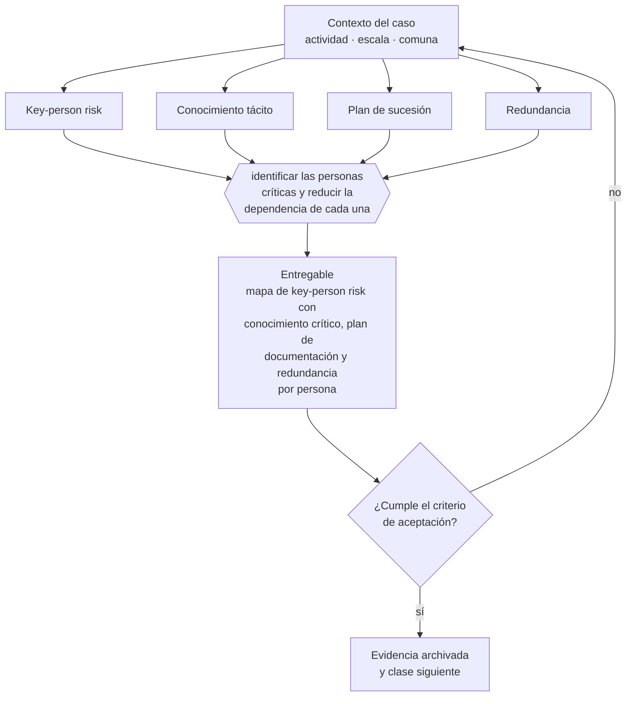

# Clase 296 — Dependencia del fundador y key-person risk

> **Parte 22 · Venta, sucesión, transformación y cierre** — clase 2 de 14

**Estado de evidencia:** `VERIFICADO-FUENTE` · **Jurisdicción:** Chile-first · **Fecha base normativa:** 07-08-2026 
**Decisión que habilita:** identificar las personas críticas y reducir la dependencia de cada una 
**Entregable:** mapa de key-person risk con conocimiento crítico, plan de documentación y redundancia por persona

## 🎯 Propósito

Reducir la dependencia de personas críticas documentando el conocimiento tácito y formando un segundo responsable.

## 📚 Resultados de aprendizaje

Al finalizar esta clase podrás:

1. **Definir** con precisión los cuatro conceptos de la tabla siguiente y usarlos para describir un caso real.
2. **Explicar** por qué esta materia condiciona decisiones de otras partes del programa.
3. **Decidir** —identificar las personas críticas y reducir la dependencia de cada una— y justificar la decisión por escrito.
4. **Producir** el entregable de la clase y contrastarlo contra su criterio de aceptación.
5. **Distinguir** el dato estable del dato dinámico que exige revalidación en la fuente oficial.

## 🧩 Conceptos centrales

| Concepto | Comprensión verificable |
|---|---|
| **Key-person risk** | Dependencia crítica de una persona. |
| **Conocimiento tácito** | Saber no documentado que vive en una persona. |
| **Plan de sucesión** | Preparación de un reemplazo para un rol crítico. |
| **Redundancia** | Existencia de más de una persona capaz de ejecutar. |

## 🗺️ Flujo de razonamiento

## 📖 Desarrollo

### 1. El fondo del asunto

El key-person risk se reduce documentando el conocimiento tácito, formando un segundo responsable y trasladando relaciones a la empresa. La prueba práctica es simple y rara vez se hace: qué pasaría si esa persona no volviera mañana.

### 2. Cómo se traduce en la práctica

La prueba práctica se hace rara vez y es simple: qué pasaría si esa persona no volviera mañana. Identificar el riesgo sin ejecutar la documentación es el patrón habitual, porque documentar compite con la operación diaria y siempre pierde salvo que se calendarice.

### 3. Marco aplicable y quién interviene

- Ley 20.720 en escenarios de cierre por insolvencia
- Código Tributario y normas del SII sobre término de giro
- Código del Trabajo en materia de finiquitos y causales de término
- normas societarias sobre disolución y liquidación

**Autoridades o contrapartes involucradas:** SII, Dirección del Trabajo, Registro de Empresas y Sociedades, Conservador de Bienes Raíces.
**Profesionales de apoyo:** abogado corporativo y tributario, banquero de inversión o asesor M&A, contador, abogado laboral. La participación concreta depende del riesgo, del
tamaño de la empresa y de la actividad económica.

## 🧪 Taller guiado

Aplica esta clase a **una** de las siguientes líneas de negocio y repite después el ejercicio con
una segunda línea de carga regulatoria distinta:

| Línea | Carga regulatoria |
|---|---|
| SaaS B2B con IA | media |
| Servicios profesionales | baja |
| E-commerce D2C | media |
| Alimentos o foodtech | alta |
| Exportación de servicios | media |
| Fintech regulada | alta |
| Construcción o servicios técnicos | alta |

**Secuencia de trabajo:**

1. Delimita el contexto: actividad económica, escala, comuna y etapa de la empresa.
2. Reúne los antecedentes que la decisión exige y anota la fecha de cada fuente.
3. Identifica las alternativas reales, incluida la de no hacer nada.
4. Evalúa el impacto en mercado, caja, personas, regulación y operación.
5. Toma la decisión y regístrala con sus supuestos.
6. Produce el entregable.
7. Contrástalo contra el criterio de aceptación.
8. Anota lo que requiere validación profesional y programa su revisión.

### 📦 Entregable

Mapa de key-person risk con conocimiento crítico, plan de documentación y redundancia por persona.

Debe incluir decisión, supuestos, fuentes con fecha de consulta, responsable, riesgos
identificados y próximos pasos.

## 🏆 Reto verificable

Resuelve la misma materia para una segunda línea de negocio con distinta carga regulatoria y
explica por escrito **qué cambió, por qué y qué fuente lo determina**.

## ✅ Criterio de aceptación

- [ ] cada persona crítica tiene plan de documentación y redundancia
- [ ] las relaciones clave están siendo trasladadas a la empresa
- [ ] cada afirmación regulatoria está referida a una fuente oficial con fecha de consulta;
- [ ] los datos dinámicos quedan marcados para revalidación;
- [ ] hay un responsable asignado y evidencia reproducible del trabajo.

## ⚠️ Errores frecuentes

**Propios de esta clase:**

- Identificar el riesgo y no ejecutar la documentación del conocimiento.
- Asumir que la relación con el cliente se transfiere sola.

**Característicos de la parte 22:**

- Vender una empresa cuya operación depende de relaciones personales del fundador.
- No ordenar contratos, propiedad intelectual y laboral antes de la due diligence.

## 🇨🇱 Checklist Chile

- [ ] ¿existe norma o autoridad específica para esta materia?
- [ ] ¿la fuente consultada está vigente a la fecha de ejecución?
- [ ] ¿se activa algún trámite ante el SII?
- [ ] ¿se activa algún requisito municipal o sectorial?
- [ ] ¿afecta a consumidores o al tratamiento de datos personales?
- [ ] ¿afecta a trabajadores o a la seguridad y salud en el trabajo?
- [ ] ¿afecta a impuestos, contabilidad o caja?
- [ ] ¿afecta a contratos o a propiedad intelectual?
- [ ] ¿requiere renovación, reporte periódico o revalidación?

## ❓ Preguntas de comprobación

1. ¿Qué conocimiento crítico vive solo en la cabeza de una persona?
2. ¿Quién es el segundo responsable de cada función crítica?
3. ¿Las relaciones con clientes clave son de la empresa o de la persona?

## 🔗 Fuentes oficiales

**Servicio de Impuestos Internos — Nuevos contribuyentes, inicio de actividades y DTE**  
<https://www.sii.cl/ayudas/nuevos_contribuyentes/boleta-vys-facturador.html> · verificado 2026-08-19

- *Qué contiene:* Reúne el circuito completo del contribuyente nuevo: obtención de RUT, declaración de inicio de actividades, elección de códigos de actividad económica y habilitación para emitir documentos tributarios electrónicos.
- *Cómo leerla:* Sepáralo en dos actos distintos que la página trata seguidos: el RUT identifica, el inicio de actividades habilita. Lo que te bloquea para facturar casi siempre está en el segundo, no en el primero.
- *Uso en esta clase:* aporta el marco de «Nuevos contribuyentes, inicio de actividades y DTE» para identificar las personas críticas y reducir la dependencia de cada una.

**Servicio de Impuestos Internos — Carpeta Tributaria Electrónica**  
<https://zeus.sii.cl/dii_doc/carpeta_tributaria/html/generar_carpeta.htm> · verificado 2026-08-19

- *Qué contiene:* Permite generar el expediente que acredita la situación tributaria de la empresa: inicio de actividades, régimen, declaraciones presentadas y timbraje.
- *Cómo leerla:* Es el documento que pedirán banco, inversionista y comprador. Genera una hoy aunque no la necesites: lo que muestre es exactamente lo que verá un tercero al evaluarte.
- *Uso en esta clase:* aporta el marco de «Carpeta Tributaria Electrónica» para identificar las personas críticas y reducir la dependencia de cada una.

**Dirección del Trabajo — Relaciones laborales y obligaciones del empleador**  
<https://www.dt.gob.cl/> · verificado 2026-08-19

- *Qué contiene:* Concentra el Código del Trabajo aplicado: dictámenes que interpretan la norma en casos concretos, la plataforma Mi DT para registrar contratos y finiquitos, y las guías de fiscalización.
- *Cómo leerla:* Los dictámenes valen más que las guías divulgativas: describen cómo la autoridad resolvió un caso real. Busca por materia y contrasta la fecha, porque un dictamen posterior puede cambiar el criterio anterior.
- *Uso en esta clase:* aporta el marco de «Relaciones laborales y obligaciones del empleador» para identificar las personas críticas y reducir la dependencia de cada una.

Complementos del repositorio: [glosario](../../../docs/19_GLOSSARY.md) ·
[ruta de lecturas](../../../docs/15_BOOKS_AND_LEARNING_PATH.md) ·
[catálogo de fuentes](../../../docs/16_OFFICIAL_SOURCE_CATALOG.md).

> [!IMPORTANT]
> Material educativo. Para una decisión real de alto impacto hay que verificar la fuente oficial
> vigente y validar con el profesional competente.

---

| Anterior | Índice | Siguiente |
|---|---|---|
| [← 295 · Construir una empresa transferible](../class-01-construir-una-empresa-transferible/README.md) | [Parte 22](../README.md) · [Programa](../../../README.md) | [297 · Valoración para venta →](../class-03-valoracion-para-venta/README.md) |
