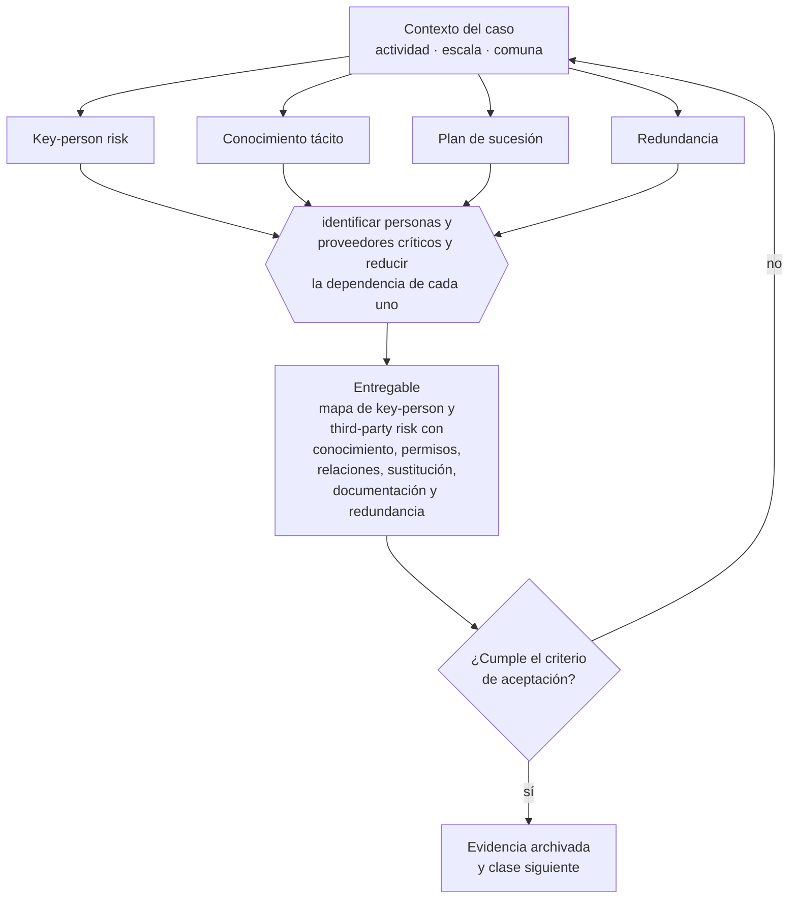

# Clase 296 — Dependencia del fundador y key-person risk

> **Parte 22 · Venta, sucesión, transformación y cierre** — clase 2 de 14

**Estado de evidencia:** `VERIFICADO-FUENTE` · **Jurisdicción:** Chile-first · **Fecha base normativa:** 07-08-2026 
**Decisión que habilita:** identificar personas y proveedores críticos y reducir la dependencia de cada uno 
**Entregable:** mapa de key-person y third-party risk con conocimiento, permisos, relaciones, sustitución, documentación y redundancia

## 🎯 Propósito

Reducir la dependencia de personas críticas documentando el conocimiento tácito y formando un segundo responsable.

## 📚 Resultados de aprendizaje

Al finalizar esta clase podrás:

1. **Definir** con precisión los cuatro conceptos de la tabla siguiente y usarlos para describir un caso real.
2. **Explicar** por qué esta materia condiciona decisiones de otras partes del programa.
3. **Decidir** —identificar personas y proveedores críticos y reducir la dependencia de cada uno— y justificar la decisión por escrito.
4. **Producir** el entregable de la clase y contrastarlo contra su criterio de aceptación.
5. **Distinguir** el dato estable del dato dinámico que exige revalidación en la fuente oficial.

## 🧩 Conceptos centrales

| Concepto | Comprensión verificable |
|---|---|
| **Key-person risk** | Dependencia crítica de una persona. |
| **Conocimiento tácito** | Saber no documentado que vive en una persona. |
| **Plan de sucesión** | Preparación de un reemplazo para un rol crítico. |
| **Redundancia** | Existencia de más de una persona capaz de ejecutar y autorizar. |

## 🗺️ Flujo de razonamiento

```mermaid
flowchart TB
    C["Contexto del caso<br/>actividad · escala · comuna"]
    C --> A1["Key-person risk"]
    C --> A2["Conocimiento tácito"]
    C --> A3["Plan de sucesión"]
    C --> A4["Redundancia"]
    A1 & A2 & A3 & A4 --> D{{"identificar personas y<br/>proveedores críticos y reducir<br/>la dependencia de cada uno"}}
    D --> E["Entregable<br/>mapa de key-person y<br/>third-party risk con<br/>conocimiento, permisos,<br/>relaciones, sustitución,<br/>documentación y redundancia"]
    E --> V{"¿Cumple el criterio<br/>de aceptación?"}
    V -->|sí| S["Evidencia archivada<br/>y clase siguiente"]
    V -->|no| C
```

## 📖 Desarrollo

### 1. El fondo del asunto

El key-person risk se reduce documentando conocimiento, formando un segundo responsable, separando permisos y trasladando relaciones a la empresa. La automatización no crea redundancia por sí sola: si el fundador diseñó integraciones, conserva credenciales, recibe excepciones y decide cambios de proveedor, el sistema puede procesar miles de casos y seguir dependiendo de una sola persona. La prueba debe cubrir ausencia del fundador y caída de un tercero crítico.

### 2. Cómo se traduce en la práctica

La prueba práctica se hace rara vez y es simple: qué pasaría si esa persona no volviera mañana. Identificar el riesgo sin ejecutar la documentación es el patrón habitual, porque documentar compite con la operación diaria y siempre pierde salvo que se calendarice.

### 3. Marco aplicable y quién interviene

- Ley 20.720 en escenarios de cierre por insolvencia
- Código Tributario y normas del SII sobre término de giro
- Código del Trabajo en materia de finiquitos y causales de término
- normas societarias sobre disolución y liquidación

**Autoridades o contrapartes involucradas:** SII, Dirección del Trabajo, Registro de Empresas y Sociedades, Conservador de Bienes Raíces.
**Profesionales de apoyo:** abogado corporativo y tributario, banquero de inversión o asesor M&A, contador, abogado laboral. La participación concreta depende del riesgo, del
tamaño de la empresa y de la actividad económica.

## 🔬 Caso aplicado: MEDVi

[MEDVi: empresa AI-native, red externa y control al crecer](../../../case-studies/21-medvi-empresa-ai-native-y-control.md#7-founder-bottleneck-y-matrices-de-tension)

**Lente para esta clase:** probar si una empresa de dos empleados sigue operando cuando falta el fundador o falla un proveedor externo crítico.

El expediente separa hechos verificados, cifras reportadas, alegaciones periodísticas,
actuaciones regulatorias, respuesta de la empresa e interpretación pedagógica. No uses una
categoría como prueba automática de otra.

## 🧪 Taller guiado

Aplica esta clase a **una** de las siguientes líneas de negocio y repite después el ejercicio con
una segunda línea de carga regulatoria distinta:

| Línea | Carga regulatoria |
|---|---|
| SaaS B2B con IA | media |
| Servicios profesionales | baja |
| E-commerce D2C | media |
| Alimentos o foodtech | alta |
| Exportación de servicios | media |
| Fintech regulada | alta |
| Construcción o servicios técnicos | alta |

**Secuencia de trabajo:**

1. Delimita el contexto: actividad económica, escala, comuna y etapa de la empresa.
2. Reúne los antecedentes que la decisión exige y anota la fecha de cada fuente.
3. Identifica las alternativas reales, incluida la de no hacer nada.
4. Evalúa el impacto en mercado, caja, personas, regulación y operación.
5. Toma la decisión y regístrala con sus supuestos.
6. Produce el entregable.
7. Contrástalo contra el criterio de aceptación.
8. Anota lo que requiere validación profesional y programa su revisión.

### 📦 Entregable

Mapa de key-person y third-party risk con conocimiento, permisos, relaciones, sustitución, documentación y redundancia.

Debe incluir decisión, supuestos, fuentes con fecha de consulta, responsable, riesgos
identificados y próximos pasos.

## 🏆 Reto verificable

Resuelve la misma materia para una segunda línea de negocio con distinta carga regulatoria y
explica por escrito **qué cambió, por qué y qué fuente lo determina**.

## ✅ Criterio de aceptación

- [ ] cada persona y proveedor crítico tiene documentación, segundo responsable y plan de sustitución probado
- [ ] credenciales, relaciones, datos y autoridad de decisión sobreviven a la ausencia del fundador
- [ ] cada afirmación regulatoria está referida a una fuente oficial con fecha de consulta;
- [ ] los datos dinámicos quedan marcados para revalidación;
- [ ] hay un responsable asignado y evidencia reproducible del trabajo.

## ⚠️ Errores frecuentes

**Propios de esta clase:**

- Contar software y proveedores como redundancia sin probar sustitución, acceso a datos y continuidad.
- Asumir que una relación comercial o regulatoria se transfiere sola cuando falta la persona clave.

**Característicos de la parte 22:**

- Vender una empresa cuya operación depende de relaciones personales del fundador.
- No ordenar contratos, propiedad intelectual y laboral antes de la due diligence.

## 🇨🇱 Checklist Chile

- [ ] ¿existe norma o autoridad específica para esta materia?
- [ ] ¿la fuente consultada está vigente a la fecha de ejecución?
- [ ] ¿se activa algún trámite ante el SII?
- [ ] ¿se activa algún requisito municipal o sectorial?
- [ ] ¿afecta a consumidores o al tratamiento de datos personales?
- [ ] ¿afecta a trabajadores o a la seguridad y salud en el trabajo?
- [ ] ¿afecta a impuestos, contabilidad o caja?
- [ ] ¿afecta a contratos o a propiedad intelectual?
- [ ] ¿requiere renovación, reporte periódico o revalidación?

## ❓ Preguntas de comprobación

1. ¿Qué conocimiento crítico vive solo en la cabeza de una persona?
2. ¿Quién es el segundo responsable de cada función crítica?
3. ¿Las relaciones con clientes clave son de la empresa o de la persona?

## 🔗 Fuentes oficiales

**Biblioteca del Congreso Nacional · LeyChile — Normativa oficial consolidada**  
<https://www.bcn.cl/leychile/> · verificado 2026-09-01

- *Qué contiene:* Publica el texto oficial y consolidado de leyes, decretos y reglamentos, con la versión vigente a una fecha, el historial de modificaciones y la tramitación que las originó.
- *Cómo leerla:* Usa siempre el selector de versión vigente a la fecha en que ejecutarás el trámite, no la última publicada. Y lee el artículo transitorio: en normas en implantación gradual —jornada, datos personales— ahí está la fecha que realmente te aplica.
- *Uso en esta clase:* aporta el marco de «Normativa oficial consolidada» para identificar personas y proveedores críticos y reducir la dependencia de cada uno.

**The New York Times · republicado por GV Wire — A $1.8 Billion Company With Two Employees? AI Made It Possible**  
<https://gvwire.com/2026/04/05/a-1-8-billion-company-with-two-employees-ai-made-it-possible/> · verificado 2026-10-04

- *Qué contiene:* Perfil empresarial que declara acceso del New York Times a estados financieros y contrapartes, y documenta capital inicial, tiempo de construcción, ventas, margen, herramientas de IA, contratistas y proveedores externos.
- *Cómo leerla:* Distingue cifras verificadas por el medio, afirmaciones del fundador y proyecciones. La meta de US$1.800 millones es una proyección de ventas, no valoración; dos empleados no significa dos ejecutores de toda la cadena.
- *Uso en esta clase:* aporta el marco de «A $1.8 Billion Company With Two Employees? AI Made It Possible» para identificar personas y proveedores críticos y reducir la dependencia de cada uno.

**U.S. Food and Drug Administration — MEDVi, LLC dba MEDVi: Warning Letter MARCS-CMS 721455**  
<https://www.fda.gov/inspections-compliance-enforcement-and-criminal-investigations/warning-letters/medvi-llc-dba-medvi-721455-02202026> · verificado 2026-10-04

- *Qué contiene:* Carta de advertencia fechada el 20 de febrero de 2026, dirigida a MEDVi, LLC dba MEDVi, sobre claims y rotulado observados por FDA en medvi.io durante diciembre de 2025.
- *Cómo leerla:* Distingue lo que FDA observó y calificó como misbranding de cualquier conclusión penal o de falsificación. Registra destinatario, dominio, claims, normas citadas, plazo de respuesta y medidas advertidas sin ampliar su alcance.
- *Uso en esta clase:* aporta el marco de «MEDVi, LLC dba MEDVi: Warning Letter MARCS-CMS 721455» para identificar personas y proveedores críticos y reducir la dependencia de cada uno.

Complementos del repositorio: [glosario](../../../docs/19_GLOSSARY.md) ·
[ruta de lecturas](../../../docs/15_BOOKS_AND_LEARNING_PATH.md) ·
[catálogo de fuentes](../../../docs/16_OFFICIAL_SOURCE_CATALOG.md).

> [!IMPORTANT]
> Material educativo. Para una decisión real de alto impacto hay que verificar la fuente oficial
> vigente y validar con el profesional competente.

---

| Anterior | Índice | Siguiente |
|---|---|---|
| [← 295 · Construir una empresa transferible](../class-01-construir-una-empresa-transferible/README.md) | [Parte 22](../README.md) · [Programa](../../../README.md) | [297 · Valoración para venta →](../class-03-valoracion-para-venta/README.md) |
