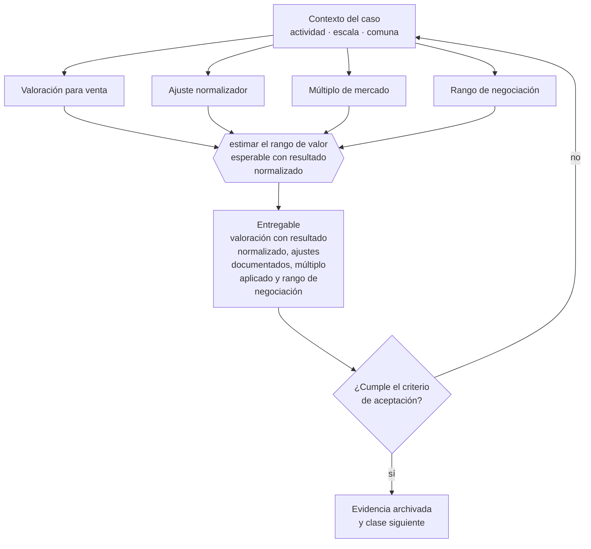

# Clase 297 — Valoración para venta

> **Parte 22 · Venta, sucesión, transformación y cierre** — clase 3 de 14

**Estado de evidencia:** `VERIFICADO-FUENTE` · **Jurisdicción:** Chile-first · **Fecha base normativa:** 07-08-2026 
**Decisión que habilita:** estimar el rango de valor esperable con resultado normalizado 
**Entregable:** valoración con resultado normalizado, ajustes documentados, múltiplo aplicado y rango de negociación

## 🎯 Propósito

Estimar el rango de valor con resultado normalizado, ajustando gastos personales del dueño y remuneraciones a valor de mercado.

## 📚 Resultados de aprendizaje

Al finalizar esta clase podrás:

1. **Definir** con precisión los cuatro conceptos de la tabla siguiente y usarlos para describir un caso real.
2. **Explicar** por qué esta materia condiciona decisiones de otras partes del programa.
3. **Decidir** —estimar el rango de valor esperable con resultado normalizado— y justificar la decisión por escrito.
4. **Producir** el entregable de la clase y contrastarlo contra su criterio de aceptación.
5. **Distinguir** el dato estable del dato dinámico que exige revalidación en la fuente oficial.

## 🧩 Conceptos centrales

| Concepto | Comprensión verificable |
|---|---|
| **Valoración para venta** | Estimación del precio esperable en una transacción real. |
| **Ajuste normalizador** | Corrección de gastos personales o extraordinarios del dueño. |
| **Múltiplo de mercado** | Factor observado en transacciones comparables. |
| **Rango de negociación** | Banda dentro de la cual es razonable acordar. |

## 🗺️ Flujo de razonamiento

## 📖 Desarrollo

### 1. El fondo del asunto

La valoración para venta parte del resultado normalizado: se retiran gastos personales del dueño, se ajustan remuneraciones a valor de mercado y se eliminan partidas extraordinarias. Ese ejercicio suele cambiar sustancialmente el resultado sobre el que se aplica el múltiplo.

### 2. Cómo se traduce en la práctica

Ese ejercicio suele cambiar sustancialmente la base sobre la que se aplica el múltiplo, y es lo primero que hará un comprador. Fijar un precio de reserva sin considerar los descuentos por tamaño y dependencia produce expectativas que ninguna oferta va a cumplir.

### 3. Marco aplicable y quién interviene

- Ley 20.720 en escenarios de cierre por insolvencia
- Código Tributario y normas del SII sobre término de giro
- Código del Trabajo en materia de finiquitos y causales de término
- normas societarias sobre disolución y liquidación

**Autoridades o contrapartes involucradas:** SII, Dirección del Trabajo, Registro de Empresas y Sociedades, Conservador de Bienes Raíces.
**Profesionales de apoyo:** abogado corporativo y tributario, banquero de inversión o asesor M&A, contador, abogado laboral. La participación concreta depende del riesgo, del
tamaño de la empresa y de la actividad económica.

## 🧪 Taller guiado

Aplica esta clase a **una** de las siguientes líneas de negocio y repite después el ejercicio con
una segunda línea de carga regulatoria distinta:

| Línea | Carga regulatoria |
|---|---|
| SaaS B2B con IA | media |
| Servicios profesionales | baja |
| E-commerce D2C | media |
| Alimentos o foodtech | alta |
| Exportación de servicios | media |
| Fintech regulada | alta |
| Construcción o servicios técnicos | alta |

**Secuencia de trabajo:**

1. Delimita el contexto: actividad económica, escala, comuna y etapa de la empresa.
2. Reúne los antecedentes que la decisión exige y anota la fecha de cada fuente.
3. Identifica las alternativas reales, incluida la de no hacer nada.
4. Evalúa el impacto en mercado, caja, personas, regulación y operación.
5. Toma la decisión y regístrala con sus supuestos.
6. Produce el entregable.
7. Contrástalo contra el criterio de aceptación.
8. Anota lo que requiere validación profesional y programa su revisión.

### 📦 Entregable

Valoración con resultado normalizado, ajustes documentados, múltiplo aplicado y rango de negociación.

Debe incluir decisión, supuestos, fuentes con fecha de consulta, responsable, riesgos
identificados y próximos pasos.

## 🏆 Reto verificable

Resuelve la misma materia para una segunda línea de negocio con distinta carga regulatoria y
explica por escrito **qué cambió, por qué y qué fuente lo determina**.

## ✅ Criterio de aceptación

- [ ] los ajustes de normalización están documentados
- [ ] el rango considera los descuentos aplicables al tamaño
- [ ] cada afirmación regulatoria está referida a una fuente oficial con fecha de consulta;
- [ ] los datos dinámicos quedan marcados para revalidación;
- [ ] hay un responsable asignado y evidencia reproducible del trabajo.

## ⚠️ Errores frecuentes

**Propios de esta clase:**

- Valorar sobre el resultado contable sin normalizar.
- Fijar un precio de reserva sin considerar el descuento por dependencia.

**Característicos de la parte 22:**

- Vender una empresa cuya operación depende de relaciones personales del fundador.
- No ordenar contratos, propiedad intelectual y laboral antes de la due diligence.

## 🇨🇱 Checklist Chile

- [ ] ¿existe norma o autoridad específica para esta materia?
- [ ] ¿la fuente consultada está vigente a la fecha de ejecución?
- [ ] ¿se activa algún trámite ante el SII?
- [ ] ¿se activa algún requisito municipal o sectorial?
- [ ] ¿afecta a consumidores o al tratamiento de datos personales?
- [ ] ¿afecta a trabajadores o a la seguridad y salud en el trabajo?
- [ ] ¿afecta a impuestos, contabilidad o caja?
- [ ] ¿afecta a contratos o a propiedad intelectual?
- [ ] ¿requiere renovación, reporte periódico o revalidación?

## ❓ Preguntas de comprobación

1. ¿Cuál es tu resultado normalizado, con el sueldo del fundador a valor de mercado?
2. ¿De qué transacciones comparables obtuviste el múltiplo que usas?
3. ¿Qué descuentos aplicaría un comprador a tu caso y por cuánto?

## 🔗 Fuentes oficiales

**Servicio de Impuestos Internos — Nuevos contribuyentes, inicio de actividades y DTE**  
<https://www.sii.cl/ayudas/nuevos_contribuyentes/boleta-vys-facturador.html> · verificado 2026-08-07

- *Qué contiene:* Reúne el circuito completo del contribuyente nuevo: obtención de RUT, declaración de inicio de actividades, elección de códigos de actividad económica y habilitación para emitir documentos tributarios electrónicos.
- *Cómo leerla:* Sepáralo en dos actos distintos que la página trata seguidos: el RUT identifica, el inicio de actividades habilita. Lo que te bloquea para facturar casi siempre está en el segundo, no en el primero.

**Servicio de Impuestos Internos — Carpeta Tributaria Electrónica**  
<https://zeus.sii.cl/dii_doc/carpeta_tributaria/html/generar_carpeta.htm> · verificado 2026-08-07

- *Qué contiene:* Permite generar el expediente que acredita la situación tributaria de la empresa: inicio de actividades, régimen, declaraciones presentadas y timbraje.
- *Cómo leerla:* Es el documento que pedirán banco, inversionista y comprador. Genera una hoy aunque no la necesites: lo que muestre es exactamente lo que verá un tercero al evaluarte.

**Dirección del Trabajo — Relaciones laborales y obligaciones del empleador**  
<https://www.dt.gob.cl/> · verificado 2026-08-07

- *Qué contiene:* Concentra el Código del Trabajo aplicado: dictámenes que interpretan la norma en casos concretos, la plataforma Mi DT para registrar contratos y finiquitos, y las guías de fiscalización.
- *Cómo leerla:* Los dictámenes valen más que las guías divulgativas: describen cómo la autoridad resolvió un caso real. Busca por materia y contrasta la fecha, porque un dictamen posterior puede cambiar el criterio anterior.

Complementos del repositorio: [glosario](../../../docs/19_GLOSSARY.md) ·
[ruta de lecturas](../../../docs/15_BOOKS_AND_LEARNING_PATH.md) ·
[catálogo de fuentes](../../../docs/16_OFFICIAL_SOURCE_CATALOG.md).

> [!IMPORTANT]
> Material educativo. Para una decisión real de alto impacto hay que verificar la fuente oficial
> vigente y validar con el profesional competente.

---

| Anterior | Índice | Siguiente |
|---|---|---|
| [← 296 · Dependencia del fundador y key-person risk](../class-02-dependencia-del-fundador-y-key-person-risk/README.md) | [Parte 22](../README.md) · [Programa](../../../README.md) | [298 · Preparar un data room de M&A →](../class-04-preparar-un-data-room-de-m-a/README.md) |
