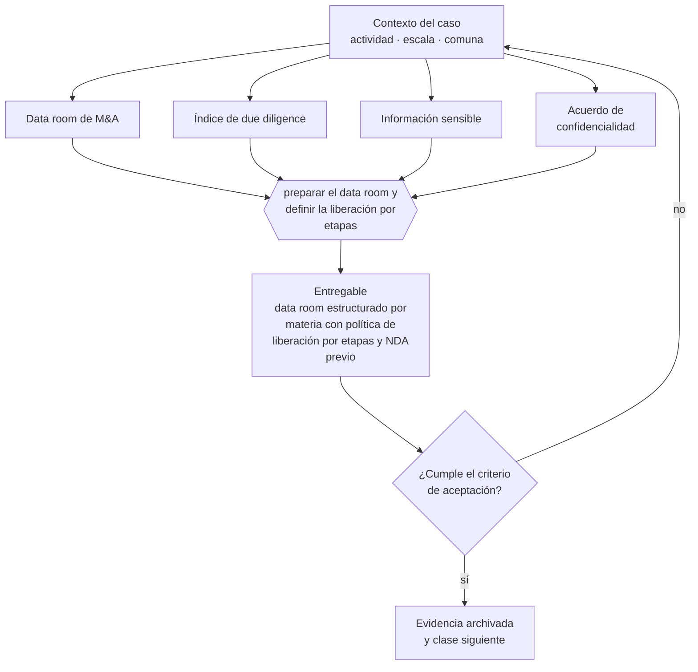

# Clase 298 — Preparar un data room de M&A

> **Parte 22 · Venta, sucesión, transformación y cierre** — clase 4 de 14

**Estado de evidencia:** `VERIFICADO-FUENTE` · **Jurisdicción:** Chile-first · **Fecha base normativa:** 07-08-2026 
**Decisión que habilita:** preparar el data room y definir la liberación por etapas 
**Entregable:** data room estructurado por materia con política de liberación por etapas y NDA previo

## 🎯 Propósito

Estructurar el data room por materia y liberar la información por etapas, con acuerdo de confidencialidad previo.

## 📚 Resultados de aprendizaje

Al finalizar esta clase podrás:

1. **Definir** con precisión los cuatro conceptos de la tabla siguiente y usarlos para describir un caso real.
2. **Explicar** por qué esta materia condiciona decisiones de otras partes del programa.
3. **Decidir** —preparar el data room y definir la liberación por etapas— y justificar la decisión por escrito.
4. **Producir** el entregable de la clase y contrastarlo contra su criterio de aceptación.
5. **Distinguir** el dato estable del dato dinámico que exige revalidación en la fuente oficial.

## 🧩 Conceptos centrales

| Concepto | Comprensión verificable |
|---|---|
| **Data room de M&A** | Repositorio ordenado para el proceso de venta. |
| **Índice de due diligence** | Estructura por materia que espera el comprador. |
| **Información sensible** | Datos que se liberan por etapas del proceso. |
| **Acuerdo de confidencialidad** | Condición previa al acceso. |

## 🗺️ Flujo de razonamiento

## 📖 Desarrollo

### 1. El fondo del asunto

El data room de venta se organiza por materias —societario, financiero, tributario, laboral, contractual, propiedad intelectual, tecnológico y regulatorio— y se libera por etapas. Entregar todo de inmediato a un competidor disfrazado de comprador es un riesgo real.

### 2. Cómo se traduce en la práctica

Entregar todo de inmediato a un interesado no verificado es un riesgo real: los competidores disfrazados de compradores existen. Y abrir el proceso con documentación incompleta transmite descontrol, que es una señal que ningún argumento posterior corrige durante la negociación.

### 3. Marco aplicable y quién interviene

- Ley 20.720 en escenarios de cierre por insolvencia
- Código Tributario y normas del SII sobre término de giro
- Código del Trabajo en materia de finiquitos y causales de término
- normas societarias sobre disolución y liquidación

**Autoridades o contrapartes involucradas:** SII, Dirección del Trabajo, Registro de Empresas y Sociedades, Conservador de Bienes Raíces.
**Profesionales de apoyo:** abogado corporativo y tributario, banquero de inversión o asesor M&A, contador, abogado laboral. La participación concreta depende del riesgo, del
tamaño de la empresa y de la actividad económica.

## 🧪 Taller guiado

Aplica esta clase a **una** de las siguientes líneas de negocio y repite después el ejercicio con
una segunda línea de carga regulatoria distinta:

| Línea | Carga regulatoria |
|---|---|
| SaaS B2B con IA | media |
| Servicios profesionales | baja |
| E-commerce D2C | media |
| Alimentos o foodtech | alta |
| Exportación de servicios | media |
| Fintech regulada | alta |
| Construcción o servicios técnicos | alta |

**Secuencia de trabajo:**

1. Delimita el contexto: actividad económica, escala, comuna y etapa de la empresa.
2. Reúne los antecedentes que la decisión exige y anota la fecha de cada fuente.
3. Identifica las alternativas reales, incluida la de no hacer nada.
4. Evalúa el impacto en mercado, caja, personas, regulación y operación.
5. Toma la decisión y regístrala con sus supuestos.
6. Produce el entregable.
7. Contrástalo contra el criterio de aceptación.
8. Anota lo que requiere validación profesional y programa su revisión.

### 📦 Entregable

Data room estructurado por materia con política de liberación por etapas y nda previo.

Debe incluir decisión, supuestos, fuentes con fecha de consulta, responsable, riesgos
identificados y próximos pasos.

## 🏆 Reto verificable

Resuelve la misma materia para una segunda línea de negocio con distinta carga regulatoria y
explica por escrito **qué cambió, por qué y qué fuente lo determina**.

## ✅ Criterio de aceptación

- [ ] la estructura cubre todas las materias de due diligence
- [ ] existe política de liberación por etapas con NDA previo
- [ ] cada afirmación regulatoria está referida a una fuente oficial con fecha de consulta;
- [ ] los datos dinámicos quedan marcados para revalidación;
- [ ] hay un responsable asignado y evidencia reproducible del trabajo.

## ⚠️ Errores frecuentes

**Propios de esta clase:**

- Entregar información sensible antes de verificar la seriedad del interesado.
- Abrir el data room con documentación incompleta y transmitir descontrol.

**Característicos de la parte 22:**

- Vender una empresa cuya operación depende de relaciones personales del fundador.
- No ordenar contratos, propiedad intelectual y laboral antes de la due diligence.

## 🇨🇱 Checklist Chile

- [ ] ¿existe norma o autoridad específica para esta materia?
- [ ] ¿la fuente consultada está vigente a la fecha de ejecución?
- [ ] ¿se activa algún trámite ante el SII?
- [ ] ¿se activa algún requisito municipal o sectorial?
- [ ] ¿afecta a consumidores o al tratamiento de datos personales?
- [ ] ¿afecta a trabajadores o a la seguridad y salud en el trabajo?
- [ ] ¿afecta a impuestos, contabilidad o caja?
- [ ] ¿afecta a contratos o a propiedad intelectual?
- [ ] ¿requiere renovación, reporte periódico o revalidación?

## ❓ Preguntas de comprobación

1. ¿Tu índice cubre societario, tributario, laboral, contractual, IP y tecnológico?
2. ¿Qué información sensible liberarías solo en una etapa avanzada?
3. ¿Cómo verificas la seriedad del interesado antes de abrir el data room?

## 🔗 Fuentes oficiales

**Servicio de Impuestos Internos — Carpeta Tributaria Electrónica**  
<https://zeus.sii.cl/dii_doc/carpeta_tributaria/html/generar_carpeta.htm> · verificado 2026-08-19

- *Qué contiene:* Permite generar el expediente que acredita la situación tributaria de la empresa: inicio de actividades, régimen, declaraciones presentadas y timbraje.
- *Cómo leerla:* Es el documento que pedirán banco, inversionista y comprador. Genera una hoy aunque no la necesites: lo que muestre es exactamente lo que verá un tercero al evaluarte.
- *Uso en esta clase:* aporta el marco de «Carpeta Tributaria Electrónica» para preparar el data room y definir la liberación por etapas.

**Dirección del Trabajo — Relaciones laborales y obligaciones del empleador**  
<https://www.dt.gob.cl/> · verificado 2026-08-19

- *Qué contiene:* Concentra el Código del Trabajo aplicado: dictámenes que interpretan la norma en casos concretos, la plataforma Mi DT para registrar contratos y finiquitos, y las guías de fiscalización.
- *Cómo leerla:* Los dictámenes valen más que las guías divulgativas: describen cómo la autoridad resolvió un caso real. Busca por materia y contrasta la fecha, porque un dictamen posterior puede cambiar el criterio anterior.
- *Uso en esta clase:* aporta el marco de «Relaciones laborales y obligaciones del empleador» para preparar el data room y definir la liberación por etapas.

Complementos del repositorio: [glosario](../../../docs/19_GLOSSARY.md) ·
[ruta de lecturas](../../../docs/15_BOOKS_AND_LEARNING_PATH.md) ·
[catálogo de fuentes](../../../docs/16_OFFICIAL_SOURCE_CATALOG.md).

> [!IMPORTANT]
> Material educativo. Para una decisión real de alto impacto hay que verificar la fuente oficial
> vigente y validar con el profesional competente.

---

| Anterior | Índice | Siguiente |
|---|---|---|
| [← 297 · Valoración para venta](../class-03-valoracion-para-venta/README.md) | [Parte 22](../README.md) · [Programa](../../../README.md) | [299 · Due diligence vendedor →](../class-05-due-diligence-vendedor/README.md) |
