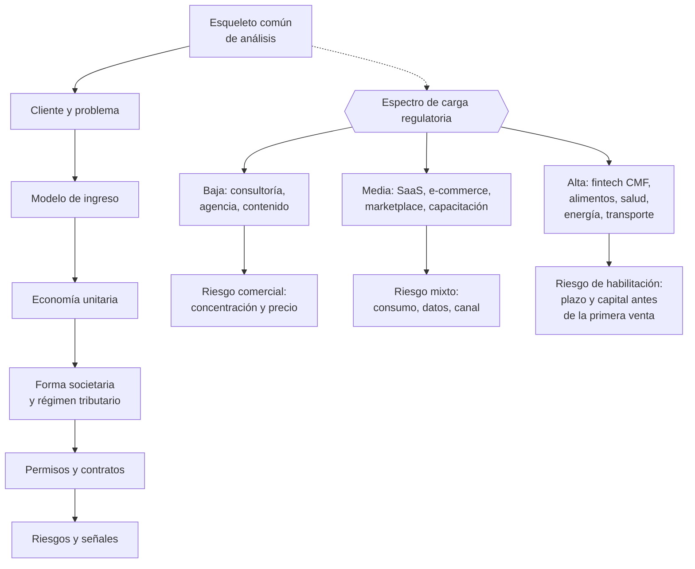

# Parte 23 — Estudios de líneas de negocio reales 2026

> *El mismo marco aplicado a catorce sectores reales*

**Estado de evidencia:** `SECTORIAL` · **Clases:** 14 (309–322) · **Fecha base normativa:** 07-08-2026 
**Conceptos definidos en esta parte:** 56

## 🎯 De qué trata esta parte

Las veintidós partes anteriores enseñan el marco; esta lo somete a la prueba de los casos. Cada estudio recorre el mismo esqueleto —cliente y problema, modelo de ingreso, economía unitaria, forma societaria, régimen tributario, permisos, contratos, riesgos y señales tempranas— sobre una línea de negocio vigente en Chile 2026. El valor está en la comparación: qué cambia entre un SaaS y una dark kitchen no es la ambición sino la carga regulatoria, el capital de trabajo y quién es el cliente que paga.

Los catorce casos están elegidos para cubrir el espectro de exigencia regulatoria. En un extremo, la consultoría tecnológica opera con permisos generales y su riesgo es comercial. En el otro, la fintech regulada necesita inscripción ante la CMF con requisitos de capital y gobierno que definen la viabilidad antes que el producto, y el foodtech necesita resolución sanitaria antes de vender el primer plato.

Cada caso incluye también las señales de que el negocio no va a funcionar, que es información escasa y valiosa. Comisiones de plataforma que se comen el margen, densidad de ruta insuficiente en última milla, arbitraje salarial que se está cerrando en exportación de servicios: son fallas estructurales, no de ejecución.

## 📚 Resultados de la parte

Al terminar esta parte podrás:

1. **Aplicar el marco completo del programa a un sector concreto**.
2. **Identificar la carga regulatoria específica de cada línea antes de entrar**.
3. **Comparar economía unitaria entre modelos de negocio distintos**.
4. **Detectar las señales tempranas de que una línea no va a funcionar**.

## 🗺️ Mapa de la parte

## ⚖️ Marco aplicable

- matriz de líneas de negocio 2026 del repositorio (manifests/business_lines_2026.json)
- regulación sectorial aplicable según actividad económica
- economía unitaria por modelo: suscripción, proyecto, transacción, retail y servicio

**Autoridades o contrapartes:** autoridad sectorial según la línea analizada, SII, SERNAC, municipalidad.
**Profesionales de apoyo:** fundador, consultor sectorial, abogado regulatorio, contador.

## ⚠️ Riesgos característicos

- Entrar a un sector regulado subestimando el costo y el plazo de habilitación.
- Asumir márgenes de referencia internacional que no aplican al mercado chileno.
- Elegir el sector por atractivo aparente y no por capacidad real de la empresa.
- No verificar la vigencia de la normativa sectorial en la fecha de ejecución.

## 📘 Las 14 clases

| # | Global | Clase | Decisión que habilita |
|---:|---:|---|---|
| 01 | 309 | [SaaS B2B con IA](class-01-saas-b2b-con-ia/README.md) | validar margen con costo de inferencia y resolver el marco de tratamiento de datos |
| 02 | 310 | [Agencia de automatización e IA aplicada](class-02-agencia-de-automatizacion-e-ia-aplicada/README.md) | definir el alcance de responsabilidad y el modelo de ingreso recurrente |
| 03 | 311 | [Ciberseguridad administrada para pymes](class-03-ciberseguridad-administrada-para-pymes/README.md) | definir el alcance del servicio, el manejo de accesos privilegiados y el límite de responsabilidad |
| 04 | 312 | [Consultoría tecnológica y modernización](class-04-consultoria-tecnologica-y-modernizacion/README.md) | definir alcance, control de cambios y modelo de tarifa del servicio |
| 05 | 313 | [E-commerce D2C de productos físicos](class-05-e-commerce-d2c-de-productos-fisicos/README.md) | validar contribución por pedido y tasa de recompra antes de escalar la inversión |
| 06 | 314 | [Marketplace vertical](class-06-marketplace-vertical/README.md) | definir el nicho de arranque y el mecanismo de liquidez |
| 07 | 315 | [Educación digital y capacitación empresarial](class-07-educacion-digital-y-capacitacion-empresarial/README.md) | elegir entre modelo B2C y B2B y determinar si conviene el reconocimiento como OTEC |
| 08 | 316 | [Exportación de servicios de software](class-08-exportacion-de-servicios-de-software/README.md) | definir el modelo de exportación y la estrategia de retención de talento |
| 09 | 317 | [Fintech regulada y servicios financieros tecnológicos](class-09-fintech-regulada-y-servicios-financieros-tecnologicos/README.md) | determinar qué servicios requieren registro ante la CMF y qué exigen |
| 10 | 318 | [Foodtech, dark kitchen y alimentos](class-10-foodtech-dark-kitchen-y-alimentos/README.md) | validar el margen después de comisión de plataforma y asegurar el cumplimiento sanitario |
| 11 | 319 | [Energía solar y servicios de eficiencia](class-11-energia-solar-y-servicios-de-eficiencia/README.md) | definir el modelo de cobro y asegurar el cumplimiento técnico y normativo |
| 12 | 320 | [Logística de última milla](class-12-logistica-de-ultima-milla/README.md) | validar la densidad necesaria y resolver la figura contractual de los repartidores |
| 13 | 321 | [Turismo de experiencias](class-13-turismo-de-experiencias/README.md) | diseñar el modelo considerando estacionalidad y cumplimiento de normas de seguridad |
| 14 | 322 | [Economía circular, reparación y reventa](class-14-economia-circular-reparacion-y-reventa/README.md) | definir el estándar de trazabilidad de origen y la información al consumidor |

## 🔤 Glosario de la parte

| Concepto | Definición operacional |
|---|---|
| **Acceso privilegiado** | Credenciales del cliente que el proveedor administra. |
| **Acuerdo de tratamiento de datos** | Contrato que regula el uso de datos del cliente. |
| **Agencia de automatización** | Servicio de diseño e implementación de automatizaciones. |
| **Alcance del proyecto** | Límite explícito de lo que se entrega. |
| **Calificación de exportación** | Condición que habilita el tratamiento tributario. |
| **Certificación** | Documento que acredita la formación entregada. |
| **Comisión de plataforma** | Porcentaje que retiene el canal de delivery. |
| **Consultoría tecnológica** | Servicio de diagnóstico y modernización. |
| **Contribución por pedido** | Margen después de todos los costos variables. |
| **Costo de inferencia** | Costo variable por uso de modelos, que afecta el margen. |
| **Costo de materia prima** | Insumo con alta variabilidad de precio. |
| **Costo por entrega** | Costo total dividido por entregas efectivas. |
| **Cumplimiento de consumo** | Obligaciones de información, retracto y garantía. |
| **D2C de productos físicos** | Venta directa al consumidor con logística propia o tercerizada. |
| **Dark kitchen** | Cocina sin atención presencial, orientada a delivery. |
| **Densidad de ruta** | Cantidad de entregas por kilómetro recorrido. |
| **Dependencia de plataforma** | Riesgo de que la herramienta base cambie sus reglas. |
| **Economía circular** | Modelo que extiende la vida útil de los productos. |
| **Educación digital** | Formación entregada por medios electrónicos. |
| **Eficiencia energética** | Reducción de consumo con inversión recuperable. |
| **Estacionalidad** | Concentración de demanda en períodos del año. |
| **Evidencia de servicio** | Registro que acredita lo ejecutado. |
| **Exportación de servicios de software** | Prestación a clientes en el extranjero. |
| **Facturación en moneda extranjera** | Implicancias cambiarias y contables. |
| **Finanzas abiertas** | Sistema de intercambio de información financiera con consentimiento. |
| **Fintech regulada** | Servicio financiero tecnológico bajo supervisión. |
| **Franquicia SENCE** | Beneficio tributario para capacitación de empresas. |
| **Garantía de desempeño** | Compromiso sobre el rendimiento del sistema. |
| **Garantía en productos usados** | Obligaciones aplicables según el estado informado. |
| **Instalación declarada** | Registro obligatorio ante la sec. |
| **Ley 21.521** | Ley que regula servicios financieros tecnológicos. |
| **Liquidez** | Densidad suficiente de oferta y demanda. |
| **Marketplace vertical** | Plataforma especializada en un sector. |
| **Modelo de ahorro compartido** | Cobro vinculado al ahorro efectivamente logrado. |
| **MSSP** | Proveedor de servicios de seguridad administrados. |
| **Registro de prestadores** | Inscripción ante la cmf para operar ciertos servicios. |
| **Registro SERNATUR** | Inscripción de prestadores de servicios turísticos. |
| **Relación laboral del repartidor** | Calificación de la figura contractual. |
| **Resolución sanitaria** | Autorización exigida para elaborar alimentos. |
| **Responsabilidad de la plataforma** | Exposición por lo que ocurre en las transacciones. |
| **Responsabilidad por la automatización** | Exposición si el flujo produce un error con efecto en el cliente. |
| **Retainer de soporte** | Ingreso recurrente por mantención de los flujos. |
| **Retención neta** | Indicador determinante de la viabilidad del modelo. |
| **Reventa** | Comercialización de productos usados o reacondicionados. |
| **SaaS B2B con IA** | Software por suscripción con componentes de modelos. |
| **Seguridad de la actividad** | Normas técnicas y cobertura de riesgos. |
| **SLA de respuesta** | Plazo comprometido ante un incidente. |
| **Take rate** | Porcentaje retenido de cada transacción. |
| **Talento y competencia global** | Presión salarial por competencia internacional. |
| **Tarifa efectiva** | Ingreso real por hora incluyendo horas no facturadas. |
| **Tasa de devolución** | Porcentaje de pedidos devueltos. |
| **Tasa de finalización** | Porcentaje de estudiantes que completan. |
| **Transferencia de conocimiento** | Entrega que permite al cliente operar sin el consultor. |
| **Trazabilidad de origen** | Acreditación de la procedencia del producto. |
| **Turismo de experiencias** | Servicio basado en actividades y no solo en alojamiento. |
| **Última milla** | Tramo final de entrega al destinatario. |

## 🔗 Cómo se conecta

Aplica en bloque las partes 03, 07, 09, 11, 17 y 19. Sirve de banco de casos para el capstone de la parte 24, y sus fichas se cruzan con los estudios de `case-studies/`.

## 📖 Pauta bibliográfica

- `manifests/business_lines_2026.json` y `docs/07_BUSINESS_LINES_2026.md` — matriz de líneas del repositorio.
- Autoridad sectorial correspondiente a cada línea, verificada a la fecha de ejecución.
- Estadísticas del SII por rubro y tamaño para contrastar supuestos de escala.

## 🏛️ Fuentes oficiales de la parte

**Servicio de Impuestos Internos — Nuevos contribuyentes, inicio de actividades y DTE**  
<https://www.sii.cl/ayudas/nuevos_contribuyentes/boleta-vys-facturador.html> · verificado 2026-08-07

- *Qué contiene:* Reúne el circuito completo del contribuyente nuevo: obtención de RUT, declaración de inicio de actividades, elección de códigos de actividad económica y habilitación para emitir documentos tributarios electrónicos.
- *Cómo leerla:* Sepáralo en dos actos distintos que la página trata seguidos: el RUT identifica, el inicio de actividades habilita. Lo que te bloquea para facturar casi siempre está en el segundo, no en el primero.

**Servicio Nacional del Consumidor — Ley 19.496, comercio electrónico y garantía legal**  
<https://www.sernac.cl/> · verificado 2026-08-07

- *Qué contiene:* Publica la interpretación aplicada de la Ley del Consumidor: deberes de información en la oferta, reglas del comercio electrónico, garantía legal, contratos de adhesión y el procedimiento de reclamos.
- *Cómo leerla:* Entra por el rubro de tu negocio y revisa las alertas y procedimientos colectivos publicados: muestran qué está fiscalizando el servicio ahora, que es mejor predictor de tu riesgo que la lectura abstracta de la ley.

**ChileAtiende · Autoridad Sanitaria Regional — Autorización sanitaria de alimentos**  
<https://www.chileatiende.gob.cl/fichas/172-autorizacion-sanitaria-de-alimentos> · verificado 2026-08-07

- *Qué contiene:* Detalla qué establecimientos requieren autorización sanitaria, qué antecedentes se presentan, qué condiciones de planta física se exigen y cuál es la vigencia del permiso.
- *Cómo leerla:* Léela antes de firmar el arriendo, no después: las exigencias de planta física —separación de áreas, superficies lavables, agua potable— se resuelven en el diseño y se vuelven carísimas de corregir sobre un local ya construido.

**Comisión para el Mercado Financiero — Registro de Prestadores de Servicios Financieros · Ley 21.521**  
<https://www.cmfchile.cl/portal/principal/613/w3-propertyvalue-18591.html> · verificado 2026-08-07

- *Qué contiene:* Establece qué servicios financieros tecnológicos requieren inscripción o autorización ante la CMF, con qué requisitos de capital, gobierno corporativo y gestión de riesgos.
- *Cómo leerla:* Califica primero tu servicio contra la lista de actividades reguladas; el nombre comercial no decide. Si califica, los requisitos de capital y gobierno son la variable que define si el modelo es viable, antes que el producto.

**ProChile — Exportación de servicios**  
<https://www.prochile.gob.cl/exportadores/exportacion-de-servicios> · verificado 2026-08-07

- *Qué contiene:* Explica qué se entiende por exportación de servicios, qué condiciones deben cumplirse para acceder al tratamiento tributario correspondiente y qué documentación de respaldo se exige.
- *Cómo leerla:* Contrástala siempre con la resolución del SII aplicable: ProChile explica el concepto y el mercado, pero la calificación que habilita el tratamiento de IVA la resuelve la normativa tributaria.

**Superintendencia de Electricidad y Combustibles — Instalaciones eléctricas y de gas**  
<https://www.sec.cl/> · verificado 2026-08-07

- *Qué contiene:* Regula la ejecución y declaración de instalaciones eléctricas y de gas, el registro de instaladores autorizados y las exigencias de seguridad de productos energéticos.
- *Cómo leerla:* Verifica la licencia del instalador antes de contratar y exige la declaración como entregable del trabajo: sin ella no hay empalme, y un siniestro sobre instalación no declarada compromete la cobertura del seguro.

**Servicio Nacional de Capacitación y Empleo — OTEC, franquicia tributaria y cursos**  
<https://sence.gob.cl/> · verificado 2026-08-07

- *Qué contiene:* Regula el reconocimiento de organismos técnicos de capacitación, el registro de cursos y el uso de la franquicia tributaria que permite a las empresas descontar capacitación.
- *Cómo leerla:* Separa dos decisiones que la página presenta juntas: ser OTEC reconocido y usar la franquicia. La segunda solo existe si tienes la primera, y arrastra exigencias estrictas de registro de asistencia y ejecución.

**Servicio Nacional de Turismo — Registro de prestadores de servicios turísticos**  
<https://www.sernatur.cl/> · verificado 2026-08-07

- *Qué contiene:* Administra el registro obligatorio de prestadores de servicios turísticos, las categorías de servicio y las normas técnicas aplicables, en particular al turismo aventura.
- *Cómo leerla:* Si tu actividad es turismo aventura, ve directo a las normas técnicas de seguridad: definen personal, equipamiento y procedimientos, y su incumplimiento es el riesgo mayor del modelo.

---

| Anterior | Índice | Siguiente |
|---|---|---|
| [← Parte 22 · Venta, sucesión, transformación y cierre](../part-22-venta-sucesion-transformacion-y-cierre/README.md) | [Currículo](../../CURRICULUM.md) · [Programa](../../README.md) | [Parte 24 · Capstone: construir una empresa de comienzo a fin →](../part-24-capstone-construir-una-empresa-de-comienzo-a-fin/README.md) |
