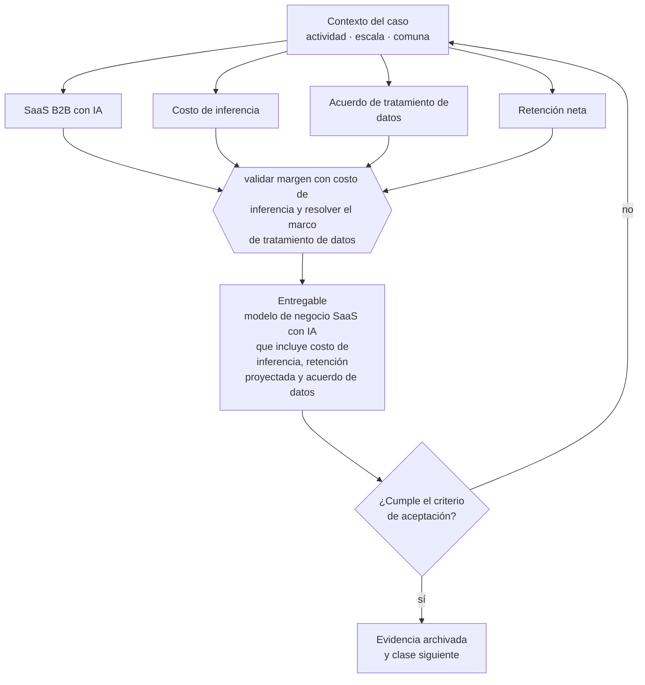

# Clase 309 — SaaS B2B con IA

> **Parte 23 · Estudios de líneas de negocio reales 2026** — clase 1 de 14

**Estado de evidencia:** `SECTORIAL` · **Jurisdicción:** Chile-first · **Fecha base normativa:** 07-08-2026 
**Decisión que habilita:** validar margen con costo de inferencia y resolver el marco de tratamiento de datos 
**Entregable:** modelo de negocio SaaS con IA que incluye costo de inferencia, retención proyectada y acuerdo de datos

## 🎯 Propósito

Modelar un SaaS con IA incorporando el costo de inferencia, que rompe el supuesto de margen casi total del software tradicional.

## 📚 Resultados de aprendizaje

Al finalizar esta clase podrás:

1. **Definir** con precisión los cuatro conceptos de la tabla siguiente y usarlos para describir un caso real.
2. **Explicar** por qué esta materia condiciona decisiones de otras partes del programa.
3. **Decidir** —validar margen con costo de inferencia y resolver el marco de tratamiento de datos— y justificar la decisión por escrito.
4. **Producir** el entregable de la clase y contrastarlo contra su criterio de aceptación.
5. **Distinguir** el dato estable del dato dinámico que exige revalidación en la fuente oficial.

## 🧩 Conceptos centrales

| Concepto | Comprensión verificable |
|---|---|
| **SaaS B2B con IA** | Software por suscripción con componentes de modelos. |
| **Costo de inferencia** | Costo variable por uso de modelos, que afecta el margen. |
| **Acuerdo de tratamiento de datos** | Contrato que regula el uso de datos del cliente. |
| **Retención neta** | Indicador determinante de la viabilidad del modelo. |

## 🗺️ Flujo de razonamiento

## 📖 Desarrollo

### 1. El fondo del asunto

El SaaS con IA introduce un costo variable relevante que rompe el supuesto de margen casi total del software tradicional. La viabilidad depende de que el precio contemple ese costo y de que los acuerdos con clientes permitan el tratamiento de datos que el servicio requiere.

### 2. Cómo se traduce en la práctica

El precio debe contemplar ese costo variable y el acuerdo con clientes debe permitir el tratamiento de datos que el servicio requiere. Procesar datos de clientes con modelos sin acuerdo de tratamiento es, bajo la normativa de datos personales, una cesión que nadie autorizó.

### 3. Marco aplicable y quién interviene

- matriz de líneas de negocio 2026 del repositorio (manifests/business_lines_2026.json)
- regulación sectorial aplicable según actividad económica
- economía unitaria por modelo: suscripción, proyecto, transacción, retail y servicio

**Autoridades o contrapartes involucradas:** autoridad sectorial según la línea analizada, SII, SERNAC, municipalidad.
**Profesionales de apoyo:** fundador, consultor sectorial, abogado regulatorio, contador. La participación concreta depende del riesgo, del
tamaño de la empresa y de la actividad económica.

## 🧪 Taller guiado

Aplica esta clase a **una** de las siguientes líneas de negocio y repite después el ejercicio con
una segunda línea de carga regulatoria distinta:

| Línea | Carga regulatoria |
|---|---|
| SaaS B2B con IA | media |
| Servicios profesionales | baja |
| E-commerce D2C | media |
| Alimentos o foodtech | alta |
| Exportación de servicios | media |
| Fintech regulada | alta |
| Construcción o servicios técnicos | alta |

**Secuencia de trabajo:**

1. Delimita el contexto: actividad económica, escala, comuna y etapa de la empresa.
2. Reúne los antecedentes que la decisión exige y anota la fecha de cada fuente.
3. Identifica las alternativas reales, incluida la de no hacer nada.
4. Evalúa el impacto en mercado, caja, personas, regulación y operación.
5. Toma la decisión y regístrala con sus supuestos.
6. Produce el entregable.
7. Contrástalo contra el criterio de aceptación.
8. Anota lo que requiere validación profesional y programa su revisión.

### 📦 Entregable

Modelo de negocio saas con ia que incluye costo de inferencia, retención proyectada y acuerdo de datos.

Debe incluir decisión, supuestos, fuentes con fecha de consulta, responsable, riesgos
identificados y próximos pasos.

## 🏆 Reto verificable

Resuelve la misma materia para una segunda línea de negocio con distinta carga regulatoria y
explica por escrito **qué cambió, por qué y qué fuente lo determina**.

## ✅ Criterio de aceptación

- [ ] el costo de inferencia está incorporado al margen
- [ ] el acuerdo de tratamiento de datos está definido
- [ ] cada afirmación regulatoria está referida a una fuente oficial con fecha de consulta;
- [ ] los datos dinámicos quedan marcados para revalidación;
- [ ] hay un responsable asignado y evidencia reproducible del trabajo.

## ⚠️ Errores frecuentes

**Propios de esta clase:**

- Fijar precio de suscripción sin modelar el costo variable de inferencia.
- Procesar datos de clientes con modelos sin acuerdo de tratamiento.

**Característicos de la parte 23:**

- Entrar a un sector regulado subestimando el costo y el plazo de habilitación.
- Asumir márgenes de referencia internacional que no aplican al mercado chileno.

## 🇨🇱 Checklist Chile

- [ ] ¿existe norma o autoridad específica para esta materia?
- [ ] ¿la fuente consultada está vigente a la fecha de ejecución?
- [ ] ¿se activa algún trámite ante el SII?
- [ ] ¿se activa algún requisito municipal o sectorial?
- [ ] ¿afecta a consumidores o al tratamiento de datos personales?
- [ ] ¿afecta a trabajadores o a la seguridad y salud en el trabajo?
- [ ] ¿afecta a impuestos, contabilidad o caja?
- [ ] ¿afecta a contratos o a propiedad intelectual?
- [ ] ¿requiere renovación, reporte periódico o revalidación?

## ❓ Preguntas de comprobación

1. ¿Cuánto representa el costo de inferencia sobre tu precio de suscripción?
2. ¿Tu contrato con clientes autoriza el tratamiento que el servicio necesita?
3. ¿Cuál es tu NRR proyectado y qué lo sostiene?

## 🔗 Fuentes oficiales

**Biblioteca del Congreso Nacional · LeyChile — Normativa oficial consolidada**  
<https://www.bcn.cl/leychile/> · verificado 2026-08-07

- *Qué contiene:* Publica el texto oficial y consolidado de leyes, decretos y reglamentos, con la versión vigente a una fecha, el historial de modificaciones y la tramitación que las originó.
- *Cómo leerla:* Usa siempre el selector de versión vigente a la fecha en que ejecutarás el trámite, no la última publicada. Y lee el artículo transitorio: en normas en implantación gradual —jornada, datos personales— ahí está la fecha que realmente te aplica.

**Servicio de Impuestos Internos — Nuevos contribuyentes, inicio de actividades y DTE**  
<https://www.sii.cl/ayudas/nuevos_contribuyentes/boleta-vys-facturador.html> · verificado 2026-08-07

- *Qué contiene:* Reúne el circuito completo del contribuyente nuevo: obtención de RUT, declaración de inicio de actividades, elección de códigos de actividad económica y habilitación para emitir documentos tributarios electrónicos.
- *Cómo leerla:* Sepáralo en dos actos distintos que la página trata seguidos: el RUT identifica, el inicio de actividades habilita. Lo que te bloquea para facturar casi siempre está en el segundo, no en el primero.

Complementos del repositorio: [glosario](../../../docs/19_GLOSSARY.md) ·
[ruta de lecturas](../../../docs/15_BOOKS_AND_LEARNING_PATH.md) ·
[catálogo de fuentes](../../../docs/16_OFFICIAL_SOURCE_CATALOG.md).

> [!IMPORTANT]
> Material educativo. Para una decisión real de alto impacto hay que verificar la fuente oficial
> vigente y validar con el profesional competente.

---

| Anterior | Índice | Siguiente |
|---|---|---|
| **Inicio de la parte** | [Parte 23](../README.md) · [Programa](../../../README.md) | [310 · Agencia de automatización e IA aplicada →](../class-02-agencia-de-automatizacion-e-ia-aplicada/README.md) |
