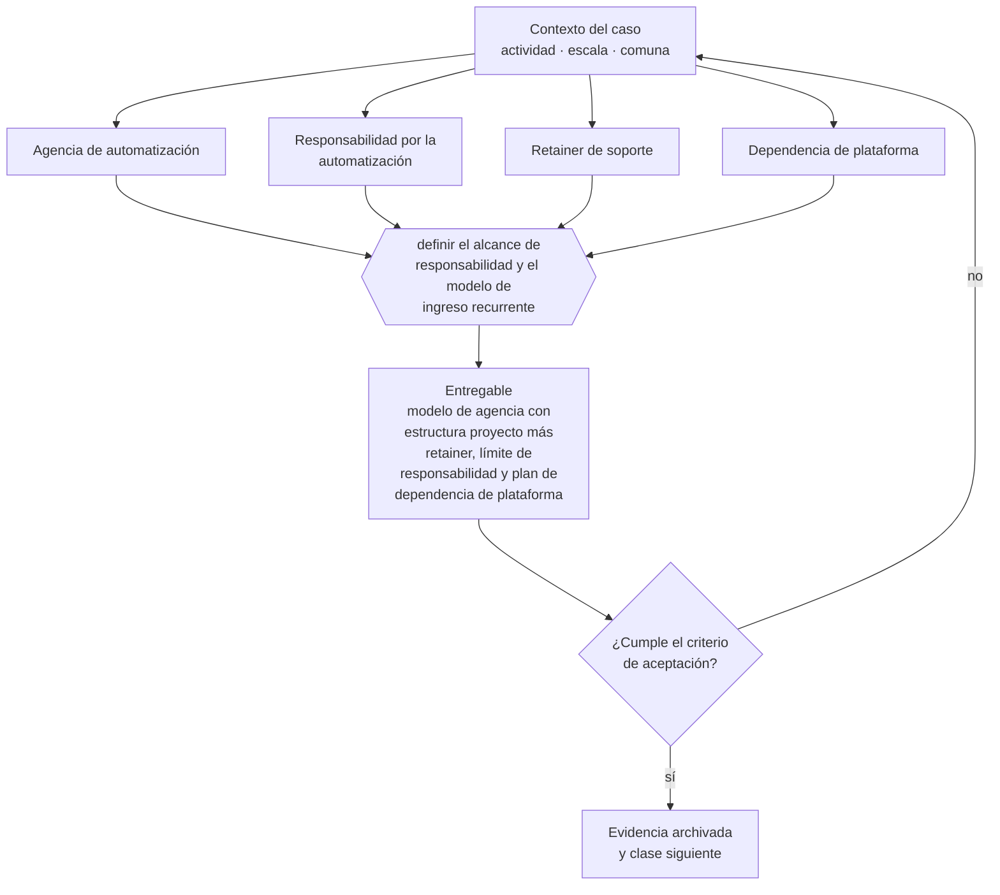

# Clase 310 — Agencia de automatización e IA aplicada

> **Parte 23 · Estudios de líneas de negocio reales 2026** — clase 2 de 14

**Estado de evidencia:** `SECTORIAL` · **Jurisdicción:** Chile-first · **Fecha base normativa:** 07-08-2026 
**Decisión que habilita:** definir el alcance de responsabilidad y el modelo de ingreso recurrente 
**Entregable:** modelo de agencia con estructura proyecto más retainer, límite de responsabilidad y plan de dependencia de plataforma

## 🎯 Propósito

Estructurar una agencia de automatización con ingreso recurrente y límite de responsabilidad, porque la barrera de entrada del modelo es baja.

## 📚 Resultados de aprendizaje

Al finalizar esta clase podrás:

1. **Definir** con precisión los cuatro conceptos de la tabla siguiente y usarlos para describir un caso real.
2. **Explicar** por qué esta materia condiciona decisiones de otras partes del programa.
3. **Decidir** —definir el alcance de responsabilidad y el modelo de ingreso recurrente— y justificar la decisión por escrito.
4. **Producir** el entregable de la clase y contrastarlo contra su criterio de aceptación.
5. **Distinguir** el dato estable del dato dinámico que exige revalidación en la fuente oficial.

## 🧩 Conceptos centrales

| Concepto | Comprensión verificable |
|---|---|
| **Agencia de automatización** | Servicio de diseño e implementación de automatizaciones. |
| **Responsabilidad por la automatización** | Exposición si el flujo produce un error con efecto en el cliente. |
| **Retainer de soporte** | Ingreso recurrente por mantención de los flujos. |
| **Dependencia de plataforma** | Riesgo de que la herramienta base cambie sus reglas. |

## 🗺️ Flujo de razonamiento

## 📖 Desarrollo

### 1. El fondo del asunto

El modelo de agencia de automatización tiene entrada rápida y barrera baja, por lo que la defensa está en el retainer de soporte y en el conocimiento del negocio del cliente. El riesgo mayor es la responsabilidad: un flujo que factura mal o envía mal puede generar un perjuicio significativo.

### 2. Cómo se traduce en la práctica

La defensa está en el retainer de soporte y en el conocimiento del negocio del cliente, no en la técnica. El riesgo mayor es la responsabilidad: un flujo que factura mal o envía mal puede generar un perjuicio que supera varias veces el valor del proyecto que lo originó.

### 3. Marco aplicable y quién interviene

- matriz de líneas de negocio 2026 del repositorio (manifests/business_lines_2026.json)
- regulación sectorial aplicable según actividad económica
- economía unitaria por modelo: suscripción, proyecto, transacción, retail y servicio

**Autoridades o contrapartes involucradas:** autoridad sectorial según la línea analizada, SII, SERNAC, municipalidad.
**Profesionales de apoyo:** fundador, consultor sectorial, abogado regulatorio, contador. La participación concreta depende del riesgo, del
tamaño de la empresa y de la actividad económica.

## 🧪 Taller guiado

Aplica esta clase a **una** de las siguientes líneas de negocio y repite después el ejercicio con
una segunda línea de carga regulatoria distinta:

| Línea | Carga regulatoria |
|---|---|
| SaaS B2B con IA | media |
| Servicios profesionales | baja |
| E-commerce D2C | media |
| Alimentos o foodtech | alta |
| Exportación de servicios | media |
| Fintech regulada | alta |
| Construcción o servicios técnicos | alta |

**Secuencia de trabajo:**

1. Delimita el contexto: actividad económica, escala, comuna y etapa de la empresa.
2. Reúne los antecedentes que la decisión exige y anota la fecha de cada fuente.
3. Identifica las alternativas reales, incluida la de no hacer nada.
4. Evalúa el impacto en mercado, caja, personas, regulación y operación.
5. Toma la decisión y regístrala con sus supuestos.
6. Produce el entregable.
7. Contrástalo contra el criterio de aceptación.
8. Anota lo que requiere validación profesional y programa su revisión.

### 📦 Entregable

Modelo de agencia con estructura proyecto más retainer, límite de responsabilidad y plan de dependencia de plataforma.

Debe incluir decisión, supuestos, fuentes con fecha de consulta, responsable, riesgos
identificados y próximos pasos.

## 🏆 Reto verificable

Resuelve la misma materia para una segunda línea de negocio con distinta carga regulatoria y
explica por escrito **qué cambió, por qué y qué fuente lo determina**.

## ✅ Criterio de aceptación

- [ ] el límite de responsabilidad está pactado por contrato
- [ ] existe ingreso recurrente asociado a la mantención
- [ ] cada afirmación regulatoria está referida a una fuente oficial con fecha de consulta;
- [ ] los datos dinámicos quedan marcados para revalidación;
- [ ] hay un responsable asignado y evidencia reproducible del trabajo.

## ⚠️ Errores frecuentes

**Propios de esta clase:**

- Entregar automatizaciones sin límite de responsabilidad contractual.
- Construir todo sobre una plataforma sin plan de migración.

**Característicos de la parte 23:**

- Entrar a un sector regulado subestimando el costo y el plazo de habilitación.
- Asumir márgenes de referencia internacional que no aplican al mercado chileno.

## 🇨🇱 Checklist Chile

- [ ] ¿existe norma o autoridad específica para esta materia?
- [ ] ¿la fuente consultada está vigente a la fecha de ejecución?
- [ ] ¿se activa algún trámite ante el SII?
- [ ] ¿se activa algún requisito municipal o sectorial?
- [ ] ¿afecta a consumidores o al tratamiento de datos personales?
- [ ] ¿afecta a trabajadores o a la seguridad y salud en el trabajo?
- [ ] ¿afecta a impuestos, contabilidad o caja?
- [ ] ¿afecta a contratos o a propiedad intelectual?
- [ ] ¿requiere renovación, reporte periódico o revalidación?

## ❓ Preguntas de comprobación

1. ¿Qué límite de responsabilidad pactas por los flujos que entregas?
2. ¿Qué proporción de tu ingreso es recurrente y no de proyecto?
3. ¿Qué pasa con tus entregas si la plataforma base cambia sus reglas?

## 🔗 Fuentes oficiales

**Biblioteca del Congreso Nacional · LeyChile — Normativa oficial consolidada**  
<https://www.bcn.cl/leychile/> · verificado 2026-08-19

- *Qué contiene:* Publica el texto oficial y consolidado de leyes, decretos y reglamentos, con la versión vigente a una fecha, el historial de modificaciones y la tramitación que las originó.
- *Cómo leerla:* Usa siempre el selector de versión vigente a la fecha en que ejecutarás el trámite, no la última publicada. Y lee el artículo transitorio: en normas en implantación gradual —jornada, datos personales— ahí está la fecha que realmente te aplica.
- *Uso en esta clase:* aporta el marco de «Normativa oficial consolidada» para definir el alcance de responsabilidad y el modelo de ingreso recurrente.

Complementos del repositorio: [glosario](../../../docs/19_GLOSSARY.md) ·
[ruta de lecturas](../../../docs/15_BOOKS_AND_LEARNING_PATH.md) ·
[catálogo de fuentes](../../../docs/16_OFFICIAL_SOURCE_CATALOG.md).

> [!IMPORTANT]
> Material educativo. Para una decisión real de alto impacto hay que verificar la fuente oficial
> vigente y validar con el profesional competente.

---

| Anterior | Índice | Siguiente |
|---|---|---|
| [← 309 · SaaS B2B con IA](../class-01-saas-b2b-con-ia/README.md) | [Parte 23](../README.md) · [Programa](../../../README.md) | [311 · Ciberseguridad administrada para pymes →](../class-03-ciberseguridad-administrada-para-pymes/README.md) |
