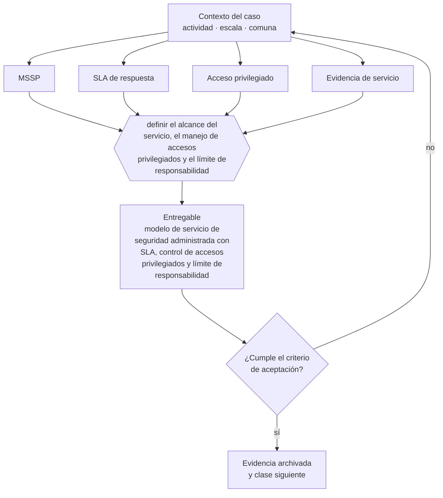

# Clase 311 — Ciberseguridad administrada para pymes

> **Parte 23 · Estudios de líneas de negocio reales 2026** — clase 3 de 14

**Estado de evidencia:** `SECTORIAL` · **Jurisdicción:** Chile-first · **Fecha base normativa:** 07-08-2026 
**Decisión que habilita:** definir el alcance del servicio, el manejo de accesos privilegiados y el límite de responsabilidad 
**Entregable:** modelo de servicio de seguridad administrada con SLA, control de accesos privilegiados y límite de responsabilidad

## 🎯 Propósito

Dimensionar el servicio de seguridad administrada por su SLA sostenible y por el control de los accesos privilegiados que administra.

## 📚 Resultados de aprendizaje

Al finalizar esta clase podrás:

1. **Definir** con precisión los cuatro conceptos de la tabla siguiente y usarlos para describir un caso real.
2. **Explicar** por qué esta materia condiciona decisiones de otras partes del programa.
3. **Decidir** —definir el alcance del servicio, el manejo de accesos privilegiados y el límite de responsabilidad— y justificar la decisión por escrito.
4. **Producir** el entregable de la clase y contrastarlo contra su criterio de aceptación.
5. **Distinguir** el dato estable del dato dinámico que exige revalidación en la fuente oficial.

## 🧩 Conceptos centrales

| Concepto | Comprensión verificable |
|---|---|
| **MSSP** | Proveedor de servicios de seguridad administrados. |
| **SLA de respuesta** | Plazo comprometido ante un incidente. |
| **Acceso privilegiado** | Credenciales del cliente que el proveedor administra. |
| **Evidencia de servicio** | Registro que acredita lo ejecutado. |

## 🗺️ Flujo de razonamiento

## 📖 Desarrollo

### 1. El fondo del asunto

El servicio de ciberseguridad administrada para pymes tiene demanda creciente por el traslado contractual de exigencias desde clientes regulados. Su riesgo central es el acceso privilegiado a los sistemas del cliente: exige controles internos estrictos y límites de responsabilidad bien definidos.

### 2. Cómo se traduce en la práctica

Comprometer tiempos de respuesta que la dotación no puede sostener produce incumplimientos contractuales desde el primer incidente nocturno. Y administrar accesos privilegiados de clientes sin controles internos formales convierte al proveedor en el vector de riesgo que se supone debe cerrar.

### 3. Marco aplicable y quién interviene

- matriz de líneas de negocio 2026 del repositorio (manifests/business_lines_2026.json)
- regulación sectorial aplicable según actividad económica
- economía unitaria por modelo: suscripción, proyecto, transacción, retail y servicio

**Autoridades o contrapartes involucradas:** autoridad sectorial según la línea analizada, SII, SERNAC, municipalidad.
**Profesionales de apoyo:** fundador, consultor sectorial, abogado regulatorio, contador. La participación concreta depende del riesgo, del
tamaño de la empresa y de la actividad económica.

## 🧪 Taller guiado

Aplica esta clase a **una** de las siguientes líneas de negocio y repite después el ejercicio con
una segunda línea de carga regulatoria distinta:

| Línea | Carga regulatoria |
|---|---|
| SaaS B2B con IA | media |
| Servicios profesionales | baja |
| E-commerce D2C | media |
| Alimentos o foodtech | alta |
| Exportación de servicios | media |
| Fintech regulada | alta |
| Construcción o servicios técnicos | alta |

**Secuencia de trabajo:**

1. Delimita el contexto: actividad económica, escala, comuna y etapa de la empresa.
2. Reúne los antecedentes que la decisión exige y anota la fecha de cada fuente.
3. Identifica las alternativas reales, incluida la de no hacer nada.
4. Evalúa el impacto en mercado, caja, personas, regulación y operación.
5. Toma la decisión y regístrala con sus supuestos.
6. Produce el entregable.
7. Contrástalo contra el criterio de aceptación.
8. Anota lo que requiere validación profesional y programa su revisión.

### 📦 Entregable

Modelo de servicio de seguridad administrada con sla, control de accesos privilegiados y límite de responsabilidad.

Debe incluir decisión, supuestos, fuentes con fecha de consulta, responsable, riesgos
identificados y próximos pasos.

## 🏆 Reto verificable

Resuelve la misma materia para una segunda línea de negocio con distinta carga regulatoria y
explica por escrito **qué cambió, por qué y qué fuente lo determina**.

## ✅ Criterio de aceptación

- [ ] el SLA es sostenible con la dotación real
- [ ] el manejo de accesos privilegiados tiene controles documentados
- [ ] cada afirmación regulatoria está referida a una fuente oficial con fecha de consulta;
- [ ] los datos dinámicos quedan marcados para revalidación;
- [ ] hay un responsable asignado y evidencia reproducible del trabajo.

## ⚠️ Errores frecuentes

**Propios de esta clase:**

- Comprometer sla de respuesta que la dotación no puede sostener.
- Administrar accesos privilegiados de clientes sin controles internos formales.

**Característicos de la parte 23:**

- Entrar a un sector regulado subestimando el costo y el plazo de habilitación.
- Asumir márgenes de referencia internacional que no aplican al mercado chileno.

## 🇨🇱 Checklist Chile

- [ ] ¿existe norma o autoridad específica para esta materia?
- [ ] ¿la fuente consultada está vigente a la fecha de ejecución?
- [ ] ¿se activa algún trámite ante el SII?
- [ ] ¿se activa algún requisito municipal o sectorial?
- [ ] ¿afecta a consumidores o al tratamiento de datos personales?
- [ ] ¿afecta a trabajadores o a la seguridad y salud en el trabajo?
- [ ] ¿afecta a impuestos, contabilidad o caja?
- [ ] ¿afecta a contratos o a propiedad intelectual?
- [ ] ¿requiere renovación, reporte periódico o revalidación?

## ❓ Preguntas de comprobación

1. ¿Puede tu dotación real sostener el SLA que ofreces, incluidos fines de semana?
2. ¿Qué controles internos aplicas sobre los accesos privilegiados de clientes?
3. ¿Qué límite de responsabilidad pactas ante un incidente en tu cliente?

## 🔗 Fuentes oficiales

**Biblioteca del Congreso Nacional · LeyChile — Normativa oficial consolidada**  
<https://www.bcn.cl/leychile/> · verificado 2026-08-07

- *Qué contiene:* Publica el texto oficial y consolidado de leyes, decretos y reglamentos, con la versión vigente a una fecha, el historial de modificaciones y la tramitación que las originó.
- *Cómo leerla:* Usa siempre el selector de versión vigente a la fecha en que ejecutarás el trámite, no la última publicada. Y lee el artículo transitorio: en normas en implantación gradual —jornada, datos personales— ahí está la fecha que realmente te aplica.

Complementos del repositorio: [glosario](../../../docs/19_GLOSSARY.md) ·
[ruta de lecturas](../../../docs/15_BOOKS_AND_LEARNING_PATH.md) ·
[catálogo de fuentes](../../../docs/16_OFFICIAL_SOURCE_CATALOG.md).

> [!IMPORTANT]
> Material educativo. Para una decisión real de alto impacto hay que verificar la fuente oficial
> vigente y validar con el profesional competente.

---

| Anterior | Índice | Siguiente |
|---|---|---|
| [← 310 · Agencia de automatización e IA aplicada](../class-02-agencia-de-automatizacion-e-ia-aplicada/README.md) | [Parte 23](../README.md) · [Programa](../../../README.md) | [312 · Consultoría tecnológica y modernización →](../class-04-consultoria-tecnologica-y-modernizacion/README.md) |
