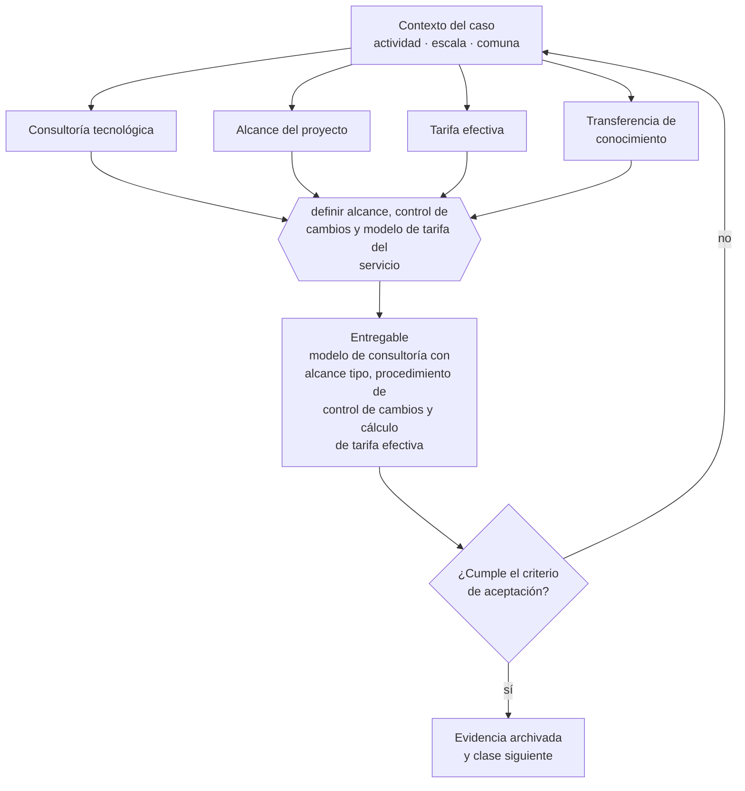

# Clase 312 — Consultoría tecnológica y modernización

> **Parte 23 · Estudios de líneas de negocio reales 2026** — clase 4 de 14

**Estado de evidencia:** `SECTORIAL` · **Jurisdicción:** Chile-first · **Fecha base normativa:** 07-08-2026 
**Decisión que habilita:** definir alcance, control de cambios y modelo de tarifa del servicio 
**Entregable:** modelo de consultoría con alcance tipo, procedimiento de control de cambios y cálculo de tarifa efectiva

## 🎯 Propósito

Definir alcance, control de cambios y tarifa efectiva en consultoría tecnológica, donde el scope creep convierte proyectos rentables en pérdidas.

## 📚 Resultados de aprendizaje

Al finalizar esta clase podrás:

1. **Definir** con precisión los cuatro conceptos de la tabla siguiente y usarlos para describir un caso real.
2. **Explicar** por qué esta materia condiciona decisiones de otras partes del programa.
3. **Decidir** —definir alcance, control de cambios y modelo de tarifa del servicio— y justificar la decisión por escrito.
4. **Producir** el entregable de la clase y contrastarlo contra su criterio de aceptación.
5. **Distinguir** el dato estable del dato dinámico que exige revalidación en la fuente oficial.

## 🧩 Conceptos centrales

| Concepto | Comprensión verificable |
|---|---|
| **Consultoría tecnológica** | Servicio de diagnóstico y modernización. |
| **Alcance del proyecto** | Límite explícito de lo que se entrega. |
| **Tarifa efectiva** | Ingreso real por hora incluyendo horas no facturadas. |
| **Transferencia de conocimiento** | Entrega que permite al cliente operar sin el consultor. |

## 🗺️ Flujo de razonamiento

## 📖 Desarrollo

### 1. El fondo del asunto

La consultoría tecnológica compite con integradores grandes y con equipos internos. Su ventaja está en la especialización vertical y en la capacidad de entregar resultados en plazos cortos. El riesgo estructural es el scope creep, que convierte proyectos rentables en pérdidas.

### 2. Cómo se traduce en la práctica

La ventaja competitiva está en la especialización vertical y en entregar resultados en plazos cortos, no en competir con integradores grandes. Y no incluir transferencia de conocimiento genera una dependencia que el cliente termina resintiendo, lo que acorta la relación en vez de alargarla.

### 3. Marco aplicable y quién interviene

- matriz de líneas de negocio 2026 del repositorio (manifests/business_lines_2026.json)
- regulación sectorial aplicable según actividad económica
- economía unitaria por modelo: suscripción, proyecto, transacción, retail y servicio

**Autoridades o contrapartes involucradas:** autoridad sectorial según la línea analizada, SII, SERNAC, municipalidad.
**Profesionales de apoyo:** fundador, consultor sectorial, abogado regulatorio, contador. La participación concreta depende del riesgo, del
tamaño de la empresa y de la actividad económica.

## 🧪 Taller guiado

Aplica esta clase a **una** de las siguientes líneas de negocio y repite después el ejercicio con
una segunda línea de carga regulatoria distinta:

| Línea | Carga regulatoria |
|---|---|
| SaaS B2B con IA | media |
| Servicios profesionales | baja |
| E-commerce D2C | media |
| Alimentos o foodtech | alta |
| Exportación de servicios | media |
| Fintech regulada | alta |
| Construcción o servicios técnicos | alta |

**Secuencia de trabajo:**

1. Delimita el contexto: actividad económica, escala, comuna y etapa de la empresa.
2. Reúne los antecedentes que la decisión exige y anota la fecha de cada fuente.
3. Identifica las alternativas reales, incluida la de no hacer nada.
4. Evalúa el impacto en mercado, caja, personas, regulación y operación.
5. Toma la decisión y regístrala con sus supuestos.
6. Produce el entregable.
7. Contrástalo contra el criterio de aceptación.
8. Anota lo que requiere validación profesional y programa su revisión.

### 📦 Entregable

Modelo de consultoría con alcance tipo, procedimiento de control de cambios y cálculo de tarifa efectiva.

Debe incluir decisión, supuestos, fuentes con fecha de consulta, responsable, riesgos
identificados y próximos pasos.

## 🏆 Reto verificable

Resuelve la misma materia para una segunda línea de negocio con distinta carga regulatoria y
explica por escrito **qué cambió, por qué y qué fuente lo determina**.

## ✅ Criterio de aceptación

- [ ] el procedimiento de control de cambios está definido
- [ ] la tarifa efectiva está calculada con horas no facturables
- [ ] cada afirmación regulatoria está referida a una fuente oficial con fecha de consulta;
- [ ] los datos dinámicos quedan marcados para revalidación;
- [ ] hay un responsable asignado y evidencia reproducible del trabajo.

## ⚠️ Errores frecuentes

**Propios de esta clase:**

- Cotizar por proyecto sin procedimiento de orden de cambio.
- No incluir transferencia de conocimiento y generar dependencia que el cliente resiente.

**Característicos de la parte 23:**

- Entrar a un sector regulado subestimando el costo y el plazo de habilitación.
- Asumir márgenes de referencia internacional que no aplican al mercado chileno.

## 🇨🇱 Checklist Chile

- [ ] ¿existe norma o autoridad específica para esta materia?
- [ ] ¿la fuente consultada está vigente a la fecha de ejecución?
- [ ] ¿se activa algún trámite ante el SII?
- [ ] ¿se activa algún requisito municipal o sectorial?
- [ ] ¿afecta a consumidores o al tratamiento de datos personales?
- [ ] ¿afecta a trabajadores o a la seguridad y salud en el trabajo?
- [ ] ¿afecta a impuestos, contabilidad o caja?
- [ ] ¿afecta a contratos o a propiedad intelectual?
- [ ] ¿requiere renovación, reporte periódico o revalidación?

## ❓ Preguntas de comprobación

1. ¿Cuál es tu tarifa efectiva real por hora, incluidas las no facturables?
2. ¿Qué procedimiento de orden de cambio aplicas y lo usas siempre?
3. ¿Tus entregas incluyen transferencia de conocimiento o generan dependencia?

## 🔗 Fuentes oficiales

**Servicio de Impuestos Internos — Nuevos contribuyentes, inicio de actividades y DTE**  
<https://www.sii.cl/ayudas/nuevos_contribuyentes/boleta-vys-facturador.html> · verificado 2026-08-19

- *Qué contiene:* Reúne el circuito completo del contribuyente nuevo: obtención de RUT, declaración de inicio de actividades, elección de códigos de actividad económica y habilitación para emitir documentos tributarios electrónicos.
- *Cómo leerla:* Sepáralo en dos actos distintos que la página trata seguidos: el RUT identifica, el inicio de actividades habilita. Lo que te bloquea para facturar casi siempre está en el segundo, no en el primero.
- *Uso en esta clase:* aporta el marco de «Nuevos contribuyentes, inicio de actividades y DTE» para definir alcance, control de cambios y modelo de tarifa del servicio.

**Servicio Nacional del Consumidor — Ley 19.496, comercio electrónico y garantía legal**  
<https://www.sernac.cl/> · verificado 2026-08-19

- *Qué contiene:* Publica la interpretación aplicada de la Ley del Consumidor: deberes de información en la oferta, reglas del comercio electrónico, garantía legal, contratos de adhesión y el procedimiento de reclamos.
- *Cómo leerla:* Entra por el rubro de tu negocio y revisa las alertas y procedimientos colectivos publicados: muestran qué está fiscalizando el servicio ahora, que es mejor predictor de tu riesgo que la lectura abstracta de la ley.
- *Uso en esta clase:* aporta el marco de «Ley 19.496, comercio electrónico y garantía legal» para definir alcance, control de cambios y modelo de tarifa del servicio.

**ChileAtiende · Autoridad Sanitaria Regional — Autorización sanitaria de alimentos**  
<https://www.chileatiende.gob.cl/fichas/172-autorizacion-sanitaria-de-alimentos> · verificado 2026-08-19

- *Qué contiene:* Detalla qué establecimientos requieren autorización sanitaria, qué antecedentes se presentan, qué condiciones de planta física se exigen y cuál es la vigencia del permiso.
- *Cómo leerla:* Léela antes de firmar el arriendo, no después: las exigencias de planta física —separación de áreas, superficies lavables, agua potable— se resuelven en el diseño y se vuelven carísimas de corregir sobre un local ya construido.
- *Uso en esta clase:* aporta el marco de «Autorización sanitaria de alimentos» para definir alcance, control de cambios y modelo de tarifa del servicio.

Complementos del repositorio: [glosario](../../../docs/19_GLOSSARY.md) ·
[ruta de lecturas](../../../docs/15_BOOKS_AND_LEARNING_PATH.md) ·
[catálogo de fuentes](../../../docs/16_OFFICIAL_SOURCE_CATALOG.md).

> [!IMPORTANT]
> Material educativo. Para una decisión real de alto impacto hay que verificar la fuente oficial
> vigente y validar con el profesional competente.

---

| Anterior | Índice | Siguiente |
|---|---|---|
| [← 311 · Ciberseguridad administrada para pymes](../class-03-ciberseguridad-administrada-para-pymes/README.md) | [Parte 23](../README.md) · [Programa](../../../README.md) | [313 · E-commerce D2C de productos físicos →](../class-05-e-commerce-d2c-de-productos-fisicos/README.md) |
