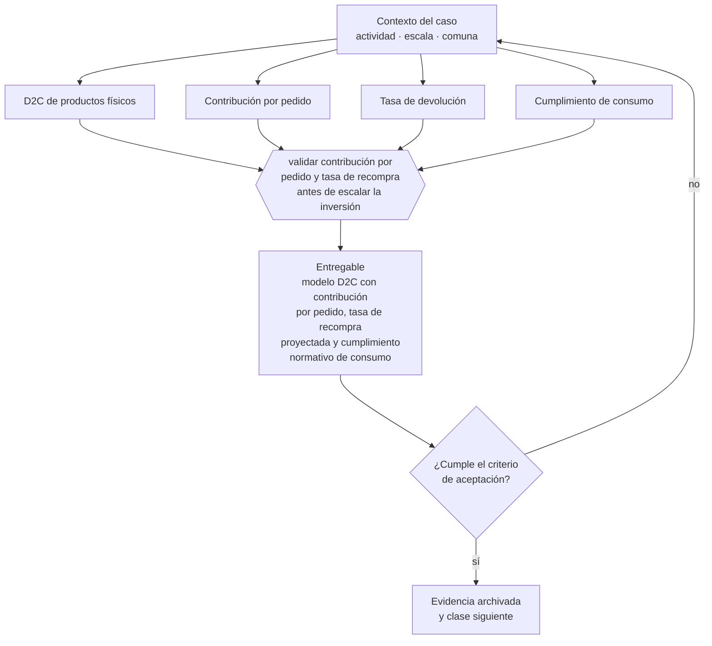

# Clase 313 — E-commerce D2C de productos físicos

> **Parte 23 · Estudios de líneas de negocio reales 2026** — clase 5 de 14

**Estado de evidencia:** `SECTORIAL` · **Jurisdicción:** Chile-first · **Fecha base normativa:** 07-08-2026 
**Decisión que habilita:** validar contribución por pedido y tasa de recompra antes de escalar la inversión 
**Entregable:** modelo D2C con contribución por pedido, tasa de recompra proyectada y cumplimiento normativo de consumo

## 🎯 Propósito

Validar contribución por pedido y tasa de recompra antes de escalar la inversión publicitaria en un D2C.

## 📚 Resultados de aprendizaje

Al finalizar esta clase podrás:

1. **Definir** con precisión los cuatro conceptos de la tabla siguiente y usarlos para describir un caso real.
2. **Explicar** por qué esta materia condiciona decisiones de otras partes del programa.
3. **Decidir** —validar contribución por pedido y tasa de recompra antes de escalar la inversión— y justificar la decisión por escrito.
4. **Producir** el entregable de la clase y contrastarlo contra su criterio de aceptación.
5. **Distinguir** el dato estable del dato dinámico que exige revalidación en la fuente oficial.

## 🧩 Conceptos centrales

| Concepto | Comprensión verificable |
|---|---|
| **D2C de productos físicos** | Venta directa al consumidor con logística propia o tercerizada. |
| **Contribución por pedido** | Margen después de todos los costos variables. |
| **Tasa de devolución** | Porcentaje de pedidos devueltos. |
| **Cumplimiento de consumo** | Obligaciones de información, retracto y garantía. |

## 🗺️ Flujo de razonamiento

## 📖 Desarrollo

### 1. El fondo del asunto

El e-commerce D2C en Chile compite con marketplaces establecidos que tienen ventaja en logística y confianza. La viabilidad depende de la contribución por pedido y de la recompra: adquirir un cliente para una sola venta rara vez es rentable con los costos de adquisición actuales.

### 2. Cómo se traduce en la práctica

Adquirir un cliente para una sola venta rara vez es rentable con los costos de adquisición actuales, de modo que la recompra es la variable que decide el modelo. Y el D2C compite con marketplaces que tienen ventaja en logística y confianza: la diferenciación debe estar en el producto o en la relación.

### 3. Marco aplicable y quién interviene

- matriz de líneas de negocio 2026 del repositorio (manifests/business_lines_2026.json)
- regulación sectorial aplicable según actividad económica
- economía unitaria por modelo: suscripción, proyecto, transacción, retail y servicio

**Autoridades o contrapartes involucradas:** autoridad sectorial según la línea analizada, SII, SERNAC, municipalidad.
**Profesionales de apoyo:** fundador, consultor sectorial, abogado regulatorio, contador. La participación concreta depende del riesgo, del
tamaño de la empresa y de la actividad económica.

## 🧪 Taller guiado

Aplica esta clase a **una** de las siguientes líneas de negocio y repite después el ejercicio con
una segunda línea de carga regulatoria distinta:

| Línea | Carga regulatoria |
|---|---|
| SaaS B2B con IA | media |
| Servicios profesionales | baja |
| E-commerce D2C | media |
| Alimentos o foodtech | alta |
| Exportación de servicios | media |
| Fintech regulada | alta |
| Construcción o servicios técnicos | alta |

**Secuencia de trabajo:**

1. Delimita el contexto: actividad económica, escala, comuna y etapa de la empresa.
2. Reúne los antecedentes que la decisión exige y anota la fecha de cada fuente.
3. Identifica las alternativas reales, incluida la de no hacer nada.
4. Evalúa el impacto en mercado, caja, personas, regulación y operación.
5. Toma la decisión y regístrala con sus supuestos.
6. Produce el entregable.
7. Contrástalo contra el criterio de aceptación.
8. Anota lo que requiere validación profesional y programa su revisión.

### 📦 Entregable

Modelo d2c con contribución por pedido, tasa de recompra proyectada y cumplimiento normativo de consumo.

Debe incluir decisión, supuestos, fuentes con fecha de consulta, responsable, riesgos
identificados y próximos pasos.

## 🏆 Reto verificable

Resuelve la misma materia para una segunda línea de negocio con distinta carga regulatoria y
explica por escrito **qué cambió, por qué y qué fuente lo determina**.

## ✅ Criterio de aceptación

- [ ] la contribución por pedido incluye devoluciones y adquisición
- [ ] el cumplimiento normativo de consumo está diagnosticado
- [ ] cada afirmación regulatoria está referida a una fuente oficial con fecha de consulta;
- [ ] los datos dinámicos quedan marcados para revalidación;
- [ ] hay un responsable asignado y evidencia reproducible del trabajo.

## ⚠️ Errores frecuentes

**Propios de esta clase:**

- Escalar inversión publicitaria sin haber validado la recompra.
- Publicar condiciones de despacho y devolución que la operación no sostiene.

**Característicos de la parte 23:**

- Entrar a un sector regulado subestimando el costo y el plazo de habilitación.
- Asumir márgenes de referencia internacional que no aplican al mercado chileno.

## 🇨🇱 Checklist Chile

- [ ] ¿existe norma o autoridad específica para esta materia?
- [ ] ¿la fuente consultada está vigente a la fecha de ejecución?
- [ ] ¿se activa algún trámite ante el SII?
- [ ] ¿se activa algún requisito municipal o sectorial?
- [ ] ¿afecta a consumidores o al tratamiento de datos personales?
- [ ] ¿afecta a trabajadores o a la seguridad y salud en el trabajo?
- [ ] ¿afecta a impuestos, contabilidad o caja?
- [ ] ¿afecta a contratos o a propiedad intelectual?
- [ ] ¿requiere renovación, reporte periódico o revalidación?

## ❓ Preguntas de comprobación

1. ¿Cuál es tu tasa de recompra a seis meses y cómo la mediste?
2. ¿Tu contribución por pedido incluye devoluciones, despacho y pasarela?
3. ¿Qué te hace preferible a que el mismo cliente compre en un marketplace?

## 🔗 Fuentes oficiales

**Servicio Nacional del Consumidor — Ley 19.496, comercio electrónico y garantía legal**  
<https://www.sernac.cl/> · verificado 2026-08-19

- *Qué contiene:* Publica la interpretación aplicada de la Ley del Consumidor: deberes de información en la oferta, reglas del comercio electrónico, garantía legal, contratos de adhesión y el procedimiento de reclamos.
- *Cómo leerla:* Entra por el rubro de tu negocio y revisa las alertas y procedimientos colectivos publicados: muestran qué está fiscalizando el servicio ahora, que es mejor predictor de tu riesgo que la lectura abstracta de la ley.
- *Uso en esta clase:* aporta el marco de «Ley 19.496, comercio electrónico y garantía legal» para validar contribución por pedido y tasa de recompra antes de escalar la inversión.

Complementos del repositorio: [glosario](../../../docs/19_GLOSSARY.md) ·
[ruta de lecturas](../../../docs/15_BOOKS_AND_LEARNING_PATH.md) ·
[catálogo de fuentes](../../../docs/16_OFFICIAL_SOURCE_CATALOG.md).

> [!IMPORTANT]
> Material educativo. Para una decisión real de alto impacto hay que verificar la fuente oficial
> vigente y validar con el profesional competente.

---

| Anterior | Índice | Siguiente |
|---|---|---|
| [← 312 · Consultoría tecnológica y modernización](../class-04-consultoria-tecnologica-y-modernizacion/README.md) | [Parte 23](../README.md) · [Programa](../../../README.md) | [314 · Marketplace vertical →](../class-06-marketplace-vertical/README.md) |
