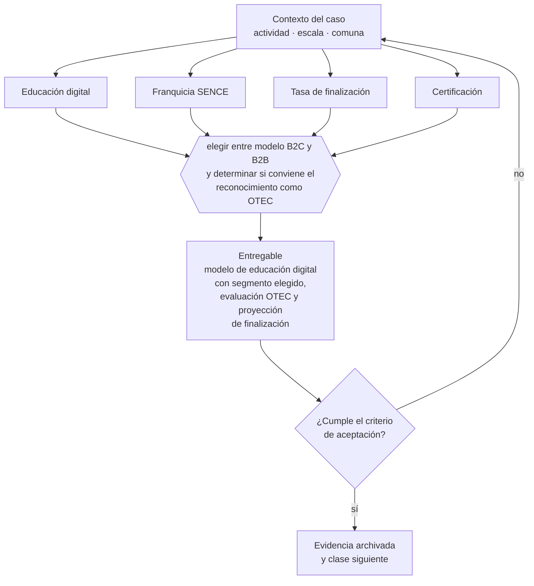

# Clase 315 — Educación digital y capacitación empresarial

> **Parte 23 · Estudios de líneas de negocio reales 2026** — clase 7 de 14

**Estado de evidencia:** `SECTORIAL` · **Jurisdicción:** Chile-first · **Fecha base normativa:** 07-08-2026 
**Decisión que habilita:** elegir entre modelo B2C y B2B y determinar si conviene el reconocimiento como OTEC 
**Entregable:** modelo de educación digital con segmento elegido, evaluación OTEC y proyección de finalización

## 🎯 Propósito

Elegir entre modelo B2C y B2B en educación digital y decidir si conviene el reconocimiento como OTEC.

## 📚 Resultados de aprendizaje

Al finalizar esta clase podrás:

1. **Definir** con precisión los cuatro conceptos de la tabla siguiente y usarlos para describir un caso real.
2. **Explicar** por qué esta materia condiciona decisiones de otras partes del programa.
3. **Decidir** —elegir entre modelo B2C y B2B y determinar si conviene el reconocimiento como OTEC— y justificar la decisión por escrito.
4. **Producir** el entregable de la clase y contrastarlo contra su criterio de aceptación.
5. **Distinguir** el dato estable del dato dinámico que exige revalidación en la fuente oficial.

## 🧩 Conceptos centrales

| Concepto | Comprensión verificable |
|---|---|
| **Educación digital** | Formación entregada por medios electrónicos. |
| **Franquicia SENCE** | Beneficio tributario para capacitación de empresas. |
| **Tasa de finalización** | Porcentaje de estudiantes que completan. |
| **Certificación** | Documento que acredita la formación entregada. |

## 🗺️ Flujo de razonamiento

## 📖 Desarrollo

### 1. El fondo del asunto

El modelo B2B de capacitación empresarial tiene tickets mayores y ciclos de venta más largos que el B2C, y puede acceder a la franquicia tributaria si se opera como OTEC reconocido. El B2C depende de tasas de conversión y finalización que determinan la reputación y la recompra.

### 2. Cómo se traduce en la práctica

El B2B tiene tickets mayores y ciclos más largos, y puede acceder a la franquicia tributaria si el organismo está reconocido por SENCE. El B2C depende de conversión y finalización: medir matrículas sin medir finalización oculta el problema que después destruye la reputación y la recompra.

### 3. Marco aplicable y quién interviene

- matriz de líneas de negocio 2026 del repositorio (manifests/business_lines_2026.json)
- regulación sectorial aplicable según actividad económica
- economía unitaria por modelo: suscripción, proyecto, transacción, retail y servicio

**Autoridades o contrapartes involucradas:** autoridad sectorial según la línea analizada, SII, SERNAC, municipalidad.
**Profesionales de apoyo:** fundador, consultor sectorial, abogado regulatorio, contador. La participación concreta depende del riesgo, del
tamaño de la empresa y de la actividad económica.

## 🧪 Taller guiado

Aplica esta clase a **una** de las siguientes líneas de negocio y repite después el ejercicio con
una segunda línea de carga regulatoria distinta:

| Línea | Carga regulatoria |
|---|---|
| SaaS B2B con IA | media |
| Servicios profesionales | baja |
| E-commerce D2C | media |
| Alimentos o foodtech | alta |
| Exportación de servicios | media |
| Fintech regulada | alta |
| Construcción o servicios técnicos | alta |

**Secuencia de trabajo:**

1. Delimita el contexto: actividad económica, escala, comuna y etapa de la empresa.
2. Reúne los antecedentes que la decisión exige y anota la fecha de cada fuente.
3. Identifica las alternativas reales, incluida la de no hacer nada.
4. Evalúa el impacto en mercado, caja, personas, regulación y operación.
5. Toma la decisión y regístrala con sus supuestos.
6. Produce el entregable.
7. Contrástalo contra el criterio de aceptación.
8. Anota lo que requiere validación profesional y programa su revisión.

### 📦 Entregable

Modelo de educación digital con segmento elegido, evaluación otec y proyección de finalización.

Debe incluir decisión, supuestos, fuentes con fecha de consulta, responsable, riesgos
identificados y próximos pasos.

## 🏆 Reto verificable

Resuelve la misma materia para una segunda línea de negocio con distinta carga regulatoria y
explica por escrito **qué cambió, por qué y qué fuente lo determina**.

## ✅ Criterio de aceptación

- [ ] la decisión sobre OTEC está fundada en el segmento elegido
- [ ] la tasa de finalización está proyectada y se medirá
- [ ] cada afirmación regulatoria está referida a una fuente oficial con fecha de consulta;
- [ ] los datos dinámicos quedan marcados para revalidación;
- [ ] hay un responsable asignado y evidencia reproducible del trabajo.

## ⚠️ Errores frecuentes

**Propios de esta clase:**

- Ofrecer capacitación con franquicia sin el reconocimiento correspondiente.
- Medir el negocio por matrículas sin medir finalización ni satisfacción.

**Característicos de la parte 23:**

- Entrar a un sector regulado subestimando el costo y el plazo de habilitación.
- Asumir márgenes de referencia internacional que no aplican al mercado chileno.

## 🇨🇱 Checklist Chile

- [ ] ¿existe norma o autoridad específica para esta materia?
- [ ] ¿la fuente consultada está vigente a la fecha de ejecución?
- [ ] ¿se activa algún trámite ante el SII?
- [ ] ¿se activa algún requisito municipal o sectorial?
- [ ] ¿afecta a consumidores o al tratamiento de datos personales?
- [ ] ¿afecta a trabajadores o a la seguridad y salud en el trabajo?
- [ ] ¿afecta a impuestos, contabilidad o caja?
- [ ] ¿afecta a contratos o a propiedad intelectual?
- [ ] ¿requiere renovación, reporte periódico o revalidación?

## ❓ Preguntas de comprobación

1. ¿Tu modelo depende de la franquicia tributaria para ser competitivo?
2. ¿Cuál es tu tasa de finalización y cómo la mejorarás?
3. ¿Qué ciclo de venta tiene el segmento B2B y puedes financiarlo?

## 🔗 Fuentes oficiales

**Servicio Nacional de Capacitación y Empleo — OTEC, franquicia tributaria y cursos**  
<https://sence.gob.cl/> · verificado 2026-08-07

- *Qué contiene:* Regula el reconocimiento de organismos técnicos de capacitación, el registro de cursos y el uso de la franquicia tributaria que permite a las empresas descontar capacitación.
- *Cómo leerla:* Separa dos decisiones que la página presenta juntas: ser OTEC reconocido y usar la franquicia. La segunda solo existe si tienes la primera, y arrastra exigencias estrictas de registro de asistencia y ejecución.

**Servicio Nacional del Consumidor — Ley 19.496, comercio electrónico y garantía legal**  
<https://www.sernac.cl/> · verificado 2026-08-07

- *Qué contiene:* Publica la interpretación aplicada de la Ley del Consumidor: deberes de información en la oferta, reglas del comercio electrónico, garantía legal, contratos de adhesión y el procedimiento de reclamos.
- *Cómo leerla:* Entra por el rubro de tu negocio y revisa las alertas y procedimientos colectivos publicados: muestran qué está fiscalizando el servicio ahora, que es mejor predictor de tu riesgo que la lectura abstracta de la ley.

Complementos del repositorio: [glosario](../../../docs/19_GLOSSARY.md) ·
[ruta de lecturas](../../../docs/15_BOOKS_AND_LEARNING_PATH.md) ·
[catálogo de fuentes](../../../docs/16_OFFICIAL_SOURCE_CATALOG.md).

> [!IMPORTANT]
> Material educativo. Para una decisión real de alto impacto hay que verificar la fuente oficial
> vigente y validar con el profesional competente.

---

| Anterior | Índice | Siguiente |
|---|---|---|
| [← 314 · Marketplace vertical](../class-06-marketplace-vertical/README.md) | [Parte 23](../README.md) · [Programa](../../../README.md) | [316 · Exportación de servicios de software →](../class-08-exportacion-de-servicios-de-software/README.md) |
