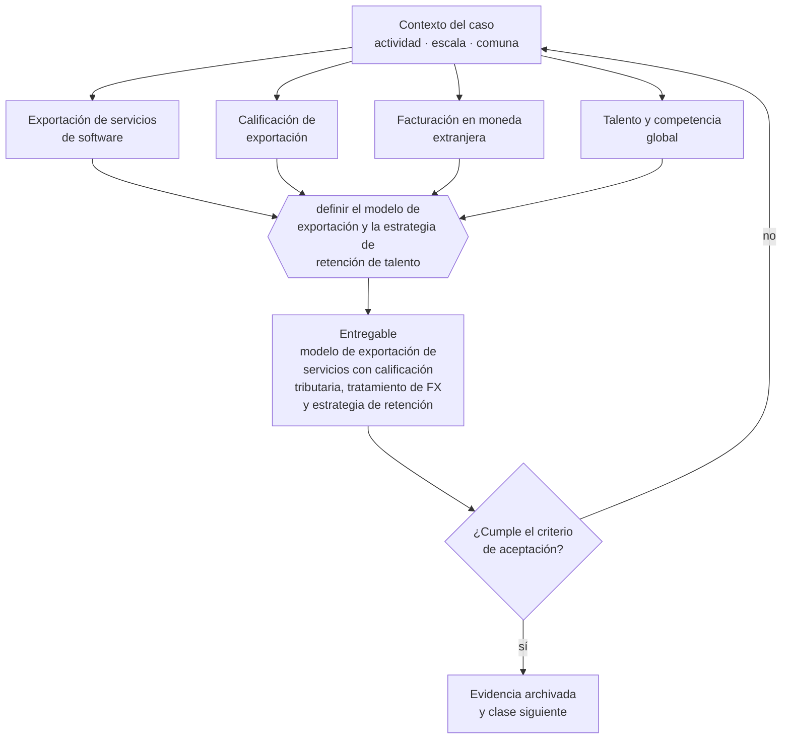

# Clase 316 — Exportación de servicios de software

> **Parte 23 · Estudios de líneas de negocio reales 2026** — clase 8 de 14

**Estado de evidencia:** `SECTORIAL` · **Jurisdicción:** Chile-first · **Fecha base normativa:** 07-08-2026 
**Decisión que habilita:** definir el modelo de exportación y la estrategia de retención de talento 
**Entregable:** modelo de exportación de servicios con calificación tributaria, tratamiento de FX y estrategia de retención

## 🎯 Propósito

Verificar la calificación tributaria de la exportación de servicios y definir la estrategia de retención de talento, que es el riesgo estructural del modelo.

## 📚 Resultados de aprendizaje

Al finalizar esta clase podrás:

1. **Definir** con precisión los cuatro conceptos de la tabla siguiente y usarlos para describir un caso real.
2. **Explicar** por qué esta materia condiciona decisiones de otras partes del programa.
3. **Decidir** —definir el modelo de exportación y la estrategia de retención de talento— y justificar la decisión por escrito.
4. **Producir** el entregable de la clase y contrastarlo contra su criterio de aceptación.
5. **Distinguir** el dato estable del dato dinámico que exige revalidación en la fuente oficial.

## 🧩 Conceptos centrales

| Concepto | Comprensión verificable |
|---|---|
| **Exportación de servicios de software** | Prestación a clientes en el extranjero. |
| **Calificación de exportación** | Condición que habilita el tratamiento tributario. |
| **Facturación en moneda extranjera** | Implicancias cambiarias y contables. |
| **Talento y competencia global** | Presión salarial por competencia internacional. |

## 🗺️ Flujo de razonamiento

## 📖 Desarrollo

### 1. El fondo del asunto

Exportar servicios de software desde Chile aprovecha diferencia de costos y zona horaria compatible con América. El desafío estructural es retener talento que puede ser contratado directamente desde el exterior, lo que presiona los salarios y erosiona el margen del modelo de intermediación.

### 2. Cómo se traduce en la práctica

El arbitraje salarial que sostenía este modelo se está cerrando: el talento chileno puede ser contratado directamente desde el exterior. Construir sobre esa diferencia sin una propuesta de retención propia es apostar a que una tendencia se detenga sola.

### 3. Marco aplicable y quién interviene

- matriz de líneas de negocio 2026 del repositorio (manifests/business_lines_2026.json)
- regulación sectorial aplicable según actividad económica
- economía unitaria por modelo: suscripción, proyecto, transacción, retail y servicio

**Autoridades o contrapartes involucradas:** autoridad sectorial según la línea analizada, SII, SERNAC, municipalidad.
**Profesionales de apoyo:** fundador, consultor sectorial, abogado regulatorio, contador. La participación concreta depende del riesgo, del
tamaño de la empresa y de la actividad económica.

## 🧪 Taller guiado

Aplica esta clase a **una** de las siguientes líneas de negocio y repite después el ejercicio con
una segunda línea de carga regulatoria distinta:

| Línea | Carga regulatoria |
|---|---|
| SaaS B2B con IA | media |
| Servicios profesionales | baja |
| E-commerce D2C | media |
| Alimentos o foodtech | alta |
| Exportación de servicios | media |
| Fintech regulada | alta |
| Construcción o servicios técnicos | alta |

**Secuencia de trabajo:**

1. Delimita el contexto: actividad económica, escala, comuna y etapa de la empresa.
2. Reúne los antecedentes que la decisión exige y anota la fecha de cada fuente.
3. Identifica las alternativas reales, incluida la de no hacer nada.
4. Evalúa el impacto en mercado, caja, personas, regulación y operación.
5. Toma la decisión y regístrala con sus supuestos.
6. Produce el entregable.
7. Contrástalo contra el criterio de aceptación.
8. Anota lo que requiere validación profesional y programa su revisión.

### 📦 Entregable

Modelo de exportación de servicios con calificación tributaria, tratamiento de fx y estrategia de retención.

Debe incluir decisión, supuestos, fuentes con fecha de consulta, responsable, riesgos
identificados y próximos pasos.

## 🏆 Reto verificable

Resuelve la misma materia para una segunda línea de negocio con distinta carga regulatoria y
explica por escrito **qué cambió, por qué y qué fuente lo determina**.

## ✅ Criterio de aceptación

- [ ] la calificación tributaria del servicio está verificada
- [ ] la estrategia de retención de talento está definida
- [ ] cada afirmación regulatoria está referida a una fuente oficial con fecha de consulta;
- [ ] los datos dinámicos quedan marcados para revalidación;
- [ ] hay un responsable asignado y evidencia reproducible del trabajo.

## ⚠️ Errores frecuentes

**Propios de esta clase:**

- Aplicar exención de iva sin cumplir los requisitos de calificación.
- Construir el modelo sobre arbitraje salarial que se está cerrando.

**Característicos de la parte 23:**

- Entrar a un sector regulado subestimando el costo y el plazo de habilitación.
- Asumir márgenes de referencia internacional que no aplican al mercado chileno.

## 🇨🇱 Checklist Chile

- [ ] ¿existe norma o autoridad específica para esta materia?
- [ ] ¿la fuente consultada está vigente a la fecha de ejecución?
- [ ] ¿se activa algún trámite ante el SII?
- [ ] ¿se activa algún requisito municipal o sectorial?
- [ ] ¿afecta a consumidores o al tratamiento de datos personales?
- [ ] ¿afecta a trabajadores o a la seguridad y salud en el trabajo?
- [ ] ¿afecta a impuestos, contabilidad o caja?
- [ ] ¿afecta a contratos o a propiedad intelectual?
- [ ] ¿requiere renovación, reporte periódico o revalidación?

## ❓ Preguntas de comprobación

1. ¿Cumples los requisitos que habilitan el tratamiento de IVA y lo documentas?
2. ¿Qué retiene a tu equipo frente a una oferta directa del exterior?
3. ¿Cómo gestionas la exposición cambiaria de facturar en moneda extranjera?

## 🔗 Fuentes oficiales

**ProChile — Exportación de servicios**  
<https://www.prochile.gob.cl/exportadores/exportacion-de-servicios> · verificado 2026-08-07

- *Qué contiene:* Explica qué se entiende por exportación de servicios, qué condiciones deben cumplirse para acceder al tratamiento tributario correspondiente y qué documentación de respaldo se exige.
- *Cómo leerla:* Contrástala siempre con la resolución del SII aplicable: ProChile explica el concepto y el mercado, pero la calificación que habilita el tratamiento de IVA la resuelve la normativa tributaria.

**Servicio de Impuestos Internos — Nuevos contribuyentes, inicio de actividades y DTE**  
<https://www.sii.cl/ayudas/nuevos_contribuyentes/boleta-vys-facturador.html> · verificado 2026-08-07

- *Qué contiene:* Reúne el circuito completo del contribuyente nuevo: obtención de RUT, declaración de inicio de actividades, elección de códigos de actividad económica y habilitación para emitir documentos tributarios electrónicos.
- *Cómo leerla:* Sepáralo en dos actos distintos que la página trata seguidos: el RUT identifica, el inicio de actividades habilita. Lo que te bloquea para facturar casi siempre está en el segundo, no en el primero.

Complementos del repositorio: [glosario](../../../docs/19_GLOSSARY.md) ·
[ruta de lecturas](../../../docs/15_BOOKS_AND_LEARNING_PATH.md) ·
[catálogo de fuentes](../../../docs/16_OFFICIAL_SOURCE_CATALOG.md).

> [!IMPORTANT]
> Material educativo. Para una decisión real de alto impacto hay que verificar la fuente oficial
> vigente y validar con el profesional competente.

---

| Anterior | Índice | Siguiente |
|---|---|---|
| [← 315 · Educación digital y capacitación empresarial](../class-07-educacion-digital-y-capacitacion-empresarial/README.md) | [Parte 23](../README.md) · [Programa](../../../README.md) | [317 · Fintech regulada y servicios financieros tecnológicos →](../class-09-fintech-regulada-y-servicios-financieros-tecnologicos/README.md) |
