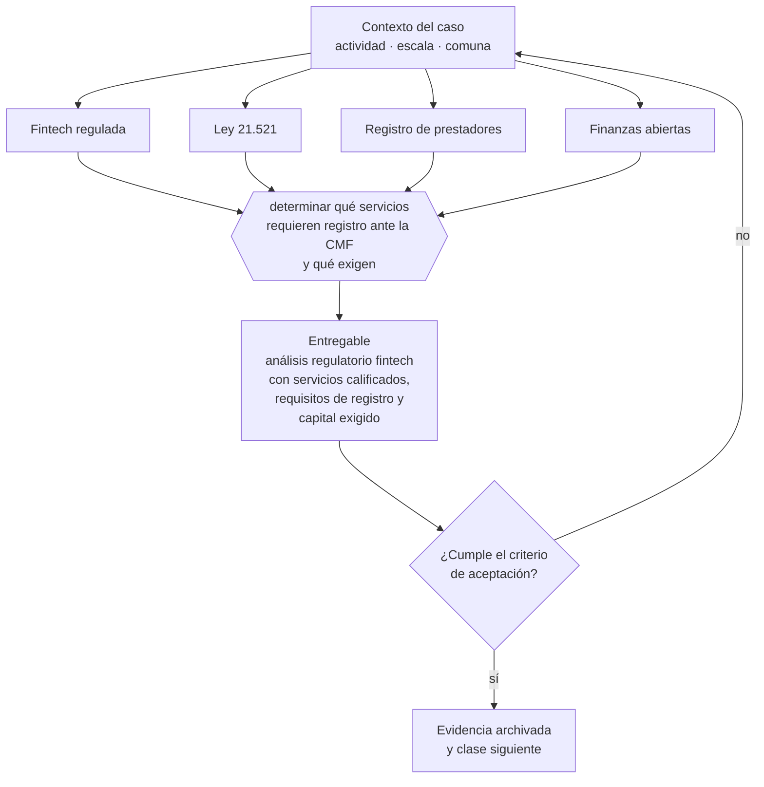

# Clase 317 — Fintech regulada y servicios financieros tecnológicos

> **Parte 23 · Estudios de líneas de negocio reales 2026** — clase 9 de 14

**Estado de evidencia:** `SECTORIAL` · **Jurisdicción:** Chile-first · **Fecha base normativa:** 07-08-2026 
**Decisión que habilita:** determinar qué servicios requieren registro ante la CMF y qué exigen 
**Entregable:** análisis regulatorio fintech con servicios calificados, requisitos de registro y capital exigido

## 🎯 Propósito

Calificar el servicio fintech frente a la Ley 21.521 y dimensionar los requisitos de capital y gobierno antes de construir el producto.

## 📚 Resultados de aprendizaje

Al finalizar esta clase podrás:

1. **Definir** con precisión los cuatro conceptos de la tabla siguiente y usarlos para describir un caso real.
2. **Explicar** por qué esta materia condiciona decisiones de otras partes del programa.
3. **Decidir** —determinar qué servicios requieren registro ante la CMF y qué exigen— y justificar la decisión por escrito.
4. **Producir** el entregable de la clase y contrastarlo contra su criterio de aceptación.
5. **Distinguir** el dato estable del dato dinámico que exige revalidación en la fuente oficial.

## 🧩 Conceptos centrales

| Concepto | Comprensión verificable |
|---|---|
| **Fintech regulada** | Servicio financiero tecnológico bajo supervisión. |
| **Ley 21.521** | Ley que regula servicios financieros tecnológicos. |
| **Registro de prestadores** | Inscripción ante la cmf para operar ciertos servicios. |
| **Finanzas abiertas** | Sistema de intercambio de información financiera con consentimiento. |

## 🗺️ Flujo de razonamiento

## 📖 Desarrollo

### 1. El fondo del asunto

La Ley 21.521 estableció un marco de registro y autorización ante la CMF para servicios como asesoría e intermediación de instrumentos, plataformas de financiamiento colectivo y custodia. Operar sin la inscripción correspondiente es infracción, y los requisitos de capital y gobierno son significativos.

### 2. Cómo se traduce en la práctica

El nombre comercial no decide la calificación: la decide la actividad. Los requisitos de capital, gobierno corporativo, gestión de riesgos y ciberseguridad definen la viabilidad del modelo antes que el producto, y lanzarse primero para inscribirse después es infracción, no estrategia de velocidad.

### 3. Marco aplicable y quién interviene

- matriz de líneas de negocio 2026 del repositorio (manifests/business_lines_2026.json)
- regulación sectorial aplicable según actividad económica
- economía unitaria por modelo: suscripción, proyecto, transacción, retail y servicio

**Autoridades o contrapartes involucradas:** autoridad sectorial según la línea analizada, SII, SERNAC, municipalidad.
**Profesionales de apoyo:** fundador, consultor sectorial, abogado regulatorio, contador. La participación concreta depende del riesgo, del
tamaño de la empresa y de la actividad económica.

## 🧪 Taller guiado

Aplica esta clase a **una** de las siguientes líneas de negocio y repite después el ejercicio con
una segunda línea de carga regulatoria distinta:

| Línea | Carga regulatoria |
|---|---|
| SaaS B2B con IA | media |
| Servicios profesionales | baja |
| E-commerce D2C | media |
| Alimentos o foodtech | alta |
| Exportación de servicios | media |
| Fintech regulada | alta |
| Construcción o servicios técnicos | alta |

**Secuencia de trabajo:**

1. Delimita el contexto: actividad económica, escala, comuna y etapa de la empresa.
2. Reúne los antecedentes que la decisión exige y anota la fecha de cada fuente.
3. Identifica las alternativas reales, incluida la de no hacer nada.
4. Evalúa el impacto en mercado, caja, personas, regulación y operación.
5. Toma la decisión y regístrala con sus supuestos.
6. Produce el entregable.
7. Contrástalo contra el criterio de aceptación.
8. Anota lo que requiere validación profesional y programa su revisión.

### 📦 Entregable

Análisis regulatorio fintech con servicios calificados, requisitos de registro y capital exigido.

Debe incluir decisión, supuestos, fuentes con fecha de consulta, responsable, riesgos
identificados y próximos pasos.

## 🏆 Reto verificable

Resuelve la misma materia para una segunda línea de negocio con distinta carga regulatoria y
explica por escrito **qué cambió, por qué y qué fuente lo determina**.

## ✅ Criterio de aceptación

- [ ] los servicios prestados están calificados frente a la ley
- [ ] los requisitos de registro y capital están dimensionados
- [ ] cada afirmación regulatoria está referida a una fuente oficial con fecha de consulta;
- [ ] los datos dinámicos quedan marcados para revalidación;
- [ ] hay un responsable asignado y evidencia reproducible del trabajo.

## ⚠️ Errores frecuentes

**Propios de esta clase:**

- Lanzar el servicio y solicitar la inscripción después.
- Subestimar los requisitos de capital, gobierno y ciberseguridad exigidos.

**Característicos de la parte 23:**

- Entrar a un sector regulado subestimando el costo y el plazo de habilitación.
- Asumir márgenes de referencia internacional que no aplican al mercado chileno.

## 🇨🇱 Checklist Chile

- [ ] ¿existe norma o autoridad específica para esta materia?
- [ ] ¿la fuente consultada está vigente a la fecha de ejecución?
- [ ] ¿se activa algún trámite ante el SII?
- [ ] ¿se activa algún requisito municipal o sectorial?
- [ ] ¿afecta a consumidores o al tratamiento de datos personales?
- [ ] ¿afecta a trabajadores o a la seguridad y salud en el trabajo?
- [ ] ¿afecta a impuestos, contabilidad o caja?
- [ ] ¿afecta a contratos o a propiedad intelectual?
- [ ] ¿requiere renovación, reporte periódico o revalidación?

## ❓ Preguntas de comprobación

1. ¿Qué actividad regulada realiza tu servicio según la ley, no según tu descripción?
2. ¿Puedes cumplir los requisitos de capital y gobierno exigidos?
3. ¿Eres además sujeto obligado ante la UAF por tu actividad?

## 🔗 Fuentes oficiales

**Comisión para el Mercado Financiero — Registro de Prestadores de Servicios Financieros · Ley 21.521**  
<https://www.cmfchile.cl/portal/principal/623/w4-article-60920.html> · verificado 2026-08-19

- *Qué contiene:* Establece qué servicios financieros tecnológicos requieren inscripción o autorización ante la CMF, con qué requisitos de capital, gobierno corporativo y gestión de riesgos.
- *Cómo leerla:* Califica primero tu servicio contra la lista de actividades reguladas; el nombre comercial no decide. Si califica, los requisitos de capital y gobierno son la variable que define si el modelo es viable, antes que el producto.
- *Uso en esta clase:* aporta el marco de «Registro de Prestadores de Servicios Financieros · Ley 21.521» para determinar qué servicios requieren registro ante la CMF y qué exigen.

**Comisión para el Mercado Financiero — Sistema de Finanzas Abiertas**  
<https://www.cmfchile.cl/portal/prensa/625/w4-article-110881.html> · verificado 2026-08-19

- *Qué contiene:* Desarrolla el sistema de finanzas abiertas de la Ley 21.521: quiénes participan, qué información se comparte, bajo qué consentimiento del cliente y con qué estándares técnicos y de seguridad.
- *Cómo leerla:* Interesa aunque no seas fintech: define el estándar de consentimiento y trazabilidad que el mercado financiero chileno está adoptando, y ese estándar se traslada por contrato a sus proveedores.
- *Uso en esta clase:* aporta el marco de «Sistema de Finanzas Abiertas» para determinar qué servicios requieren registro ante la CMF y qué exigen.

**Unidad de Análisis Financiero — Sujetos obligados · Ley 19.913**  
<https://www.uaf.cl/es-cl/sujetos-obligados/sector-privado/quienes-deben-reportar> · verificado 2026-08-19

- *Qué contiene:* Enumera los sectores obligados a reportar, las obligaciones que se activan —designar oficial de cumplimiento, mantener registros, reportar ROS y ROE— y los umbrales aplicables.
- *Cómo leerla:* Busca tu actividad en la lista literal antes de asumir que no te aplica: inmobiliarias, casas de cambio, corredores y varias actividades con manejo de efectivo entran sin ser instituciones financieras.
- *Uso en esta clase:* aporta el marco de «Sujetos obligados · Ley 19.913» para determinar qué servicios requieren registro ante la CMF y qué exigen.

**Biblioteca del Congreso Nacional · LeyChile — Normativa oficial consolidada**  
<https://www.bcn.cl/leychile/> · verificado 2026-08-19

- *Qué contiene:* Publica el texto oficial y consolidado de leyes, decretos y reglamentos, con la versión vigente a una fecha, el historial de modificaciones y la tramitación que las originó.
- *Cómo leerla:* Usa siempre el selector de versión vigente a la fecha en que ejecutarás el trámite, no la última publicada. Y lee el artículo transitorio: en normas en implantación gradual —jornada, datos personales— ahí está la fecha que realmente te aplica.
- *Uso en esta clase:* aporta el marco de «Normativa oficial consolidada» para determinar qué servicios requieren registro ante la CMF y qué exigen.

Complementos del repositorio: [glosario](../../../docs/19_GLOSSARY.md) ·
[ruta de lecturas](../../../docs/15_BOOKS_AND_LEARNING_PATH.md) ·
[catálogo de fuentes](../../../docs/16_OFFICIAL_SOURCE_CATALOG.md).

> [!IMPORTANT]
> Material educativo. Para una decisión real de alto impacto hay que verificar la fuente oficial
> vigente y validar con el profesional competente.

---

| Anterior | Índice | Siguiente |
|---|---|---|
| [← 316 · Exportación de servicios de software](../class-08-exportacion-de-servicios-de-software/README.md) | [Parte 23](../README.md) · [Programa](../../../README.md) | [318 · Foodtech, dark kitchen y alimentos →](../class-10-foodtech-dark-kitchen-y-alimentos/README.md) |
