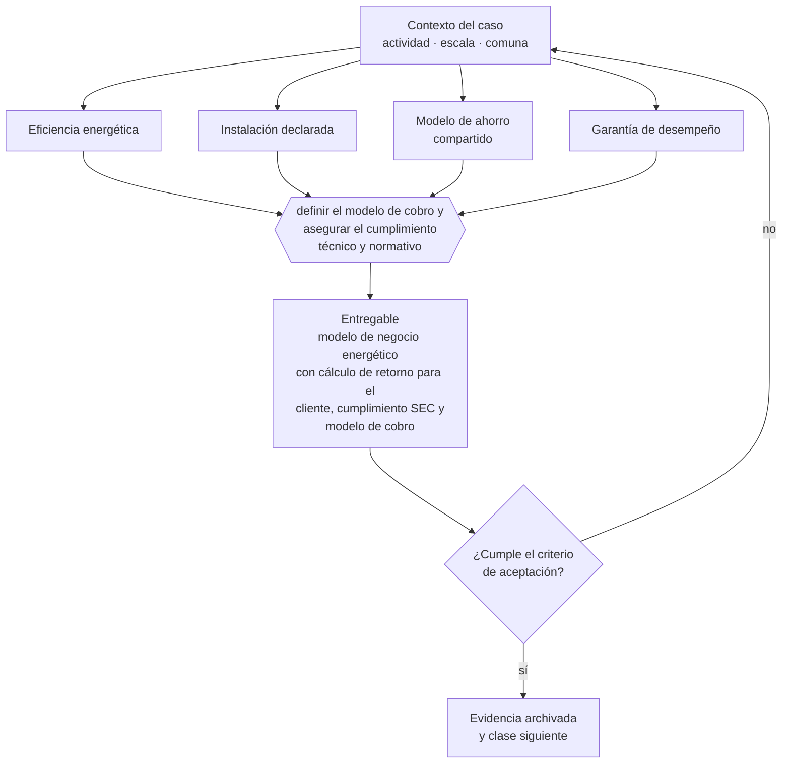

# Clase 319 — Energía solar y servicios de eficiencia

> **Parte 23 · Estudios de líneas de negocio reales 2026** — clase 11 de 14

**Estado de evidencia:** `SECTORIAL` · **Jurisdicción:** Chile-first · **Fecha base normativa:** 07-08-2026 
**Decisión que habilita:** definir el modelo de cobro y asegurar el cumplimiento técnico y normativo 
**Entregable:** modelo de negocio energético con cálculo de retorno para el cliente, cumplimiento SEC y modelo de cobro

## 🎯 Propósito

Sustentar la venta en un cálculo de retorno verificable y cumplir las exigencias técnicas y de declaración ante la SEC.

## 📚 Resultados de aprendizaje

Al finalizar esta clase podrás:

1. **Definir** con precisión los cuatro conceptos de la tabla siguiente y usarlos para describir un caso real.
2. **Explicar** por qué esta materia condiciona decisiones de otras partes del programa.
3. **Decidir** —definir el modelo de cobro y asegurar el cumplimiento técnico y normativo— y justificar la decisión por escrito.
4. **Producir** el entregable de la clase y contrastarlo contra su criterio de aceptación.
5. **Distinguir** el dato estable del dato dinámico que exige revalidación en la fuente oficial.

## 🧩 Conceptos centrales

| Concepto | Comprensión verificable |
|---|---|
| **Eficiencia energética** | Reducción de consumo con inversión recuperable. |
| **Instalación declarada** | Registro obligatorio ante la sec. |
| **Modelo de ahorro compartido** | Cobro vinculado al ahorro efectivamente logrado. |
| **Garantía de desempeño** | Compromiso sobre el rendimiento del sistema. |

## 🗺️ Flujo de razonamiento

## 📖 Desarrollo

### 1. El fondo del asunto

El negocio solar y de eficiencia energética requiere instalador autorizado y declaración ante la SEC, y su venta se apoya en el cálculo de retorno para el cliente. El modelo de ahorro compartido alinea incentivos pero exige medición confiable y capacidad financiera para sostener la inversión inicial.

### 2. Cómo se traduce en la práctica

El modelo de ahorro compartido alinea incentivos pero exige medición confiable acordada con el cliente y capacidad financiera para sostener la inversión inicial. Prometer ahorros sin metodología de medición pactada convierte cada facturación en una negociación.

### 3. Marco aplicable y quién interviene

- matriz de líneas de negocio 2026 del repositorio (manifests/business_lines_2026.json)
- regulación sectorial aplicable según actividad económica
- economía unitaria por modelo: suscripción, proyecto, transacción, retail y servicio

**Autoridades o contrapartes involucradas:** autoridad sectorial según la línea analizada, SII, SERNAC, municipalidad.
**Profesionales de apoyo:** fundador, consultor sectorial, abogado regulatorio, contador. La participación concreta depende del riesgo, del
tamaño de la empresa y de la actividad económica.

## 🧪 Taller guiado

Aplica esta clase a **una** de las siguientes líneas de negocio y repite después el ejercicio con
una segunda línea de carga regulatoria distinta:

| Línea | Carga regulatoria |
|---|---|
| SaaS B2B con IA | media |
| Servicios profesionales | baja |
| E-commerce D2C | media |
| Alimentos o foodtech | alta |
| Exportación de servicios | media |
| Fintech regulada | alta |
| Construcción o servicios técnicos | alta |

**Secuencia de trabajo:**

1. Delimita el contexto: actividad económica, escala, comuna y etapa de la empresa.
2. Reúne los antecedentes que la decisión exige y anota la fecha de cada fuente.
3. Identifica las alternativas reales, incluida la de no hacer nada.
4. Evalúa el impacto en mercado, caja, personas, regulación y operación.
5. Toma la decisión y regístrala con sus supuestos.
6. Produce el entregable.
7. Contrástalo contra el criterio de aceptación.
8. Anota lo que requiere validación profesional y programa su revisión.

### 📦 Entregable

Modelo de negocio energético con cálculo de retorno para el cliente, cumplimiento sec y modelo de cobro.

Debe incluir decisión, supuestos, fuentes con fecha de consulta, responsable, riesgos
identificados y próximos pasos.

## 🏆 Reto verificable

Resuelve la misma materia para una segunda línea de negocio con distinta carga regulatoria y
explica por escrito **qué cambió, por qué y qué fuente lo determina**.

## ✅ Criterio de aceptación

- [ ] el cálculo de retorno usa supuestos verificables
- [ ] la declaración ante la SEC está contemplada en el proceso
- [ ] cada afirmación regulatoria está referida a una fuente oficial con fecha de consulta;
- [ ] los datos dinámicos quedan marcados para revalidación;
- [ ] hay un responsable asignado y evidencia reproducible del trabajo.

## ⚠️ Errores frecuentes

**Propios de esta clase:**

- Prometer ahorros sin metodología de medición acordada.
- Instalar sin declaración ante la sec y comprometer seguros y garantías.

**Característicos de la parte 23:**

- Entrar a un sector regulado subestimando el costo y el plazo de habilitación.
- Asumir márgenes de referencia internacional que no aplican al mercado chileno.

## 🇨🇱 Checklist Chile

- [ ] ¿existe norma o autoridad específica para esta materia?
- [ ] ¿la fuente consultada está vigente a la fecha de ejecución?
- [ ] ¿se activa algún trámite ante el SII?
- [ ] ¿se activa algún requisito municipal o sectorial?
- [ ] ¿afecta a consumidores o al tratamiento de datos personales?
- [ ] ¿afecta a trabajadores o a la seguridad y salud en el trabajo?
- [ ] ¿afecta a impuestos, contabilidad o caja?
- [ ] ¿afecta a contratos o a propiedad intelectual?
- [ ] ¿requiere renovación, reporte periódico o revalidación?

## ❓ Preguntas de comprobación

1. ¿Con qué metodología se mide el ahorro y quién la acordó?
2. ¿Están tus instalaciones ejecutadas por instalador autorizado y declaradas?
3. ¿Puedes financiar la inversión inicial si cobras contra ahorro?

## 🔗 Fuentes oficiales

**Superintendencia de Electricidad y Combustibles — Instalaciones eléctricas y de gas**  
<https://www.sec.cl/> · verificado 2026-08-07

- *Qué contiene:* Regula la ejecución y declaración de instalaciones eléctricas y de gas, el registro de instaladores autorizados y las exigencias de seguridad de productos energéticos.
- *Cómo leerla:* Verifica la licencia del instalador antes de contratar y exige la declaración como entregable del trabajo: sin ella no hay empalme, y un siniestro sobre instalación no declarada compromete la cobertura del seguro.

**Servicio Nacional del Consumidor — Ley 19.496, comercio electrónico y garantía legal**  
<https://www.sernac.cl/> · verificado 2026-08-07

- *Qué contiene:* Publica la interpretación aplicada de la Ley del Consumidor: deberes de información en la oferta, reglas del comercio electrónico, garantía legal, contratos de adhesión y el procedimiento de reclamos.
- *Cómo leerla:* Entra por el rubro de tu negocio y revisa las alertas y procedimientos colectivos publicados: muestran qué está fiscalizando el servicio ahora, que es mejor predictor de tu riesgo que la lectura abstracta de la ley.

Complementos del repositorio: [glosario](../../../docs/19_GLOSSARY.md) ·
[ruta de lecturas](../../../docs/15_BOOKS_AND_LEARNING_PATH.md) ·
[catálogo de fuentes](../../../docs/16_OFFICIAL_SOURCE_CATALOG.md).

> [!IMPORTANT]
> Material educativo. Para una decisión real de alto impacto hay que verificar la fuente oficial
> vigente y validar con el profesional competente.

---

| Anterior | Índice | Siguiente |
|---|---|---|
| [← 318 · Foodtech, dark kitchen y alimentos](../class-10-foodtech-dark-kitchen-y-alimentos/README.md) | [Parte 23](../README.md) · [Programa](../../../README.md) | [320 · Logística de última milla →](../class-12-logistica-de-ultima-milla/README.md) |
