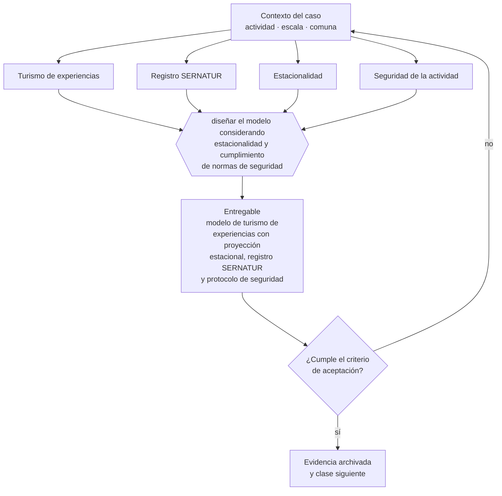

# Clase 321 — Turismo de experiencias

> **Parte 23 · Estudios de líneas de negocio reales 2026** — clase 13 de 14

**Estado de evidencia:** `SECTORIAL` · **Jurisdicción:** Chile-first · **Fecha base normativa:** 07-08-2026 
**Decisión que habilita:** diseñar el modelo considerando estacionalidad y cumplimiento de normas de seguridad 
**Entregable:** modelo de turismo de experiencias con proyección estacional, registro SERNATUR y protocolo de seguridad

## 🎯 Propósito

Dimensionar la estructura sobre el año completo y no sobre la temporada alta, y cumplir las normas técnicas de seguridad.

## 📚 Resultados de aprendizaje

Al finalizar esta clase podrás:

1. **Definir** con precisión los cuatro conceptos de la tabla siguiente y usarlos para describir un caso real.
2. **Explicar** por qué esta materia condiciona decisiones de otras partes del programa.
3. **Decidir** —diseñar el modelo considerando estacionalidad y cumplimiento de normas de seguridad— y justificar la decisión por escrito.
4. **Producir** el entregable de la clase y contrastarlo contra su criterio de aceptación.
5. **Distinguir** el dato estable del dato dinámico que exige revalidación en la fuente oficial.

## 🧩 Conceptos centrales

| Concepto | Comprensión verificable |
|---|---|
| **Turismo de experiencias** | Servicio basado en actividades y no solo en alojamiento. |
| **Registro SERNATUR** | Inscripción de prestadores de servicios turísticos. |
| **Estacionalidad** | Concentración de demanda en períodos del año. |
| **Seguridad de la actividad** | Normas técnicas y cobertura de riesgos. |

## 🗺️ Flujo de razonamiento

## 📖 Desarrollo

### 1. El fondo del asunto

El turismo de experiencias tiene alta estacionalidad, lo que exige estructura de costos flexible y estrategia para los meses bajos. Las actividades de turismo aventura tienen normas técnicas de seguridad y requisitos de personal que deben cumplirse antes de operar.

### 2. Cómo se traduce en la práctica

La estacionalidad exige estructura de costos flexible y una estrategia para los meses bajos, o el resultado anual se consume en el período sin demanda. En turismo aventura las normas técnicas de seguridad son además el riesgo mayor del modelo, muy por encima del comercial.

### 3. Marco aplicable y quién interviene

- matriz de líneas de negocio 2026 del repositorio (manifests/business_lines_2026.json)
- regulación sectorial aplicable según actividad económica
- economía unitaria por modelo: suscripción, proyecto, transacción, retail y servicio

**Autoridades o contrapartes involucradas:** autoridad sectorial según la línea analizada, SII, SERNAC, municipalidad.
**Profesionales de apoyo:** fundador, consultor sectorial, abogado regulatorio, contador. La participación concreta depende del riesgo, del
tamaño de la empresa y de la actividad económica.

## 🧪 Taller guiado

Aplica esta clase a **una** de las siguientes líneas de negocio y repite después el ejercicio con
una segunda línea de carga regulatoria distinta:

| Línea | Carga regulatoria |
|---|---|
| SaaS B2B con IA | media |
| Servicios profesionales | baja |
| E-commerce D2C | media |
| Alimentos o foodtech | alta |
| Exportación de servicios | media |
| Fintech regulada | alta |
| Construcción o servicios técnicos | alta |

**Secuencia de trabajo:**

1. Delimita el contexto: actividad económica, escala, comuna y etapa de la empresa.
2. Reúne los antecedentes que la decisión exige y anota la fecha de cada fuente.
3. Identifica las alternativas reales, incluida la de no hacer nada.
4. Evalúa el impacto en mercado, caja, personas, regulación y operación.
5. Toma la decisión y regístrala con sus supuestos.
6. Produce el entregable.
7. Contrástalo contra el criterio de aceptación.
8. Anota lo que requiere validación profesional y programa su revisión.

### 📦 Entregable

Modelo de turismo de experiencias con proyección estacional, registro sernatur y protocolo de seguridad.

Debe incluir decisión, supuestos, fuentes con fecha de consulta, responsable, riesgos
identificados y próximos pasos.

## 🏆 Reto verificable

Resuelve la misma materia para una segunda línea de negocio con distinta carga regulatoria y
explica por escrito **qué cambió, por qué y qué fuente lo determina**.

## ✅ Criterio de aceptación

- [ ] la proyección considera la estacionalidad completa del año
- [ ] el protocolo de seguridad cumple las normas técnicas aplicables
- [ ] cada afirmación regulatoria está referida a una fuente oficial con fecha de consulta;
- [ ] los datos dinámicos quedan marcados para revalidación;
- [ ] hay un responsable asignado y evidencia reproducible del trabajo.

## ⚠️ Errores frecuentes

**Propios de esta clase:**

- Dimensionar la estructura sobre los meses de temporada alta.
- Operar actividades de aventura sin cumplir las normas técnicas de seguridad.

**Característicos de la parte 23:**

- Entrar a un sector regulado subestimando el costo y el plazo de habilitación.
- Asumir márgenes de referencia internacional que no aplican al mercado chileno.

## 🇨🇱 Checklist Chile

- [ ] ¿existe norma o autoridad específica para esta materia?
- [ ] ¿la fuente consultada está vigente a la fecha de ejecución?
- [ ] ¿se activa algún trámite ante el SII?
- [ ] ¿se activa algún requisito municipal o sectorial?
- [ ] ¿afecta a consumidores o al tratamiento de datos personales?
- [ ] ¿afecta a trabajadores o a la seguridad y salud en el trabajo?
- [ ] ¿afecta a impuestos, contabilidad o caja?
- [ ] ¿afecta a contratos o a propiedad intelectual?
- [ ] ¿requiere renovación, reporte periódico o revalidación?

## ❓ Preguntas de comprobación

1. ¿Tu estructura de costos se sostiene en los meses de temporada baja?
2. ¿Qué harás con la capacidad instalada fuera de temporada?
3. ¿Cumples las normas técnicas de seguridad de las actividades que ofreces?

## 🔗 Fuentes oficiales

**Servicio Nacional de Turismo — Registro de prestadores de servicios turísticos**  
<https://www.sernatur.cl/> · verificado 2026-08-19

- *Qué contiene:* Administra el registro obligatorio de prestadores de servicios turísticos, las categorías de servicio y las normas técnicas aplicables, en particular al turismo aventura.
- *Cómo leerla:* Si tu actividad es turismo aventura, ve directo a las normas técnicas de seguridad: definen personal, equipamiento y procedimientos, y su incumplimiento es el riesgo mayor del modelo.
- *Uso en esta clase:* aporta el marco de «Registro de prestadores de servicios turísticos» para diseñar el modelo considerando estacionalidad y cumplimiento de normas de seguridad.

**Servicio Nacional del Consumidor — Ley 19.496, comercio electrónico y garantía legal**  
<https://www.sernac.cl/> · verificado 2026-08-19

- *Qué contiene:* Publica la interpretación aplicada de la Ley del Consumidor: deberes de información en la oferta, reglas del comercio electrónico, garantía legal, contratos de adhesión y el procedimiento de reclamos.
- *Cómo leerla:* Entra por el rubro de tu negocio y revisa las alertas y procedimientos colectivos publicados: muestran qué está fiscalizando el servicio ahora, que es mejor predictor de tu riesgo que la lectura abstracta de la ley.
- *Uso en esta clase:* aporta el marco de «Ley 19.496, comercio electrónico y garantía legal» para diseñar el modelo considerando estacionalidad y cumplimiento de normas de seguridad.

Complementos del repositorio: [glosario](../../../docs/19_GLOSSARY.md) ·
[ruta de lecturas](../../../docs/15_BOOKS_AND_LEARNING_PATH.md) ·
[catálogo de fuentes](../../../docs/16_OFFICIAL_SOURCE_CATALOG.md).

> [!IMPORTANT]
> Material educativo. Para una decisión real de alto impacto hay que verificar la fuente oficial
> vigente y validar con el profesional competente.

---

| Anterior | Índice | Siguiente |
|---|---|---|
| [← 320 · Logística de última milla](../class-12-logistica-de-ultima-milla/README.md) | [Parte 23](../README.md) · [Programa](../../../README.md) | [322 · Economía circular, reparación y reventa →](../class-14-economia-circular-reparacion-y-reventa/README.md) |
