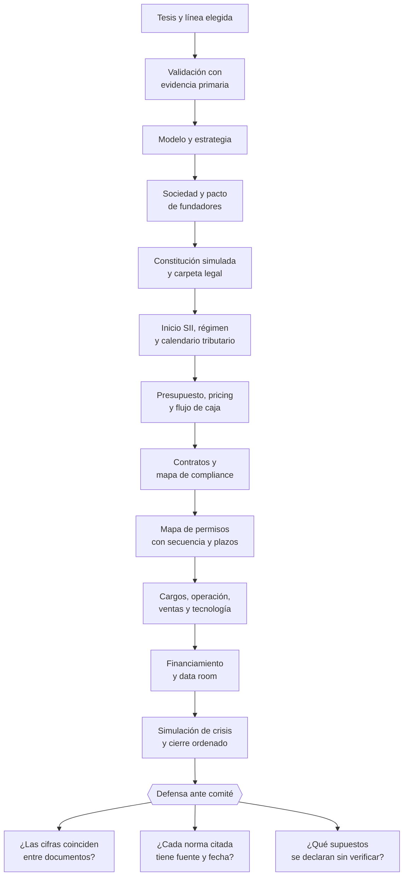

# Parte 24 — Capstone: construir una empresa de comienzo a fin

> *Un solo caso llevado de la tesis a la defensa*

⚫ **Etapa 6 — Crisis, salida y práctica integrada** · salida de la etapa: Caso completo defendido y capacidad de operar bajo estrés

**Estado de evidencia:** `GUIA-PRACTICA` · **Clases:** 14 (323–336) · **Fecha base normativa:** 07-08-2026 
**Contenido central:** Tesis, validación, modelo, sociedad, SII, finanzas, contratos, permisos, financiamiento y defensa 
**Conceptos definidos en esta parte:** 56

## 🎯 De qué trata esta parte

El capstone no es un resumen: es la prueba de que las decisiones del programa se sostienen juntas. Un mismo caso —una empresa elegida por quien estudia— atraviesa las veintidós partes anteriores y produce una carpeta empresarial completa. Lo que se evalúa no es la ambición del proyecto sino la coherencia: que las ventas del flujo de caja sean las mismas del modelo, que la estructura de cargos quepa en la caja proyectada, que los permisos listados correspondan a la actividad declarada ante el SII.

La exigencia de trazabilidad recorre todo el capstone. Cada afirmación regulatoria debe poder respaldarse con fuente y fecha de consulta, y cada supuesto no verificado debe declararse como tal. Reconocer un límite vale más que defender una afirmación sin respaldo, porque es exactamente lo que distingue a alguien capaz de operar una empresa real de alguien que memorizó un procedimiento.

La defensa final ante un comité simulado cierra el programa con preguntas adversariales: por qué este régimen y no otro, qué pasa si el cliente principal se va, con qué evidencia sostienes esa cifra, qué harías si el permiso demora el doble. Un caso bien construido responde con documentos; uno improvisado responde con intenciones.

## 📚 Resultados de la parte

Al terminar esta parte podrás:

1. **Producir una carpeta empresarial completa y coherente entre sus partes**.
2. **Sostener las decisiones tomadas frente a preguntas adversariales**.
3. **Identificar de forma explícita los supuestos que requieren validación profesional**.
4. **Entregar un plan ejecutable con calendario de obligaciones y evidencia**.

## 🗺️ Mapa de la parte

## ⚖️ Marco aplicable

- integración de todas las partes anteriores del programa
- criterio de defensa: coherencia entre decisiones, evidencia y caja
- trazabilidad a fuente oficial en cada afirmación regulatoria

**Autoridades o contrapartes:** todas las anteriores según la línea de negocio elegida.
**Profesionales de apoyo:** fundador, contador, abogado, especialista sectorial.

## ⚠️ Riesgos característicos

- Producir documentos bonitos sin coherencia numérica entre ellos.
- Copiar el caso de otra empresa sin adaptar actividad, comuna ni escala.
- Omitir el calendario de obligaciones periódicas.
- Defender decisiones sin poder citar la fuente que las respalda.

## 📘 Las 14 clases

| # | Global | Clase | Decisión que habilita |
|---:|---:|---|---|
| 01 | 323 | [Elegir tesis y línea de negocio](class-01-elegir-tesis-y-linea-de-negocio/README.md) | elegir la línea de negocio y declarar el alcance del caso |
| 02 | 324 | [Validar problema, cliente y disposición a pagar](class-02-validar-problema-cliente-y-disposicion-a-pagar/README.md) | producir evidencia de problema, cliente y disposición a pagar para el caso |
| 03 | 325 | [Diseñar modelo de negocio y estrategia](class-03-disenar-modelo-de-negocio-y-estrategia/README.md) | definir modelo de negocio y estrategia coherentes con la validación |
| 04 | 326 | [Elegir sociedad y diseñar pacto de fundadores](class-04-elegir-sociedad-y-disenar-pacto-de-fundadores/README.md) | elegir la forma societaria y redactar el pacto de fundadores del caso |
| 05 | 327 | [Simular constitución y carpeta legal](class-05-simular-constitucion-y-carpeta-legal/README.md) | ejecutar la simulación de constitución y armar la carpeta legal del caso |
| 06 | 328 | [Diseñar inicio SII, régimen y calendario tributario](class-06-disenar-inicio-sii-regimen-y-calendario-tributario/README.md) | diseñar el inicio SII, el régimen y el calendario tributario del caso |
| 07 | 329 | [Construir presupuesto, pricing y flujo de caja](class-07-construir-presupuesto-pricing-y-flujo-de-caja/README.md) | construir el modelo financiero completo y coherente del caso |
| 08 | 330 | [Diseñar contratos y mapa de compliance](class-08-disenar-contratos-y-mapa-de-compliance/README.md) | diseñar los contratos y el mapa de compliance del caso |
| 09 | 331 | [Crear mapa de permisos sectoriales](class-09-crear-mapa-de-permisos-sectoriales/README.md) | construir el mapa de permisos sectoriales del caso con secuencia y plazos |
| 10 | 332 | [Diseñar estructura de cargos y responsabilidades](class-10-disenar-estructura-de-cargos-y-responsabilidades/README.md) | diseñar la estructura de cargos, su figura contractual y su secuencia |
| 11 | 333 | [Construir operación, ventas y stack tecnológico](class-11-construir-operacion-ventas-y-stack-tecnologico/README.md) | diseñar la operación, el motor comercial y el stack tecnológico del caso |
| 12 | 334 | [Preparar financiación y data room](class-12-preparar-financiacion-y-data-room/README.md) | determinar la necesidad de financiamiento y preparar el data room del caso |
| 13 | 335 | [Simular crisis, continuidad y cierre](class-13-simular-crisis-continuidad-y-cierre/README.md) | someter el caso a escenarios adversos y diseñar el cierre ordenado |
| 14 | 336 | [Defensa final ante comité empresarial](class-14-defensa-final-ante-comite-empresarial/README.md) | sostener el caso completo ante preguntas adversariales |

## 🔤 Glosario de la parte

| Concepto | Definición operacional |
|---|---|
| **Acreditación de domicilio** | Documento que habilita el domicilio declarado. |
| **Alcance del caso** | Límites del ejercicio: geografía, escala y línea. |
| **Arquitectura contractual** | Conjunto de contratos que sostiene la operación. |
| **Calendario tributario** | Fechas periódicas de cumplimiento. |
| **Carpeta legal** | Conjunto de documentos societarios del caso. |
| **Coherencia integral** | Consistencia entre todos los documentos del caso. |
| **Coherencia interna** | Consistencia entre modelo, estrategia y capacidad. |
| **Coherencia operativa** | Correspondencia entre promesa, proceso y capacidad. |
| **Costo de dotación** | Costo total de las personas requeridas. |
| **Costo de habilitación** | Desembolso total para poder operar. |
| **Criterio de elección** | Factores que hacen viable el caso para el estudiante. |
| **Data room del caso** | Información preparada para el evaluador. |
| **Defensa** | Presentación y sostenimiento de las decisiones ante un comité. |
| **Escenario de cierre** | Secuencia de término ordenado. |
| **Estrategia** | Elección de dónde competir y cómo defenderse. |
| **Estructura de capital** | Reparto entre fundadores y espacio para inversionistas. |
| **Estructura de cargos** | Roles necesarios para operar el caso. |
| **Evidencia de cumplimiento** | Documento que acredita cada obligación. |
| **Evidencia primaria** | Dato obtenido directamente del mercado. |
| **Figura contractual** | Forma jurídica de cada vínculo. |
| **Flujo de caja** | Proyección con supuestos explícitos. |
| **Forma societaria del caso** | Vehículo elegido con su justificación. |
| **Gobierno inicial** | Ritmo y registro de decisiones. |
| **Inicio de actividades del caso** | Declaración con giros y régimen elegidos. |
| **Instrumento elegido** | Fuente de financiamiento coherente con el uso. |
| **Límite reconocido** | Supuesto que el caso declara como no verificado. |
| **Mapa de compliance** | Obligaciones aplicables y sus controles. |
| **Mapa de permisos** | Inventario de habilitaciones exigidas por la actividad. |
| **Modelo de negocio del caso** | Forma de crear, entregar y capturar valor. |
| **Motor comercial** | Sistema de adquisición y retención. |
| **Métrica norte** | Indicador que resume el valor entregado. |
| **Necesidad de financiamiento** | Monto y momento en que se requiere capital. |
| **Objeto social** | Actividades declaradas, alineadas con el plan. |
| **Operación del caso** | Procesos que entregan la promesa al cliente. |
| **Pacto de fundadores** | Reglas de vesting, salida y conflicto. |
| **Plan de contingencia** | Respuesta preparada por escenario. |
| **Plazo de obtención** | Tiempo estimado de cada trámite. |
| **Presupuesto del caso** | Estimación de desembolsos hasta operación estable. |
| **Pricing** | Precio fijado con método declarado. |
| **Provisión de impuestos** | Reserva de caja para obligaciones tributarias. |
| **Punto de equilibrio** | Volumen mínimo de ventas. |
| **Registro de aprendizaje** | Bitácora de lo confirmado y lo refutado. |
| **Resiliencia** | Capacidad de sostener la operación bajo estrés. |
| **Riesgo priorizado** | Exposición ordenada por impacto y probabilidad. |
| **Régimen tributario** | Elección justificada con simulación comparada. |
| **Secuencia de contratación** | Orden en que se incorporan los cargos. |
| **Secuencia de habilitación** | Orden en que los permisos se condicionan. |
| **Simulación de constitución** | Ejecución completa del flujo sin efecto jurídico real. |
| **Simulación de crisis** | Ejercicio de respuesta ante un escenario adverso. |
| **Stack tecnológico** | Conjunto mínimo de sistemas. |
| **Supuesto declarado** | Afirmación que el caso asume y que debe verificarse. |
| **Tesis del capstone** | Apuesta empresarial que se desarrollará de principio a fin. |
| **Trazabilidad a fuente** | Capacidad de respaldar cada afirmación regulatoria. |
| **Umbral de validación** | Criterio fijado antes de recolectar evidencia. |
| **Uso de fondos** | Destino específico del capital solicitado. |
| **Validación** | Evidencia de que el problema y la disposición a pagar existen. |

## 🔗 Cómo se conecta

Integra las 22 partes anteriores sobre los casos de la parte 23. Es el único punto del programa donde la coherencia entre documentos se evalúa de forma explícita.

## 📖 Pauta bibliográfica

- Ellet, W. — *The Case Study Handbook*: cómo se construye y se defiende un caso.
- Todas las fuentes oficiales citadas en las partes que el caso atraviesa.
- `docs/00_MASTER_FLOW.md` — la secuencia completa que el capstone debe recorrer.

## 🏛️ Fuentes oficiales de la parte

**Registro de Empresas y Sociedades / ChileAtiende — Constitución de empresas**  
<https://www.chileatiende.gob.cl/fichas/21409-tu-empresa> · verificado 2026-08-07

- *Qué contiene:* Describe el régimen simplificado de la Ley 20.659: qué tipos societarios admite el formulario electrónico, quiénes deben firmar, qué documentos entrega el sistema y cómo se hacen después las modificaciones.
- *Cómo leerla:* Entra por el tipo societario que ya elegiste, no al revés. La ficha dice qué campos pide el formulario; si tu estatuto necesita una cláusula que el formulario no soporta, la respuesta es la ruta notarial.

**Servicio de Impuestos Internos — Nuevos contribuyentes, inicio de actividades y DTE**  
<https://www.sii.cl/ayudas/nuevos_contribuyentes/boleta-vys-facturador.html> · verificado 2026-08-07

- *Qué contiene:* Reúne el circuito completo del contribuyente nuevo: obtención de RUT, declaración de inicio de actividades, elección de códigos de actividad económica y habilitación para emitir documentos tributarios electrónicos.
- *Cómo leerla:* Sepáralo en dos actos distintos que la página trata seguidos: el RUT identifica, el inicio de actividades habilita. Lo que te bloquea para facturar casi siempre está en el segundo, no en el primero.

**Servicio de Impuestos Internos — Regímenes tributarios · Operación Renta 2026**  
<https://www.sii.cl/destacados/renta/2026/intermediarios/regimenes_tributarios/> · verificado 2026-08-07

- *Qué contiene:* Compara los regímenes vigentes: requisitos de ingreso y permanencia, tipo de propietarios admitidos, forma de determinar la base imponible y cómo se imputa el crédito contra los impuestos finales de los dueños.
- *Cómo leerla:* Lee primero la columna de requisitos de propietarios: descarta regímenes antes de comparar tasas. Las tasas cambian por ley y por período transitorio, así que anota la fecha de consulta junto a cada cifra que uses.

**Dirección del Trabajo — Relaciones laborales y obligaciones del empleador**  
<https://www.dt.gob.cl/> · verificado 2026-08-07

- *Qué contiene:* Concentra el Código del Trabajo aplicado: dictámenes que interpretan la norma en casos concretos, la plataforma Mi DT para registrar contratos y finiquitos, y las guías de fiscalización.
- *Cómo leerla:* Los dictámenes valen más que las guías divulgativas: describen cómo la autoridad resolvió un caso real. Busca por materia y contrasta la fecha, porque un dictamen posterior puede cambiar el criterio anterior.

**Servicio Nacional del Consumidor — Ley 19.496, comercio electrónico y garantía legal**  
<https://www.sernac.cl/> · verificado 2026-08-07

- *Qué contiene:* Publica la interpretación aplicada de la Ley del Consumidor: deberes de información en la oferta, reglas del comercio electrónico, garantía legal, contratos de adhesión y el procedimiento de reclamos.
- *Cómo leerla:* Entra por el rubro de tu negocio y revisa las alertas y procedimientos colectivos publicados: muestran qué está fiscalizando el servicio ahora, que es mejor predictor de tu riesgo que la lectura abstracta de la ley.

**Biblioteca del Congreso Nacional · LeyChile — Normativa oficial consolidada**  
<https://www.bcn.cl/leychile/> · verificado 2026-08-07

- *Qué contiene:* Publica el texto oficial y consolidado de leyes, decretos y reglamentos, con la versión vigente a una fecha, el historial de modificaciones y la tramitación que las originó.
- *Cómo leerla:* Usa siempre el selector de versión vigente a la fecha en que ejecutarás el trámite, no la última publicada. Y lee el artículo transitorio: en normas en implantación gradual —jornada, datos personales— ahí está la fecha que realmente te aplica.

---

| Anterior | Índice | Siguiente |
|---|---|---|
| [← Parte 23 · Estudios de líneas de negocio reales 2026](../part-23-estudios-de-lineas-de-negocio-reales-2026/README.md) | [Currículo](../../CURRICULUM.md) · [Programa](../../README.md) | **Última parte** |
